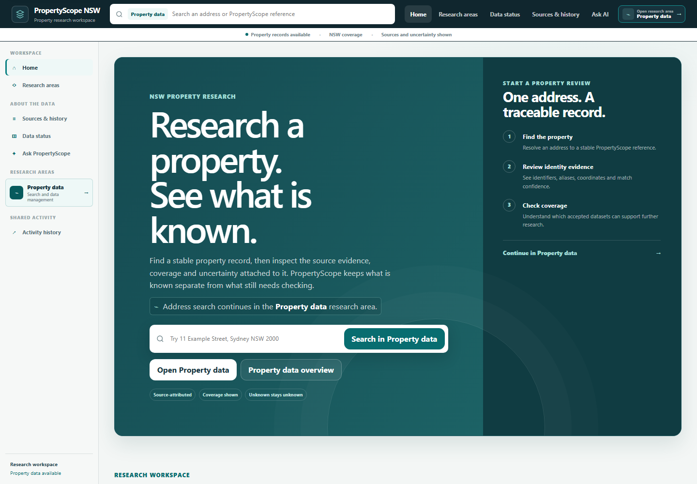
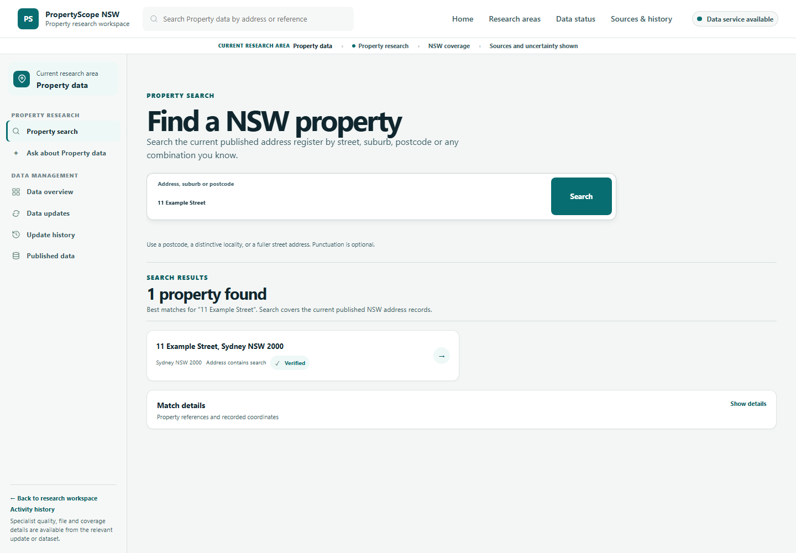
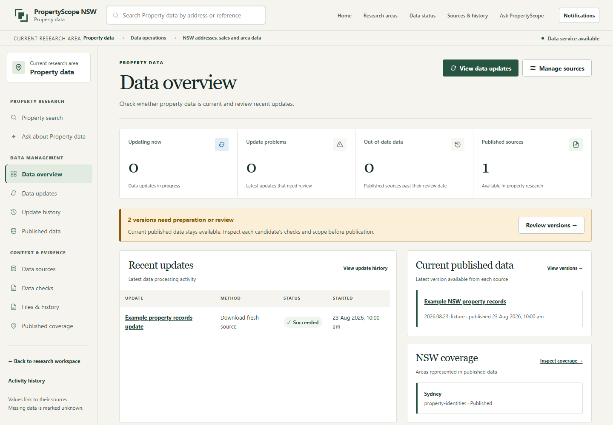

# 41026 Advanced Software Development Group Project

Shared repository for the Spring 2026 PropertyScope NSW group project.

PropertyScope is a tutor-approved NSW property-research application. The repository currently
contains the Shared platform plus enabled independently deployable slices for Property Discovery,
Market Intelligence, Suburb Analytics, Due Diligence and the Buyer Journey workspace. Suburb
Analytics is available through the shared home or directly at `http://localhost:5600`; its data
is explicitly a deterministic demonstration fixture, not current official evidence.

The implemented baseline includes a reproducible Python workspace, strict shared contracts,
manifest-driven feature onboarding, a shared HTMX product shell, bounded AI-mode orchestration over
the OpenAI Responses API, and a containerised Feature 1 data platform using PostgreSQL/PostGIS.
Release 1 adds local MCP tool dispatch, versioned semantic retrieval and grounded Feature 1
answers with inspectable sources, confidence categories and insufficient-context handling.
Fresh developer setups run AI-mode, MCP and RAG in Docker for visibility. The launcher also retains
an explicit host mode for the Release 1 non-containerisation requirement; the agent loop runs
inside AI-mode in either placement. The shared frontend and student services remain containerised.
The [Shared/Feature 1 handoff](docs/release-1/shared-feature-1-handoff.md)
maps this increment to the rubric, evidence and remaining owner responsibilities.

## Fieldbook UI/UX overhaul

The implemented cross-feature redesign and its evidence are documented in
[`docs/deliverables/propertyscope-ux-overhaul`](docs/deliverables/propertyscope-ux-overhaul/00_EXECUTIVE_SUMMARY.md).
Start with the [before/after gallery](docs/deliverables/propertyscope-ux-overhaul/SCREENSHOT_GALLERY.html),
[design system](docs/deliverables/propertyscope-ux-overhaul/03_DESIGN_SYSTEM.md),
[assistant experience](docs/deliverables/propertyscope-ux-overhaul/06_AI_ASSISTANT_EXPERIENCE.md) and
[validation boundaries](docs/deliverables/propertyscope-ux-overhaul/10_VALIDATION_REPORT.md).
The injected-document browser evidence does not replace real-origin or full-stack validation.

## Team

| Student | Name | Student ID | UTS email | Feature |
|---|---|---:|---|---|
| 1 | Matthew Shelton | 24763373 | matthew.n.shelton@student.uts.edu.au | Data Platform and Property Discovery |
| 2 | Burhan Naeem | 24764134 | Burhan.Naeem@wisetechglobal.com | Property Sales Explorer and Market Cases |
| 3 | James Huang | 24970865 | Zihuang.huang@student.uts.edu.au | Suburb, Crime, and Liveability Analytics |
| 4 | Michael White | 24846267 | Michael.h.white@student.uts.edu.au | Site, Planning, and Building Due Diligence |
| 5 | Derek Song | 24833978 | Derek.song@student.uts.edu.au | Buyer Journey and Agent Workspace |

The approved feature purposes and ownership boundaries are recorded in the
[registered feature scope](docs/architecture/registered-feature-scope.md). Allocation does not imply
implementation; the application exposes only manifest-enabled features.

## Release path

| Release | Planned scope |
|---|---|
| Release 0 | Integrated microservices, AI mode/OpenAI, shared agentic loop, Docker Compose, and student CI |
| Release 1 | Release 0 plus MCP, RAG, and grounded AI responses |
| Release 2 | Release 1 plus multi-agent orchestration, advanced testing, and Azure deployment |

MCP and RAG run locally for Release 1 and remain disabled during CI/CD. Multi-agent orchestration
is planned for Release 2; all three advanced capabilities must remain disabled in its cloud
deployment. The supplied Release 1 rubric requires all shared AI services and the loop outside
containers; use `stack up --ai-runtime host` for that assessment topology. The optional Docker
development mode does not satisfy that requirement. Release 2 cloud hosting remains a future decision.

## Application preview

The shared research workspace keeps property evidence, source coverage, and uncertainty visible
from the start.



Property Discovery resolves a NSW address against the current published property register.



The data overview summarises publication readiness, recent updates, and current coverage.



These images use the deterministic populated UI fixture at a 1440x1000 viewport, so they contain no
live credentials or machine-specific data. After a UI change, refresh all three consistently with:

```text
uv run playwright install chromium
uv run scripts/dev.py ui readme-screenshots
```

## Repository guide

- `.github/workflows/`: canonical integration CI and student workflow files
- `ai-services/`: deterministic agent core, AI-mode, MCP and RAG services
- `deployment/`: validated feature selection and generated runtime projections
- `docs/`: living architecture, release evidence, reports, and dated historical records
- `shared/`: contracts, bounded tool transport, consumer protocol, testkit, product shell and browser capabilities
- `student-1/` to `student-5/`: independently owned feature workspaces
- `scripts/`: quality, development, acquisition, fixture, and UI-audit commands
- `docker-compose.yml`: base service definitions; enabled feature profiles are generated from manifests

Start with [CONTRIBUTING.md](CONTRIBUTING.md) for the developer workflow,
[docs/README.md](docs/README.md) for maintained documentation, and [AGENTS.md](AGENTS.md) for coding-agent
rules.

## Developer quick start

Install `uv` using the [official installation guide](https://docs.astral.sh/uv/getting-started/installation/),
then run from the repository root:

```text
uv python install
uv sync --locked --all-packages --all-groups
uv run python scripts/check.py
```

For the complete local application, start Docker Desktop and create the Git-ignored environment
file once:

```text
Copy-Item .env.example .env  # Windows PowerShell
# cp .env.example .env       # macOS/Linux
# Add OPENAI_API_KEY to .env, then:
uv run scripts/dev.py stack up
```

Open the shared home at <http://localhost:5100>, Feature 1 at <http://localhost:5200>, or the Buyer
Journey workspace at <http://localhost:5500>. To exercise
deterministic data flows without a model credential, use:

```text
uv run scripts/dev.py stack up --offline
```

`stack up` validates the enabled feature manifests and Compose/route projections, then starts or
reuses only approved enabled services. Missing images are built automatically; pass `--build` only
when Docker or dependency inputs changed. AI placement defaults to Docker on a fresh setup and
is remembered for subsequent commands. Switch explicitly with:

```text
uv run scripts/dev.py stack up --ai-runtime host    # Release 1 assessment topology
uv run scripts/dev.py stack up --ai-runtime docker  # Docker Desktop development visibility
```

The launcher stops the previous AI owners before starting the selected placement and recreates
backend/proxy routing. Both placements use the same exclusive history and RAG state directories
under `.propertyscope-runtime/host/`; switching does not copy or reset their databases.
Only AI-mode receives the provider credential, through a runtime secret file in Docker or its
host environment. Credentials never enter the image. An internal service token protects AI-mode;
backend clients and the shared proxy attach it without exposing it to browser code. Use `stack up`
after rotating that token so every caller receives the updated configuration.
OpenAI configuration, the opt-in Gemini compatibility profile, and provider diagnostics are in the
[OpenAI API operations guide](docs/release-0/openai-api-operations.md).

For semantic document research, prepare the local embedding model explicitly, then follow the
token and ingestion instructions in the [local AI runtime guide](docs/release-1/host-runtime.md) and
[Feature 1 corpus recipe](student-1/config/rag/README.md):

```text
uv run rag-server prepare-model
uv run scripts/dev.py ai stop
uv run scripts/dev.py ai start --mode combined
# With the managed RAG_SERVICE_TOKEN in this shell:
uv run rag-server ingest student-1/config/rag/corpus.json
uv run scripts/dev.py ai validate mcp
uv run scripts/dev.py ai validate rag
```

Ordinary startup never downloads model weights or ingests documents. Missing assets/corpus produce
visible unavailable or insufficient-context states. Named validation modes use deterministic model
decisions with real local services; actual provider and browser evidence is recorded separately.

Common lifecycle commands:

| Purpose | Command |
|---|---|
| Inspect prerequisites | `uv run scripts/dev.py stack doctor` |
| Show service state | `uv run scripts/dev.py stack status` |
| Show selected AI service state | `uv run scripts/dev.py ai status` |
| Read selected AI service logs | `uv run scripts/dev.py ai logs` |
| Follow logs | `uv run scripts/dev.py stack logs` |
| Read release/publication readiness | `uv run scripts/dev.py operator report` |
| Stop while preserving data | `uv run scripts/dev.py stack down` |
| Restart selected containers | `uv run scripts/dev.py stack restart [service ...]` |
| Rebuild selected services | `uv run scripts/dev.py stack rebuild [service ...]` |
| Delete this stack's labelled volumes | `uv run scripts/dev.py stack reset` |

## UI-only workflow

Shared and Feature 1 can run against deterministic same-origin fixtures without Docker, databases,
or a model credential:

```text
uv run scripts/dev.py ui serve
uv run scripts/dev.py ui audit quick
```

Use `ui audit full` for the explicit route/state/four-viewport matrix. Scenarios, ports, sharding,
and generated evidence are documented in the [UI fixture guide](docs/ui/feature-1-fixture-mode.md)
and [UI audit guide](docs/ui/feature-1-audit.md).

## Feature 1 data operations

Starting the stack does not contact a data publisher. An operator explicitly previews and starts
each registered-source acquisition through the browser or CLI. Complete source is the default; the
PSI browser/API workflow can instead select completed publisher archive years as a partial,
non-publishable candidate:

```text
uv run scripts/dev.py data collect fixture-property
uv run scripts/dev.py data collect schools-master
```

Acquisition and candidate creation are automatic; publication is not. A candidate becomes current
only after explicit human review and approval. Full official-source workflows, PSI cache preparation,
provenance, and recovery are documented in the [Feature 1 README](student-1/README.md).

## Remaining delivery decisions

The topic, team, five-feature split, Azure target, OpenAI profiles, and Feature 1
PostgreSQL/PostGIS exception are approved. The final submission must retain durable approval
evidence. Feature owners must still finalise their bounded datasets, routes/schemas, authentication
where required, source licensing, tests, workflows, and integration evidence. Features 2–5 retain
independent stores and never receive Feature 1 database credentials.


## Repository health review

The [repository health review](docs/reviews/repository-health-review.md) records the cross-feature
reliability and design-system changes, source-level findings, validation evidence and remaining
work. Shared frontend extension rules are in
[the browser package guide](shared/frontend/browser/README.md).
