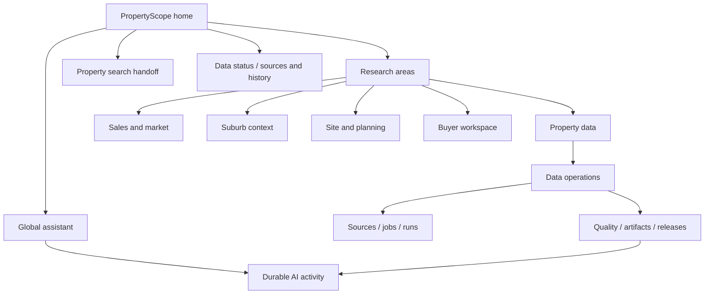
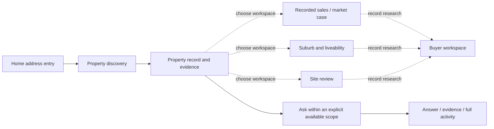
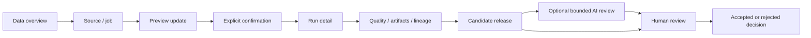
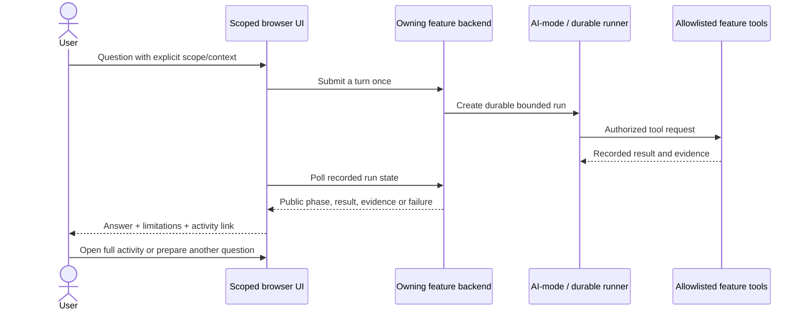

# Information architecture and journeys

## Navigation model

The product has one identity and two task expressions. Global navigation connects research areas, status/history and the assistant. Contextual navigation exposes the current workspace’s actual routes. Data operations is clearly discoverable within Property data rather than being mistaken for the default experience of every researcher. AI activity is the audit counterpart of conversation and bounded review.

The arrows describe available navigation or an explicit workflow entry, not an unimplemented shared-property entity model. Feature-specific selected entities remain owned and validated by their services.

## A. Property researcher

Start with an address or reference, open the canonical Property data search, inspect the returned identity and available evidence, then choose the relevant research workspace. Sales cases, suburb comparisons, site reviews and buyer cases have their own saved-state models. Use visible product navigation to move between them; do not imply that creating one automatically creates the others.

Solid arrows represent direct product patterns where supported; dashed arrows are user-led transitions, not automatic context propagation. The researcher’s first question is “What does the evidence actually say?” Date, source, limitations and coverage sit next to the relevant result. Raw lineage and technical IDs are available after that question, not before it.

## B. Data operator

The data overview summarizes updates and published sources. Sources define what may be ingested; jobs provide bounded commands; run detail exposes actual progress and evidence. Quality, artifacts and release views retain their expert density. Candidate review and accepted publication remain different states.

The UI does not publish because a model produced a positive answer. Review context and comments stay with the actual candidate. Browser testing of the command/confirmation interface used deterministic fixtures only; it is not evidence that a real release was persisted or accepted by the backend.

## C. AI and audit

This is the existing trust model, not a new direct browser-to-model channel. The browser does not gain tools merely by selecting a scope. Conversation history supports continuity, not authorization or evidence. The full activity view exposes recorded activity, not private model reasoning.

## Returning without losing context

The assistant’s submitted context is snapshotted per turn. Feature 1’s activity links are built by a small pure helper that respects integrated and standalone paths. Activity return paths are validated against known internal destinations. A buyer summary is not linked as though its local workflow ID were an agent-run ID. Unknown/external return destinations do not become an open redirect.

Mobile navigation has both a way forward and a way back. The global and feature menus remain distinguishable. Activity list/detail navigation retains a visible title and return control. Native dialog cancellation restores the originating control rather than leaving focus behind an overlay.
