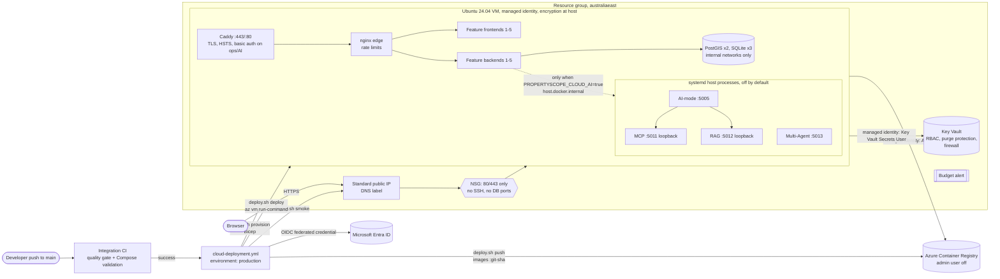

# Azure deployment (Release 2)

This directory holds everything needed to run PropertyScope NSW on Azure: Bicep, a VM bootstrap, the
production Compose wiring, the TLS edge, systemd units for the optional cloud AI tier, the
operations script and the bonus security validations. The design and its trade-offs are recorded
in [ADR-048](../../docs/architecture/decisions/ADR-048-azure-vm-hosting.md).

**Status:** prepared and validated locally. Nothing has been provisioned yet. Once a subscription
is chosen, deployment is a configuration step: complete the [one-time setup](#one-time-setup),
then run the workflow or `deploy.sh all`.

## Architecture



| Path | Purpose |
|---|---|
| `main.bicep`, `modules/*.bicep` | Network, registry, Key Vault, VM, role assignments, auto-shutdown, budget |
| `main.bicepparam` | Production parameters; values come from environment variables or GitHub variables |
| `dev.bicepparam` | Example low-cost rehearsal environment in its own resource group |
| `cloud-init.yaml` | First boot: Docker Engine and Compose plugin, Azure CLI, uv, the `propertyscope-ai` user, SSH disabled |
| `../../docker-compose.azure.yml` | Production override: ACR images by SHA, only Caddy publishes ports, file secrets, internal data networks, AI off |
| `../../docker-compose.azure-ai.yml` | Cloud AI overlay: host-gateway wiring for the bonus tiers |
| `Caddyfile`, `caddy/` | TLS edge, redirect, HSTS and security headers, operator auth, AI on/off switch |
| `nginx/00-propertyscope-production.conf` | Production-only nginx include: rate limits, timeouts, body limit, no version banner |
| `compose/` | Entrypoint shims that turn Compose secret files into process-only environment variables |
| `systemd/` | `propertyscope-ai.target` plus AI-mode, MCP, RAG and Multi-Agent units |
| `vm/propertyscope-vm.sh` | Runs on the VM through run-command: deploy, AI on/off, status, logs, on-host validation |
| `deploy.sh` | The operator and CI entry point (below) |
| `validate-endpoint-security.sh`, `validate-data-security.sh` | Bonus B5 and B6 validation |

## One-time setup

Do these steps once, as a subscription Owner, after choosing the subscription. Replace the
placeholders. None of the values below is a secret.

```bash
SUBSCRIPTION_ID=<subscription-guid>
RG=rg-propertyscope-prod
LOCATION=australiaeast
REPO=MattShelton04/41026ASDProject
az login
az account set --subscription "$SUBSCRIPTION_ID"
```

1. **Register the resource providers and the encryption-at-host feature.** Registration takes a
   few minutes. Wait until the feature shows `Registered`.

   ```bash
   for ns in Microsoft.Compute Microsoft.Network Microsoft.ContainerRegistry Microsoft.KeyVault \
             Microsoft.DevTestLab Microsoft.Consumption; do az provider register --namespace "$ns"; done
   az feature register --namespace Microsoft.Compute --name EncryptionAtHost
   az feature show --namespace Microsoft.Compute --name EncryptionAtHost --query properties.state -o tsv
   az provider register --namespace Microsoft.Compute   # propagate the feature once Registered
   ```

   If the feature cannot be registered, set `AZURE_ENCRYPTION_AT_HOST=false`. Managed disks are
   still encrypted at rest with platform keys, but host caches and the temporary disk are not, so
   the B6 check reports this as a failure.

2. **Create the resource group.** `deploy.sh provision` also creates it when it is missing, but
   creating it here lets the deployer identity be scoped to it.

   ```bash
   az group create --name "$RG" --location "$LOCATION"
   ```

3. **Create the GitHub deployer identity with OIDC.** It has no client secret.

   ```bash
   APP_ID=$(az ad app create --display-name propertyscope-github-deployer --query appId -o tsv)
   SP_ID=$(az ad sp create --id "$APP_ID" --query id -o tsv)
   az ad app federated-credential create --id "$APP_ID" --parameters '{
     "name": "github-production-environment",
     "issuer": "https://token.actions.githubusercontent.com",
     "subject": "repo:MattShelton04/41026ASDProject:environment:production",
     "audiences": ["api://AzureADTokenExchange"]
   }'
   RG_ID=$(az group show --name "$RG" --query id -o tsv)
   az role assignment create --assignee-object-id "$SP_ID" --assignee-principal-type ServicePrincipal \
     --role Contributor --scope "$RG_ID"
   # Lets the Bicep template create its own least-privilege role assignments (AcrPull, Key Vault
   # Secrets User/Officer, AcrPush) inside this resource group only.
   az role assignment create --assignee-object-id "$SP_ID" --assignee-principal-type ServicePrincipal \
     --role "Role Based Access Control Administrator" --scope "$RG_ID"
   echo "AZURE_CLIENT_ID=$APP_ID  AZURE_DEPLOYER_PRINCIPAL_ID=$SP_ID  AZURE_TENANT_ID=$(az account show --query tenantId -o tsv)"
   ```

   The job uses `environment: production`, so the token subject is always
   `repo:MattShelton04/41026ASDProject:environment:production`. A credential for
   `ref:refs/heads/main` is **not** needed and would not match.

4. **Configure GitHub.** In *Settings → Environments*, create `production`. Add required reviewers
   to record a human approval for each deployment, and limit deployment branches to `main`. Then,
   in *Settings → Secrets and variables → Actions → Variables*, add these repository variables:

   | Variable | Example | Required |
   |---|---|---|
   | `AZURE_SUBSCRIPTION_ID` | subscription GUID. The workflow skips until this is set | yes |
   | `AZURE_TENANT_ID` | tenant GUID | yes |
   | `AZURE_CLIENT_ID` | `$APP_ID` from step 3 | yes |
   | `AZURE_RESOURCE_GROUP` | `rg-propertyscope-prod` | yes |
   | `AZURE_DNS_LABEL` | `propertyscope-nsw-g20` (unique in the region) | yes |
   | `PROPERTYSCOPE_ACME_EMAIL` | team address for certificate notices | yes |
   | `AZURE_DEPLOYER_PRINCIPAL_ID` | `$SP_ID` (granted AcrPush) | recommended |
   | `AZURE_BUDGET_EMAILS` | `a@uni.edu,b@uni.edu` (the budget is skipped while empty) | recommended |
   | `AZURE_SECRET_OFFICER_IDS` | object IDs of the operators who run `deploy.sh secrets` | recommended |
   | `AZURE_OPERATOR_IP_RANGES` | operator public IPv4/CIDR list for the Key Vault firewall | optional |
   | `AZURE_LOCATION`, `AZURE_VM_SIZE`, `AZURE_ENCRYPTION_AT_HOST`, `AZURE_MONTHLY_BUDGET` | defaults `australiaeast`, `Standard_D4s_v5`, `true`, `100` | optional |

   **No GitHub secrets are required.** The provider key for the optional AI tier goes into Key
   Vault, never into GitHub.

5. **Provision once from a laptop, then create the runtime secrets.** Copy
   `.env.azure.example` to `.env.azure` (Git-ignored) and fill in the same values. Put your own
   object ID in `AZURE_SECRET_OFFICER_IDS`. Use `az ad signed-in-user show --query id -o tsv` to
   find it.

   ```bash
   bash deployment/azure/deploy.sh provision
   # The vault firewall denies the internet; admit this machine for the call only:
   KEY_VAULT_CLIENT_IP=<your public IPv4> bash deployment/azure/deploy.sh secrets
   # Optional, for the bonus AI tiers only:
   OPENAI_API_KEY=... KEY_VAULT_CLIENT_IP=<ip> bash deployment/azure/deploy.sh secrets
   ```

   `secrets` creates each missing secret with a random 64-character value and never overwrites
   an existing one. Rotate a secret by deleting it, rerunning `secrets` and redeploying.

   | Key Vault secret | Used by |
   |---|---|
   | `internal-token` | backend-to-database-API service token (all features) |
   | `runner-token` | Feature 1 runner-to-backend token |
   | `f1-postgres-password`, `f4-postgres-password` | PostGIS superuser passwords. The VM also renders the database URLs |
   | `edge-basic-auth-password` | operator password for `/operations/*`, AI and data-pipeline routes (user `propertyscope-operator`) |
   | `ai-mode-service-token`, `mcp-service-token`, `rag-service-token`, `multi-agent-service-token` | host AI tier service tokens (read only when the AI tier is on) |
   | `openai-api-key` (optional) | AI-mode provider key, handed to systemd as a credential file |
   | `github-repo-token` (optional) | read-only token, needed only if the repository becomes private (AI tier source checkout) |

6. **Deploy.** Run the *Cloud Deployment* workflow manually, or push to `main` and let it follow
   Integration CI. From a laptop, `bash deployment/azure/deploy.sh all` does the same.

## Using `deploy.sh`

Run the script from Git Bash, WSL, Linux or macOS. On Windows, `uv run scripts/dev.py cloud ...`
finds Git Bash for you. Every subcommand accepts `--dry-run`, which prints each mutating Azure or
Docker command instead of running it. The run-command payloads are written to
`.propertyscope-runtime/cloud/` for inspection.

| Command (`deploy.sh …` or `dev.py cloud …`) | What it does |
|---|---|
| `provision` | Creates the resource group if missing and applies `main.bicepparam`. If the VM already exists, it converges everything else, because the VM's customData and SSH key are immutable |
| `secrets` | Creates missing Key Vault secrets (see the table above) |
| `push` | Builds every enabled image, then pushes `propertyscope/<service>:<git-sha>` to ACR and mirrors Caddy and PostGIS into ACR. An uncommitted tree gets the tag `<sha>-dirty` |
| `deploy` | Starts the VM if it is deallocated, then through run-command: installs the commit's Compose and edge bundle, renders secrets from Key Vault with the managed identity, `az acr login`-equivalent token exchange, `compose pull`, `compose up -d --wait`, checks the seeded baseline, and runs the `fixture-property` collection once |
| `smoke [--expect-ai]` | `scripts/cloud_smoke.py` against `https://<fqdn>`: home page, each feature route and health, one self-cleaning CRUD case per feature, and the AI-off check |
| `ai on` / `ai off` | Bonus tiers: checks out the deployed SHA on the VM, `uv sync`s it, prepares the RAG model and corpora, starts the systemd units and applies the AI overlay. `off` reverses all of this |
| `status`, `logs [service] [lines]` | Container health, AI units and listening sockets. Recent Compose logs, or journal logs for `ai-mode`, `mcp`, `rag` and `multi-agent` |
| `outputs` | FQDN, ACR login server, VM name and Key Vault name from the Bicep deployment |
| `validate-endpoint`, `validate-data` | Bonus B5 and B6 evidence (`endpoint-security.txt`, `data-security.txt`) |
| `all` | `provision`, then `push`, `deploy` and `smoke` |

Logs and reports are written to `.propertyscope-runtime/cloud/` (Git-ignored). The workflow
uploads that directory as an artifact and runs `scripts/cloud_deployment_report.py` to produce
`cloud-deployment-report.md`. Copy the accepted report into `docs/release-2/evidence/cloud/`.

### Data in the cloud

A fresh cloud database holds the **seeded demonstration baseline** that the Feature 1 migrations
create: about 10 synthetic records per dataset, labelled as such. `deploy` also runs the
`fixture-property` collection once, which ends at a candidate release that a human must review.
Real data is collected and published in the cloud only through the normal Feature 1 review (see
the `feature-1-data` skill). Protected data-pipeline routes require the operator credentials.

### Bonus tiers (B1–B6)

- **B5 endpoint security:** Caddy provides TLS, the HTTP→HTTPS redirect, HSTS and security
  headers, and basic auth on operations, AI and pipeline routes. nginx adds `limit_req` with
  20 r/s on `/api/` and 30 r/min on sensitive routes. The NSG admits 80/443 only. Evidence:
  `deploy.sh validate-endpoint`.
- **B6 data security:** secrets are kept only in Key Vault and read by the managed identity, the
  repository holds no cloud secret (OIDC), disks are encrypted at host and at rest, databases sit
  on internal networks, and no secret appears in `docker inspect` or image history. Evidence:
  `deploy.sh validate-data`.
- **B1–B4 AI:** `deploy.sh ai on`, then exercise each tier from a feature UI. Use
  `deploy.sh smoke --expect-ai` and the feature evidence in `docs/release-2/evidence/bonus/`.
  Turn it off again with `deploy.sh ai off`. The workflow always deploys with AI off.

## Costs and deallocation

These are approximate pay-as-you-go prices. Check the Azure pricing calculator for your
subscription.

| Resource | Approximate cost |
|---|---|
| `Standard_D4s_v5` VM | about US$0.25 per running hour (about US$180 per month if never stopped) |
| 128 GiB Premium SSD OS disk | about US$20 per month (charged while deallocated) |
| ACR Basic | about US$5 per month |
| Standard static public IP | about US$4 per month |
| Key Vault, budget, auto-shutdown | cents |

The VM deallocates every day at 23:30 AEST (`AZURE_AUTO_SHUTDOWN_TIME`), and `deploy`
starts it again automatically. Deallocate it by hand between demonstrations. The static IP and
the FQDN survive deallocation.

```bash
az vm deallocate --resource-group rg-propertyscope-prod --name propertyscope-prod-vm
az vm start      --resource-group rg-propertyscope-prod --name propertyscope-prod-vm
```

The budget emails `AZURE_BUDGET_EMAILS` at 50% and 80% of actual spend and at 100% of forecast
spend.

## Teardown

```bash
az group delete --name rg-propertyscope-prod --yes          # every resource, including the budget
az ad app delete --id <AZURE_CLIENT_ID>                      # the GitHub deployer and its federated credential
```

Key Vault purge protection keeps the deleted vault, and its name, for 7 days. It cannot be purged
early. To redeploy within that window, recover it with `az keyvault recover --name <vault>`, or use
a new resource group or `AZURE_NAME_PREFIX`. Remove the GitHub variables to make the workflow skip
again.

## Local validation (no Azure needed)

```bash
uv run pytest scripts/tests -q -k "azure or cloud or workflow or architecture"
ACR_LOGIN_SERVER=example.azurecr.io IMAGE_TAG=0000000 PROPERTYSCOPE_PUBLIC_HOST=example.test \
PROPERTYSCOPE_ACME_EMAIL=ops@example.test PROPERTYSCOPE_SECRETS_DIR=<dir with dummy files> \
  docker compose -f docker-compose.yml -f deployment/enabled-features.compose.yml \
  -f docker-compose.azure.yml --profile release-0 config --quiet
PROPERTYSCOPE_ACME_EMAIL=ops@example.test bash deployment/azure/deploy.sh --dry-run deploy
uv run python scripts/cloud_smoke.py --base-url http://localhost:5100 --expect-ai   # against a local stack
az bicep build --file deployment/azure/main.bicep                                    # when Bicep is installed
```
