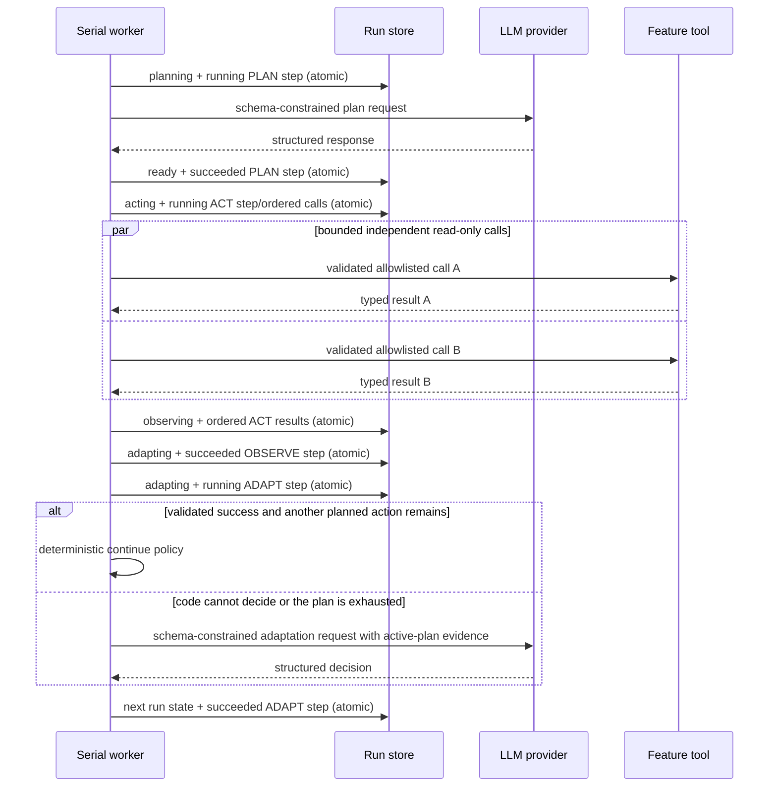

# Agent run state machine and recovery model

## Document control

| Field | Value |
|---|---|
| Status | Implemented Release 0 core baseline |
| Last verified | 31 August 2026 |
| Scope | `agent-core` lifecycle, persistence boundaries, tool turns, and restart recovery |
| Decision record | [ADR-010](decisions/ADR-010-deterministic-persisted-agent-state-machine.md) |

This document is the operational specification for the shared agent runner. The
broader service boundaries and release roadmap remain in
[shared-platform-design.md](shared-platform-design.md).

## Design guarantees

- Deterministic code owns transitions, authorization, limits, validation, cancellation,
  and recovery. Model output is untrusted structured data.
- Every model call and tool dispatch has a persisted `running` step before external I/O.
- A run snapshot and its associated step or review update commit in one SQLite
  transaction with optimistic version checking.
- Model calls and complete read-only stages may be repeated after interruption. A mutation with
  an unknown outcome is never silently repeated.
- Mutation replay reuses the original call ID and idempotency key. Feature-owned tool
  endpoints must enforce that key atomically with their business write.
- Plans, concise decisions, safe errors, tool results, and invocation metadata are
  auditable. Hidden reasoning and exception traces are neither requested nor stored.
- Persisted run/detail contracts enforce aware timestamps, ordered lifecycle times,
  limit-respecting counters, terminal result/error combinations, and nested step/review
  ownership. Immutable updates are fully revalidated rather than trusted copies.

These rules provide at-least-once recovery with effect-aware deduplication. They do not
claim impossible exactly-once delivery across independent HTTP services.

## Persisted lifecycle

`AgentRun.status` describes the orchestration boundary. `AgentStep.phase` records an
individual Plan, Act, Observe, or Adapt attempt. Retried model phases therefore create
new steps without inventing new run states.

```mermaid
stateDiagram-v2
    [*] --> queued
    queued --> planning: worker claims run
    queued --> cancelled: cancel before start

    planning --> ready: valid bounded plan
    planning --> planning: interrupted model call; close step and retry
    planning --> failed: invalid plan, provider error, or limit
    planning --> cancelled: cancellation at safe boundary

    ready --> acting: authorized action dispatch
    ready --> review_required: protected action
    ready --> cancelled: cancellation at safe boundary
    ready --> failed: invalid action or policy

    acting --> observing: result persisted
    acting --> ready: interrupted read-only action; replay exact call
    acting --> review_required: mutation outcome unknown
    acting --> failed: terminal tool or adapter failure

    observing --> adapting: deterministic observation persisted
    observing --> failed: invalid persisted result

    adapting --> ready: continue current plan
    adapting --> planning: replan
    adapting --> adapting: interrupted model call; close step and retry
    adapting --> failed: review request has no actionable target
    adapting --> succeeded: validated final result
    adapting --> failed: terminal decision or limit
    adapting --> cancelled: cancellation at safe boundary

    review_required --> ready: human approves exact pending call
    review_required --> cancelled: human rejects
    review_required --> failed: invalid review state

    succeeded --> [*]
    failed --> [*]
    cancelled --> [*]
```



Terminal states have no outgoing transitions. `succeeded` requires a final result and
`failed` requires a structured safe error. Every persisted change advances the run's
optimistic `version` by exactly one.

## One iteration and its durable checkpoints



The runner executes one plan stage per iteration. Repeated, ordered action sequence values define
a stage; only independent `read_only` actions may share a stage, and the worker pool is capped by
`max_parallel_tools`. Oversized read-only stages are split into deterministic chunks. Every
mutation has its own stage and protected actions retain the exact single-call review flow. An
adaptation can continue to the next stage, request a new plan, request review, complete, or fail. Iteration count,
tool-call count, wall-time budget, and the single optional model repair are enforced by
code rather than prompts. A validated successful result deterministically continues
when the active plan still has another action; this decision is persisted as an ADAPT
step with `decision_source=orchestration_policy` and does not spend a model call. When
model judgement is required, the adapter receives every ordered action/result pair from
the active plan, plus the current observation, rather than relying on hidden chat memory.

Replanning must demonstrate progress. If all tool results after the previous plan were
successful and the planner proposes the same ordered tool names and arguments again,
the run fails with `run_stalled` before repeating any call. Retryable tool failures may
still produce an identical retry plan. This deterministic guard complements the hard
iteration/tool/time limits and prevents contradictory model text from consuming the
entire budget in a no-progress loop.

Elapsed time is checked before every model or tool phase, including adaptation. Model
requests carry the run's absolute deadline, and tool executors receive the lesser of
their registered timeout and the run's remaining budget. Transport adapters enforce
those values. The runner also checks the next persisted boundary, so no subsequent
external call begins after expiry.

## Tool-call and review semantics

1. The planner may reference only immutable, allowlisted `ToolDefinition` entries.
2. Input is JSON Schema validated before authorization and again before dispatch.
3. Independent `read_only` calls may execute concurrently only when they share a planner stage.
   All other side-effect classes execute sequentially and receive the
   stable key `<run-id>:call:<call-id>`. The persisted call ID makes the key unique
   across replans while exact recovery continues to reuse the same key.
4. `destructive_write`, `external_effect`, and definitions explicitly marked as
   protected stop in `review_required` before dispatch.
5. Approval updates the existing pending call. It does not create a replacement call,
   arguments, call ID, or idempotency key.
6. Before a stage dispatch, code verifies `tool_call_count + batch_size <= max_tool_calls` and
   increments the counter by the exact dispatched size in the atomic checkpoint.
7. Successful output is schema validated before it becomes an observation. Adapter
   failures become bounded `ToolError` values and never expose a traceback through the
   run API.

Feature tool authors must distinguish an expected negative domain result from a failed
invocation. Evidence the agent can legitimately adapt from—such as an empty search or
`found: false`—belongs in a schema-valid successful response. Reserve non-retryable
tool failures for requests or invariants that should terminate the current plan, such
as malformed arguments, authorization denial, an idempotency conflict, or a broken
response contract. The runner deliberately does not ask a model to override those
deterministic failures.

An unexpected executor exception during a read is terminal and safely recorded. The
same exception during a write has an uncertain outcome, so the call returns to pending
review. Retryable transport failures such as timeouts, lost connections, and server
errors are also uncertain for writes even when the adapter returns a typed result; they
follow the same review path. The tool-call counter advances in the atomic pre-dispatch
checkpoint, so crashes and ambiguous attempts cannot bypass the run limit. Approving an
uncertain action means “retry/reconcile this exact idempotent operation”; rejecting it
cancels further execution. Feature HTTP adapters should offer an operation-status
lookup so a reviewer can distinguish “already applied” from “not applied” before
choosing.

## Durable scheduling and reconciliation

SQLite run state is the scheduling source of truth; the bounded in-memory queue is only
a low-latency wake-up signal. At startup and periodically while idle, AI-mode lists
non-terminal, non-review-blocked runs in stable order. Queue saturation therefore does
not lose accepted work, and transient handler failures recover without requiring a
process restart. Recovery applies the following policy before a run is executed:

| Persisted status | Evidence at interruption | Recovery |
|---|---|---|
| `queued` | No external work began | Re-enqueue unchanged |
| `planning` | No running PLAN step yet | Re-enqueue the stable boundary unchanged |
| `planning` | Running PLAN step, no accepted response | Mark that attempt failed with `execution_interrupted`; retry planning |
| `ready` | Valid plan, no action in flight | Re-enqueue unchanged |
| `acting`, read-only | Exact persisted call or all-read-only ordered batch, result absent | Return the same step to pending, transition to `ready`, and replay the complete call/batch |
| `acting`, effectful | Exact persisted call and idempotency key, result absent | Return the same step to pending and transition to `review_required` |
| `observing` | Tool result is already durable | Re-enqueue and derive the deterministic observation |
| `adapting` | No running ADAPT step yet | Re-enqueue the stable boundary unchanged |
| `adapting` | Running ADAPT step, no accepted response | Mark that attempt failed with `execution_interrupted`; retry adaptation |
| `review_required` | Human decision is required | Leave blocked; never auto-enqueue |
| terminal | Complete outcome | Ignore |

Malformed recovery evidence fails closed with `recovery_state_invalid`. Optimistic
version checks prevent a stale worker or reconciler from overwriting a newer decision.

## Structured-output turns

Planning and adaptation use provider-neutral message records and the Pydantic model's
JSON Schema. A validation failure permits at most one repair. The repair conversation
contains the prior assistant JSON followed by a user correction instruction with
bounded validation errors; this preserves conversational causality without storing or
requesting private reasoning. If repair fails, the phase and run fail deterministically.

## Current boundaries and later releases

The state machine, SQLite recovery, OpenAI Responses adapter, HTTP run/review surface,
feature-scoped HTTP tool adapter, create-run idempotency, and resumable safe-event pages
are implemented. The default tool registry remains empty until feature owners define
their HTTP contracts. Feature 1 proves feature-side mutation idempotency and operation status;
approved product endpoints for later features, production reviewer
authentication, and the integrated edge UI are still required before the full Release
0 capability can be claimed complete. An opt-in authenticated development evidence
view is available for local inspection.

`AdaptationDecision.REQUEST_REVIEW` is reserved as a later-release contract seam. In
Release 0 it fails closed with `unsupported_review_target`: the current review endpoint
can authorize an exact pending tool call, but a free-form adaptation supplies no target
or deterministic resume decision. A generalized Release 2 review contract must define
those semantics before enabling that transition.

Release 1 MCP tools and RAG observations must enter through the same tool/provider
ports. Release 2 Planner, Worker, and Reviewer roles must share these run records and
transition rules; they do not create an independent free-form agent loop.

## Verification

Deterministic tests cover the legal graph, transaction rollback, schema repair,
protected approval, exact idempotent resume, executor exceptions, and interruption in
planning, acting, observing, and adapting. They do not require Docker, OpenAI credentials, Azure, or
internet access:

```text
uv run pytest ai-services/agent-core/tests ai-services/ai-mode/tests/test_persistence.py
uv run python scripts/check.py
```
