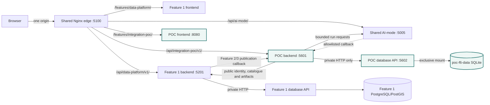
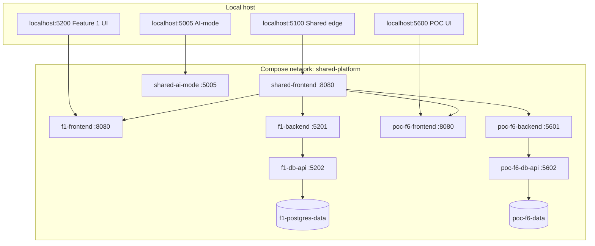
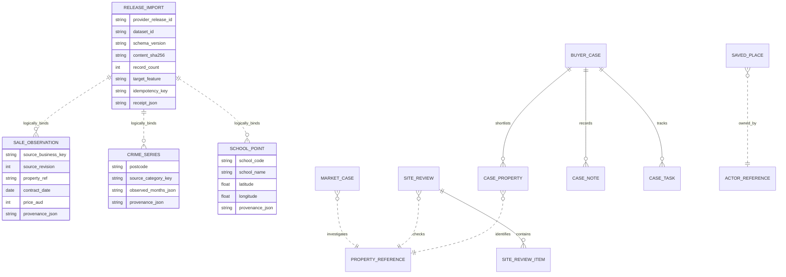
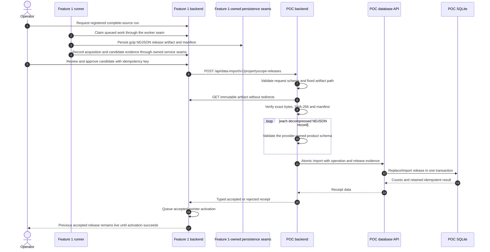
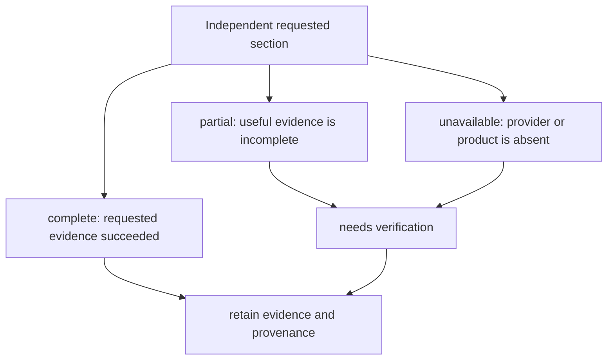
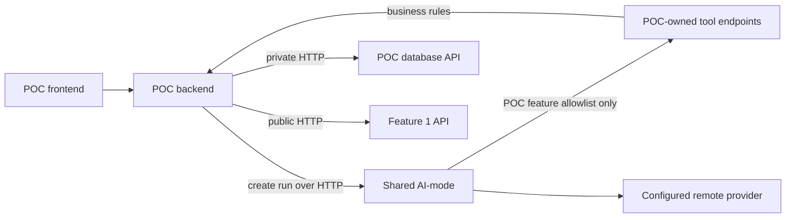

# Features 2–5 integration proof of concept

## Document control

| Field | Value |
|---|---|
| Status | Local-only integration experiment; not an allocated or assessed sixth feature |
| Branch | `Matt/Features_2-5_POC` |
| Scope | Exercise Shared and Feature 1 as a consumer while prototyping the workflows planned for Features 2–5 |
| Product route | `/features/integration-poc/` through the Shared edge; direct development port `5600` |
| Public API | `/api/integration-poc/v1/` |
| Persistence | POC-owned SQLite volume, opened only by `poc-f6-db-api` |

This branch deliberately does **not** change the five-feature registry, the approved ownership
allocation, or the planned status of Features 2–5. The POC is an integration laboratory: it tests
whether a new consumer can use the public Shared and Feature 1 seams without importing Feature 1,
receiving its database credentials, opening PostgreSQL, or mounting its artifact volume. It is not
evidence that the four owners' assessed implementations are complete.

## Component architecture



Only the POC database API mounts `poc-f6-data`. No POC service mounts `f1-postgres-data` or
`f1-artifacts`. The backend receives the fixed Feature 1 service origin
`http://f1-backend:5201`, not a database address.

## Local deployment and ownership



The two database volumes have disjoint owners. The edge and public frontends do not receive either
database credential, and the POC backend only receives the POC database API token.

## POC logical persistence model



This is a logical model, not a claim that every box is a SQLite table or every line is a foreign
key. `PROPERTY_REFERENCE` and `ACTOR_REFERENCE` are external opaque reference types, not local
copies of another service's entities. Provider-release relationships are validated logical bindings
retained in each imported row rather than SQLite foreign keys. Every imported record retains its
provider release and record-level provenance; `release_import` retains the exact publication
request, byte digest, count and returned receipt.

## Real dataset support

“Consume all real datasets” means consume every Feature 1 product whose current source policy and
contract permit a downstream consumer. It does not mean silently acquire publishers during startup
or invent missing Feature 4 evidence.

| Feature 1 registration | POC use | Transport | Live branch evidence | Honest limitation |
|---|---|---|---|---|
| `gnaf-nsw` | Property identity, address, coordinates and coverage for all prototype workflows | Feature 1 property APIs | Real accepted 5,190,134-record release consumed through query/report APIs | The G-NAF artifact is licence-controlled and correctly returns `403`; the POC must not copy it |
| `nsw-psi-sales` | Feature 2-style sale history, sample count, median price and period volume | Receipt-gated gzip-NDJSON callback; accepted-release pull reconciliation after activation | Streaming, rollback and source-scale configuration tests pass; replacement real run acquired/staged 7,395,147 records but failed late on an out-of-range street number before release construction | Source-aligned records include unmatched and unusual sales; the POC does not estimate value or recommend a purchase |
| `bocsar-crime` | Feature 3-style postcode series with exact observed-month and zero/missing semantics | Receipt-gated gzip-NDJSON callback; accepted-release pull reconciliation after activation | Real 10,114,565-row run was operator-cancelled after more than three hours in one database statement; no product artifact or POC receipt exists | Counts are not rates, causes, predictions, or a “safe suburb” score |
| `nsw-government-schools` | Feature 3-style nearby government-school points | Receipt-gated gzip-NDJSON callback; accepted-release pull reconciliation after activation | Real 2,210-record callback imported with an accepted consumer receipt; Feature 1 activation and cross-operation-key pull reconciliation both completed | Proximity does not establish catchment, eligibility, quality, or recommendation |
| Feature 4 planning/building products | Due-diligence checklist and explicit evidence gaps | No registered product exists | Explicit unavailable/verification states rendered | Planning, hazard, strata and building observations remain `unavailable`/`needs_verification` |
| Feature 5 data product | Buyer-case composition of the independent sections above | Runtime composition and POC-owned snapshots | Representative buyer case persisted and independently composed | Feature 5 is a consumer/composition owner, not a Feature 1 source product |

Feature 1 startup never contacts a publisher. Real acquisitions are explicit operator actions and
can be long-running. A release is not discoverable through the accepted-product pull seam merely
because acquisition succeeded: deterministic quality checks and human review must complete. The
publication callback reads the immutable candidate to construct a consumer receipt; the accepted
pointer advances only after that receipt is valid and asynchronous activation also succeeds.

## Publication and import sequence



The content hash covers the compressed bytes served by Feature 1. The POC uses the manifest's
`media_type` and `content_encoding` to decode those verified bytes; it does not infer the product
shape from a filename or prose documentation.

## Prototype workflow composition

```mermaid
sequenceDiagram
    autonumber
    actor User
    participant UI as POC frontend
    participant P as POC backend
    participant F1 as Feature 1 API
    participant DB as POC database API
    participant AI as Shared AI-mode

    User->>UI: Search and select an address
    UI->>P: Resolve property
    P->>F1: Search/inspect opaque property_ref
    F1-->>P: Identity, locality, point and release coverage
    P-->>UI: Verified property context
    User->>UI: Create market case, saved place, site review and buyer case
    UI->>P: CRUD requests
    P->>DB: Versioned writes
    P->>F1: Property identity/coverage report section
    P->>DB: Sale observations and market summary
    P->>DB: Crime series and nearby schools
    P->>DB: Site checklist and explicit missing evidence
    P-->>UI: Complete/partial/unavailable section states with provenance
    User->>UI: Request bounded explanation or dossier
    UI->>P: Start POC-owned AI task
    P->>AI: Objective, bounded context and POC feature key
    AI-->>P: Durable run reference/result or explicit provider-unavailable state
    P-->>UI: Evidence-aware result; deterministic CRUD remains available offline
```

Each requested section is failure-classified independently even though the POC currently composes
them sequentially; they are separate evidence outcomes, not one whole-report lifecycle:



One provider failure never discards a successful section. In particular, the absence of Feature 4
products produces a visible verification task; it does not produce a synthetic zoning or hazard
claim.

## AI boundary



The implemented catalogue exposes exactly two read-only wrappers:
`integration.provider_readiness.v1` and `integration.research_compose.v1`. The composition tool
returns the independent market, place, due-diligence and buyer-case evidence sections; there is no
AI mutation tool. AI-mode intentionally scopes a run to one feature key and does not grant a POC run
direct access to another feature's private tool set. A future persisted dossier or workflow mutation
would need a reviewed, idempotent contract. Offline mode proves deterministic paths and the explicit
AI-degraded state, not a model response.

## Local operation

The POC has the opt-in Compose profile `feature-6-poc`; ordinary
`uv run scripts/dev.py stack up --offline` continues to start only the canonical Shared and Feature
1 topology. From a clean checkout:

```text
uv sync --locked --all-packages --all-groups
uv run scripts/dev.py stack up --offline
$env:AI_MODE_REQUIRE_PROVIDER_READY = "false"
docker compose --file docker-compose.yml --file docker-compose.dev.yml --file poc/feature-6/docker-compose.yml --profile release-0 --profile feature-6-poc up --build --detach --wait shared-ai-mode shared-frontend f1-backend f1-frontend poc-f6-db-api poc-f6-backend poc-f6-frontend
```

Open the integrated route at <http://localhost:5100/features/integration-poc/> or the direct
development frontend at <http://localhost:5600>. The first command materialises the ignored offline
provider secret and starts Shared/Feature 1. The explicit third Compose file adds only the POC edge
routes, Feature 2/3 callback destinations and AI tool catalogue; without it the ordinary stack does
not advertise dead POC tools or redirect publication callbacks to an absent service. The second
command starts the additional POC containers and reconciles the four existing integration hosts so
they actually receive that overlay. It preserves the `ps-dev` project and named volumes.

To leave the laboratory without leaving dead routes, tools or callback origins behind:

```text
$env:AI_MODE_REQUIRE_PROVIDER_READY = "false"
docker compose --file docker-compose.yml --file docker-compose.dev.yml --file poc/feature-6/docker-compose.yml --profile release-0 --profile feature-6-poc stop poc-f6-frontend poc-f6-backend poc-f6-db-api
docker compose --file docker-compose.yml --file docker-compose.dev.yml --file poc/feature-6/docker-compose.yml --profile release-0 --profile feature-6-poc rm --force poc-f6-frontend poc-f6-backend poc-f6-db-api
docker compose --file docker-compose.yml --file docker-compose.dev.yml --profile release-0 up --detach --wait --force-recreate shared-ai-mode shared-frontend f1-backend f1-frontend
```

`uv run scripts/dev.py stack down` remains the simpler whole-project teardown and preserves named
volumes.

Official data remains opt-in. Use the registered Feature 1 operator workflow to acquire, review and
publish `psi-sales`, `bocsar-crime` and `schools-master`; use an approved local G-NAF archive only
under its documented licence path. Tests and a normal POC startup must not initiate network
acquisition.

## Live local validation evidence

The POC was exercised on 30 August 2026 against the running reloadable Compose stack, not only
against fixtures:

| Boundary | Live evidence |
|---|---|
| Shared edge | POC frontend, health and API resolved through `localhost:5100` on the same origin |
| G-NAF property API | The accepted release contained 5,190,134 records; `1 Martin Place Sydney` returned verified property references, coordinates and postcode over Feature 1 HTTP |
| Schools publication | Real release `5b95eee6-256f-4aad-a1c3-42975638a6ff` streamed 2,210 gzip-NDJSON records; the POC retained SHA-256 `9ca9fbe6140dbcbc85133cdb131225daae49c91931afbffd1c24e8347d78c76b` and returned an accepted 2,210/2,210/0 consumer receipt. Feature 1 activation `3de85e2d-a2fa-46d1-8abd-d5ef8427652f` advanced after the BOCSAR cancellation, and a pull reconciliation returned the original durable callback receipt rather than duplicating the release |
| BOCSAR acquisition | Run `d8dc3a73-0297-4e04-af04-40abb8874a64` acquired and prepared 10,114,565 real records, then was operator-cancelled at 17:25 after more than three hours in one unblocked CPU-active observation insert. The backend spilled about 2.4 GB across three temporary files; the draft release `f7bc23d8-1e3e-4350-b0ab-3249e0fa6645` is `abandoned` with zero records and no POC receipt |
| PSI replay | Replacement run `2fb2fbfe-e84d-4a56-8af0-77e2f953d106` acquired and staged all 7,395,147 rows, then failed at 18:01 with PostgreSQL integer overflow on `street_number_first=6711011622`. Its materialisation spilled about 34 GB to 36 temporary files and attempted 6,201,374 inserts before rollback; draft release `20ade72b-cd2c-4e6b-8070-583c5c15ae7b` is `abandoned`, the accepted predecessor is unchanged, and no POC receipt is claimed |
| Representative workflows | Market case, saved place, site review and buyer case were created through the Shared edge and remained after subsequent reads from the exclusive SQLite volume |
| Evidence composition | The selected Sydney property reported identity `complete`, place `complete` after the real schools import, market `partial`, and site due diligence `needs_verification` |
| AI-mode | A run was accepted with only the POC feature key, trusted property reference and two read-only tools; the deliberately offline credential then produced a retained `model_authentication_failed` result while deterministic research remained available, and the readiness UI rendered the body-level state as `degraded` rather than treating HTTP 200 as usable |
| Browser | Readiness, property search/research, the optional AI action and persisted sales-case view rendered without browser console errors |
| Canonical quality gate | `uv run python scripts/check.py` passed formatting, lint, contract generation, architecture/model/tool/style validation, strict MyPy and 1,004 tests (908 Python and 96 frontend) |

This evidence is deliberately exact about provider state. The tiny seeded sales/crime/school
releases have persistence status `accepted` but fail the current public accepted-release contract
validation with HTTP 409; they are not counted as real consumer proof.

## Friction register

The purpose of this branch is to retain integration friction rather than disguise it. “Suggested
sanding” describes a later change and is not a claim that the POC should alter the production
contract now.

| Priority | Observed friction | Consumer impact | Suggested sanding after the POC |
|---|---|---|---|
| Critical | `student-1/DATA_PRODUCT_CONSUMER_GUIDE.md` describes old builder versions and a JSON/uncompressed envelope, while runtime profiles use property snapshot 2.0.0, sales 3.0.0, crime 2.0.0 and schools 2.0.0 with gzip NDJSON | A copy-paste consumer follows a format that the real runner no longer emits | Generate the catalogue table/format examples from the runtime registry and add a drift test |
| Critical | The named real-HTTP reference consumer validates the legacy JSON envelope; it does not publish/import a runner-produced streaming artifact | The most important consumer path can pass tests while failing on runner-produced gzip-NDJSON artifacts | Add a real-HTTP streamed gzip-NDJSON publication test with per-record schema validation |
| Critical | The replacement real PSI run passed the earlier postcode-placeholder defect and staged 7,395,147 rows, but the warehouse cast accepted `street_number_first=6711011622` until the final insert raised integer overflow | A single invalid field can consume the entire source-scale sort/insert cost before the one-transaction rollback, while the public error is only `stage_parse_failed` | Validate and range-check typed canonical fields before source-scale materialisation, preserve the field-level reason in operator diagnostics, then replay the pinned evidence only after a bounded regression test |
| High | There is no reusable consumer package or scaffold for request validation, bounded download, digest verification, decompression, schema validation, atomic import and receipt construction | Every feature must independently reproduce security-sensitive protocol code | Publish a domain-neutral consumer helper in Shared, leaving record semantics feature-owned |
| High | Provider-owned consumer JSON Schemas live below `student-1/contracts` rather than in a versioned shared or independently consumable package | A consumer build must reach into the producer's source tree to validate its public wire product | Publish the data-product schemas as an explicit contract artifact/package with compatibility policy |
| High | Feature 1's synchronous callback client has a fixed 10-second timeout while real gzip-NDJSON products can contain millions of rows | Correct download, per-record validation and atomic import can exceed the callback deadline even with bounded memory | Make publication asynchronous or negotiate a source-scale timeout/retry contract with durable operation status |
| High | Feature 1's default callback origins use `feature-2-backend` style names while root Compose enforces `f2-*` ownership prefixes | A future service relying on defaults cannot resolve in the documented topology | Require explicit endpoint configuration and align examples/defaults with approved Compose names |
| High | Shared Nginx, feature registry/static fragment, dev service lists, tests and UI fixtures enumerate integrations manually | Onboarding requires edits across unrelated files and omissions are easy | Add a validated deployment projection that generates/checks only domain-neutral route metadata; this POC now isolates its edge additions in an explicit overlay |
| High | Shared dev Compose mounts common frontend assets below a read-only feature source mount and assumes those mountpoint directories already exist | A brand-new frontend container fails during OCI setup until it creates otherwise-empty `design-system/` and `browser/` directories | Mount an immutable assembled frontend image, or make the shared asset overlay a documented/generated feature scaffold |
| High | The direct Feature 1 frontend resolves its backend upstream at Nginx startup; recreating `f1-backend` left the still-running frontend returning `502` until it was restarted, while the Shared edge recovered | The canonical data CLI targets port 5200, so an otherwise healthy backend can appear unavailable and operator commands fail after ordinary dev rebuilds | Use Docker's resolver with a variable/upstream re-resolution strategy consistently, or make dependent frontend recreation part of the supported rebuild workflow |
| High | The baseline quality gate, style roots and fixture browser did not discover new feature inputs; this POC required explicit additions to `pyproject.toml` and `scripts/check.py` | A new feature can exist without automatically entering all aggregate checks | Make feature-owned check inputs discoverable from validated manifests/workflow metadata |
| High | The baseline Compose stack mounts only Feature 1's tool catalogue even though AI-mode can compose multiple catalogues; the POC needed an explicit overlay mount and path | A new AI feature needs manual secret-safe mount, path and reload changes | Validate and compose only enabled feature catalogues from explicit deployment configuration |
| High | Architecture validation has strong Feature 1 PostgreSQL/artifact rules but no generic one-owner rule for future SQLite volumes | A future database volume leak is not uniformly machine-rejected | Model service/volume ownership declaratively and validate every enabled feature |
| Medium | The Shared shell evidence adapter is Feature 1-specific | Other features can expose basic health/navigation but not rich evidence without new shell code | Define a small domain-neutral optional shell evidence adapter contract |
| Medium | `feature.yaml` and the Shared browser registry correctly allow only the five allocated students | A local POC cannot reuse the production discovery path without misrepresenting ownership | Keep experiments on explicit `/features/integration-poc/` routes; add a separate lab manifest only if repeated experiments need discovery |
| Medium | Publication is intentionally review-gated and no startup action publishes data | A fresh POC has valid empty states until an operator completes acquisition/review | Provide an explicit reconciliation/demo command that reports prerequisites without bypassing review |
| High | A valid accepted consumer receipt coexisted with a queued activation until the unrelated BOCSAR database statement was cancelled; only then did the schools accepted-product pointer advance | Consumers could not reconcile from the accepted pull seam and operators lacked enough queue/isolation progress to know when activation would advance | Expose activation queue position, phase, heartbeat and isolation evidence; consider a separate activation worker after measuring database contention and preserve compare-and-swap pointer semantics |
| Medium | Callback publication and accepted-release pull reconciliation derive different operation keys for the same immutable release | The first live pull returned a conflict even though its release checksum, schema and count exactly matched the accepted callback import | The POC now avoids duplicate storage and replays the original durable receipt only when immutable release evidence matches; it still opens and revalidates the artifact before the database detects the release alias, so the contract should define a release-identity lookup separately from delivery-operation identity |
| Medium | An already-open run detail page stops polling after `interrupted`; when another operator/API call resumes that same run, the tab can keep showing “Worker heartbeat expired” while the API and a freshly opened page show active staging | Operators can mistake a recovered multi-gigabyte import for a dead run and start conflicting work | Keep action availability unchanged, but use a distinct slow detail-reconciliation policy for `interrupted` plus an immediate visibility refresh; infer external recovery from its transition back to an active state |
| Medium | G-NAF redistribution is intentionally denied | A consumer cannot bulk-copy the address registry | Document property API query patterns and test the expected `403` artifact response |
| Medium | A common-address search can return many opaque property references with the same display address, coordinates and match score (94 results for `1 Martin Place Sydney` in the live check) | A consumer cannot present a meaningful choice or safely guess which indistinguishable reference the user intended | Expose approved disambiguation attributes or an explicit canonical-group/unit relationship while keeping the reference opaque |
| Medium | Feature 4 and Feature 5 have no registered Feature 1 data products | “All datasets” cannot satisfy their planned domain scope | Preserve unknown states; register only owner-approved planning/building contracts and sources later |
| Medium | Statewide real-source acquisition and import can be large and slow | Laptop demos cannot assume a fresh full import will complete quickly | Retain accepted volumes/caches and add bounded readiness/evidence checks, never silent truncation |
| High | During the real 10,114,565-row BOCSAR staging insert, the run showed 100% prepared but 0 loaded for more than three hours while one CPU-active database materialisation query continued and spilled about 2.4 GB to temporary files | The heartbeat proved liveness, but operators could not distinguish useful progress from pathological work, estimate the remaining time, or assess whether the plan needed intervention | Treat this as a performance failure: benchmark a typed `COPY FREEZE` stage without the ordinal key/JSON extraction or unproven `ORDER BY ordinal`, then expose loader sub-phases and durable progress/row estimates without weakening transaction atomicity |
| High | Cancelling the BOCSAR run through the supported API persisted `cancel_requested_at` but returned HTTP 503, and the active PostgreSQL statement required an explicit backend cancellation before rollback completed | Operators receive an ambiguous failure response and a long statement does not observe cooperative cancellation promptly | Make cancellation idempotently queryable and have the owning loader cancel its exact database statement/session when a run cancellation is persisted; return/reconcile the durable outcome rather than a misleading dependency error |
| High | Rollback left 9,796,443 dead observation tuples and a 2,515 MB heap plus 1,482 MB index for a table with only ten visible seed rows | Atomicity protected visible data, but cancellation consumed roughly 4 GB until vacuum/rebuild and can penalise later imports | Load a disposable release partition/table and drop it on failure, or provide a bounded post-cancel vacuum/reindex recovery policy; test disk reclamation as part of cancellation acceptance |
| High | PSI's wide JSONB `DISTINCT ON`, revision window, multiply referenced CTE, exact-address join and final ordering spilled about 34 GB; failure after 6,201,374 attempted inserts left about 2,204 MB heap and 772 MB index bloat around ten visible seed rows | The current plan repeatedly sorts/materialises wide payloads and discovers malformed fields only after expensive matching and indexing | Benchmark narrow typed identity/revision stages, one resolution per distinct address, explicit analysed temp phases and bulk index construction; preserve deduplication, deterministic revisions, ambiguity semantics, atomicity and replay safety |
| Medium | Adding the POC as a workspace member required copying its manifest into existing Feature 1 and AI-mode Docker dependency layers | A new workspace package breaks unrelated image builds until every hand-maintained manifest list is updated | Generate or validate workspace-manifest copy inputs from `uv.lock`/workspace metadata |
| Medium | POC import limits and HTTP/Gunicorn deadlines need explicit source-scale configuration; the current safety cap is not proof that every future product fits | A valid artifact may be rejected or interrupted for operational reasons rather than contract reasons | Publish product size budgets and asynchronous import SLOs in the catalogue, with separate connect/read/write limits |
| Medium | Pull reconciliation is still synchronous; the POC overlay needs a four-hour exact-route edge timeout to avoid the generic 10-second API timeout | A correct source-scale import occupies one browser/edge/backend request for an operationally unreasonable period | Replace pull reconciliation with a durable operation resource and polling; the long timeout only makes the current POC honest, not production-ready |
| Medium | AI-mode create returns a run object directly, while run detail returns an envelope containing `run`, `steps` and `reviews` | An ungenerated client can accidentally scope-check the wrong level; the first live POC read caught this despite create-path tests | Publish/generate a typed AI-mode client from one versioned HTTP contract and test both create and detail against the real app |
| Medium | AI-mode readiness uses HTTP 200 for both `healthy` and body-level `degraded` states | A status-code-only consumer can advertise model explanations as ready even when authentication or model access has failed | Publish a shared typed health projection and require consumers to evaluate the response body; the POC now demonstrates the expected degraded rendering |
| Medium | The Shared SPA fallback can make an invented path such as `/health/integration-poc` return HTML with HTTP 200; the actual integrated health route is `/api/shared-health/integration-poc` | A manual status-code-only smoke check can report a false positive against the product shell | Publish health routes from deployment metadata and assert response media type/schema as well as status in smoke checks |

The first BOCSAR performance experiment should retain one transaction, rollback semantics and
replay safety. The current path loads a 10-million-row JSONB stage with an ordinal primary key,
extracts/casts fields during an ordered `INSERT ... SELECT`, maintains a wide composite target key
and repeats three lineage foreign-key checks per observation. The live 2.4 GB temporary spill makes
the ordinal access/sort plan the first hypothesis to measure. A disposable benchmark should compare
100k, 1m and full-size inputs across typed staging, removal of unproven ordinal ordering, normal-path
`rowcount` rather than follow-up full counts, and larger local WAL budgets. It must keep
`ON CONFLICT` until an atomic committed-import marker makes the database-commit/loader-status crash
window replay-safe; chunk commits, disabled constraints and unlogged targets would be false wins.

## BOCSAR root-cause investigation and solve-next gate

The live cancellation is a failed source-scale acceptance test, not merely an unfinished demo. The
follow-up branch should not replay the publisher until it can explain and improve the disposable
plan. Its minimum gate is:

1. Reproduce at 100k and 1m representative observations with `EXPLAIN (ANALYZE, BUFFERS, WAL,
   SETTINGS, SUMMARY)`, per-phase timings, temp bytes, checkpoints, relation/index growth and
   rows/second.
2. Compare the current JSONB/ordinal plan with typed `COPY FREEZE`, no ordinal ordering, explicit
   staging analysis and normal-path row counts; retain exact zero-versus-missing and provenance
   semantics.
3. Measure the wide composite primary key and repeated lineage foreign-key cost against a
   release-scoped series key or disposable per-release table with a bulk-built index.
4. Prove cancellation interrupts the owning SQL statement promptly, returns a reconcilable durable
   result, rolls back visible rows, cleans temporary files and reclaims or deliberately schedules
   recovery of dead heap/index space.
5. Set an explicit local acceptance budget in minutes and a progress contract with truthful phases;
   do not accept “heartbeat is current” or 100% staged as evidence that materialisation is healthy.

PSI needs the same evidence discipline, but its first gate is earlier validation. Reproduce the
`6711011622` overflow with a focused canonical-record test, reject or explicitly model out-of-range
address components before opening the warehouse transaction, and preserve the field-level reason in
operator diagnostics. Then benchmark a typed narrow identity table, deterministic revision mapping
and one exact-match lookup per distinct normalised address against the current 34 GB spill plan.

## Prioritized follow-up

1. Fix stale run-detail reconciliation after an externally resumed run. Keep `interrupted` out of
   the active/cancellable set; give it a slow finite detail refresh and an immediate visibility
   refresh. Add a focused browser test that opens the page in `interrupted`, resumes over HTTP, and
   observes the same tab move back to `queued`/`staging` without a manual reload.
2. Investigate and solve the cancelled three-hour-plus BOCSAR acquisition/materialisation path using the root-cause gate above
   before replaying the real source; include prompt SQL cancellation and post-rollback bloat recovery.
3. Align the consumer guide/reference consumer with runner-produced gzip NDJSON and publish the
   provider Schemas as a supported contract artifact.
4. Give release activation independent queue/phase/heartbeat evidence so a successful consumer
   receipt does not leave accepted-product reconciliation opaque.
5. Replace synchronous source-scale publication callbacks with durable asynchronous import
   operations, or at minimum publish explicit timeout and artifact-size budgets.
6. Make Shared route, tool-catalogue, frontend-asset and quality-gate onboarding manifest-driven.
7. Fix PSI's pre-materialisation range validation and profile the 34 GB spill plan before replaying
   the real source evidence; add owner-approved Feature 4 products only when their contracts and
   sources are decided.

## Readiness conclusion

Shared and Feature 1 are a credible foundation: boundaries are explicit, deterministic tests are
strong, the public data catalogue and property APIs are useful, release artifacts and their bound
content evidence are immutable and
review-gated, AI-mode has a safe multi-catalogue seam, and the full current stack runs offline.
They are not yet a turnkey feature template. Current live proof is intentionally partial: ownership
and HTTP boundaries, real G-NAF API use and a real schools streaming callback/import are proven;
BOCSAR never reached publication or POC import because Feature 1 materialisation failed its live
acceptance test, and replayed real PSI sales are not yet proven. The POC is useful because
it exercises those boundaries in a live local stack and leaves a precise backlog for reducing the
manual onboarding, activation and streaming-consumer burden without disguising unfinished evidence.
