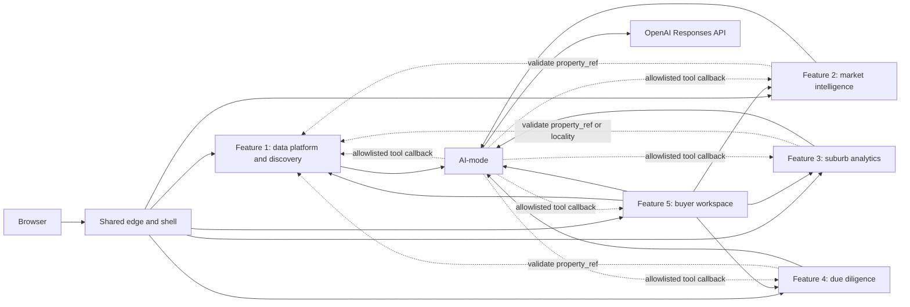
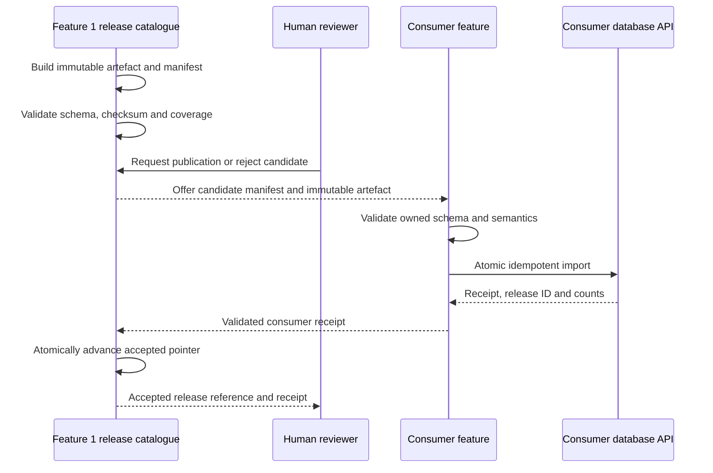

# PropertyScope feature integration and experience contract

## Document control

| Field | Value |
|---|---|
| Status | Team integration baseline; approved five-feature allocation, Feature 1 implemented, Features 2–5 planned |
| Last verified | 29 August 2026 |
| Scope | Browser navigation, HTTP integration, cross-feature data flow, shared styling, failure behaviour, onboarding and integration tests |
| Audience | Feature owners, shared-platform maintainers, reviewers and demonstrators |
| Normative language | **Must** is required for integration; **should** is the preferred default; **may** is optional |
| Related architecture | [`registered-feature-scope.md`](registered-feature-scope.md), [`shared-platform-design.md`](shared-platform-design.md) and [`propertyscope-product-and-feature-plan.md`](propertyscope-product-and-feature-plan.md) |

This document turns the approved repository boundaries and PropertyScope feature allocation into one
implementable integration contract. [`registered-feature-scope.md`](registered-feature-scope.md) is
the authority for owner, purpose and minimum feature scope. This contract refines integration
mechanics but does not authorise one student to implement another student's assessed work or turn an
optional design concept into a required capability.
Feature owners can change a domain contract through review, but they must preserve the integration
rules here or update this document and the affected contract tests in the same pull request.

## 1. Decision summary

PropertyScope is one application composed from five independently owned vertical slices. Integration
happens at four explicit seams:

1. the shared edge provides the product entry point, stable same-origin feature paths, availability
   metadata, global status/evidence links and the common visual contract;
2. feature frontends call only their own public backend and pass opaque identifiers in normal links;
3. feature backends collaborate through versioned HTTP APIs or validated publication artefacts, never
   another feature's code, database API, credentials or volume; and
4. AI-mode coordinates allowlisted tools while domain behaviour and all domain writes remain with the
   owning feature backend.

Feature 1 is the canonical property and release authority. Features 2–4 own their evidence semantics
and local accepted copies. Feature 5 is the only runtime cross-feature composition owner. This keeps
the provider graph acyclic and lets every feature remain useful when another feature or the model
provider is unavailable.

The common UI is a contract, not a shared product monolith. Shared code owns tokens, primitives,
navigation conventions, state language and the domain-neutral browser mapping provider. Each
feature owns its routes, forms, charts, map composition and domain layers, CRUD, API client and
domain interpretation. ADR-020 records this technical mapping seam.

## 2. Sources and current state

This baseline was reconciled against:

- the ASD 2026 project specification, especially the requirement for one unified home page and shared
  CSS theme across five frontend/backend/database microservice sets;
- the living shared-platform architecture and PropertyScope product/feature plan;
- the PropertyScope v2 prototype, screen inventory, API-to-UI mapping and desktop/mobile storyboards;
- the running shared shell and Feature 1 implementation; and
- the root Compose and development overlays.

The prototype is design evidence, not runtime authority. The checked-in contracts, application code,
Compose model and living architecture win if an old prototype screen disagrees with the repository.

| Area | Current state | Integration consequence |
|---|---|---|
| Shared shell | Implemented at port 5100 | Becomes the stable product entry and same-origin edge |
| Shared design system | Implemented and consumed by Feature 1 | Treat `--ps-*` tokens and `.ps-*` primitives as a versioned API |
| Feature 1 | Implemented at port 5200 with backend, runner, database API/loader and PostgreSQL/PostGIS | Preserve direct development access while adding canonical edge routing |
| Features 2–5 | Approved and allocated; not implemented | Reserve routes and contracts; never present them as available until their complete thin slice is healthy |
| AI-mode | Implemented at port 5005 | Features create bounded runs through their own backend; global operations remain secondary navigation |
| MCP, RAG, multi-agent and cloud | Later-release seams | Capability-gate them; ordinary CRUD and evidence reads must not depend on them |

## 3. Ownership and dependency model



The dashed Feature 2–4 calls are bounded validation or control-plane calls, not required joins for
ordinary reads. After a consumer imports an accepted release, its normal read path uses its own
database service.

| Feature | Runtime authority | Public API base | Canonical frontend base | May synchronously call |
|---|---|---|---|---|
| 1 Data platform and discovery | Property identity, source/release control plane, accepted property projections | `/api/data-platform/v1/` | `/features/data-platform/` | AI-mode; its own database API |
| 2 Sales explorer and market cases | Recorded-sale interpretation, simple deterministic summaries, market cases | `/api/market-intelligence/v1/` | `/features/market-intelligence/` | Feature 1 for bounded identity validation; AI-mode; its own database API |
| 3 Suburb, crime and liveability | Suburb/crime/amenity interpretation, saved and favourite suburbs | `/api/suburb-analytics/v1/` | `/features/suburb-analytics/` | Feature 1 for bounded identity/locality validation; AI-mode; its own database API |
| 4 Due diligence | Planning/site/building coverage semantics, site reviews | `/api/due-diligence/v1/` | `/features/due-diligence/` | Feature 1 for bounded identity/location validation; AI-mode; its own database API |
| 5 Buyer journey and agent workspace | Buyer cases, shortlisted properties, notes, tasks, cross-feature research summaries and next actions | `/api/buyer-workspaces/v1/` | `/features/buyer-workspaces/` | Feature APIs 1–4; AI-mode; its own database API |

### 3.1 Prohibited coupling

A feature must not:

- import another student's production package;
- call another feature's private database service;
- receive another feature's database URL, token or volume;
- parse the internal structure of an opaque `property_ref`;
- use shared browser code to implement domain rules;
- use AI-mode as a general service-to-service proxy; or
- make Feature 1 perform cross-domain joins for an interactive page.

The architecture validator remains the executable authority for import, credential and volume
boundaries. Any approved boundary change must update its tests and the living architecture.

## 4. Shared shell and routing contract

### 4.1 Public route ownership

The shared edge owns `/`, shared hash routes and the `/features/<slug>/` ingress paths. The browser
must be able to enter the integrated application at one origin without learning development ports.
Direct bound ports may remain available for isolated development and marking evidence.

| Route | Owner | Behaviour |
|---|---|---|
| `/` and `/#home` | Shared shell | Product home and primary journey start |
| `/#features` | Shared shell | Five-area directory driven by the shell feature registry |
| `/#system-status` | Shared shell | Live implemented-service readiness; planned features do not count as failures |
| `/#evidence` | Shared shell | Bounded accepted-release and agent-run references |
| `/#release-roadmap` | Shared shell | Honest implemented/planned capability view |
| `/operations/ai-mode/` | AI-mode, through the shared edge | Read-only durable Agent activity and evidence |
| `/features/data-platform/` | Feature 1 | Property search and data operations |
| `/features/market-intelligence/` | Feature 2 | Reserved until its complete slice is integrated |
| `/features/suburb-analytics/` | Feature 3 | Reserved until its complete slice is integrated |
| `/features/due-diligence/` | Feature 4 | Reserved until its complete slice is integrated |
| `/features/buyer-workspaces/` | Feature 5 | Reserved until its complete slice is integrated |

Each feature owns its hash routes below its base. The baseline landing hashes are:

```text
/features/data-platform/#properties
/features/market-intelligence/#market-cases
/features/suburb-analytics/#suburbs
/features/due-diligence/#site-reviews
/features/buyer-workspaces/#workspace
```

An unavailable feature has no live link. The shell displays `Planned`, `Disabled` or `Unavailable`
with an explanation; it must not redirect the user to Feature 1 or return an unrelated screen.
Reserved feature paths redirect to the registry-backed `/#features` explanation until their
complete slice is enabled. Unknown `/api/` paths return a structured Problem Details response and
must never fall through to shell HTML.

### 4.2 Feature registry

One domain-neutral browser registry is the deployed navigation and availability projection. Each
entry contains:

```text
id, feature_key, label, short_label, owner, summary,
frontend_base, default_hash, implemented, enabled, health_path
```

`implemented` means the code and contracts exist. `enabled` means the current deployment exposes
them. `ready` is a live health observation and must not be stored as static configuration. A feature
card becomes a link only when it is implemented and enabled; readiness is shown separately.

The registry must not contain feature entities, API payloads or business calculations. Compose
services stay explicit—the registry does not generate hidden topology. An implemented feature's
validated `feature.yaml` remains the machine-readable ownership and service-path authority; shell
tests must cross-check its identity and canonical frontend path against the browser projection.
Planned registry entries for approved but unimplemented features reserve product routes only and do
not stand in for an implemented feature manifest.

### 4.3 In-feature navigation

Every feature frontend must provide:

- a PropertyScope wordmark linking back to `/` at the shared origin and the same global product
  destinations used by the shared shell;
- the current feature name and task-oriented local navigation;
- one `main` landmark with one route-level `h1`;
- an accepted-data/freshness strip when the screen depends on published evidence;
- a visible route for its assessed CRUD aggregate and its bounded AI action; and
- a responsive navigation control with keyboard focus management.

The shared header is reserved for product-wide destinations. A link that leaves the shared
workspace for a feature must name the destination research area and use a visually distinct
transition affordance; it must not look like another same-shell navigation item. Once entered, the
feature keeps its research-area name visible and separates global destinations from its local task
navigation. Shared views reached from a feature provide an equally explicit return to that area.

Feature navigation must not copy the complete local navigation of every other feature. Cross-feature
destinations belong in the shared header or in explicit contextual links. Primary local navigation
must describe a small number of user tasks. Specialist contract, quality, file, coverage and trace
views should be opened from the record they explain instead of competing with the main workflow.

### 4.4 Deep links and context hand-off

Cross-feature browser links pass only stable, non-secret identifiers. They do not use shared
`localStorage`, mutable global JavaScript state or copied domain objects.

Preferred parameters are:

| Parameter | Meaning | Owner |
|---|---|---|
| `property_ref` | Opaque canonical PropertyScope property identifier | Feature 1 |
| `state` + `locality` | Locality identity; both are required | Feature 1 validates; consuming feature owns its observations |
| `buyer_case_id`, `market_case_id`, `saved_suburb_id`, `site_review_id` | Feature-owned aggregate identifier | Named feature only |
| `evidence_id`, `run_id`, `release_id` | Trace/detail reference, not embedded content | Provider named by the link |

For example, Feature 1 may link to:

```text
/features/market-intelligence/#property-history?property_ref=<opaque-id>
```

The receiving feature validates the identifier and renders not-found, unsupported and unavailable
states distinctly. Free-text address, prices, notes, objectives and evidence payloads must not be
placed in URLs. Return navigation uses a known route name or browser history, never an arbitrary
user-supplied redirect URL.

### 4.5 Asset and API paths

Feature HTML must use base-path-compatible relative asset URLs. Feature API calls use their absolute,
namespaced public API base. This allows the same image to work through the shared edge and through a
direct development port without duplicating builds.

The edge strips the feature ingress prefix only when proxying static feature requests. It does not
rewrite feature hashes, interpret domain routes or proxy database APIs. Security headers remain at
least as strict as the current shared and Feature 1 Nginx configurations.

### 4.6 Release 0 HTMX slices

The shared shell vendors HTMX 2.0.10 locally and uses it for the visible research-area directory:
`GET /fragments/research-areas.html` replaces a readable fallback. The deployed browser registry
remains the navigation authority; an executable parity test compares its IDs, labels, owners,
routes, implemented state and enabled state with the static fragment. This prevents the four planned
areas from becoming links or being presented as implemented.

Feature 1 Source-definition CRUD is the complete feature-owned slice. Browser requests under
`/fragments/data-platform/v1/sources` are proxied to the Feature 1 backend, rendered as autoescaped
HTML, and call the owning private database API through the existing injected `DataStoreClient`.
Existing `/api/data-platform/v1/sources` JSON contracts remain available and unchanged. The fragment
adapter does not call its own public API and neither frontend nor backend receives database
credentials. Validation and optimistic conflicts retain form values; safe error fragments expose a
request ID, loading/retry controls remain readable, and external CSP-compatible JavaScript restores
dialog/heading focus and preserves dirty-navigation protection.

This is a focused migration, not a frontend rewrite. Maps/spatial rendering, AI chat and run
timelines, adaptive polling, charts, complex client state, and unaffected feature routes remain
JavaScript-owned. Both fragment paths must be exercised in deterministic fixture mode and through
the containerised edge; fixture Source mutations use session-isolated memory only.

## 5. Cross-feature data and API integration

### 5.1 Identity contract

Feature 1 owns `property_ref`, canonical display address and location. Other features store
`property_ref` as an opaque string with no cross-database foreign key. A G-NAF PID remains source
evidence and must not be treated as a permanent legal-property identifier.

A locality key is the pair `(state, locality)`, normalised to the provider contract. Locality name
alone is not a durable key.

### 5.2 Evidence envelope

Source-backed responses should carry the domain-neutral metadata below while the feature retains
ownership of the observation itself:

```json
{
  "evidence": {
    "evidence_id": "provider-stable-reference",
    "source_name": "Publisher and dataset",
    "source_url": "https://publisher.example/record",
    "source_record_id": "source-specific-id",
    "source_release": "2026.05.1",
    "observed_at": "2026-05-18T08:45:37Z",
    "effective_date": "2025-12-31",
    "coverage_status": "observed",
    "freshness_status": "current_for_source",
    "match_method": "gnaf_pid",
    "match_confidence": "high",
    "transform_version": "provider-transform.v1"
  }
}
```

Until the team approves a shared schema, this is a provider/consumer convention with fixtures—not a
licence to move property entities into `shared_contracts`. Candidate vocabulary is:

```text
coverage_status: observed | partial | unavailable | stale | source_failed | not_applicable
freshness_status: current_for_source | age_unknown | potentially_stale | superseded
match_confidence: exact | high | medium | low | unmatched
```

An empty observation collection is schema-valid and is not proof of a negative. Feature 4 in
particular must distinguish observed non-intersection from unavailable or partial layer coverage.

### 5.3 Publication flow

Bulk or curated source data moves through a control-plane publication flow, not interactive API
fan-out:



The manifest includes producer feature, target feature, schema version, release ID, content hash,
record count, coverage/freshness metadata and creation time. The consumer owns acceptance rules.
Feature 1 records and validates the consumer receipt before atomically advancing its accepted
pointer; a rejection, unavailable consumer or invalid receipt leaves the previous accepted release
live. Publication/import operations require an idempotency key and auditable receipt.

### 5.4 Runtime composition

Only Feature 5 composes cross-feature product responses for a buyer case. It calls bounded research
section endpoints from Features 1–4, validates every response and snapshots provider, evidence,
release and request IDs. It does not recalculate another feature's metrics or remove provider
caveats.

| Provider | Feature 5 consumes | Provider remains responsible for |
|---|---|---|
| Feature 1 | Identity, match and release/coverage section | Canonical identity and source-release accuracy |
| Feature 2 | Market section | Calculations, exclusions, sample/method language |
| Feature 3 | Suburb/crime/place section | Period/measure alignment, zero/missing semantics and neutral framing |
| Feature 4 | Site/building section | Intersection/coverage semantics and professional-verification language |

Feature 5 returns independent section states: `complete`, `partial`, `unavailable`,
`needs_verification` or `conflicting`. One provider failure must not discard other successful
sections. The overall buyer-case research summary may complete as `needs_verification`.

### 5.5 AI-mode integration

The browser starts an AI task through its feature backend. The backend validates the entity,
constructs the bounded objective/context and calls AI-mode. AI-mode may call only registered,
versioned feature tools. A tool callback returns through the owning feature backend and its database
API; AI-mode never sees database credentials.

Read-only tools may run automatically within limits. Reversible, destructive or external-effect
tools follow the shared side-effect and human-review policy. All run creation and protected mutation
requests are idempotent. Deterministic search, CRUD, evidence reads and calculations remain available
when the model provider is not ready.

## 6. Failure, timeout and consistency rules

| Condition | Required behaviour |
|---|---|
| Feature is planned | No live link; explain that it is not implemented |
| Feature is disabled | Preserve route description; explain deployment gating |
| Feature is enabled but unhealthy | Show unavailable with last request ID/retry action; do not call it planned |
| Provider returns an empty evidence set | Render a valid unknown/no-supported-record state |
| Cross-feature call times out | Preserve other sections and identify the failed provider |
| AI provider is unavailable | Keep deterministic functionality; disable or fail the AI action explicitly |
| Candidate data release fails | Keep the previous accepted release active |
| Version conflict | Return `409`; reload/compare rather than overwrite |
| Invalid identifier or domain input | Return Problem Details, normally `400`, `404` or `422` as defined by the owner |
| Protected action changed after review | Reject stale approval with `409`; require regeneration and review |

Baseline deterministic cross-feature calls use a one-second connect timeout and a two-to-five-second
read timeout. There are no hidden unbounded retries. One retry is allowed only for an explicitly
idempotent transient read. Every HTTP request accepts or creates `X-Request-ID`; agent traffic also
propagates `X-Agent-Run-ID` and `traceparent` where available.

## 7. Shared experience and styling contract

### 7.1 Stable visual API

The stable shared surface is:

- every `--ps-*` custom property in `shared/frontend/design-system/tokens.css`;
- `.ps-container`, `.ps-cluster`, `.ps-stack`, `.ps-grid*`;
- `.ps-button` and documented modifiers;
- `.ps-badge` and semantic state modifiers;
- `.ps-card` and card elements;
- `.ps-input-shell`, `.ps-status-list`, `.ps-toast`;
- `.ps-sr-only` and `.ps-skip-link`; and
- the evidence vocabulary in the design-system README.

Classes without a `ps-` prefix are private to their feature or page. Feature stylesheets may compose
shared tokens and primitives but must not redefine token values. A shared breaking change requires a
version/migration note, affected-screen review, tests and a changelog entry.

### 7.2 Required import order

```html
<link rel="stylesheet" href="./design-system/tokens.css">
<link rel="stylesheet" href="./design-system/base.css">
<link rel="stylesheet" href="./design-system/components.css">
<link rel="stylesheet" href="./styles.css">
```

Each feature image copies the approved design-system directory at build time and the development
overlay mounts it read-only. This avoids a runtime dependency on the shell container while keeping a
single version-controlled source.

### 7.3 Token policy

Feature code uses semantic or scale tokens instead of ad hoc values for shared concepts:

| Concern | Shared token families |
|---|---|
| Typography | `--ps-font-*`, shared type scale/line-height tokens |
| Text/surfaces | `--ps-ink-*`, `--ps-canvas`, `--ps-paper*`, `--ps-line*` |
| Product accent | `--ps-ocean-*`, `--ps-eucalypt-*`, `--ps-sand-*` |
| Evidence state | `--ps-confirmed*`, `--ps-partial*`, `--ps-conflicting*`, `--ps-unknown*` |
| Operational/destructive state | `--ps-info*`, `--ps-danger*` |
| Layout/rhythm | `--ps-space-*`, `--ps-content-max`, shared control/shell sizes |
| Shape/elevation/motion | `--ps-radius-*`, `--ps-shadow-*`, `--ps-duration`, `--ps-ease`, focus ring |

Confirmed evidence is not a synonym for healthy service, successful request or approved AI output.
Operational health, evidence quality, feature availability, run state and human-review state use
separate labels even if they reuse a palette.

### 7.4 Screen anatomy

Every substantial route should use this order:

1. context/feature label, page title, task description and primary action;
2. accepted release, freshness, coverage or user-supplied context where applicable;
3. primary table, form, map, chart, comparison, report or run task;
4. adjacent or expandable method and limitation details;
5. a clear next action; and
6. request, evidence, release or run references where useful.

The product should feel related, not cloned. A market chart and site map can have different feature
layouts; their headings, form behaviour, badges, loading/empty/error treatment and evidence detail
must remain consistent.

### 7.5 Accessibility and responsive baseline

All feature frontends must provide keyboard-complete navigation and CRUD, visible focus, labelled
forms and errors, non-colour status labels, reduced-motion handling, meaningful loading/empty/error
states and chart/map text alternatives. Interactive targets should be at least 42 CSS pixels where
practical. Layouts must remain usable at 320 CSS pixels.

Desktop may use a persistent feature rail and split evidence views. Tablet collapses the rail and
prioritises columns. Mobile uses a single-column task flow and list-to-detail navigation rather than
squeezed split panes. Any printable buyer-case summary styles belong to Feature 5.

## 8. Integrated journeys

### 8.1 Property research and buyer case

1. The shell forwards an address query to Feature 1 through the canonical edge route.
2. Feature 1 resolves the address and the user confirms a `property_ref`.
3. A contextual link opens Feature 5, which stores the candidate in a user-owned workspace.
4. Feature 5 retrieves independent bounded sections from Features 1–4.
5. AI-mode plans and observes allowlisted retrieval; missing or conflicting evidence is retained.
6. Feature 5 saves a buyer-case summary with provider/evidence/release/run references.
7. The user reviews the summary and explicitly accepts, edits or rejects any suggested next action.

### 8.2 Data publication

1. Feature 1 builds and validates a candidate domain artefact.
2. The consumer validates its owned schema and semantics.
3. Human review accepts or rejects the candidate.
4. The consumer database API imports atomically and returns a receipt.
5. The shell/evidence surfaces show the accepted version; a rejected candidate never displaces it.

### 8.3 Partial failure

1. Feature 5 requests four provider sections with bounded concurrency and timeouts.
2. Feature 4 is unavailable; the other providers succeed.
3. The buyer case preserves the successful snapshots and the Feature 4 structured failure/request ID.
4. The agent may adapt once but cannot invent site evidence.
5. The result is `needs_verification`, with an editable follow-up for a qualified professional.

## 9. Onboarding a feature

A feature is linked from the shell only after all of the following are true:

- its team/tutor allocation and owner are recorded;
- `feature.yaml` validates and its frontend/API/health paths match this route table;
- frontend, backend and database services are independently containerised and healthy;
- its database store has exactly one owning database service and deterministic migrations/seeds;
- visible CRUD and ten-or-more-record evidence exist for every assessed table;
- its backend and database API have OpenAPI/fixtures and deterministic contract tests;
- its AI action uses the shared run contract and fake-provider tests;
- its frontend imports the common design system and passes keyboard/mobile checks;
- Compose adds explicit services, networks, volumes, health checks and edge proxy routes;
- provider/consumer tests cover success, empty, partial, invalid and unavailable responses; and
- the shell registry changes from planned to implemented/enabled only in the same integration PR.

The recommended implementation order is: contracts and thin CRUD slice; shared styling adoption;
Compose/edge wiring; AI action; consumer/provider integration; richer domain visualisation; integrated
journey evidence. Feature owners should not begin with a combined report or broad live-data import.

## 10. Required integration tests

### 10.1 Per feature

- frontend route parsing and deep-link tests;
- public backend to private database API over real HTTP;
- create/read/update/delete plus version-conflict tests;
- health/readiness dependency truthfulness;
- Problem Details and request-ID propagation;
- AI-mode client tests with fake model/tool behaviour;
- provider contract fixtures for success, empty, partial, stale/conflicting where relevant and errors;
- design-system import, skip-link, landmark and responsive smoke checks; and
- architecture validation proving no forbidden imports, credentials or volumes.

### 10.2 Group integration

- shell registry and route-link tests for all implemented features;
- one-origin browser navigation from shell to every enabled frontend and back;
- Compose health for all enabled services;
- one property identity carried through all supported providers;
- publication acceptance, rejection, checksum/schema drift and previous-release retention;
- Feature 5 full, partial and provider-timeout composition;
- AI Plan → Act → Observe → Adapt with tool and review evidence;
- deterministic functionality with the model provider unavailable; and
- desktop/mobile screenshots of the common shell and one primary route per feature.

The canonical local gate remains `uv run python scripts/check.py`. The complete stack is tested with
`uv run scripts/dev.py stack up`, `stack status`, and `stack down`; ordinary down must preserve
named volumes.

## 11. Delivery sequence and ownership

| Stage | Shared integration work | Feature-owner work | Exit evidence |
|---|---|---|---|
| 1 Contract baseline | Edge paths, registry, token API and this document | Review names/boundaries | Architecture review and focused shell tests |
| 2 Edge proof | Proxy Feature 1 at its canonical path; keep direct port | Make Feature 1 assets base-path compatible | Same-origin navigation and API smoke |
| 3 Thin slices | Add explicit route/service slots as owners deliver | Features 2–5 CRUD/API/database/AI slice | Per-student workflow and Compose health |
| 4 Publication | Manifest/receipt conventions and group fixture | Provider exports and consumer validation/import | Accept/reject/rollback integration tests |
| 5 Composition | Golden-path and partial-failure harness | Feature 5 provider clients, case summaries and next-action flow | Full and degraded buyer-case evidence |
| 6 Release extensions | Capability gates for MCP/RAG/multi-agent/cloud | Feature-owned tools/corpora/evaluations | Release-specific integration evidence |

Commits should stay staggered by concern: documentation/contract, edge/registry, styling adoption,
tests/fixes and review amendments. Shared-contract or edge changes require affected-owner review.

## 12. Decisions still requiring people

The following are intentionally not invented here:

- the curated Release 0 geography and candidate properties;
- the evidence-envelope promotion into `shared_contracts`;
- the approved browser end-to-end stack;
- authentication and user identity requirements;
- source licences/redistribution treatment; and
- Azure persistence and public-ingress configuration.

Until these are resolved, reserved routes and approved feature labels are safe planning constraints,
not claims that the associated assessed feature is implemented.

## 13. Change control

The owner changing a public route, evidence term, shared token, provider response or publication
schema must update:

1. the owning OpenAPI/schema/fixture or design-system changelog;
2. provider tests and affected consumer contract tests;
3. the shell registry or edge configuration if routing/availability changes;
4. this document and the living shared-platform design if the boundary changes; and
5. the PR description with migration, rollback and validation evidence.

Silent contract drift is not compatible with independent feature ownership. If prose and executable
contracts disagree, stop the integration, decide the intended behaviour with the affected owners and
update both in one reviewed change.
