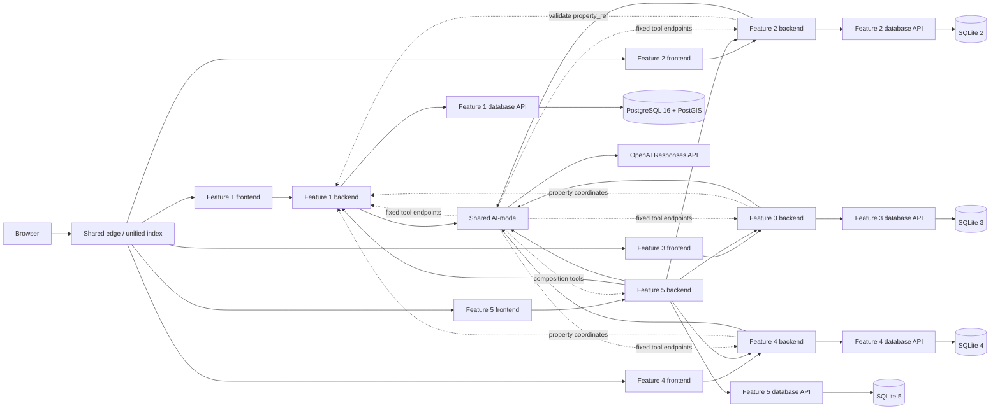
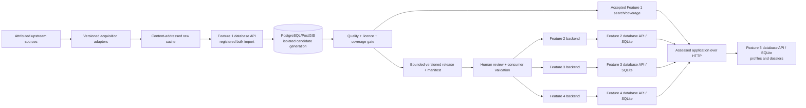
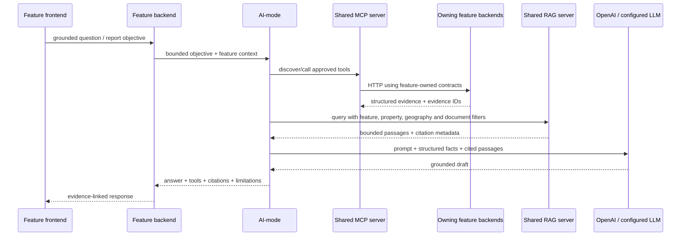

# PropertyScope NSW product, feature, and architecture plan

## Document control

| Field | Value |
|---|---|
| Status | Detailed planning reference; approved ownership and minimum scope are recorded separately |
| Prepared | 9 August 2026 |
| Scope | Releases 0–2, with detailed Release 0 delivery boundaries |
| Intended audience | Project team, tutor, feature owners, architecture reviewers, and report authors |
| Primary course sources | ASD 2026 Project Specifications, Assessment 1 brief, and Release 0 rubric |
| Prior product and data work | Previous project work completed by Matthew Shelton, including an attributed NSW property-data warehouse and ingestion research |
| Related architecture | [`registered-feature-scope.md`](registered-feature-scope.md), [`shared-platform-design.md`](shared-platform-design.md), [`decisions/ADR-016-propertyscope-feature-1-postgresql-postgis.md`](decisions/ADR-016-propertyscope-feature-1-postgresql-postgis.md), and [`../release-0/feature-onboarding.md`](../release-0/feature-onboarding.md) |

The team and tutor have approved PropertyScope, its five owners and the minimum feature boundaries in
[`registered-feature-scope.md`](registered-feature-scope.md). That record is authoritative. This
earlier document remains useful for implementation options, data research and release sequencing,
but concepts beyond the approved minimum—such as comparables, dossiers, printable reports or broad
source coverage—are optional stretch proposals unless separately approved. It does not authorise one
student to implement another student's assessed feature.

## 1. Executive decision

Build **PropertyScope NSW**, an evidence-first home-buyer research application for a deliberately bounded set of NSW properties and suburbs.

The product should help a user answer:

> “I am considering this property at this asking price. What do the available official and attributed records say about its sale history, suburb context, planning and hazard constraints, nearby schools and services, and building or strata evidence? What is confirmed, conflicting, stale, unavailable, or still worth checking?”

The product must not answer:

> “What will this property be worth?” or “Should I buy it?”

The approved five assessed features are:

1. **Data Platform and Property Discovery** — source catalogue, ingestion/release operations, canonical property identity, coverage explorer, and address/map search.
2. **Property Sales Explorer and Market Cases** — attributed sale history, simple deterministic summaries, saved market cases, and grounded AI explanations without valuation or purchase advice.
3. **Suburb, Crime, and Liveability Analytics** — suburb facts, approved crime/liveability indicators, amenities, visualisations, and saved/favourite suburbs.
4. **Site, Planning, and Building Due Diligence** — planning controls, environmental overlays, strata, tribunal, building evidence, and saved site reviews with explicit coverage states.
5. **Buyer Journey and Agent Workspace** — buyer cases, shortlists, journey stages, notes, tasks, related cross-feature research, and evidence-aware AI summaries/next actions.

This allocation makes the data platform a real, assessed feature rather than invisible shared labour. It has its own users, CRUD, frontend, backend, Feature 1-owned PostgreSQL/PostGIS database, AI workflow, and downstream publication contracts. It does not replace the other four students' independently owned databases or become a general SQL surface. It also promotes crime analytics into a first-class feature and combines uneven planning/hazard/building sources into a resilient **due-diligence evidence** slice.

### Overall assessment

| Dimension | Assessment |
|---|---|
| Release 0 feasibility | Medium–high with a small deterministic showcase profile plus a staged full-data Feature 1 profile; low if all known sources are ported at once |
| Project difficulty | 4.2/5 |
| Showcase wow factor | 5/5 |
| Rubric alignment | 4.8/5 with strict ownership and visible CRUD per slice |
| Strongest differentiator | One map/report joins official sales, source-aware suburb facts, land/building evidence, and an auditable agent run |
| Principal risk | Existing data depth tempts the team to overbuild ingestion and under-deliver assessed CRUD, CI, Compose, evidence, or individual ownership |

## 2. Assignment and rubric drivers

The architecture must be designed backwards from the literal assessment conditions.

### 2.1 Non-negotiable topology

Each of the five features needs its own:

- frontend microservice/container;
- backend/API microservice/container;
- database API microservice/container;
- feature-owned database store opened exclusively by that database service—approved PostgreSQL/PostGIS for Feature 1 and SQLite for Features 2–5;
- complete create, read, update, and delete flow visible through the frontend;
- minimum ten records in every database table;
- AI interaction initiated from the feature frontend through its backend and shared AI-mode;
- tool catalogue, tests, Docker targets, and `student-N.yml` workflow; and
- individual architecture, planning, risk, data-design, commit, contribution, and demonstration evidence.

The runtime boundary remains:

```text
feature frontend
  -> feature backend/API
     -> feature database API
        -> feature-owned database store

feature backend
  -> shared AI-mode
     -> OpenAI / configured LLM
     -> allowlisted feature backend tool endpoints
```

Other features access data only through the owning backend/API. They must not import another student's code, inspect another database schema/file, mount another database volume, or call another database service directly.

#### Database technology interpretation

The general technology table permits “SQLite / PostgreSQL,” but the more specific assessment text repeatedly requires integrated SQLite database microservices in Release 0, the Release 1 submission, and Release 2 cloud deployment. It also makes every student individually responsible for one database microservice. The supplied rubric further says each database container owns its assigned SQLite schema.

The approved baseline is therefore **five feature-owned database services**: Feature 1 uses
PostgreSQL 16/PostGIS because the verified corpus is approximately 29 GB and spatial; Features 2–5
retain SQLite. This is a targeted exception, not one shared team database. The decision and fallback
are recorded in the PostgreSQL/PostGIS ADR.

### 2.2 Rubric-to-design mapping

| Rubric criterion | PropertyScope design response |
|---|---|
| Project setup | Five manifests/slices, unified index, shared property-themed CSS, five populated feature-owned database services, root Compose topology, and five workflows |
| Service implementation | Each feature proves frontend → backend → database over HTTP with live/readiness checks |
| AI-mode integration | Every feature exposes one bounded AI task and its own run UI; Feature 5 provides the integrated report workflow |
| Agentic workflow | Report generation retrieves from all five feature APIs, observes missing/conflicting evidence, adapts, and review-gates the report write |
| Prompt/context management | Versioned prompts, source/freshness metadata, bounded tool schemas, prohibited-advice rules, and per-feature evaluation cases |
| DevOps | Each workflow validates its owned slice, contracts, seeds, tests, and images; integration CI verifies the full report journey |
| Docker Compose | One root configuration runs at least 15 student containers plus edge and AI-mode; the LLM API is external |
| Working software | User-owned records in every feature have visible CRUD independent of LLM-provider availability |
| Technical report | Data provenance, architecture, diagrams, evaluation results, screenshots, run trace, limitations, and contribution evidence are designed in from the start |
| Demonstration | Each student gets a short CRUD + AI vignette; the final report scenario crosses all five services |

### 2.3 What “full fledged” should mean here

For this assignment, full fledged means:

- polished, coherent navigation and visual design;
- rich interactions over a small, trustworthy dataset;
- clear provenance and data-quality language;
- real cross-service integration and graceful partial failure;
- deterministic calculations plus bounded AI interpretation;
- excellent tests, evidence, and demo reliability; and
- a credible path to deeper data in later releases.

It should **not** mean loading statewide data into every feature store, starting the 29 GB profile in CI/showcase, porting every researched adapter in Release 0, scraping commercial portals in CI, implementing a production AVM, or adding infrastructure that the team cannot explain and demonstrate.

## 3. Evidence available from previous project work

### 3.1 Attribution and purpose

Previous project work completed by **Matthew Shelton** provides:

- a researched product vision, source catalogue and data model;
- ingestion, provenance, validation and repeatability patterns;
- implemented address, sales, spatial, school, area, strata and public-record adapters of varying maturity, including partial and failed-source evidence that must be corrected rather than copied blindly;
- interface, dataset-interaction and insight concepts; and
- a populated PostgreSQL/PostGIS research warehouse suitable for read-only analysis, source validation and carefully migrated ingestion logic.

This is valuable prior intellectual and engineering work and should be credited as such in planning and contribution records. PropertyScope may reuse validated knowledge, transformation logic and legally redistributable extracts, while all assessed implementation, feature ownership and new contributions remain visible. The prior warehouse is evidence and a migration source, not the assessed database itself: Feature 1 receives new migrations-from-empty, versioned adapters/import profiles and a clear API boundary, while every other feature keeps its own database microservice.

### 3.2 Available data snapshot

The following counts were observed on 9 August 2026. They describe data available from the attributed previous project work, not promised Release 0 scope.

| Dataset or derived surface | Observed rows | Assessment interpretation |
|---|---:|---|
| NSW address records in the earlier accepted core | about 5.19 million | Excellent address spine, but a G-NAF PID is an address-record identifier rather than a legal property/parcel identity |
| VIC addresses | 4,394,828 | Out of scope for an NSW-first assignment release |
| Normalised sales | about 5.42 million | Strongest product dataset, subject to date/area/deduplication corrections |
| High-confidence address matches | Tier A 4,187,988; Tier B 311,538; Tier C 25,946 | Only unit-aware high-confidence matches should power address history; each tier remains disclosed |
| Geographic fallback/unmatched sales | Tier D 706,574; unmatched 53,533 | Valid for appropriately scoped suburb aggregates, not exact-property history |
| Plausibly dated sales from 1990 to audit date | 5,418,808 | Invalid/future date outliers exist and must be filtered/tested |
| Market-class sales | 5,285,049 | Strong deterministic basis for trends and comparables |
| Suburb quarterly median rows | 157,877 | Supports polished trend charts |
| Suburb market summaries | 2,006 | Strong suburb coverage, with state included in identity |
| Flood polygons | 94,431 | Substantial geometry, but locality coverage is uneven |
| Bushfire polygons | 146,400 | Substantial layer, but address intersection/materialisation is not uniformly proven |
| Other hazard polygons | 18,000 | Mostly landslide inventory plus Hunter flood-mitigation features |
| Planning features | 25,000 | Exactly 5,000 each for five layers due to a collection cap; this is partial evidence, not NSW coverage |
| Schools | 2,210 | Strong point dataset; catchment polygons are not currently promoted in the live core schema |
| Crime-month observations in the earlier dense model | 38,167,200, including about 35 million explicit zero rows | Rebuild sparsely with a separate coverage universe, then publish bounded Feature 3 products |
| SEIFA suburb observations | 14,495 | Useful contextual evidence, not a buyer or neighbourhood quality score |
| Broadband/mobile coverage features | 7,144 / 5,067 | Potential stretch layer; large geometries and interpretation complexity |
| Traffic stations/year rows | 1,783 / 236,148 | Useful local evidence; transit stops/routes are currently empty |
| Strata schemes | 88,468 | Strong NSW strata identity dataset |
| Strata Hub reports | 1,019 | Useful but incomplete and rate-limited source coverage |
| NCAT strata decisions | 713 | Useful evidence if plan/address linking is shown honestly |
| Building orders/undertakings | 10 / 54 | Real but thin; supporting evidence rather than a whole feature |
| Listings | 0 | Do not promise live listing coverage in Release 0 |
| Development applications | 0 | Adapter exists, but live product data is not currently demonstrated |
| Transit stops/routes | 0 / 0 | Defer until a successful, tested ingest exists |

### 3.3 Attributed source catalogue

Before any extract is committed, the owner must verify the current endpoint, terms, licence, attribution wording, release date and redistribution rules. “Publicly accessible” does not automatically mean “safe to redistribute.” The initial source register is:

| Evidence domain | Candidate authoritative or attributed source | Intended use | Important constraint |
|---|---|---|---|
| Address identity/geocode | Geoscape G-NAF Open | Canonical NSW addresses and coordinates | Preserve release and Geoscape attribution; do not imply postal verification |
| Sales | NSW Valuer General Property Sales Information | Historical registered sale observations and derived market aggregates | Validate current PSI terms; prefer bounded records or derived aggregates if redistribution is restricted |
| Inflation context | Australian Bureau of Statistics CPI | Optional real-price context | Display the series, reference period and method; do not call it a valuation |
| Boundaries and area linkage | ABS ASGS and/or Geoscape administrative boundaries | Locality and statistical-area mapping | Record geography edition and boundary vintage |
| Schools | NSW Department of Education school master/catchment services; ACARA school profiles where permitted | Nearby school facts and optional verified catchment evidence | Proximity is not eligibility; ACARA redistribution conditions require review |
| Crime | NSW Bureau of Crime Statistics and Research | Neutral, category-specific locality trends | Do not create a “safe suburb” score; expose period, geography and denominator limits |
| Socio-economic context | ABS SEIFA | Area-level contextual indicators | Never infer an individual household or protected characteristic |
| Planning | NSW Planning Portal/ePlanning spatial services and NSW Spatial Services | Zoning, height, FSR, lot size, heritage and parcel context | Planning instruments change; surface effective date and professional-verification warning |
| Flood | NSW Flood Data Portal/SEED, planning layers and relevant council studies | Study/overlay evidence and coverage status | Coverage is fragmented; absence of a loaded layer is not absence of flood exposure |
| Bushfire | NSW Rural Fire Service bush-fire-prone-land data | Mapped bushfire-prone observations | Do not certify safety, insurance status or development compliance |
| Other hazards | Geoscience Australia and relevant NSW datasets | Landslide and other selected mapped observations | Use only where candidate-level coverage and semantics are verified |
| Strata | NSW Strata Hub and NSW strata plan/reference data where permitted | Scheme identity and selected public report facts | Incomplete/rate-limited coverage; do not imply a clean bill of health |
| Tribunal/court material | NSW Caselaw/NCAT public decisions | Attributed strata decision evidence | Case linkage can be uncertain; observe copyright, privacy and match confidence |
| Building regulation | NSW Building Commission public orders and enforceable undertakings | Selected public compliance records | Thin dataset and date-sensitive; show exact source record |
| Connectivity | NBN/ACMA or other licensed coverage releases | Optional area connectivity context | Coverage claims and geometry may be generalised or dated |
| Transport/traffic | Transport for NSW open data | Traffic counts and future transit context | Current available transit ingest is incomplete; defer route-time promises |
| Amenities | OpenStreetMap under ODbL or another approved POI source | Optional nearby practical amenities | Retain ODbL attribution and avoid unsupported completeness claims |

### 3.4 Important coverage finding

Polygon count is not the same as useful property coverage. In a sample of familiar localities, the available risk summary reported near-complete flood intersection for Wollongong but zero flood matches for several others, including locations that users might reasonably expect to have flood information. This reflects the mix of open, gated, partial, and council-specific flood sources.

Therefore Feature 4 must expose one of these states per source/layer:

```text
observed_intersection
observed_no_intersection
coverage_unavailable
coverage_partial
evidence_stale
source_failed
not_applicable
```

It must never collapse “no loaded polygon” into “no risk.”

### 3.5 Proven, partial, and deferred capabilities

| Capability | Status | Release 0 treatment |
|---|---|---|
| Canonical address search and geocoding | Proven at scale | Curated NSW locality extract |
| Same-address sales and suburb histories | Proven at scale | Core feature |
| Comparable selection | Existing endpoint/logic; requires careful filters | Bounded deterministic comparables |
| CPI-adjusted history and market momentum | Demonstrated in previous work | Core charts or a polished stretch |
| Flood polygons | Proven but geographically uneven | One strong demo locality plus explicit coverage state elsewhere |
| Bushfire/planning/heritage | Loaded, but property-level demonstrations need curated verification | Include only verified candidate intersections |
| Schools | Proven points and attributes | Core; use distance and factual summaries |
| School intake zones | Official source identified; not loaded in current core | Stretch only after fixture and point-in-polygon tests |
| Crime trends | Proven, very large | Export suburb aggregates/categories, not raw 38M rows |
| SEIFA | Proven | Context with careful language; no neighbourhood ranking |
| Traffic counts | Proven | Candidate/suburb stretch evidence |
| Broadband/mobile | Proven but geometry-heavy | Stretch; prefer summary facts |
| Strata identity and selected reports | Proven, incomplete | Core for selected strata candidates |
| Tribunal/building records | Proven, linkage varies | Evidence with explicit match method/confidence |
| Live listings | Empty and terms/quota dependent | User-entered asking price/listing notes or synthetic fixture only |
| Development applications | Empty | Defer unless a successful bounded fixture is produced before scope freeze |
| Transit routes/stops | Empty | Defer; do not advertise commute-time calculations |
| Automated valuation/prediction | Explicit prior-work non-goal | Prohibited in assessed scope |

## 4. Product definition

### 4.1 Product statement

**PropertyScope NSW helps a buyer investigate candidate homes on a map, trace important claims to attributed evidence, compare suburb and property context, and use a reviewable AI workflow to identify what is confirmed, conflicting, stale, unavailable, or still missing.**

### 4.2 Primary users

| Persona | Need | Product response |
|---|---|---|
| First-home buyer | Understand unfamiliar records without pretending to be an expert | Plain-language evidence report with source links and questions to verify |
| Family buyer | Compare practical school, access, and suburb context | Factual nearby/catchment evidence plus user-controlled priorities |
| Apartment buyer | Discover strata/building evidence hidden across registers | Strata identity, public record summary, match confidence, and missing-document checklist |
| Regional/coastal buyer | Understand environmental/planning coverage | Coverage-aware map and explicit unknown states |
| Data-conscious investor | Examine history, volume, and comparables | Deterministic price-history and methodology; no forecast or buy/sell recommendation |
| Researcher/journalist | Understand provenance and transformations | Source register, timestamps, match tiers, sample size, and downloadable safe summaries in later scope |

### 4.3 Product principles

1. **Evidence before narrative.** Every important statement links to structured evidence or is labelled as an assumption/question.
2. **Unknown is a first-class result.** Missing coverage is not converted into a reassuring answer.
3. **Calculations are deterministic.** Distances, spatial intersections, medians, inflation adjustments, rankings, and thresholds are code—not model prose.
4. **AI explains and orchestrates.** The LLM chooses allowed evidence lookups, summarises results, identifies gaps, and adapts a checklist.
5. **No automated valuation or purchasing recommendation.** The system does not predict price, certify risk, provide legal/planning/engineering advice, or tell the user whether to buy.
6. **Small default profile, strong provenance.** Release 0 CI/showcase uses curated reproducible extracts; Feature 1 may run the same contracts against its opt-in statewide PostgreSQL profile.
7. **One owner per truth.** Every product record and API has a clear feature owner.

### 4.4 Explicit non-goals for Release 0

- statewide end-to-end report coverage or production service-level guarantees; Feature 1's opt-in full-data ingestion profile is an engineering capability, not a promise that every downstream feature supports every NSW address;
- real-time listing scraping or auction tracking;
- AVM, price forecast, rental-yield promise, or investment recommendation;
- mortgage affordability or finance advice;
- legal title, conveyancing, planning, engineering, insurance, or safety certification;
- user accounts, payments, agent leads, notifications, or personal-document uploads;
- satellite imagery or AI image appraisal;
- general GIS editing;
- arbitrary property support outside the documented demo coverage; and
- PDF generation if a polished printable HTML report can satisfy the demo.

## 5. Naming options

| Name | Positioning | Strength | Caution |
|---|---|---|---|
| **PropertyScope NSW** | Broad evidence lens | Clear, credible, expandable | Slightly generic |
| **GroundTruth Property** | Provenance and verification | Strong evidence-first message | “Ground truth” can overstate incomplete data |
| **HomeLens NSW** | Buyer-friendly research | Warm and memorable | Less analytical |
| **LotLogic** | Land/property intelligence | Short and technical | “Lot” does not fit every strata address |
| **ParcelProof** | Evidence and mapping | Distinctive | Sounds like title/legal verification |
| **AddressAtlas NSW** | Map and fact aggregation | Strong geospatial feel | Underplays reports and comparisons |
| **DwellScope** | Dwelling intelligence | Brandable | Meaning may not be immediately obvious |
| **BuyerBrief NSW** | Tailored report product | Direct user benefit | Underplays maps/data platform |
| **SiteSignal NSW** | Risks and local indicators | Modern/product-like | Can sound like a scoring engine |
| **PropertyEvidence NSW** | Literal and trustworthy | Tutor-friendly | Less polished as a consumer brand |
| **HomeContext NSW** | Suburb/property context | Honest, accessible | Less distinctive |
| **CivicParcel** | Government/open-data angle | Unusual | Sounds government-operated |

**Recommendation:** retain **PropertyScope NSW** for the registration and architecture documents. Use **“Evidence before decisions”** or **“Know what the records say”** as the product line. Avoid names containing “valuer,” “certified,” “safe,” “risk-free,” “advisor,” or “investment AI.”

## 6. Can the agent generate a tailored property report?

Yes, within a carefully defined support envelope.

### 6.1 Supported input

```json
{
  "property_ref": "nsw-gnaf-example",
  "address_text": "selected address from the supported dataset",
  "asking_price_aud": 1250000,
  "intended_use": "owner_occupier",
  "household_priorities": [
    "primary_school_access",
    "rail_or_bus_access",
    "lower_known_flood_exposure"
  ],
  "notes": "We are comparing this with one other shortlisted property."
}
```

The asking price is treated as a user-supplied claim, not a fact and not a valuation target.

### 6.2 Report sections

| Section | Owning evidence service | Contents |
|---|---|---|
| Request and scope | Feature 5 | User inputs, supported coverage, report time, model/prompt version |
| Property identity | Feature 1 | Canonical address, location, source release, match/verification status |
| Asking-price context | Features 1 and 2 | User-entered asking price versus recorded sales/comparable distribution, with no fair-value conclusion |
| Sale history | Feature 2 | Timeline, record class, matched address, changes, sample/method caveats |
| Suburb market | Feature 2 | Median/volume trend, property-type/timeframe caveats, nominal/real toggle |
| Crime/neighbourhood | Feature 3 | Selected offence trends/comparisons, nearby schools, practical services, area statistics, measure/period/source caveats |
| Site/planning evidence | Feature 4 | Verified overlay facts, explicit coverage states, planning fields, map links |
| Building/strata evidence | Feature 4 | Scheme identity, public decisions/orders/undertakings, match confidence, absent evidence caveat |
| Gaps and contradictions | Feature 5 agent | Missing tools/data, stale records, conflicting claims, weak joins, unassessed priorities |
| Suggested verification questions | Feature 5 agent | Questions for the user, council, conveyancer, inspector, insurer, school, or source authority |
| Human disposition | Feature 5 | Draft/accepted/needs verification/rejected, reviewer comment, immutable agent-run reference |

### 6.3 Support tiers

| Tier | Report available | Release 0 recommendation |
|---|---|---|
| Curated property | Full property report across all available feature evidence | Primary demo path |
| Supported suburb, unknown address | Suburb report plus user-entered property/listing notes | Useful fallback |
| NSW address outside extract | Clear unsupported-coverage response; optionally create a watchlist placeholder | Do not silently fabricate |
| Arbitrary Australian address | Out of scope | Future expansion only |

An excellent Release 0 can support four to eight selected NSW localities and tens of thousands of slim address rows without carrying the full warehouse. It can produce full reports for ten to thirty curated candidate properties and suburb reports for every selected locality.

## 7. Realistic user stories

### 7.1 Data platform and property discovery

1. As a buyer, I can search a supported NSW address and see the canonical matched record and map position.
2. As a user, I can see which PropertyScope datasets cover an address or suburb and when each accepted release was produced.
3. As a data operator, I can create, inspect, update, enable/disable, and delete a source definition.
4. As a data operator, I can inspect historical ingestion runs, row counts, validation results, failures, and published dataset releases.
5. As a data operator, I can initiate a bounded import/export job and retain the previous accepted release if validation fails.
6. As a data operator, I can ask AI to diagnose a failed/stale release, propose a safe refresh plan, and queue—rather than autonomously execute—a reviewed action.
7. As a user, I can see that an address or property is outside the supported dataset rather than receive guessed results.

### 7.2 Sales and market evidence

8. As a buyer, I can view the property's matched sale history and distinguish contract from settlement dates.
9. As a buyer, I can inspect why a nominal, part-sale, bulk-strata, future-dated, or unmatched record is excluded from normal comparisons.
10. As a buyer, I can create and revise a market-analysis case with chosen timeframe and comparable filters.
11. As a buyer, I can compare an asking price with recorded evidence without receiving an estimated value.
12. As a buyer, I can ask AI for a plain-language explanation that states sample size, assumptions, and anomalies.

### 7.3 Suburb, crime, and liveability analytics

13. As a buyer, I can open a polished suburb dashboard showing schools, crime trends, selected area context, and source freshness.
14. As a user, I can select offence categories and compare monthly or annualised trends across supported suburbs over the same period.
15. As a user, I can distinguish raw counts, population-normalised rates, percentage change, missing months, zeros, and revised source periods.
16. As a user, I can compare a suburb with itself over time and with a selected peer; I do not receive a predictive “safety score.”
17. As a family buyer, I can see nearby government schools and available intake-zone evidence without treating proximity or catchments as guaranteed enrolment.
18. As a commuter, I can see only transport or traffic facts that are actually loaded; unavailable transit data is labelled honestly.
19. As a buyer, I can create, view, update, and delete a saved suburb comparison/profile with practical priorities and selected indicators.
20. As a buyer, I can ask AI to explain observed changes and trade-offs using cited facts, without claiming causes, predicting crime, ranking residents, or labelling an area “safe” or “unsafe.”

### 7.4 Site, planning, strata, and building evidence

21. As a buyer, I can toggle available planning and hazard layers and view their source/effective dates.
22. As a buyer, I can distinguish observed non-intersection from unavailable or partial coverage.
23. As an apartment buyer, I can view matched strata scheme information and associated public records with match confidence.
24. As a buyer, I can create and maintain a site-review checklist and mark questions as verified, unresolved, or referred to a professional.
25. As a buyer, I can ask AI to explain the evidence and missing checks without receiving a risk certification.

### 7.5 Comparison and agentic report

26. As a buyer, I can create a workspace/profile stating intended use and practical priorities.
27. As a buyer, I can add, view, edit, annotate, archive, and delete watchlist entries and record an asking price/source URL as user-supplied information.
28. As a buyer, I can compare two to four candidates using the same evidence categories and as-of date.
29. As a buyer, I can request a report that gathers evidence from all four provider features.
30. As a buyer, I can watch the Plan → Act → Observe → Adapt run and see which tool produced each claim.
31. As a buyer, I can review, accept, reject, edit, or delete a draft dossier while retaining the immutable AI run reference.
32. As a buyer, I can turn unresolved report gaps into editable follow-up tasks and stakeholder-specific question guides.
33. As a buyer, I can track follow-ups without the application automatically contacting, negotiating with, or making commitments to another party.
34. As a demonstrator, I can deliberately remove or stale one evidence source and show the agent adapt its report and follow-up plan.

## 8. Five-feature decomposition options

### Option A — data platform plus buyer journey (recommended)

| Feature | Main data | User-owned CRUD | AI value | Balance |
|---|---|---|---|---|
| Data Platform, Provenance, and Property Discovery | Source/release/run metadata and canonical properties | Source definitions and dataset releases | Data-quality diagnosis and reviewed refresh plan | High |
| Sales and Market Intelligence | Sales and market series | Market-analysis cases | Evidence/anomaly explanation | Medium |
| Suburb, Crime, and Liveability Analytics | Crime time series, schools and selected area facts | Suburb comparison profiles | Evidence-grounded trend/trade-off explanation | High |
| Site, Planning, and Building Due Diligence | Planning/hazards/strata/building | Site reviews | Coverage-aware evidence checklist | High |
| Buyer Journey and Agent Workspace | Cross-service references | Workspaces, watchlists, follow-ups and dossiers | Full integrated agent/report/follow-up workflow | High |

**Advantages:** Makes ingestion/provenance assessable without sacrificing property discovery; gives crime analytics a strong visual home; gives every consumer saved work; and makes Feature 5's integration ownership obvious.  
**Disadvantages:** Feature 1 and Feature 5 are high effort. Feature 1 must publish bounded domain releases rather than become a general query database; Feature 5 needs stable contracts early.

### Option B — five evidence domains

1. Property identity and listings.
2. Sales and market history.
3. Planning and environmental overlays.
4. Schools and neighbourhood.
5. Strata and building evidence.

**Advantages:** Clean evidence-domain ownership and a simple source-to-feature mapping.  
**Disadvantages:** No owner for watchlists/comparison/report composition; the five experiences can feel like detached portals. Land-risk usefulness varies by locality.

### Option C — shared central runtime warehouse

1. Source registry, ingestion runs, and provenance.
2. Address and sales explorer.
3. Spatial overlays.
4. Suburb insights.
5. Buyer reports.

**Advantages:** One canonical query surface and minimal copied observations.  
**Disadvantages:** Creates a live dependency for nearly everything and weakens the other students' database ownership. This is not the targeted Feature 1-owned PostgreSQL decision: no other feature receives SQL access, and all retain their own system of record. Do not use this option.

### Option D — investor/analyst emphasis

1. Property catalogue and watchlists.
2. Address sale history and comparables.
3. Suburb market analytics and rankings.
4. Risk/liveability overlays.
5. Portfolio comparison and reports.

**Advantages:** Excellent charts and easy-to-understand analytics.  
**Disadvantages:** Encourages investment scoring, prediction, causal claims, and financial-advice language; schools/strata/building evidence gets squeezed.

### Decision

Choose **Option A**. Feature 1 owns the PostgreSQL/PostGIS ingestion data plane, control plane, release catalogue, provenance and canonical property registry; it does not own every domain's product semantics or saved work. Versioned, bounded data products flow to the database service that owns each downstream domain. This keeps ingestion visible and impressive while preventing SQL coupling and preserving four independent consumer stores.

## 9. Recommended feature specifications

### 9.1 Feature 1 — Data Platform, Provenance, and Property Discovery

The actionable Release 0 build sequence is maintained in [`../release-0/propertyscope-feature-1-implementation-plan.md`](../release-0/propertyscope-feature-1-implementation-plan.md).

**Purpose:** Own the product's data control plane, accepted dataset-release catalogue, canonical property identity, coverage discovery, and address/map search.

The team may describe this informally as the **data warehouse and ingestion feature**, but the
approved registration name includes **Property Discovery** so its end-user value and integrated
product role are unmistakable. PostgreSQL 16/PostGIS is its approved feature-owned persistence
implementation; the public boundary remains its frontend/backend API and publication contracts,
never SQL access.

**In scope:**

- source-definition and job-definition CRUD;
- browser-launched full-refresh/cached-reprocess runs, stage/task history, validation summaries, checksums, status, recovery and publication controls;
- supported-locality address search and canonical property detail;
- map/list browse and per-property source-coverage matrix;
- publish/rollback metadata for versioned per-feature data products;
- source freshness, attribution, licence and match-confidence surfaces; and
- data-quality/refresh-planning AI with human review before action.

**Out of scope:** bypassing source terms, scraping commercial portals, unreviewed scheduled writes, general-purpose SQL/data-lake access for other features, owning every feature's product semantics, valuation, and statewide browser payloads.

**Owned model groups:**

- `ops` — source definitions, job definitions, runs, tasks, artifacts, quality results, dataset releases and publication receipts;
- `registry` — stable platform property/addressable-location identity, versioned external identifiers, aliases and unresolved matches;
- `warehouse` — accepted, source-aligned G-NAF, PSI, BOCSAR, school and selected spatial observations used to build governed releases; and
- `serving` — accepted-release property-search and coverage projections only.

The detailed PostgreSQL types, constraints, import profiles, normalisation contracts and seed plan are maintained in the Feature 1 implementation plan. Every persistent Release 0 table still receives at least ten deterministic CI/showcase rows.

**Frontend:** two coherent workspaces behind one feature navigation:

- **Property Discovery:** address search, map/list split view, property drawer and source-coverage badges; and
- **Data Operations:** source catalogue CRUD, run timeline, release/coverage matrix, validation failures, provenance drawer and AI “diagnose release” action.

**Backend contracts:** source/release/run operations, published-manifest retrieval, property lookup/search and coverage discovery. It is the sole authority for `property_ref`, canonical address display and map point. It publishes bounded release artefacts; it does not provide general SQL/query access to the warehouse.

**AI objective example:** “Assess why the suburb-crime release failed validation, inspect the source definition and previous accepted run, propose a bounded refresh/recovery plan, and queue any publish/retry action for human review.”

**Tools:** `property.search.v1`, `property.inspect.v1`, `data.sources.v1`, `data.runs.v1`, `data.release_inspect.v1`, `data.coverage.v1`, and optional review-gated `data.run_retry.v1` / `data.release_publish.v1`.

**Difficulty:** 5/5. It is a credible feature only if both the operator workflow and buyer-facing discovery surface are polished. Keep real source acquisition out of CI and bound the assessed demo to deterministic fixture imports.

### 9.2 Feature 2 — Sales and Market Intelligence

**Purpose:** Own recorded sale evidence and deterministic market computations.

**In scope:**

- same-address sale timeline;
- contract versus settlement dates;
- sale class and match-quality explanation;
- nearby or same-suburb comparable evidence;
- suburb quarterly/monthly trend and volume;
- nominal versus CPI-adjusted history if the fixture includes CPI factors;
- market-analysis case CRUD; and
- AI narrative grounded in computed metrics.

**Out of scope:** AVM, forecast, “fair value,” automated comparable truth, rental yield without verified rental data, and causal investment claims.

**Owned tables:**

- `sale_observation` — attributed sale rows keyed by external `property_ref`;
- `market_case` — user-selected property/suburb, timeframe, filters, notes, and status; and
- optional `cpi_factor` as a small reference table only if inflation-adjusted charts are in Release 0.

**Frontend:** property timeline, sortable sale table, comparable distribution, suburb trend/volume chart, market-case CRUD, methodology drawer, AI explanation panel.

**Backend contracts:** property sale history, comparable query, suburb summary/time series, market-case CRUD. It may call Feature 1 to validate a property reference but does not import Feature 1 code.

**AI objective example:** “Explain this sale history and asking-price context. State record classes, sample size, excluded records, and whether the evidence is insufficient. Do not estimate value.”

**Tools:** `market.property_history.v1`, `market.comparables.v1`, `market.suburb_snapshot.v1`, and optional review-gated `market.case_save_summary.v1`.

**Difficulty:** 3.5/5. Most difficulty is methodological correctness and readable charts, not CRUD.

### 9.3 Feature 3 — Suburb, Crime, and Liveability Analytics

**Purpose:** Own factual suburb/place context, BOCSAR-derived crime time-series analytics, saved comparisons, and user-controlled practical priorities.

**Release 0 core data:** a bounded BOCSAR suburb-level monthly series across selected offence categories and supported suburbs, school points/attributes, selected school-intake-zone fixtures if verified, SEIFA context with careful wording, and one or two proven access indicators such as traffic or broadband summary. Do not include empty GTFS data merely to fill a screen.

**Owned tables:**

- `place_observation` — schools and other selected point facts;
- `area_observation` — attributed locality metrics by period/source; and
- `crime_series` — geography kind/value, offence, subcategory, month, count, optional published rate/denominator, source release, and zero/missing status; and
- `suburb_comparison` — user-owned localities, period, selected offences/indicators, priorities, notes, and status with full CRUD.

**Frontend:** suburb hero, comparison picker, school list/map, practical access cards, multi-series crime chart, category/period/count-rate controls, absolute/percentage-change cards, source/denominator notes, data freshness/coverage drawer, saved-comparison CRUD, and AI trend explanation. Every map/chart also has a table/text alternative.

**Backend contracts:** suburb facts, nearby places, school detail, bounded crime series/comparison/summary, selected area series, and saved-comparison CRUD. Feature 3 does not call Feature 2 at runtime. Optional market cards are composed by Feature 5 or loaded independently by the browser from Feature 2, so Feature 3 never copies or interprets sale summaries.

**AI objective example:** “Compare the selected offence trends for Parramatta and the chosen peer over the same period. Distinguish counts from rates, cite the periods and source release, state missing data, and describe observations without claiming causes, predicting crime, or labelling either suburb safe/unsafe.”

**Tools:** `suburb.snapshot.v1`, `crime.series.v1`, `crime.compare.v1`, `crime.methodology.v1`, `neighbourhood.nearby_places.v1`, `suburb.comparison_inspect.v1`, and optional review-gated `suburb.comparison_update_notes.v1`.

**Difficulty:** 4.5/5. The main challenges are data volume, consistent geographies, zero-versus-missing handling, responsible framing, and readable comparisons.

### 9.4 Feature 4 — Site, Planning, and Building Due Diligence

**Purpose:** Own property-level constraint and public building evidence without claiming completeness or professional authority.

**Release 0 core data:** selected planning controls, verified flood/bushfire/landslide observations for curated candidates, strata scheme identity, and selected tribunal/building records. Heritage, FSR, height, and lot-size fields are useful where verified. Development applications remain out until data is non-empty and tested.

**Owned tables:**

- `constraint_observation` — layer/evidence type, property reference, result, coverage state, dates, geometry reference, and provenance;
- `building_observation` — strata, tribunal, building-order/undertaking evidence and match method/confidence; and
- `site_review` — user-owned checklist, questions, disposition, reviewer notes, and status with full CRUD.

**Frontend:** candidate selector, source-aware layer map, planning fact cards, strata/building event timeline, coverage matrix, site-review CRUD board, and AI due-diligence checklist.

**Backend contracts:** property constraints, simplified layer GeoJSON, building evidence, and site-review CRUD. It calls Feature 1 for canonical location and never reads the property database.

**AI objective example:** “Explain the recorded site/planning/building evidence, distinguish non-intersection from unavailable coverage, and draft questions for professional verification. Do not certify safety or compliance.”

**Tools:** `site.constraints.v1`, `site.layer_coverage.v1`, `building.evidence.v1`, `site.review_inspect.v1`, and optional review-gated `site.review_update.v1`.

**Difficulty:** 4.5/5. This is the most data-quality-sensitive slice and should go to an owner comfortable with geospatial concepts and careful language.

### 9.5 Feature 5 — Buyer Journey and Agent Workspace

**Purpose:** Own buyer intent, candidate comparison, report lifecycle, follow-up workflow, human review, and cross-feature orchestration. It behaves like an evidence-organising buying assistant, not a licensed buyer's agent.

**In scope:**

- buyer-workspace/profile CRUD without authentication or sensitive documents;
- watchlist-entry CRUD with asking-price/listing claims explicitly marked user-supplied;
- dossier/report CRUD;
- follow-up-task CRUD for the selling agent, conveyancer, inspector, council, lender/broker, insurer, or school authority;
- stakeholder-specific question/checklist guides derived from report gaps;
- task status, owner, due date, notes and linked evidence;
- two-to-four candidate comparison;
- report objective builder;
- AI-mode run submission and progress display;
- evidence-section states and citations;
- human approve/reject/needs-verification disposition; and
- printable HTML report; and
- review-gated AI suggestions that never send messages, book appointments, negotiate, make offers, or contact external parties.

**Owned tables:**

- `buyer_profile` — intended use, practical priorities, notes, and status;
- `watchlist_entry` — workspace/property reference, asking price, source URL, user claims, notes and status;
- `follow_up_task` — dossier/property reference, stakeholder type, question/action, rationale, due date, status, notes and source evidence IDs;
- `property_dossier` — candidate references, asking-price claim, report status, prompt/model/run references, final disposition, and sections as bounded JSON; and
- optional `dossier_event` only if product-level report history needs more than AI-mode's existing run history.

**Frontend:** workspace/profile editor, watchlist board, shortlist comparison grid, report objective form, live phase/tool timeline, evidence matrix, stakeholder question guide, follow-up Kanban/list, report preview, review controls, history, and print layout.

**Backend contracts:** profile/watchlist/follow-up/dossier CRUD, candidate comparison, report-run creation/status projection, follow-up-guide generation, and composition proxy tools that call Features 1–4 over HTTP.

**AI objective example:** the complete property-report objective in Section 6.

**Tools:** `dossier.property_evidence.v1`, `dossier.market_evidence.v1`, `dossier.neighbourhood_evidence.v1`, `dossier.site_building_evidence.v1`, `followup.inspect.v1`, review-gated `dossier.save_draft.v1`, and review-gated `followup.create_tasks.v1`.

**Difficulty:** 4.5/5. This owner has less raw-data work but the most cross-service, AI, state, and report UX responsibility.

## 10. Canonical identifiers and evidence model

### 10.1 Cross-service identity

Feature 1 owns the meaning and resolution of `property_ref`.

Recommended external form:

```text
property_ref = "<platform-generated UUID>"
```

G-NAF identifiers are versioned evidence attached to the registry identity:

```text
scheme = "gnaf_pid"
identifier_value = "<source PID>"
source_release_id = "<accepted G-NAF release UUID>"
```

A G-NAF PID identifies a source address record, not a legal parcel, title, building or permanent PropertyScope property. A user-entered address can receive a platform UUID with `resolution_status = "unresolved"`; ambiguous aliases/units remain reviewable rather than being silently collapsed. Feature 1 carries a UUID across releases only when deterministic evidence supports continuity.

Other services store `property_ref` as an opaque string. They do not parse it, enforce a cross-database foreign key, or assume G-NAF fields. When necessary, they validate it through `GET /api/property-search/v1/properties/{property_ref}`.

Suburb identity must include state to avoid collisions already found in previous data analysis:

```json
{
  "state": "NSW",
  "locality": "BURWOOD"
}
```

Do not use locality name alone as a durable identifier.

### 10.2 Common evidence envelope

Every source-backed observation should expose a consistent, domain-neutral evidence envelope while the owning feature defines the observation itself.

```json
{
  "evidence": {
    "source_name": "NSW Valuer General Property Sales Information",
    "source_url": "https://example-authoritative-source.invalid/record-or-dataset",
    "source_record_id": "source-specific-id",
    "source_release": "2026-05-fixture-v1",
    "observed_at": "2026-05-18T08:45:37Z",
    "effective_date": "2025-12-31",
    "coverage_status": "observed",
    "match_method": "gnaf_pid",
    "match_confidence": "high",
    "licence_id": "recorded-source-licence",
    "transform_version": "propertyscope-export.v1"
  }
}
```

Candidate enums:

```text
coverage_status:
  observed | partial | unavailable | stale | source_failed | not_applicable

match_confidence:
  exact | high | medium | low | unmatched

freshness_status:
  current_for_source | age_unknown | potentially_stale | superseded
```

This envelope may become a new **domain-neutral** shared contract after team review because it is useful to any evidence-based feature. Property/sale/school/risk entities themselves must not be added to `shared_contracts`.

### 10.3 CRUD versus official evidence

The literal CRUD requirement should be satisfied on user-owned work records:

| Feature | CRUD aggregate | Why users legitimately edit/delete it |
|---|---|---|
| 1 | Source definition and dataset release | Operators configure a local source and manage candidate/accepted release metadata; immutable run evidence is superseded rather than rewritten |
| 2 | Market case | It represents chosen filters, comparables, notes, and analysis status |
| 3 | Suburb comparison | It represents selected suburbs, crime/area metrics, period, priorities and notes |
| 4 | Site review | It represents the user's checklist and verification progress |
| 5 | Buyer profile, watchlist entry, follow-up task and dossier | They represent the buyer's workspace, candidates, evidence requests, report draft, and disposition |

Government/source observations are seeded/imported evidence. Product users do not “correct” or delete the NSW register through this application. An admin/import test surface may replace or supersede local fixture records, but that is distinct from claiming to mutate an upstream source.

### 10.4 Suggested table fields

The following is a logical design, not a mandate to duplicate every field.

#### Feature 1

```text
source_definition
  id TEXT PK
  name TEXT
  publisher TEXT
  source_url TEXT
  adapter_key TEXT
  cadence TEXT
  licence_id TEXT
  redistribution_policy TEXT
  owner_contact TEXT
  enabled INTEGER
  notes TEXT
  created_at TEXT
  updated_at TEXT
  version INTEGER

ingestion_run
  id TEXT PK
  source_definition_id TEXT
  adapter_version TEXT
  started_at TEXT
  finished_at TEXT NULL
  status TEXT
  rows_discovered INTEGER
  rows_accepted INTEGER
  rows_rejected INTEGER
  content_sha256 TEXT NULL
  validation_summary_json TEXT
  error_json TEXT NULL
  supersedes_run_id TEXT NULL

dataset_release
  id TEXT PK
  source_definition_id TEXT
  target_feature TEXT
  release_version TEXT
  schema_version TEXT
  coverage_json TEXT
  record_count INTEGER
  content_sha256 TEXT
  manifest_json TEXT
  status TEXT
  accepted_at TEXT NULL
  supersedes_release_id TEXT NULL
  created_at TEXT
  updated_at TEXT
  version INTEGER

property_snapshot
  property_ref TEXT PK
  address_display TEXT
  unit TEXT NULL
  street_number TEXT
  street_name TEXT
  locality TEXT
  postcode TEXT
  state TEXT CHECK state='NSW'
  latitude REAL
  longitude REAL
  resolution_status TEXT
  source_release TEXT
  observed_at TEXT
```

#### Feature 2

```text
sale_observation
  id TEXT PK
  property_ref TEXT
  source_sale_id TEXT
  contract_date TEXT NULL
  settlement_date TEXT NULL
  price_aud INTEGER
  area_sqm REAL NULL
  sale_class TEXT
  match_tier TEXT
  locality TEXT
  postcode TEXT
  source_release TEXT
  observed_at TEXT

market_case
  id TEXT PK
  title TEXT
  property_ref TEXT NULL
  state TEXT
  locality TEXT
  from_date TEXT
  to_date TEXT
  filters_json TEXT
  selected_comparable_ids_json TEXT
  notes TEXT
  status TEXT
  created_at TEXT
  updated_at TEXT
  version INTEGER
```

#### Feature 3

```text
place_observation
  id TEXT PK
  place_type TEXT
  name TEXT
  state TEXT
  locality TEXT
  latitude REAL
  longitude REAL
  attributes_json TEXT
  source_release TEXT
  observed_at TEXT

area_observation
  id TEXT PK
  state TEXT
  locality TEXT
  metric_key TEXT
  period_start TEXT NULL
  period_end TEXT NULL
  numeric_value REAL NULL
  text_value TEXT NULL
  unit TEXT NULL
  caveat TEXT NULL
  source_release TEXT
  observed_at TEXT

crime_series
  id TEXT PK
  geog_kind TEXT
  state TEXT
  geog_value TEXT
  offence TEXT
  subcategory TEXT
  month TEXT
  count INTEGER
  rate_value REAL NULL
  rate_unit TEXT NULL
  population_basis TEXT NULL
  value_status TEXT
  source_release TEXT
  observed_at TEXT

suburb_comparison
  id TEXT PK
  title TEXT
  state TEXT
  localities_json TEXT
  from_month TEXT
  to_month TEXT
  selected_offences_json TEXT
  selected_indicators_json TEXT
  priorities_json TEXT
  selected_place_ids_json TEXT
  notes TEXT
  status TEXT
  created_at TEXT
  updated_at TEXT
  version INTEGER
```

#### Feature 4

```text
constraint_observation
  id TEXT PK
  property_ref TEXT
  evidence_type TEXT
  result TEXT
  coverage_status TEXT
  effective_date TEXT NULL
  detail_json TEXT
  geometry_json TEXT NULL
  source_release TEXT
  observed_at TEXT

building_observation
  id TEXT PK
  property_ref TEXT NULL
  strata_plan_number TEXT NULL
  evidence_type TEXT
  title TEXT
  event_date TEXT NULL
  summary TEXT
  match_method TEXT
  match_confidence TEXT
  source_url TEXT
  source_release TEXT
  observed_at TEXT

site_review
  id TEXT PK
  property_ref TEXT
  title TEXT
  checklist_json TEXT
  reviewer_notes TEXT
  status TEXT
  created_at TEXT
  updated_at TEXT
  version INTEGER
```

#### Feature 5

```text
buyer_profile
  id TEXT PK
  display_name TEXT
  intended_use TEXT
  priorities_json TEXT
  notes TEXT
  status TEXT
  created_at TEXT
  updated_at TEXT
  version INTEGER

watchlist_entry
  id TEXT PK
  buyer_profile_id TEXT
  property_ref TEXT
  label TEXT
  asking_price_aud INTEGER NULL
  listing_url TEXT NULL
  listing_claims_text TEXT NULL
  notes TEXT
  status TEXT
  created_at TEXT
  updated_at TEXT
  version INTEGER

follow_up_task
  id TEXT PK
  buyer_profile_id TEXT
  dossier_id TEXT NULL
  property_ref TEXT
  stakeholder_type TEXT
  action_text TEXT
  rationale TEXT
  due_date TEXT NULL
  evidence_ids_json TEXT
  status TEXT
  notes TEXT
  created_at TEXT
  updated_at TEXT
  version INTEGER

property_dossier
  id TEXT PK
  buyer_profile_id TEXT
  title TEXT
  property_refs_json TEXT
  primary_property_ref TEXT
  asking_price_aud INTEGER NULL
  objective TEXT
  report_sections_json TEXT
  evidence_as_of TEXT
  agent_run_id TEXT NULL
  agent_prompt_set TEXT NULL
  model_profile TEXT NULL
  status TEXT
  human_disposition TEXT NULL
  reviewer_comment TEXT NULL
  created_at TEXT
  updated_at TEXT
  version INTEGER
```

Every production table needs a migration, at least ten deterministic seed rows, idempotent seeding, uniqueness/validation tests, and a documented deletion rule.

## 11. HTTP API contracts

### 11.1 Contract ownership rule

Domain contracts live with the feature that provides them, for example:

```text
student-2/
  contracts/
    market-api.v1.openapi.yaml
    fixtures/
      property-history.success.json
      property-history.empty.json
```

Consumers may generate clients or test against published OpenAPI/JSON examples, but production code must not import another student's Python package. Provider workflow changes should trigger consumer contract tests through path filters or the integration workflow.

### 11.2 Route namespace

Recommended same-origin external routes:

```text
/features/data-platform/
/features/market-intelligence/
/features/suburb-analytics/
/features/due-diligence/
/features/buyer-workspaces/

/api/data-platform/v1/
/api/market-intelligence/v1/
/api/suburb-analytics/v1/
/api/due-diligence/v1/
/api/buyer-workspaces/v1/
```

Internal database routes should remain on private networks and need not be exposed by the shared edge.

### 11.3 Feature 1 public/backend API

| Method | Path | Purpose |
|---|---|---|
| GET/POST | `/sources` | List/create source definitions |
| GET/PUT/DELETE | `/sources/{id}` | Inspect/update/delete a source definition |
| GET/POST | `/ingestion-runs` | List or request a bounded run; request is idempotent/reviewable |
| GET | `/ingestion-runs/{id}` | Run counts, validation, failure and provenance evidence |
| POST | `/ingestion-runs/{id}/retry` | Queue a reviewed retry; never arbitrary shell execution |
| GET/POST | `/dataset-releases` | List/create candidate release metadata |
| GET/PUT/DELETE | `/dataset-releases/{id}` | Inspect/update/delete permitted draft metadata; accepted history is superseded |
| POST | `/dataset-releases/{id}/publish` | Review-gated accepted-release transition |
| GET | `/properties/search?q=&state=NSW&limit=` | Bounded address/property search |
| GET | `/properties/{property_ref}` | Canonical property snapshot |
| GET | `/properties/{property_ref}/map-context` | Point plus safe display geometry metadata |
| GET | `/properties/{property_ref}/coverage` | Dataset release/coverage summary by feature/source |
| POST | `/dataset-releases/{id}/agent-runs` | Start data-quality/recovery analysis |
| GET | `/agent-runs/{run_id}` | Feature-safe projection/proxy to AI-mode run |

### 11.4 Feature 2 public/backend API

| Method | Path | Purpose |
|---|---|---|
| GET | `/properties/{property_ref}/sales` | Ordered attributed sale history |
| GET | `/properties/{property_ref}/comparables` | Deterministic bounded comparable selection |
| GET | `/suburbs/{state}/{locality}/market-summary` | Current summary with sample/method fields |
| GET | `/suburbs/{state}/{locality}/market-timeseries` | Period series for charts |
| GET/POST | `/market-cases` | List/create analysis cases |
| GET/PUT/DELETE | `/market-cases/{id}` | Detail/update/delete |
| POST | `/market-cases/{id}/agent-runs` | Start market explanation run |

### 11.5 Feature 3 public/backend API

| Method | Path | Purpose |
|---|---|---|
| GET | `/suburbs/{state}/{locality}` | Factual suburb summary and coverage |
| GET | `/suburbs/{state}/{locality}/places?type=&limit=` | Schools/selected places |
| GET | `/properties/{property_ref}/nearby-places?radius_m=` | Deterministic distance query over owned observations |
| GET | `/suburbs/{state}/{locality}/crime-series?offence=&from=&to=&measure=` | Bounded monthly counts/rates with missing/zero semantics |
| GET | `/crime/compare?localities=&offences=&from=&to=&measure=` | Same-period, same-measure deterministic comparison |
| GET | `/crime/methodology` | Geography, category, denominator, revision and source-release metadata |
| GET | `/suburbs/{state}/{locality}/area-series?metric=` | Other selected indicator series |
| GET/POST | `/suburb-comparisons` | List/create saved comparisons |
| GET/PUT/DELETE | `/suburb-comparisons/{id}` | Detail/update/delete |
| POST | `/suburb-comparisons/{id}/agent-runs` | Start grounded crime/liveability explanation |

### 11.6 Feature 4 public/backend API

| Method | Path | Purpose |
|---|---|---|
| GET | `/properties/{property_ref}/constraints` | Evidence plus coverage states |
| GET | `/properties/{property_ref}/layers.geojson?types=` | Bounded simplified geometry |
| GET | `/properties/{property_ref}/building-evidence` | Strata/building/tribunal evidence |
| GET | `/strata/{plan_number}` | Scheme summary where available |
| GET/POST | `/site-reviews` | List/create reviews |
| GET/PUT/DELETE | `/site-reviews/{id}` | Detail/update/delete |
| POST | `/site-reviews/{id}/agent-runs` | Start due-diligence explanation run |

### 11.7 Feature 5 public/backend API

| Method | Path | Purpose |
|---|---|---|
| GET/POST | `/buyer-profiles` | List/create profiles |
| GET/PUT/DELETE | `/buyer-profiles/{id}` | Detail/update/delete |
| GET/POST | `/watchlist-entries` | List/create workspace candidates |
| GET/PUT/DELETE | `/watchlist-entries/{id}` | Detail/update/archive/delete candidate notes and asking-price claims |
| POST | `/watchlist-entries/{id}/agent-runs` | Start claim-to-evidence planning run |
| GET/POST | `/follow-ups` | List/create buyer follow-up tasks |
| GET/PUT/DELETE | `/follow-ups/{id}` | Detail/update/delete task, status, due date and notes |
| GET | `/dossiers/{id}/question-guide?stakeholder=` | Deterministic/approved stakeholder guide projection |
| POST | `/dossiers/{id}/follow-up-agent-runs` | Propose evidence-linked tasks through AI-mode |
| GET/POST | `/dossiers` | List/create dossier requests |
| GET/PUT/DELETE | `/dossiers/{id}` | Detail/update/delete |
| GET | `/dossiers/{id}/comparison` | Deterministic comparison projection |
| POST | `/dossiers/{id}/agent-runs` | Start integrated report run |
| GET | `/dossiers/{id}/agent-runs/{run_id}` | Report-safe run projection |
| POST | `/dossiers/{id}/review` | Human disposition; separate from protected tool approval if needed |
| GET | `/dossiers/{id}/print` | Printable semantic HTML report |

### 11.8 Standard response and error rules

All APIs should:

- accept/propagate `X-Request-ID`, `traceparent`, `X-Agent-Run-ID`, and `Idempotency-Key` where relevant;
- return `application/problem+json` using the shared Problem Details contract;
- support bounded pagination and explicit maximum limits;
- return schema-valid empty evidence as `items: []`, `found: false`, or `coverage_status: unavailable`, not an HTTP 500;
- distinguish `404 unknown record`, `409 version/idempotency conflict`, `422 invalid domain input`, `502 dependency failed`, and `503 dependency not ready`;
- never expose database paths, raw upstream payloads, secrets, exception text, or model prompts; and
- include source/effective/freshness metadata with evidence-bearing data.

## 12. AI and tool contracts

### 12.1 Per-feature AI is mandatory

Every frontend should have an obvious bounded AI action:

| Feature | Button/action | Success evidence |
|---|---|---|
| 1 | “Diagnose this release” | Model uses run/source/quality evidence, proposes a bounded recovery plan, and review-gates retry/publish |
| 2 | “Explain this sale history” | Narrative matches deterministic metrics and names exclusions/sample limitations |
| 3 | “Compare crime and suburb trends” | Output distinguishes count/rate and zero/missing, cites exact periods, and makes no causal/safety claim |
| 4 | “Prepare due-diligence questions” | Output distinguishes intersection, non-intersection, and missing coverage |
| 5 | “Generate report and follow-up guide” | Multi-tool run crosses all feature APIs and review-gates report/task persistence |

### 12.2 Tool catalogue shape

Each model-callable tool is a fixed HTTP endpoint with strict input/output JSON Schema. The model never supplies a URL, SQL, source name, timeout, or arbitrary query expression.

Recommended read tools:

```text
Feature 1
  property.search.v1
  property.inspect.v1
  data.sources.v1
  data.runs.v1
  data.release_inspect.v1
  data.coverage.v1

Feature 2
  market.property_history.v1
  market.comparables.v1
  market.suburb_snapshot.v1

Feature 3
  suburb.snapshot.v1
  crime.series.v1
  crime.compare.v1
  crime.methodology.v1
  neighbourhood.nearby_places.v1
  suburb.comparison_inspect.v1

Feature 4
  site.constraints.v1
  site.layer_coverage.v1
  building.evidence.v1
  site.review_inspect.v1

Feature 5 composition proxies
  dossier.property_evidence.v1      -> Feature 1 backend
  dossier.market_evidence.v1        -> Feature 2 backend
  dossier.neighbourhood_evidence.v1 -> Feature 3 backend
  dossier.site_building_evidence.v1 -> Feature 4 backend
```

Feature 5 composition tools live in Feature 5's backend/tool catalogue but use typed injected HTTP clients to call the authoritative feature APIs. They do not reproduce those features' business rules or access their databases.

Recommended write tools:

```text
data.run_retry.v1
data.release_publish.v1
watchlist.update_notes.v1
market.case_save_summary.v1
suburb.comparison_update_notes.v1
site.review_update.v1
dossier.save_draft.v1
followup.create_tasks.v1
```

All are `reversible_write`, require approval, implement atomic idempotency, and provide operation-status reconciliation. Delete remains direct user CRUD in Release 0 rather than a model-callable tool.

### 12.3 Prompt policy

Every prompt must require the model to:

- distinguish source evidence, user-supplied claims, derived calculations, assumptions, and missing evidence;
- cite evidence IDs/tool outputs rather than vague “according to the data” wording;
- preserve coverage/freshness/match-quality caveats;
- state when success criteria remain unassessed;
- avoid recommending purchase/non-purchase;
- avoid forecasting price or claiming fair value;
- avoid legal, planning, engineering, insurance, school-enrolment, or safety certification;
- avoid causal statements from correlations; and
- request human review before persisting report conclusions.

### 12.4 Context management

The model should receive compact evidence summaries, not raw datasets or complete source documents.

| Context | Included | Excluded |
|---|---|---|
| Data operations | One source/release, bounded run metrics, validation failures, previous accepted release | Raw downloads, credentials, unrestricted logs or shell commands |
| Property | Canonical display address, supported location, source/match status | Full G-NAF payload |
| Sales | Bounded timeline, deterministic metrics, exclusions, selected comparable summary | Thousands of suburb sales |
| Crime/neighbourhood | Selected suburbs/categories/periods, deterministic aggregates, top relevant places, source dates and missing priorities | Millions of monthly rows, causal inference, protected traits or safety labels |
| Site/building | Candidate-specific observations and coverage matrix | Statewide polygons or raw tribunal HTML |
| Prior report | Explicit safe summary selected by user | Hidden conversation state or previous prompts |

Prompt inputs and tool responses need byte/record limits and stable ordering. Tool results should return evidence references already supported by the shared `ToolResult` contract.

### 12.5 Evaluation cases

Each feature should maintain at least five deterministic cases:

1. complete evidence;
2. empty but valid evidence;
3. partial or stale coverage;
4. conflicting user/source evidence;
5. dependency unavailable or tool timeout; and
6. prohibited request such as “tell me if I should buy this” where applicable.

Expected properties should be machine-checkable: required caveat present, forbidden phrase absent, correct evidence IDs cited, no unsupported number, bounded tools, and exact final status.

## 13. Runtime and dependency architecture



### 13.1 Dependency rules

| Provider | Consumers | Contract reason |
|---|---|---|
| Feature 1 | Features 2, 3, 4, 5 | Canonical property identity/location and accepted release metadata |
| Feature 2 | Feature 5 | Suburb/property market evidence |
| Feature 3 | Feature 5 | Crime/neighbourhood/suburb evidence |
| Feature 4 | Feature 5 | Site/building evidence |
| Feature 5 | None for domain data | Composition/report owner |

Keep dependencies acyclic. Feature 1's discovery/map experience never synchronously calls Features 2–5. Feature 2–4 may validate canonical identifiers through Feature 1 on writes, but normal reads operate from their own accepted local release. Feature 5 is the only runtime composition layer. Cross-feature badges belong in Feature 5's comparison/report or load independently in the browser through each owning backend.

Data publication is a separate control-plane relationship, not a user-request dependency:

```text
Feature 1 release catalogue
  -> versioned immutable artefact + manifest
  -> owning Feature 2/3/4 import validator
  -> owning database API transaction
  -> accepted local release
```

If Feature 1 is unavailable after import, existing market, crime/neighbourhood and due-diligence reads still work. Only new property validation, coverage discovery, new release publication and integrated reports that need Feature 1 are degraded.

### 13.2 Failure behaviour

Feature 5 should render independent report sections. If Feature 4 is unavailable, the report can still complete as `needs_verification` with a failed/unassessed site section. One dependency should not erase successfully retrieved evidence from other owners.

Recommended per-call behaviour:

```text
connect timeout: 1 second
read timeout: 2–5 seconds for deterministic APIs
no hidden unbounded retries
one safe retry only for explicitly idempotent transient reads
schema validate every response
record dependency status and request ID in report evidence
```

### 13.3 Combined report ownership

Combined reporting should be a **shared integration outcome with one runtime owner**. Co-owning a service or database would make changes, failures, commits and assessment evidence ambiguous.

| Responsibility | Owner |
|---|---|
| Property identity/release section contract and evidence | Feature 1 |
| Sales/market section contract, calculations and methodology | Feature 2 |
| Crime/neighbourhood section contract, calculations and methodology | Feature 3 |
| Site/planning/building section contract and coverage semantics | Feature 4 |
| Buyer criteria, orchestration, snapshots, report lifecycle, follow-ups, rendering and review state | Feature 5 |
| Report visual language, acceptance criteria, golden-path integration test and showcase story | Group |

Each provider supplies a versioned, bounded `report-section` endpoint/fixture and owns the accuracy of that section. Feature 5 calls those endpoints, snapshots their evidence IDs/as-of dates, renders the combined report, and turns unresolved gaps into reviewable follow-ups. It must not recalculate another feature's metrics or rewrite its wording to remove caveats.

This gives all five students defensible report contributions while leaving one accountable orchestration boundary. Shared work appears in the group integration plan and contribution log; code and databases retain explicit owners.

## 14. What belongs in shared/core infrastructure

The safest test is: **would this component still make sense if PropertyScope were replaced by a repair, film, or museum application?** If yes, it may be shared. If it knows what a property, sale, school, suburb, hazard, or dossier is, it belongs to a feature.

### 14.1 Allowed shared platform responsibilities

| Shared responsibility | Why it is appropriate |
|---|---|
| Edge routing and unified index | Explicit group requirement and product-neutral navigation |
| Shared CSS tokens, header, footer, icons, loading/error patterns | Explicit shared-theme requirement; avoids five visually unrelated applications |
| Correlation IDs, Problem Details, health/readiness conventions | Cross-cutting operational contracts |
| Agent run, event, review, prompt/model and tool-result contracts | Already-established domain-neutral AI-mode seams |
| AI-mode orchestration, bounded loop, OpenAI adapter and review UI | Group platform required by the brief |
| Release 1 MCP gateway/registry and protocol adapters | Required shared service; delegates domain work to feature HTTP APIs |
| Release 1 RAG extraction/index/retrieval service | Required shared service; index is derived and documents retain feature ownership/provenance |
| Authentication/session abstraction if later required | Cross-cutting, provided it contains no property rules |
| Common test helpers and architecture validation | Product-neutral quality infrastructure |
| Generic evidence metadata value object | Acceptable only if the team approves it as genuinely reusable |
| Generic map shell/component assets | Shared presentation primitive only; layers and map data remain feature-owned |
| Compose networks, service naming, logging and observability conventions | Group deployment responsibility |

### 14.2 Must remain feature-owned

- address matching and `property_ref` policy;
- property source catalogue, ingestion-run and dataset-release operations, owned by Feature 1;
- sale cleaning, price calculations and comparable-selection rules;
- locality, school, crime, amenity and socio-economic interpretations;
- spatial intersection, flood/bushfire/planning/building logic;
- buyer preferences, dossier composition and report wording;
- all PropertyScope prompts, tools and domain schemas;
- domain data extracts and the provenance records describing them; and
- cross-feature composition logic, which belongs to Feature 5 rather than AI-mode.

There must not be a **shared** runtime `property-data` database or a shared package containing all five domain models. Feature 1 owns its PostgreSQL/PostGIS operational catalogue, canonical property registry and source-aligned warehouse, but it does not become the runtime system of record for Feature 2 market cases/semantics, Feature 3 crime/liveability analytics, Feature 4 site reviews or Feature 5 dossiers. AI-mode is an orchestrator, not a hidden sixth product backend.

### 14.3 Shared UI versus feature UI

The shared edge may own the application shell, navigation cards, release/status links, theme tokens and a neutral landing dashboard. It should not own a combined property-search endpoint, report algorithm or data store. Feature pages may use copied/versioned shared UI assets or a small static package, but each feature frontend must remain an independently buildable and demonstrable container.

## 15. Data engineering, extracts, and individual ownership

### 15.1 Is ingestion shared?

**Acquisition and source-side normalisation are Feature 1 responsibilities; downstream product semantics and acceptance are distributed.** The assessment does not require five students to independently download and decode the same upstream sources. Repeating acquisition would waste time and create inconsistent releases. It does require every student to own a database microservice, CRUD, integration, AI interaction and evidence.

Feature 1 owns the data-platform product surface and coordinates a team data-engineering workflow:

1. Feature 1 owns source/job CRUD, registered acquisition adapters, source-format parsing, PostgreSQL/PostGIS import profiles, source-aligned normalisation, provenance and the release catalogue;
2. each consumer feature owner defines its bounded schema, analytical semantics, fixture expectations and acceptance tests;
3. Feature 1 creates an isolated candidate generation, runs deterministic quality gates and builds a checksum/schema/coverage manifest;
4. a human reviews the candidate, then the owning consumer backend validates and accepts or rejects it;
5. the consumer's database service atomically imports it into its own SQLite store; and
6. all runtime consumers use feature backend APIs, never Feature 1 SQL, another database API or another database volume.

This makes ingestion an assessed **feature** while data acceptance remains a shared integration responsibility. Feature 1's database is a runtime dependency for Feature 1 property discovery and release operations, but it is not a shared team database or the product store for Features 2–5.

### 15.2 Recommended acquisition and publishing flow



Previous project work completed by Matthew Shelton informs adapters, normalisation rules, source expectations and migration tests, but is not mounted or queried by the assessed application. The new Feature 1 store is reproducible from repository migrations and uses three profiles: tiny deterministic fixtures for CI, a small seeded/cached showcase profile for ordinary Compose, and an opt-in persistent full-data profile for statewide work. A teammate can run and assess the application without possessing the prior database or downloading 29 GB.

### 15.3 Why Feature 1 is a data warehouse but not a shared database

Feature 1 owns a real PostgreSQL/PostGIS data plane because address, source and spatial operations are part of its assessed feature. It does not expose SQL to the team or replace consumer databases. One authoritative publication path is valuable; one live query dependency for every domain query is not.

| Choice | Assessment fit | Consequence | Recommendation |
|---|---|---|---|
| One central PostgreSQL store replaces the five stores | Poor | Other students no longer clearly maintain their own database microservice; repeated SQLite deliverables are missed | Do not use |
| Feature 1 PostgreSQL becomes a general query/API dependency for every screen | Poor | Creates a god service, weakens domain ownership and couples availability/performance | Do not use |
| Feature 1 owns PostgreSQL/PostGIS; four consumers own SQLite and receive bounded releases | Approved | Fits the verified scale while preserving five database services and API-only ownership | **Selected** |
| Feature 1 uses bounded SQLite only | Acceptable fallback | Demonstrates the contracts but cannot truthfully offer full NSW ingestion/search | Use only if the PostgreSQL exception is rejected |
| Later shared RAG index has its own derived persistence | Strong with approval | It is a required shared Release 1 service, not a replacement product database | Design separately and document it |

The recommended Feature 1 is therefore a real user-facing **Data Platform and Property Discovery** slice: browser-operated source/job CRUD, full-refresh/reprocess runs, quality and release history, canonical address search, map discovery, AI diagnosis and reviewed publication operations. The other four feature databases retain the observations, analytical semantics and saved work they are assessed on.

### 15.4 Feature 1 ownership boundary

The Feature 1 owner is responsible for the assessed Data Platform, Provenance, and Property Discovery slice and may also lead migration of the attributed prior data work. That prior contribution should be acknowledged, but the product plan need not prescribe a named allocation before the team registers features.

Feature 1 can deliver adapter coordination, export tooling, stable identifier mapping, fixture manifests and cross-feature quality gates without transferring ownership of sales, crime/neighbourhood, site/building or dossier schemas away from their students.

#### Crime ownership example

Feature 1 does own the **source-side crime dataset work**, but it should not own the complete buyer-facing crime feature. The hand-off is:

| Stage | Feature 1 — data platform | Feature 3 — crime/neighbourhood |
|---|---|---|
| Source registration | BOCSAR endpoint, cadence, licence, attribution and adapter version | Reviews fitness for the intended comparison |
| Acquisition | Download/raw checksum, run log, retry and provenance | Not responsible for scraping infrastructure |
| Staging | Parse source shape, retain source geography/category/period/value faithfully | Defines the accepted analytical contract and domain validation |
| Release construction | Produces candidate bounded artefact and manifest | Selects supported geography/categories/period; validates zero/missing and rate semantics |
| Acceptance | Records candidate/accepted/superseded release and publication receipt | Owns acceptance decision and imports through its backend/database API |
| Runtime serving | Exposes release/coverage metadata only | Owns `crime_series`, queries, comparisons, charts and user-facing methodology |
| AI | Diagnoses ingestion/release quality | Explains trends/comparisons responsibly |

This is analogous to a platform team publishing a governed data product and an analytics team owning its semantic model. It avoids both duplicate scraping and the central-warehouse bottleneck.

Guardrails against Feature 1 becoming a god service:

- it may describe whether a feature/source supports a property, but it does not store the other feature's substantive observations;
- Feature 2 owns sales calculations and sale records;
- Feature 3 owns crime, school, place and area observations;
- Feature 4 owns planning, hazard, strata and building observations;
- Feature 5 owns buyer preferences, watchlists, follow-ups and dossier snapshots;
- feature owners approve their own exports and migrations; and
- cross-feature data-engineering commits are identified as group contributions, while Feature 1 feature commits remain distinguishable.

### 15.5 Minimum ownership expected from every student

Each owner should be able to demonstrate that they:

1. designed their schema and migrations;
2. reviewed the source licence, provenance and transformation assumptions;
3. produced or reviewed a deterministic extract with at least ten rows in every table;
4. implemented validation, import/seed logic and full CRUD through their database API;
5. exposed stable backend contracts and AI tools;
6. tested missing, stale, unmatched and malformed records;
7. documented limitations and source freshness; and
8. maintained their own workflow, commits and contribution evidence.

Feature 1 may own reusable acquisition/import profiles, release builders, manifests and checksums, but its owner cannot own everybody's domain decisions or edit their SQLite files at runtime.

### 15.6 Recommended source allocation

| Feature | Candidate attributed data | Release 0 extract |
|---|---|---|
| 1 Data platform/discovery | Source/job/run/release provenance plus G-NAF address records and geocodes | Ten-plus records per persistent R0 table in CI/showcase, plus an opt-in full-data PostgreSQL profile |
| 2 Market | NSW Valuer General sales and ABS CPI reference data | Plausibly dated, matched, cleaned sales for supported localities |
| 3 Crime/neighbourhood | BOCSAR monthly suburb/postcode crime, NSW/ACARA school facts where permitted, selected ABS/transport/connectivity summaries | Selected categories and localities across a useful monthly history plus place/area observations; not the 38-million-row warehouse table |
| 4 Site/building | NSW planning, flood, bushfire and hazard layers plus attributed strata/building records | Curated candidate-level observations and small geometries plus coverage metadata |
| 5 Reports | User-authored profiles and snapshots obtained from Features 1–4 | No duplicated statewide source dataset |

School catchments should be deferred unless a reliable, licensed and explainable catchment extract is available. Release 0 can truthfully provide nearby-school summaries and straight-line distance, with a prominent statement that proximity does not prove enrolment eligibility.

### 15.7 Repository and artefact ownership

Keep feature-specific import code with the feature owner. A small, approved product data-engineering area may hold only cross-source tooling and documentation:

```text
data-engineering/
  README.md                 # purpose, owners, safe commands
  source-register.yaml      # attribution, licence, cadence, redistribution decision
  export-contracts/         # CSV/JSON/GeoJSON schemas, not Python domain imports
  scripts/                  # bounded reproducible exporters

student-N/
  database/
  data/
    manifest.yaml
    seed.<csv|json|geojson>
  import/                   # feature-owned validation/transformation
```

Confirm the new top-level area with the team before adding it. It is product-specific tooling, so it must not be placed inside domain-neutral shared packages. Never commit secrets, unrestricted raw downloads, the full prior warehouse, or source material whose licence forbids redistribution.

### 15.8 Fixture and import artefacts

Each feature should keep a small manifest beside its seed data:

```yaml
dataset_id: propertyscope-market-r0
version: 2026-08-09.1
owner_feature: sales-market-intelligence
source_name: NSW Valuer General Property Sales Information
source_release: <source-specific value>
source_retrieved_at: 2026-08-09T00:00:00Z
transform_version: market-export-v1
record_count: 1250
sha256: <digest>
licence: <licence identifier and URL>
redistribution_decision: <raw_allowed|derived_only|synthetic_only>
supported_localities: [PARRAMATTA, MOSMAN, WOLLONGONG]
known_limitations: [nominal prices, incomplete property characteristics]
```

Release builders should produce stable ordering, normalised dates, explicit nulls and checksums. Consumer import must be idempotent and transactional. At runtime, Feature 1 calls the owning consumer backend; it never mounts that feature's SQLite volume, calls its database service directly or issues SQL against its store.

### 15.9 Data quality gates

Before an extract is accepted, automate:

- primary-key uniqueness and required-field checks;
- plausible date, coordinate and numeric ranges;
- locality plus state normalisation;
- source and transformation metadata completeness;
- property/address match-rate summary;
- duplicate and outlier counts;
- minimum ten records in every target table;
- no future-dated observation unless the source semantics permit it; and
- a coverage matrix for every supported locality and report section.

Previous data work already shows why these checks matter: raw sale dates include implausible years, source acquisition success varies, and having many polygons does not guarantee useful address coverage.

### 15.10 Refresh strategy by release

| Release | Collection mode | Publication mode | Reason |
|---|---|---|---|
| Release 0 | Browser-launched registered full refresh for fixtures and the four Feature 1 core sources; cached/reprocess path for showcase | Isolated candidate generation, deterministic gates, human review and bounded downstream release | Real ingestion evidence without making CI/showcase depend on internet or the full-data volume |
| Release 1 | Repeatable on-demand refresh for selected sources/documents | New feature fixture/corpus version after automated gates and owner approval | Demonstrates retrieval freshness without making demos depend on external sites |
| Release 2 local | Optional scheduled refresh in a separate data-operations profile | Publish immutable version, then roll feature services forward | Keeps failure isolated from the user application |
| Release 2 cloud | Prefer prebuilt approved snapshots; schedule only sources with stable terms and bounded cost | Controlled deployment/import through owning APIs | MCP/RAG/multi-agent are disabled in cloud and statewide processing is expensive |

For source adapters, preserve the proven lifecycle concept `discover → download → stage → validate → publish`, content hashes and import-run records. “Publish” means creating a versioned per-feature data product; it does not mean directly mutating five live databases. A failed refresh must leave the previous accepted version usable.

### 15.11 Crime data product for Release 0

Previous project work includes BOCSAR monthly counts by suburb/postcode, offence and subcategory. The available warehouse form is far too large for the assessed containers, but the useful product surface is compact.

Recommended Release 0 export:

```text
4–8 supported NSW localities
× 5–8 clearly named offence categories
× 60–120 monthly periods
= roughly 1,200–7,680 observation rows
```

Publication rules:

- prefer one documented geography level for comparisons; never silently compare suburb data with postcode/LGA data;
- retain BOCSAR's category/subcategory labels and source release;
- preserve blank/missing versus recorded zero explicitly;
- include published rates and denominator metadata only where the selected source release supports them consistently;
- do not derive a per-capita rate using a mismatched census year without clearly documenting the method;
- precompute only transparent metrics such as rolling 12-month count, same-period change and chart-friendly totals;
- exclude low-count “rankings,” hotspot prediction and street-level inference; and
- validate that every compared locality uses the same period, category definition, measure and release.

Good visualisations are monthly lines, rolling 12-month totals, category share, same-suburb change over time and two-to-four-suburb comparisons. A z-score can show deviation from a suburb's own historical pattern, but it is harder to explain and should be a stretch—not the primary “risk” indicator.

## 16. Information architecture and polished user interface

### 16.1 Shared application shell

The shared edge/index should provide:

- PropertyScope wordmark, consistent NSW-inspired but non-government visual identity and disclaimer;
- five feature cards with owner/service health and clear task-oriented labels;
- global links to agent runs, evidence, system status and documentation;
- shared colour, typography, spacing, focus, table, form, badge and skeleton tokens;
- accessible skip link, keyboard navigation and responsive shell; and
- a visible data-freshness/status strip rather than pretending all data is live.

Do not imply NSW Government affiliation or reproduce restricted branding.

### 16.2 Feature-owned screens

| Feature | Primary screens | Polished interaction |
|---|---|---|
| 1 Data platform/discovery | Source CRUD, run history/detail, release/coverage matrix, search/autocomplete, property detail and map | Diagnose a failed run, review/publish a release, then search the accepted property set |
| 2 Market | Case list/edit, sale timeline, suburb trend, comparable table | Brush or filter a timeline; explain exclusions; AI narrates only the selected evidence |
| 3 Crime/neighbourhood | Saved comparison CRUD, suburb dashboard, crime series/comparison, schools, nearby places and indicators | Same-period/category comparison; count/rate toggle; zero/missing/source status always visible |
| 4 Site/building | Review CRUD, constraint map, coverage matrix, strata/building evidence | Toggle layers; clicking a badge reveals exact observation and limitation |
| 5 Buyer agent workspace | Profile/watchlist/follow-up CRUD, shortlist comparison, dossier builder, question guides and report history | Evidence gaps become editable stakeholder tasks; run progress; approve/reject AI drafts; printable report |

### 16.3 Mapping approach

Leaflet with OpenStreetMap-compatible tiles is sufficient for wow factor, but the demo must not depend on live tile availability. Use a deliberately small set of GeoJSON overlays and provide a table/list fallback. Consider locally cached tiles only if licence and repository size are acceptable; otherwise the data layers and popups should still render against a neutral background when tiles fail.

Map rules:

- each layer is served by its owning feature backend;
- never send statewide raw polygons to a browser;
- simplify geometry offline and query by bounded viewport/property;
- use patterns/icons as well as colour for accessibility;
- label distance as straight-line unless a routing service is actually used;
- distinguish `intersects`, `nearby`, `area-level`, `not_covered` and `unknown`; and
- show the layer source/effective date in the legend.

### 16.4 Report design

The report can be a polished HTML print view in Release 0. PDF export is optional and should not displace assessed CRUD, AI and integration work. Its first page should answer:

- What property and user-supplied price are being considered?
- What evidence was found, and as of when?
- Which sections are complete, partial, unavailable or require verification?
- What are the most important buyer questions—not a buy/no-buy verdict?

Suggested sections: property identity and data-release coverage; supplied purchase scenario; sales timeline and suburb context; selected crime trends with period/measure caveats; neighbourhood profile; nearby schools and explicit catchment caveat; site/planning/building observations; matched buyer priorities; questions for the selling agent/conveyancer/council/inspector; editable follow-up plan; evidence index; methodology and limitations.

## 17. Golden user journeys

### 17.1 Tailored purchase dossier

User: “I am looking at purchasing 12 Example Street, Parramatta for $1.25 million. I commute three days a week and care about primary schools and flood evidence.”

The application should not send that sentence directly to an unconstrained model. It should:

1. Feature 1 resolves the address and asks the user to confirm the canonical candidate.
2. Feature 5 creates/updates a buyer profile, watchlist entry and dossier through normal CRUD.
3. Deterministic parsing records the offered price; AI may propose priority tags for user confirmation.
4. The agent plans bounded evidence retrieval.
5. Feature 1 returns identity, location and match quality.
6. Feature 2 returns sale history, suburb metrics and deterministic price-context ratios.
7. Feature 3 returns the requested crime/area observations and nearest-school records with distances.
8. Feature 4 returns candidate-specific observations plus an explicit coverage matrix.
9. The agent observes missing/stale/conflicting evidence and adapts once, for example retrieving an alternate market period or marking flood evidence unassessed.
10. Feature 5 creates a review-gated draft containing cited evidence IDs and buyer questions.
11. The user reviews, edits and approves the persisted report.
12. Feature 5 proposes evidence-linked follow-ups by stakeholder; the user edits/approves tasks and remains responsible for all external contact.

This is feasible for a curated candidate property. It is also a near-perfect demonstration of frontend → backend → AI-mode → OpenAI → tools → feature APIs, plus Plan → Act → Observe → Adapt and a human approval boundary.

### 17.2 Data release diagnosis and recovery

A data operator opens a seeded failed crime-release run. Feature 1 shows the source definition, validation failures, previous accepted release and impacted Feature 3 coverage. The agent plans diagnostic reads, observes that the candidate export has missing months, adapts to retain the prior accepted release, and queues a retry/re-publish action for review. The operator approves the safe action; the system records the new run and immutable evidence. No external download is required during the showcase.

This gives Feature 1 a complete CRUD + AI + Plan/Act/Observe/Adapt story that visibly supports the rest of the product.

### 17.3 Crime and suburb comparison

A renter or buyer creates a saved comparison for two supported suburbs, selects theft, assault and malicious-damage categories, chooses a five-year period, and toggles count/rate where supported. Deterministic code aligns the monthly periods and calculates rolling totals/change. AI describes the observed patterns, cites exact series and periods, and refuses to explain causes or declare either suburb safe. Feature 5 can include the approved comparison in a dossier.

### 17.4 Due-diligence question pack

A user selects a property with partial planning coverage. Feature 4 displays known observations and unknowns. AI turns those gaps into questions for qualified professionals, not conclusions. The user saves/edit/deletes the review and later incorporates it into a dossier.

### 17.5 Market evidence review

A user creates a market case, selects possible comparable observations, excludes an anomalous transfer with a reason and asks AI to summarise the evidence. The deterministic service calculates all figures; AI explains selection and limitations.

### 17.6 Agent failure and recovery

During dossier generation, the site-evidence dependency is made unavailable. The run observes the structured failure, adapts by completing other sections, and produces a `needs_verification` report with the missing section visible. This is stronger evidence of an agentic loop than four headings generated in prose.

## 18. Release scope and roadmap

### 18.1 Release 0 — foundations and one polished vertical story

Must have:

- five independent frontend/backend/database container sets;
- full CRUD for each student-owned aggregate and ten-plus rows in every database table;
- one obvious AI action in every feature frontend;
- one shared Compose topology, unified index and theme;
- deterministic supported-locality fixtures and coverage notices;
- a curated shortlist of property candidates;
- source/run/release operations, address/property discovery, market charts, crime/suburb analytics, constraint evidence and dossier report;
- one deterministic manual release-import/recovery demonstration without external network dependence;
- one integrated five-feature agent run with durable trace and human review;
- student-specific GitHub Actions build/validation workflows; and
- evidence mapped to every rubric row.

Explicitly defer from Release 0: statewide **end-to-end dossier** coverage/performance, automated daily ingestion, live listings, route travel times, authoritative school catchments, automated valuation, arbitrary-address full reports, user accounts/payments, production PDF generation and real-time alerts. Feature 1 may still demonstrate opt-in statewide address ingestion/search independently of downstream coverage.

### 18.2 Release 1 — MCP and grounded document retrieval

Release 1 must extend every Release 0 feature and every `student-N.yml` with MCP and RAG integration. PropertyScope has a particularly natural separation:

- **MCP retrieves structured, current application facts and executes allowlisted operations.**
- **RAG retrieves passages from attributed documents, methodologies and source guidance.**
- **The LLM explains those results with citations.**

MCP and RAG must not become alternative ways to read PostgreSQL or SQLite directly.

#### 18.2.1 Release 1 request flow



The shared MCP server may adapt the existing feature tool catalogues to MCP resources/tools. It must call the owning feature backends over HTTP and preserve feature scope, correlation IDs, timeouts, schemas, idempotency and review requirements. Do not implement a parallel set of business rules inside MCP.

#### 18.2.2 Per-feature MCP and RAG plan

| Feature | MCP capability | Candidate RAG corpus | Grounded user interaction |
|---|---|---|---|
| 1 Data platform/discovery | Inspect source/release/run/coverage resources, resolve property, and queue reviewed retry/publish operations | Source licences, release notes/data dictionaries, adapter runbooks, validation methodology, G-NAF/address-matching guidance | “Why did this release fail, which accepted data remains usable, and what reviewed recovery is supported by the runbook?” |
| 2 Market | Retrieve bounded sale history, deterministic metrics, comparable candidates/exclusions and methodology parameters | NSW Valuer General field definitions and publication notes, ABS CPI methodology, team-authored comparable methodology | “Explain this price history and selected comparables using the exact sale evidence and definitions.” |
| 3 Crime/neighbourhood | Retrieve bounded crime series/comparisons, measure/category metadata, nearby places, area indicators, school facts and saved comparison criteria | BOCSAR category/release/methodology documents, ABS denominator/geography notes, attributed school profiles and dataset glossaries | “Explain the compared trends with exact periods/measures and methodological citations, without causal, predictive or safe/unsafe claims.” |
| 4 Due diligence | Retrieve planning/hazard/building observations, coverage matrix and exact public-record references | Planning-instrument explanations, flood-study metadata/reports, bushfire guidance, public strata/building records and source methodology | “Explain what this mapped evidence means, what it does not establish, and which questions require professional verification.” |
| 5 Buyer agent workspace | Retrieve workspace/watchlist/follow-up state, buyer criteria and cross-feature evidence bundles; create review-gated report/tasks | PropertyScope methodology, report glossary, stakeholder checklists, disclosure/limitation templates and user-approved candidate documents in later scope | “Create a cited dossier and editable follow-up guide that separates facts, document context, user claims and unknowns.” |

Each student should own at least one MCP tool/resource definition, a small attributed document collection, retrieval filters, a grounded prompt, evaluation cases, workflow validation and showcase evidence for their feature. The shared MCP/RAG infrastructure remains a group responsibility.

#### 18.2.3 Document ingestion and RAG ownership

Structured-data ingestion and RAG document ingestion are related but separate pipelines:

```text
attributed document
  -> licence and checksum register
  -> safe text extraction
  -> structure-aware chunking
  -> metadata enrichment
  -> embedding/indexing in the shared RAG service
  -> filtered retrieval
  -> citation validation
  -> grounded response
```

Required chunk metadata:

```text
document_id
document_version
owner_feature
title
publisher
source_url
licence
effective_date
retrieved_at
page_or_section
content_sha256
chunk_id
supersedes_document_id (optional)
geography/property_ref filters (optional)
```

Feature owners select and validate documents for their domain. The shared RAG service owns extraction/index mechanics and derived index persistence. A central vector index is acceptable because the specification explicitly requires a shared RAG server and the index is reproducible derived data; it must not become the system of record for structured property facts or user CRUD. Any use of PostgreSQL/pgvector, Qdrant, Chroma or another store should be an explicit later architecture decision based on course guidance and deployment constraints.

#### 18.2.4 Corpus scope and copyright controls

Release 1 should start with a small, high-quality corpus rather than indexing the internet:

- official data dictionaries and source methodology;
- public planning/hazard explanatory material for the curated geography;
- school/public-service profile documents whose reuse terms permit it;
- team-authored methodology, coverage and limitation documents; and
- a carefully selected set of public building/strata records for the golden properties.

Keep documents outside the corpus when redistribution/indexing rights are unclear. Store a source link and metadata instead, or use an approved excerpt/derived team summary. Do not automatically ingest commercial listings, copyrighted sales copy, title documents, contracts, strata reports or user uploads in Release 1 without an explicit privacy/licence design.

Retrieved text is untrusted input. Defend against document prompt injection by delimiting passages, forbidding instructions from retrieved content, allowlisting metadata fields, escaping rendered output and never allowing retrieved prose to expand tool permissions.

#### 18.2.5 Grounding and citation contract

Every grounded response should return:

- structured evidence IDs from MCP tools;
- document/chunk citations from RAG;
- source title, publisher, effective date and URL where available;
- answer-level `grounded`, `partially_grounded`, or `insufficient_evidence` status;
- unassessed requested criteria;
- model, prompt, retrieval and corpus versions; and
- tool/retrieval trace references.

Numeric property facts should normally cite the structured feature observation, not a prose document. Documents explain definitions, policies and context; they should not override current structured records silently. If sources conflict, show both versions and route the response to human review.

#### 18.2.6 Release 1 evaluation and evidence

Per feature, test at least:

1. a supported grounded question with correct structured and document citations;
2. an unanswerable question that returns insufficient evidence;
3. a stale or superseded document filtered or clearly labelled;
4. conflicting tool/document evidence surfaced rather than hidden;
5. a retrieved prompt-injection string ignored;
6. a citation whose quoted/supporting passage can be resolved exactly;
7. MCP/RAG timeout and partial-result behaviour; and
8. ordinary CRUD still working when MCP or RAG is disabled.

The technical report and video should show MCP discovery/call evidence, the RAG retrieval flow, source passages, the final cited answer, workflow executions for all five students, and known retrieval limitations. Widen supported localities only after these coverage and grounding gates pass.

### 18.3 Release 2 — multi-agent and cloud

Local mode can use:

- Planner: decomposes a report into evidence questions;
- Worker: calls the approved read tools and drafts sections;
- Reviewer: checks citation coverage, numeric consistency, prohibited conclusions and unassessed criteria; and
- Human: approves any persisted report/update.

Cloud mode must remain useful with MCP, RAG and multi-agent services disabled as required. Deploy CRUD, deterministic insights, basic AI-mode summaries and previously supported fixtures without assuming local-only capabilities. Keep large statewide datasets out of small cloud instances.

## 19. Non-functional requirements

| Area | Release 0 target |
|---|---|
| Availability | Direct CRUD and deterministic insights remain usable when the LLM provider is unavailable |
| Performance | Search p95 under 500 ms and normal reads under 1 s on curated local data; dossier deterministic fetch under 5 s excluding model latency |
| Agent bounds | Maximum steps/tools/time/output configured; all runs end in a durable terminal state |
| Accessibility | Keyboard-complete flows, visible focus, labelled forms/maps, table alternatives and WCAG-conscious contrast |
| Data quality | Every displayed claim has source/freshness/coverage/match metadata or is explicitly user-supplied |
| Privacy | Collect no financial approval, identity documents or protected-trait profiles; minimise free text and document retention |
| Security | Allowlisted tools, schema validation, bounded inputs, escaped HTML, no arbitrary URLs/files, non-root containers where practical |
| Reliability | Correlation IDs across service calls; partial report sections survive dependency failure |
| Reproducibility | Versioned fixtures, transform version, checksums, fixed clocks/model fakes in tests |
| Operability | Health/readiness endpoints, useful structured logs and visible dependency status |

The application should use “decision support” language. It is not a valuation, conveyancing, engineering, planning, insurance, lending or enrolment service.

## 20. Testing, CI, and assessment evidence

### 20.1 Per-student test pyramid

Each `student-N.yml` should path-filter and validate the owner's:

- pure domain calculations and validation;
- database migrations, seeds and all CRUD operations;
- backend/database API schemas and structured errors;
- frontend HTMX success, empty, error and provider-unavailable states;
- AI request construction using a fake AI-mode client;
- tool catalogue conformance, bounded results and idempotent writes;
- provider/consumer contract fixtures for cross-feature APIs;
- container build and health checks; and
- architecture rules preventing direct DB/import shortcuts.

Tests must not require OpenAI credentials, Docker, internet or the prior data warehouse unless explicitly marked integration/evaluation.

Feature-specific minimum acceptance cases:

| Feature | Deterministic acceptance evidence |
|---|---|
| 1 Data platform | Source/release CRUD; ten-plus records/table; checksum/schema rejection; failed candidate never replaces accepted release; publish/retry idempotency; property search and coverage |
| 2 Market | Sale-date/class exclusions; stable comparable ordering; median/change/CPI calculations; insufficient sample; market-case CRUD |
| 3 Crime/neighbourhood | Same geography/period alignment; recorded zero versus missing; count versus rate; category filtering; saved-comparison CRUD; no safe/unsafe or causal AI language |
| 4 Due diligence | Intersection/non-intersection/unknown distinctions; geometry bounds; match confidence; site-review CRUD; prohibited certification language |
| 5 Buyer workspace/report | Profile/watchlist/follow-up/dossier CRUD; four-provider partial results; citation/evidence mapping; reviewed idempotent save; dependency recovery |

### 20.2 Group integration evidence

Maintain one executable golden-path test which:

1. resolves a seeded property;
2. creates user records through each relevant public path;
3. retrieves evidence from all four providers;
4. runs AI-mode with deterministic model/tool fakes in CI;
5. records Plan/Act/Observe/Adapt events;
6. pauses at the report write review gate;
7. approves and reconciles the idempotent write; and
8. verifies the dossier remains retrievable after restart.

Use a second integration case for partial dependency failure. A live provider evaluation can be recorded explicitly, but it should not be the sole proof that integration works.

### 20.3 Evidence matrix

| Rubric criterion | Strong PropertyScope evidence |
|---|---|
| Project setup | 18+ healthy containers, five populated stores, unified index/theme, manifests and workflows |
| Service implementation | One traceable CRUD request per feature through frontend/backend/database API |
| AI-mode | Five distinct frontend AI buttons and approved-model run records |
| Agentic workflow | Dossier run with real tool observations, adaptation and review-gated write |
| Prompt/context | Versioned feature prompts, context budgets, evaluation fixtures and before/after evidence |
| DevOps | Five green path-filtered workflows with contract/container checks |
| Compose | Single command starts edge, 15 student services and AI-mode; remote-provider health evidence retained |
| Working software | CRUD matrix plus screenshots/tests for every student aggregate |
| Report | Architecture, ERDs, contracts, data provenance, risks, logs, screenshots, attendance and known gaps |
| Demonstration | Timed five-person scenario plus CI, Compose and run-trace evidence |

## 21. Ten-minute showcase design

The full-mark strategy is a deterministic, rehearsed story rather than an improvised statewide search.

| Time | Owner/action |
|---:|---|
| 0:00–0:35 | Group: unified home, Compose health and problem statement |
| 0:35–1:45 | Student 1: source/release CRUD, failed-run evidence, AI recovery plan and property discovery |
| 1:45–2:45 | Student 2: market case CRUD, price timeline and AI evidence summary |
| 2:45–3:55 | Student 3: saved suburb comparison CRUD, crime trend chart, count/rate caveat and AI explanation |
| 3:55–4:55 | Student 4: review CRUD, constraint layers/coverage and AI question pack |
| 4:55–6:35 | Student 5: profile/watchlist/dossier CRUD and integrated agent run |
| 6:35–7:25 | Group: Plan/Act/Observe/Adapt trace, review approval and final report |
| 7:25–8:05 | Deliberate missing-data/release recovery or stored deterministic trace |
| 8:05–8:50 | Five GitHub Actions workflows and evidence matrix |
| 8:50–9:35 | Deployment/Compose and architecture summary |
| 9:35–10:00 | Limitations, release runway and conclusion |

Keep each prompt/tool output bounded. Have a stored successful run and deterministic CI trace available if remote-provider latency exceeds the video window. Every student must speak and visibly demonstrate their integrated feature.

### 21.1 High-value polish, in order

1. Coverage/freshness/evidence badges that behave consistently everywhere.
2. A beautiful, printable dossier with source-linked sections.
3. Synchronized maps, charts and comparison table using deterministic local data.
4. Live agent trace with understandable tool names and a human approval moment.
5. A deliberate unknown/partial-evidence state that the model handles honestly.
6. Responsive/accessibility polish and convincing seed data.

Animated maps or elaborate valuation models are lower value until every rubric requirement is visibly complete.

## 22. Principal risks and controls

| Risk | Impact | Control |
|---|---|---|
| Scope expands to “all NSW” | Performance and data quality fail | Explicit support tiers; curated R0 footprint |
| Feature 1 becomes an overloaded data platform | Ownership imbalance | It owns the control plane, release catalogue and property registry only; each domain owner specifies/accepts its release and owns observations |
| Feature 5 becomes all the integration work | Unequal workload | Other owners provide/consume one contract and maintain distinct AI/CRUD paths; share contract-test effort |
| Sparse or uneven hazard/planning evidence | Misleading report | Merge into broad due-diligence feature; show coverage matrix and unknown states |
| School proximity read as catchment eligibility | Harmful claim | Say “nearby”; no eligibility claim without authoritative catchment data |
| Crime/SEIFA used to rank “good” suburbs | Ethical/reputational harm | User-selected factual context, neutral labels, no desirability/safety score or protected-trait inference |
| Crime dataset overwhelms Feature 3 SQLite/UI | Performance/demo failure | Store sparse source evidence/coverage in Feature 1, publish only selected localities/categories/months, and aggregate/paginate deterministically |
| Crime counts/rates are compared incorrectly | Misleading conclusion | Same geography/period/measure validation, explicit denominator metadata, zero/missing state and automated comparison tests |
| AI invents figures or recommendations | Trust and marking failure | Deterministic calculations, evidence IDs, structured prompts, reviewer checks and prohibited-output tests |
| Source licence prevents redistribution | Submission/deployment issue | Licence register and bounded synthetic substitute before committing fixtures |
| PostgreSQL plus fifteen-plus service containers strain laptops | Demo instability | Tiny Flask images, no local model container, small consumer SQLite files, small default PostgreSQL profile, persistent full-data opt-in, and health dependencies |
| Cyclic cross-feature calls | Cascading failures | Provider hierarchy, short timeouts and Feature 5 composition only |
| Prior project work obscures new contributions | Individual evidence risk | Attribute prior work clearly; log new export tooling separately; each owner authors their service/schema/tests/prompts and contribution record |
| Polished map hides incomplete CRUD | Lost binary marks | CRUD/evidence checklist is the release gate before visual extras |

## 23. Remaining product and delivery decisions

The topic, five owners, minimum feature boundaries, Azure target and Feature 1 persistence exception
are approved. The team should still agree on:

1. whether any dossier, printable report, comparable-selection or stakeholder-guide concept becomes
   a separately approved stretch target beyond the registered minimum;
2. whether nearby-school data is acceptable without catchment claims;
3. the curated Release 0 geography and candidate addresses;
4. treatment/licensing of bounded source-derived fixtures in a shared repository;
5. whether every official observation requires UI delete, or whether assessed CRUD may focus on
   student-owned records while observation corrections use controlled admin CRUD;
6. acceptable disclaimers and avoidance of valuation/advice claims;
7. Release 1 ownership for shared MCP/RAG infrastructure plus per-student capabilities, corpora and
   grounded interactions; and
8. BOCSAR crime/liveability scope, rate/denominator handling and the prohibition on predictive or
   safe/unsafe scoring.

The fifth point matters because deleting source history is poor data practice, yet the rubric says working CRUD. The lowest-risk implementation is to provide complete authenticated/admin CRUD endpoints and tests for observations while making student-owned aggregates the prominent user CRUD. Confirm this interpretation early.

## 24. Recommended implementation sequence

### Phase A — approve and freeze contracts

- Treat the approved registration scope as the allocation baseline.
- Choose supported localities and 10–30 golden properties.
- Allocate student owners.
- Write one-page vocabulary, disclaimers, data licence register and support matrix.
- Approve OpenAPI examples, evidence envelope and provider dependency graph.
- Record the approved Feature 1 PostgreSQL/PostGIS exception and four SQLite consumer-store boundary
  in release evidence.

### Phase B — prove five thin vertical slices

- For each feature: one table, ten-plus records, full CRUD, list/detail form, one AI request with fake client, Dockerfile and workflow.
- Connect each database only through its owner database API.
- Put all five cards behind the shared index and theme.

### Phase C — load bounded evidence and integrate

- Export validated fixtures from the attributed prior data work through reproducible scripts.
- Publish one accepted crime/neighbourhood release through Feature 1 and import it through Feature 3's validated database API path.
- Add read-optimised domain observations and maps/charts.
- Implement provider/consumer contract tests.
- Build Feature 5's partial-results composition and golden dossier.

### Phase D — agentic workflow and polish

- Register versioned prompts and narrow tools.
- Add review-gated report save and durable evidence links.
- Test missing/stale/dependency-failure adaptations.
- Finish responsive UI, accessibility and printable report.

### Phase E — assessment evidence

- Run the canonical quality gate and full Compose test.
- Capture workflow, test, architecture, agent-run and CRUD evidence.
- Rehearse the timed script with the actual laptops/model.
- Record known limitations honestly and ensure every student has traceable contributions.

## 25. Release 0 definition of done

PropertyScope Release 0 is done only when:

- the tutor-approved five-feature allocation is recorded;
- each feature has independent frontend/backend/database containers and healthy APIs;
- every database table has ten or more seeded records;
- each student-owned aggregate supports visible create/read/update/delete;
- every feature has a distinct approved-LLM action callable from its frontend;
- direct CRUD still works when the LLM provider is unavailable;
- no service opens another service's database/file, receives its credentials or imports its code;
- Feature 1 can demonstrate source/release CRUD, a failed candidate release, preserved accepted data and a reviewed recovery action;
- Feature 3 can demonstrate a same-period crime comparison with count/rate and zero/missing semantics;
- one bounded dossier run uses all five features and records a genuine Plan/Act/Observe/Adapt trace;
- report persistence is idempotent and human-reviewed;
- shared Compose, index/theme and all five workflows are green;
- source, coverage, freshness and match limitations appear in the UI and report;
- the 10-minute video gives every student a working integrated demonstration; and
- the technical-report evidence matrix has no empty rubric row.

## 26. Bottom-line recommendation

Proceed with **PropertyScope NSW** using Option A and sell it as an **evidence-first property research workspace**, not an automated valuation or buyer-advice engine. Its strongest differentiator is not merely putting points on a map: it is the combination of a visible data-release/provenance platform, transparent sales and crime analytics, honest coverage states, deterministic analysis, five independently owned services and a reviewable agent that can assemble a tailored dossier without inventing certainty.

The highest-mark Release 0 is a narrow but exceptionally polished corridor through real NSW-derived fixtures. It should convincingly answer “what evidence do we have about this address, its market, its neighbourhood and its due-diligence questions?” for a curated set of properties. Statewide breadth, richer documents, MCP/RAG and multi-agent review can then expand that trustworthy core in Releases 1 and 2.

## Appendix A — planning basis and attribution

This plan is grounded in:

- the ASD 2026 Project Specifications, Assessment 1 brief and supplied Release 0 rubric;
- the repository's current contribution, shared-platform, service-boundary, agent-run, contract, Docker and feature-onboarding guidance;
- previous project work completed by **Matthew Shelton**, including source research, ingestion adapters, schemas, data-quality findings, interface concepts and a populated property-data warehouse; and
- point-in-time, read-only aggregate inspection of that prior data on 9 August 2026.

The attribution recognises valuable prior work; it does not claim that the earlier implementation itself is new assessment work. The team should identify which artefacts are reused, adapted or newly created and preserve individual commit/contribution evidence accordingly.

The counts and capability assessments in Section 3 are planning evidence, not guarantees about completeness, legal usability, redistribution rights or future source availability. Every feature owner must revalidate source licences, current endpoints, effective dates, transformations and candidate-level coverage before committing or deploying an extract.
