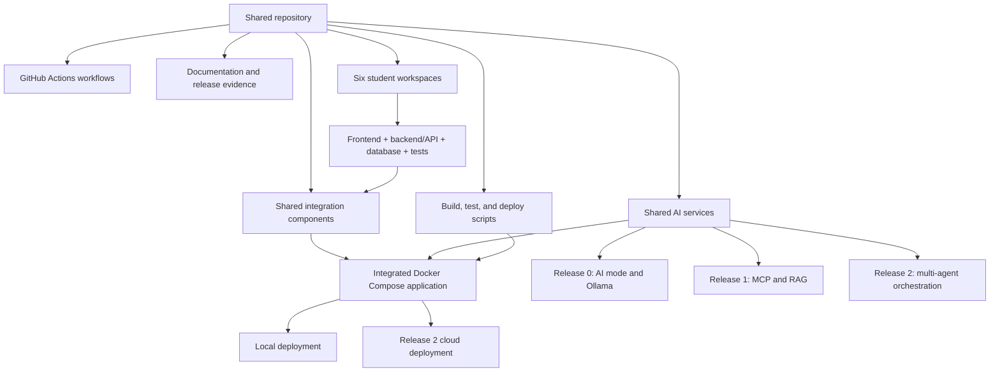

# Repository Architecture and Scaffold Record

## Document status

- Status: Initial scaffold implemented; project implementation not started
- Date: 26 July 2026
- Student initiating the work: Matthew Shelton
- AI-assisted engineering tool: OpenAI Codex using GPT-5.6-sol
- Review state: Initial structure accepted by Matthew; team and tutor review
  remain pending

## Purpose

This document records the planning, architectural decisions, implementation
boundary, and validation of the repository's initial scaffold. It began as the
pre-implementation scaffold plan and was updated after the plan was carried
out, preserving both the intent and evidence of the resulting structure.

The product topic, individual features, cloud provider, database engine, and
detailed service architecture remain undecided. The scaffold therefore defines
ownership and integration boundaries without prematurely implementing a
solution.

## Evidence scope

This record can support evidence of:

- AI-assisted requirements analysis, repository design, and documentation
- Early software architecture and source-control planning
- Separation of individual and shared responsibilities
- Incremental release planning
- Validation of the initial repository structure

It does not replace the required individual and integrated software
architecture diagrams, Docker Compose architecture, agentic-loop diagram, or
later MCP, RAG, multi-agent, DevOps, and cloud architecture artefacts. It also
does not demonstrate the project's required Ollama-based Agentic AI
implementation; Codex was used as a development assistant, not as the
application's runtime LLM.

## Sources reviewed

- `ASD_2026_Project_Specifications.txt` and the original 22-page PDF
- The repository-structure diagram in the specification and the supplied image
- `Project_Group_Registration_Form.docx`
- Published 41026 Canvas pages, including team formation, assessment overview,
  subject schedule, subject resources, and the AI Agent Configuration Guide
- Lecture 0 material covering Agile, planning, risk, architecture, DevOps,
  testing, and deployment
- Local 41026 release checklists, semester plan, and content-conflict notes

The current Project Specifications and Assessment Overview were treated as
authoritative where the Canvas FAQ contained older, conflicting assessment
information.

## AI-assisted engineering process

Matthew directed Codex to:

1. Inspect the locally archived 41026 group-project material.
2. Plan the scaffold in Markdown before changing the repository.
3. Follow the supplied repository diagram while adapting it for six students.
4. Record Matthew as Student 1 and leave clear placeholders for other members.
5. Create scaffolding only, without application implementation.
6. Avoid committing or pushing any changes.

Codex reviewed the source material, proposed the structure below, created the
files, detected and corrected an overly broad `build/` ignore rule, and ran the
validation checks recorded in this document. Matthew remains responsible for
reviewing, understanding, revising, and approving the work before submission.

## Architectural drivers

- One integrated Agentic AI application must be assembled from individual
  frontend, backend/API, and database microservices.
- Individual work and contribution evidence need clear ownership.
- Shared integration assets must remain separate from student-owned features.
- Architecture must grow incrementally across Releases 0, 1, and 2.
- The complete application must eventually run through one shared Docker
  Compose definition and one shared cloud deployment.
- Secrets, generated artefacts, local databases, and temporary files must not
  enter source control.
- Team-size changes should require predictable, localised edits.

## Repository architecture



```text
.
|-- .github/
|   `-- workflows/
|       |-- student-1-ci.yml ... student-6-ci.yml
|       |-- integration-ci.yml
|       `-- cloud-deployment.yml
|-- docs/
|   |-- architecture/
|   |   |-- README.md
|   |   `-- repository-architecture.md
|   |-- reports/
|   |-- release-0/
|   |-- release-1/
|   `-- release-2/
|-- shared/
|   |-- frontend/
|   |   |-- index.html
|   |   |-- css/
|   |   |-- js/
|   |   `-- assets/
|   `-- configuration/
|-- student-1/ ... student-6/
|   |-- README.md
|   |-- frontend/
|   |-- backend/
|   |-- database/
|   |-- tests/
|   `-- Dockerfile
|-- ai-services/
|   |-- ai-mode/
|   |-- mcp-server/
|   |-- rag-server/
|   `-- multi-agent-server/
|-- scripts/
|   |-- build/
|   |-- test/
|   `-- deploy/
|-- .editorconfig
|-- .gitignore
|-- docker-compose.yml
`-- README.md
```

## Architectural decisions

### ADR-001: Six student workspaces

- Decision: Create `student-1` through `student-6` with identical structures.
- Reason: The requested working team size is six and consistent templates make
  ownership clear.
- Consequence: The published brief and registration form currently specify
  five students. The sixth member and feature require tutor or subject
  coordinator approval.
- Change cost: Adding or removing a member requires one `student-N/` directory,
  one student workflow, and roster/integration updates.

### ADR-002: Separate individual and shared components

- Decision: Keep feature work in `student-N/` and team-wide integration in
  `shared/`, `ai-services/`, and the root Compose configuration.
- Reason: This mirrors the course's individual ownership model while retaining
  one integrated application.
- Consequence: Shared code must not become an unowned substitute for individual
  feature contributions.

### ADR-003: Scaffold all release locations early

- Decision: Create directories for later-release services before implementing
  them.
- Reason: The progressive target architecture is visible from the beginning.
- Consequence: Release labels and placeholders must not be misrepresented as
  completed functionality.

### ADR-004: Keep executable placeholders inactive

- Decision: Use a valid empty Compose model and manually triggered workflows
  whose placeholder jobs are disabled.
- Reason: Syntax and repository shape can be validated without creating false
  CI or deployment behaviour.
- Consequence: Real triggers, tests, images, and deployment steps must be added
  after the application architecture is approved.

### ADR-005: Use the diagram's workflow filenames

- Decision: Name student workflows `student-N-ci.yml`.
- Reason: This follows the visual repository structure supplied with the
  specification.
- Consequence: The written specification sometimes abbreviates these names to
  `student-N.yml`; confirm naming expectations with the tutor before Release 0.

## Release evolution

| Release | Repository architecture introduced or extended |
|---|---|
| Release 0 | Student microservices, unified frontend, AI mode/Ollama, Docker Compose, student CI, integration validation |
| Release 1 | MCP server, RAG server, grounded responses, updated local integration and CI |
| Release 2 | Local multi-agent server, pre-commit pytest, post-commit AI-assisted tests, integrated Azure or AWS deployment |

For the Release 2 cloud deployment, MCP, RAG, and multi-agent services remain
disabled according to the current specification.

## Implemented scaffold contents

- Root project overview, team roster, release path, and next decisions
- Six student READMEs and equivalent frontend, backend, database, test, and
  Dockerfile placeholders
- Six student CI placeholders plus integration and cloud workflow placeholders
- Documentation areas for architecture, reports, and Releases 0-2
- Unified frontend and shared configuration locations
- Release-gated AI service locations
- Build, test, and deployment script locations
- Cross-platform editor settings and source-control exclusions
- A syntactically valid but empty Docker Compose definition

## Validation evidence

The following checks were completed after scaffolding:

| Check | Result |
|---|---|
| Six equivalent student workspaces | Passed |
| Six matching student CI workflow files | Passed |
| All planned shared and release directories retained | Passed |
| YAML syntax for eight workflows and Docker Compose | Passed |
| Docker Compose schema validation | Passed |
| `.env.example` and `scripts/build/.gitkeep` visible to Git | Passed |
| Final newlines and trailing-whitespace check | Passed |
| Temporary PDF and DOCX inspection artefacts removed | Passed |
| Commit or push performed | No |

## Known open decisions

- Obtain approval for a six-person team and sixth feature.
- Select the project problem and Agentic AI topic.
- Allocate one approved integrated feature to each student.
- Confirm workflow filename expectations with the tutor.
- Choose SQLite or PostgreSQL.
- Choose Azure or AWS.
- Define service boundaries, ports, APIs, data ownership, and integration
  contracts.
- Create the required individual and integrated architecture diagrams as the
  design matures.

## Updating this record

Update this document when an architectural decision changes. Significant
changes should add or revise an ADR, record the reason, identify affected
components, and update the validation evidence. After the scaffold is committed,
the team may add the commit or pull-request reference here for traceability.
