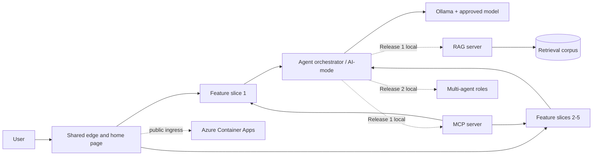
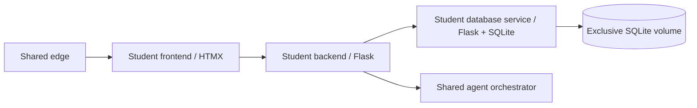
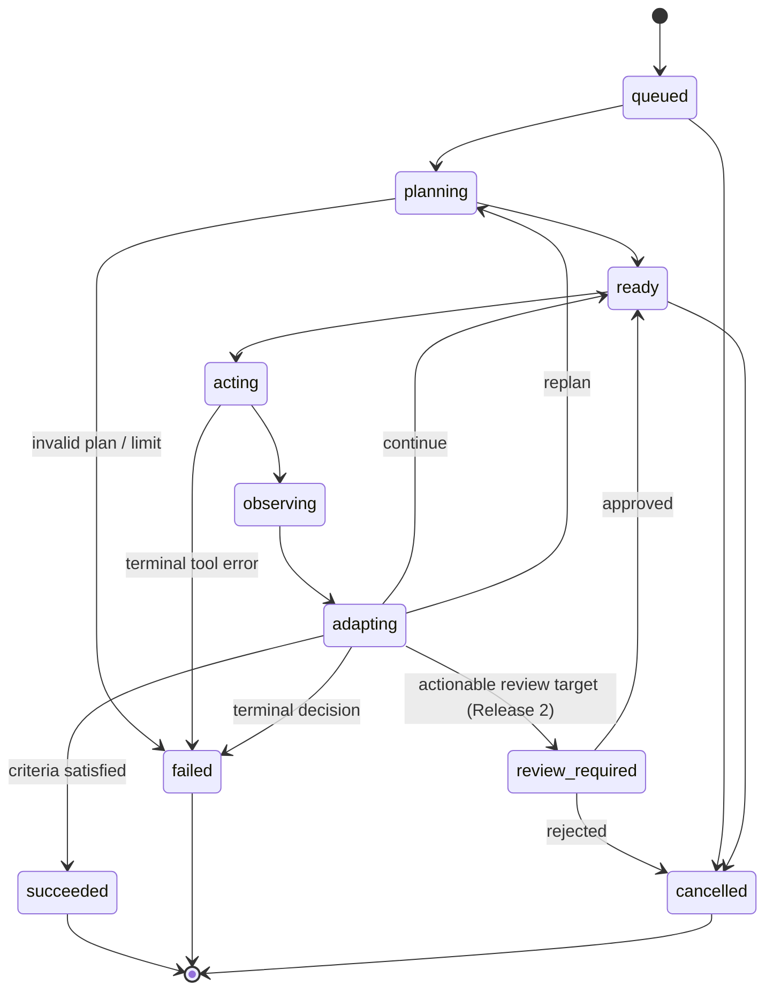

# Shared Platform and Agentic Harness Design

## Document control

| Field | Value |
|---|---|
| Status | Proposed baseline for team review |
| Date | 1 August 2026 |
| Scope | Shared services and integration contracts across Releases 0-2 |
| Primary audience | Project team, tutor, reviewers, and future maintainers |
| Related record | `docs/architecture/repository-architecture.md` |

### Implementation status (1 August 2026)

The first Release 0 foundation increment now implements the strict shared agent
contracts, deterministic state graph, limits and tool policy, persistence-independent
ports, bounded four-phase runner, deterministic fake provider, SQLite run/step/review
store, prompt registry, native Ollama structured-output adapter, serial worker, and
create/read/cancel/review HTTP endpoints. JSON Schema and OpenAPI artefacts are generated
and drift-checked by the canonical quality gate. A pinned non-root AI-mode image,
profiled Ollama runtime/model initializer, native-host override, and real structured
provider diagnostic now supply the shared Release 0 container boundary.

The next domain-neutral Release 0 increment adds validated feature manifests,
feature-scoped/versioned tool registration, fail-fast YAML tool composition, a bounded
HTTP executor, create-run idempotency, safe append-only progress events, and an opt-in
redacted development evidence page. A non-product `integration-test-feature` proves
the agent/core/backend/database boundary over real HTTP and SQLite. A validated model
registry now maps stable logical profiles to assignment-approved Ollama tags and explicit
context/output budgets; ADR-015 records the selection and readiness policy.

This does not complete the shared-foundation definition of done. Student owners must
still supply their approved manifests and feature endpoints; the integrated edge and
Compose topology, a product-feature integration, representative real-model evaluation,
and release evidence remain. MCP, RAG, and multi-agent runtime behavior remains disabled
and unclaimed.

This document is both a high-level design and a detailed build guide. It deliberately
defines the stable shared platform before the project domain and five feature schemas
are known. Feature-specific entities, prompts, and business rules remain owned by the
student responsible for that feature.

## 1. Executive decision

Build a compliance-first, contract-driven microservices platform with five repeated
student-owned feature slices and a small set of shared integration services.

Each feature slice owns its frontend, backend/API, database service, tests, and
container artefacts. Shared services provide the unified web entry point, agentic
orchestration, Ollama access, common contracts, test utilities, and later MCP, RAG,
multi-agent, and Azure integration. Shared services must not absorb feature business
logic or erase evidence of individual ownership.

The central design pattern is a deterministic state machine around a probabilistic
model:

```text
validated request
  -> bounded Plan
  -> policy-checked Act
  -> structured Observe
  -> validated Adapt
  -> success, human review, another bounded iteration, or failure
```

The state machine, contracts, persistence model, telemetry fields, prompt registry,
and provider interface should be built in Release 0. MCP, RAG, and multi-agent
implementations may have interfaces and disabled placeholders early, but their runtime
capabilities and assessment evidence must be introduced only in their specified
releases.

## 2. Sources, constraints, and interpretations

### 2.1 Authoritative course requirements

The design is grounded in the 22-page `ASD_2026_Project_Specifications.pdf`, the Canvas
page **Assessment overview**, the Canvas page **AI Agent Configuration Guide**, and the
Week 1 lab **DevOps and Agentic AI Foundations**.

The main architectural constraints are:

- one integrated Agentic AI application;
- five student-owned frontend, backend/API, and database microservice sets;
- CRUD and at least ten records per table for every individual feature;
- successful LLM interaction from every frontend/backend feature;
- one shared home page and CSS theme;
- one shared Docker Compose application;
- a shared Plan -> Act -> Observe -> Adapt loop in every release;
- local MCP and RAG in Release 1;
- local Planner, Worker, Reviewer, and human review in Release 2;
- Azure or AWS deployment in Release 2;
- AI-mode and Ollama enabled in the cloud while MCP, RAG, and multi-agent services are
  disabled; and
- individual workflows, integrated testing, diagrams, execution evidence, and reports.

### 2.2 Recorded interpretations

1. **Database choice.** Section 5.3 allows SQLite or PostgreSQL, but the release
   deliverables and cloud tables repeatedly name SQLite. This design therefore uses a
   separately owned SQLite database service per feature. A repository port prevents
   domain logic from depending on SQLite and leaves a tutor-approved PostgreSQL
   migration possible.
2. **Database microservice.** SQLite is embedded rather than a network database server.
   To satisfy the course topology, each database container owns its SQLite file and
   exposes a narrow internal API. No other container mounts or opens that file.
3. **Workflow names.** Use `student-1.yml` through `student-5.yml`, matching the written
   requirements. The PDF repository diagram's `student-N-ci.yml` labels are treated as
   a documented inconsistency.
4. **Early foundations.** Later-release interfaces, schemas, feature flags, and test
   doubles may exist from Release 0. Later capabilities remain off, are excluded from
   the relevant release demo, and are not claimed as completed early.
5. **Ollama location.** Native host Ollama is allowed as a developer convenience on
   Windows and macOS, consistent with the course configuration guide. Integrated
   release validation uses a containerised Ollama profile so the complete topology is
   reproducible.

### 2.3 Requirement traceability

| Course requirement | Design response | Primary evidence |
|---|---|---|
| Five student frontend/backend/database sets | Repeated, separately owned feature slices | Manifests, Compose graph, per-student workflows and tests |
| CRUD and ten records per table | Feature backend plus exclusive DB service and idempotent seeds | CRUD contract tests, migration/seed report, UI recording |
| LLM interaction per feature | Feature backend calls shared orchestrator with a feature namespace | Per-feature AI smoke test and trace |
| Unified home page and CSS | Shared edge, manifest links, common design tokens | Browser E2E test and screenshot |
| Plan -> Act -> Observe -> Adapt | Persisted bounded state machine | Run-detail evidence, state-model tests, workflow diagram |
| Docker/Compose integration | One root Compose model with release profiles | `docker compose config`, health report, full-stack test |
| Individual CI/CD | Path-filtered `student-N.yml` workflows | Five successful workflow runs |
| Release 1 MCP/RAG/grounding | Adapters over existing tools plus citation-bearing retrieval | MCP Inspector/contract output and RAG evaluation report |
| Release 2 multi-agent/human review | Planner, Worker, Reviewer roles over the same run model | Role traces, approval/rejection cases, architecture diagram |
| Pre/post testing | Deterministic pre-commit pytest and isolated AI-assisted test stage | JUnit/coverage artefacts and generated-test evidence |
| Azure deployment | Container Apps, ACR, Bicep, OIDC, smoke/rollback workflow | Deployment output, endpoint tests, infrastructure diagram |
| Advanced services disabled in cloud | Services absent from Azure graph and flags false | Automated negative reachability/configuration assertions |
| Reports, diagrams, logs, screenshots | Evidence paths and reproducible scripts built into the platform | Release evidence manifest tied to one commit/tag |

## 3. Goals and non-goals

### 3.1 Goals

- Make ownership and contribution evidence unambiguous.
- Let five teams build features independently against stable contracts.
- Keep the agent loop observable, bounded, resumable, and testable without a real LLM.
- Support weak and capable developer machines through configuration rather than forks.
- Run on Windows, macOS, Linux CI, Docker Compose, and Azure with the same service APIs.
- Make prompt, model, retrieval, cache, and tool behaviour measurable.
- Produce assessment evidence as a normal build output rather than a last-minute task.
- Prefer mature, understandable patterns over framework-specific magic.

### 3.2 Non-goals

- Defining feature domain entities before the topic is approved.
- Sharing feature database tables or ORM models.
- Building a general-purpose autonomous agent platform.
- Storing hidden chain-of-thought or using it as audit evidence.
- Introducing Kubernetes, Kafka, a service mesh, or distributed event sourcing.
- Scaling beyond the needs of a semester demonstration.
- Treating an LLM recommendation as authorization to mutate data.

## 4. Quality attributes and measurable targets

| Attribute | Initial target |
|---|---|
| Correctness | All external and tool inputs schema-validated; invalid state transitions rejected |
| Boundedness | Default maximum 6 agent iterations, 12 tool calls, and one configurable time budget per run |
| CRUD performance | Non-AI endpoints meet the course lab baseline of 19/20 calls at or below 500 ms locally |
| Resilience | CRUD remains available when Ollama is unavailable; AI requests return a typed degraded response |
| Idempotency | Retried mutation tool calls do not create duplicate effects |
| Portability | One documented command path each for Windows PowerShell, macOS/Linux, and Compose |
| Testability | Shared core tests use a deterministic fake model; real-model tests are a separate suite |
| Coverage | At least 85% branch coverage for new shared core code, with no unexplained regression |
| Traceability | Every run, step, model call, tool call, and retrieval item has a correlation/run identifier |
| Maintainability | No feature imports another feature's Python package or accesses another database directly |
| Security | Only allowlisted typed tools; destructive effects require policy approval and idempotency |

LLM response-time and task-success targets must be established from representative
benchmarks on the team's actual machines. Model latency is not folded into the 500 ms
CRUD target.

## 5. Architecture principles

1. **Vertical ownership.** A student owns one end-to-end feature slice.
2. **Minimal shared kernel.** Share protocol types, configuration conventions, tracing,
   and test utilities; do not share business entities.
3. **Contract first.** HTTP APIs, events, and tools are versioned schemas before they are
   implementation details.
4. **Deterministic shell, probabilistic core.** Code controls state, permissions,
   retries, validation, and stop conditions. The LLM proposes structured decisions.
5. **Single writer per data store.** Only its database service opens a feature's SQLite
   file. Only the orchestrator opens the agent-state store.
6. **API composition, not database integration.** Cross-feature behaviour uses APIs or
   tools, never joins across SQLite files.
7. **Explicit release gates.** Disabled means the service is not started and its routes
   reject use; it is not merely hidden in the UI.
8. **Evidence by design.** Logs, test reports, contract artefacts, diagrams, and release
   manifests are reproducible.
9. **Graceful degradation.** Deterministic feature functionality does not depend on LLM
   availability.
10. **Human authority.** Model output is data. Policy-checked code and the user authorize
    actions.

## 6. System context and service topology



One feature slice is repeated five times:



### 6.1 Shared service catalogue

| Service/package | Release | Responsibility | Must not own |
|---|---:|---|---|
| `shared/frontend` edge | 0 | Unified home page, shared assets, same-origin routing, health landing page | Feature business rules |
| `shared/contracts` | 0 | Pydantic/JSON Schema types, error envelope, identifiers, headers | Feature entities |
| `shared/testkit` | 0 | Fake model, contract fixtures, factories, assertion helpers | Production orchestration |
| `ai-services/agent-core` | 0 | State machine, policies, provider/tool ports, cache interfaces | Flask routes or feature code |
| `ai-services/ai-mode` | 0 | Orchestrator API, run persistence, Ollama adapter, prompt registry | Direct feature DB access |
| Ollama | 0 | Approved model runtime | Application workflow state |
| `ai-services/mcp-server` | 1 | MCP tools/resources/prompts over existing contracts | Duplicate CRUD logic |
| `ai-services/rag-server` | 1 | Ingestion, chunking, retrieval, citations, corpus versions | Final response authority |
| `ai-services/multi-agent-server` | 2 | Planner/Worker/Reviewer coordination and human-review API | A second incompatible run model |
| Optional OTel collector | 0+ | Local trace/metric export when enabled | Required runtime dependency |

### 6.2 Student service catalogue

Each `student-N` slice contains:

- a static/HTMX frontend service;
- a Flask backend containing feature use cases and AI-facing endpoints;
- a Flask database service containing SQLAlchemy mappings, migrations, seeds, and its
  exclusive SQLite database;
- unit, contract, integration, and browser tests; and
- container targets and a path-filtered CI workflow.

The single student-root `Dockerfile` uses explicit named build targets (`frontend`,
`backend`, and `database`) so Compose produces three independently runnable images
without contradicting the supplied repository layout. If the tutor later confirms that
separate Dockerfiles are preferred, these targets can be split without changing service
contracts.

The backend is the feature's business boundary. The database service is deliberately
narrow: persistence CRUD, filtering, pagination, health, migrations, and seed-state
inspection. It does not call the LLM.

### 6.3 Dependency and call direction

There are two different shared elements and they must not be confused:

1. **Shared packages** are small compile-time dependencies. Student services and shared
   AI services may import `shared_contracts`; tests may also import `shared_testkit`.
   Student services do not import `agent-core` or another student's package.
2. **Shared services** are independently running containers. Student backends call the
   shared orchestrator over HTTP; they do not embed its implementation.

The normal runtime flow is:

```text
student frontend
  -> student backend starts an agent run
  -> shared orchestrator plans and selects an allowlisted feature tool
  -> shared orchestrator calls that student's backend tool endpoint
  -> student backend applies its business rules and calls its database service
  -> tool result returns to the orchestrator
  -> orchestrator observes/adapts and returns the final result
```

This controlled callback is intentional. The feature initiates the run, while the
orchestrator may call feature-owned capabilities as tools. The orchestrator never calls
a student database directly, and a feature never imports orchestration implementation.
Release 1 may expose the same feature tools through MCP without changing their owner or
duplicating their business logic.

## 7. Shared contracts

### 7.1 General conventions

- HTTP JSON APIs are namespaced under `/api/v1`.
- JSON uses `snake_case`; timestamps use UTC RFC 3339; IDs use UUIDv7 when the selected
  Python library supports it consistently, otherwise UUIDv4.
- Every request accepts or creates `X-Request-ID`; agent traffic also carries
  `X-Agent-Run-ID` and W3C `traceparent`.
- Errors use one common Problem Details-compatible envelope with `type`, `title`,
  `status`, `detail`, `instance`, `code`, `request_id`, and field errors.
- List endpoints use `items`, `page`, `page_size`, `total`, and stable ordering.
- OpenAPI 3.1 documents are checked into source and linted in CI.
- Additive changes remain within `v1`; breaking changes require a new version.

### 7.2 Feature manifest

Every student owns a validated `feature.yaml` containing:

```yaml
schema_version: 1
feature_key: student-1-feature
display_name: To be decided
owner: student-1
frontend_base_path: /features/student-1
backend_base_path: /api/features/student-1/v1
health_path: /health/ready
ai_capabilities: []
```

The shared home page, integration tests, and architecture evidence use these manifests.
Compose service definitions remain explicit; manifests do not generate hidden runtime
topology.

### 7.3 Agent contract model

The following domain-neutral objects form the stable harness contract.

| Object | Essential fields |
|---|---|
| `AgentRun` | `id`, `feature_key`, `objective`, `status`, `prompt_set`, `model_profile`, limits, timestamps, final result/error |
| `AgentStep` | `id`, `run_id`, `sequence`, `phase`, `status`, input/output references, timestamps |
| `Plan` | `goal`, ordered typed actions, success criteria, risk level, assumptions |
| `ToolDefinition` | unique name, description, input/output JSON Schemas, side-effect class, timeout, approval rule |
| `ToolCall` | `id`, `step_id`, tool name/version, validated arguments, idempotency key, approval status |
| `ToolResult` | call ID, outcome, typed content, error, duration, retryability, evidence references |
| `Observation` | facts derived from tool results, success-criteria state, new constraints |
| `Adaptation` | `continue`, `replan`, `request_review`, `complete`, or `fail`, plus concise justification |
| `HumanReview` | run/step, requested action, risk summary, decision, reviewer, timestamp |
| `ModelInvocation` | provider, model name/digest, prompt template versions, parameters, durations, token counts, cache metadata |
| `RetrievalCitation` | corpus/document/chunk IDs, source URI, content hash, rank, score, excerpt |
| `Artifact` | type, content hash, media type, safe location, producer step |

Do not persist private hidden reasoning. Persist the validated plan, requested action,
tool result, concise decision summary, and evidence needed to reproduce or audit the
run.

### 7.4 Tool naming and ownership

Use namespaced names such as `student_1.records.search.v1`. Each tool has exactly one
student owner and calls that student's backend API. Shared tools are limited to genuine
cross-cutting capabilities such as retrieval or run status.

Tool side-effect classes are:

- `read_only` - may execute automatically;
- `reversible_write` - requires policy approval and an idempotency key;
- `destructive_write` - requires explicit human confirmation; and
- `external_effect` - disabled unless specifically approved for the project.

Never expose generic SQL, shell execution, arbitrary URLs, or unrestricted filesystem
access as model-callable tools.

### 7.5 Orchestrator HTTP surface

| Method and path | Behaviour |
|---|---|
| `POST /api/v1/agent-runs` | Validate, persist, and accept a run; return `202`, run ID, status, and `Location` |
| `GET /api/v1/agent-runs/{run_id}` | Return current state, safe step summaries, limits, and final result/error |
| `GET /api/v1/agent-runs/{run_id}/events` | Page ordered safe progress events after an explicit resumable cursor |
| `POST /api/v1/agent-runs/{run_id}/cancel` | Idempotently request cancellation |
| `POST /api/v1/agent-runs/{run_id}/reviews` | Approve or reject exactly one pending protected action |
| `GET /health/live` | Process liveness only; no dependency calls |
| `GET /health/ready` | Migration/store readiness and configured provider reachability state |

The first implementation uses one controlled background executor with concurrency one
inside a single `ai-mode` process. Its `RunQueue` port is deliberately small so a later
Redis/RQ-style adapter can be introduced only if measurements justify another service.
Because transitions are persisted before and after each effect, startup reconciliation
can safely resume queued runs and route uncertain mutations to review. The public API
does not change if the queue implementation changes.

## 8. Agentic harness detailed design

### 8.1 Run state machine



Run status and step phase are separate enums so reports can distinguish, for example,
an active run currently in `observe` from a completed observation step.

The implemented transition invariants, phase checkpoints, effect-aware startup
recovery, repair turns, and idempotency obligations are maintained in
[`agent-run-state-machine.md`](agent-run-state-machine.md). That document is normative
for runner behavior when this broader roadmap and the implementation differ.

### 8.2 Execution algorithm

1. Validate and persist the request before calling a model.
2. Resolve the immutable prompt-set version and model profile.
3. Ask the planner for a JSON-schema-constrained plan.
4. Validate tool names, argument schemas, limits, and policy.
5. Execute one action or an explicitly safe parallel read-only group.
6. Persist results before asking the model to interpret them.
7. Compute deterministic success checks where possible.
8. Ask for a structured adaptation only when code cannot decide.
9. Stop on success, rejection, cancellation, non-retryable failure, or any limit.
10. Return a typed result containing evidence links and degradation warnings.

Retries use exponential backoff with jitter for transient transport failures. A model
format failure gets at most one repair attempt using the validation error; it must not
loop indefinitely. Mutation retries reuse the original idempotency key.

### 8.3 Planner, Worker, and Reviewer evolution

- **Release 0:** one orchestrator process performs the four phases. The LLM may propose
  a plan or adaptation, while code executes tools and enforces policy.
- **Release 1:** the same orchestrator can call MCP tools and obtain RAG context. These
  become new adapters, not a new loop.
- **Release 2:** Planner, Worker, and Reviewer become explicit roles sharing the same
  `AgentRun` and `AgentStep` records. The reviewer checks evidence and success criteria;
  it cannot silently execute tools. Human review remains the final authority for
  protected actions.

This is an orchestrator-worker pattern, not free-form multi-agent debate. Parallel work
is allowed only for independent read-only actions and only when the configured machine
and Ollama runtime can support it.

### 8.4 Failure and cancellation semantics

- Client cancellation marks the run and prevents new tool dispatches.
- A timed-out tool returns a structured timeout result; the planner never sees a Python
  exception or stack trace.
- If Ollama is unavailable, deterministic checks and CRUD continue; the AI operation
  becomes `degraded` or `failed` according to its contract.
- A restarted orchestrator resumes only from a persisted safe boundary. An `acting`
  mutation with unknown outcome goes to human review rather than being repeated.
- Poisoned or repeatedly failing runs are terminal after the configured retry budget.

## 9. Prompts, model access, and caching

### 9.1 Provider boundary

`agent-core` defines an `LLMProvider` protocol for structured generation, chat, health,
and invocation metrics. `ai-mode` supplies an Ollama implementation using the native
Ollama API so tool calls, structured output, detailed duration fields, and `keep_alive`
remain available. No feature backend imports an Ollama or commercial-provider SDK.

Configuration selects a model profile rather than embedding model names in feature
code. Profiles can reduce context, output length, concurrency, or agent discretion on
less capable hardware. The versioned registry records the assignment-approved family,
exact Ollama tag, advertised maximum context, official source, and conservative runtime
budgets. Startup and CI validate it; the public API exposes the same typed view. The same
evaluation set should run against every supported profile before a default changes.

### 9.2 Prompt registry

```text
ai-services/ai-mode/src/ai_mode/prompt_assets/
|-- planner/
|   |-- v1.system.j2
|   `-- v1.meta.yaml
|-- adapter/
|   |-- v1.system.j2
|   `-- v1.meta.yaml
`-- reviewer/
    |-- v1.system.j2
    `-- v1.meta.yaml
```

Every prompt invocation records the logical prompt ID, semantic version, Git content
hash, rendered-input hash, and model digest. Stable instructions, schemas, and tool
definitions appear before dynamic user and retrieval content. Prompt changes require
evaluation results in the pull request.

### 9.3 Cache layers

| Layer | Key | Invalidation | Allowed content |
|---|---|---|---|
| Model residency | model digest and `keep_alive` | expiry or memory pressure | Model weights/runtime state |
| Embedding cache | embedding model digest + chunk content hash | content/model change | Embedding vectors |
| Retrieval cache | normalized query + corpus version + retriever config | corpus/config change | Ranked chunk IDs |
| Deterministic response cache | model digest + prompt-set hash + normalized input + relevant data version | TTL or any dependency version change | Read-only, non-personal, non-agentic responses |

Do not cache mutation plans, approval decisions, tool outputs over mutable data, error
responses, or responses containing secrets/personal data. Cache hits and misses are
metrics, not assumptions. A cache is adopted only after an A/B benchmark shows a useful
latency or compute improvement without reducing task success.

Ollama `keep_alive` keeps a model resident and reduces reload latency; it is not treated
as a portable guarantee of provider-managed prompt-prefix caching. The architecture can
take advantage of future prefix caching through the provider adapter without changing
feature code.

### 9.4 Performance experiment

Do not claim prompt caching from anecdotal timing. For each release candidate, run a
versioned benchmark containing at least 10 cold requests and 30 warm repeated-prefix
requests per supported showcase profile. Export CSV/JSON with model digest, machine
profile, context length, prompt hash, input/output tokens, `load_duration`,
`prompt_eval_duration`, `eval_duration`, total duration, cache outcome, and task-success
assertion. Compare:

1. model unloaded versus resident with `keep_alive`;
2. stable-prefix versus semantically identical reordered prompts;
3. retrieval cache disabled versus enabled; and
4. application response cache disabled versus enabled for an eligible read-only case.

Adopt an optimisation only when the dataset shows lower median and p95 latency or lower
prompt evaluation work with no task-success regression. Store the benchmark script and
raw results under `scripts/test/` and `docs/evaluations/`.

## 10. Persistence design

### 10.1 Feature data

- One SQLite file and named volume per student database service.
- WAL mode locally where verified; short transactions; a busy timeout; foreign keys on.
- SQLAlchemy 2 unit-of-work sessions and Alembic migrations.
- Migrations run as an explicit one-shot Compose/CI task, not concurrently in every web
  replica.
- Seed scripts are idempotent and verify at least ten records per required table.
- Database endpoints expose application-level operations, never arbitrary SQL.
- Backups for assessment evidence use SQLite's online backup API or a stopped service,
  not a raw copy during writes.

### 10.2 Agent state

`ai-mode` owns a separate SQLite file and volume for runs, steps, invocations, reviews,
and cache metadata. This is operational workflow state, not a sixth student feature
database. It does not require another public database API or separately assessed
database microservice: only the `ai-mode` process opens the file. Large artefacts live
outside rows and are referenced by hash. Database rows store only safe, bounded
excerpts.

The schema includes an integer schema version and forward-only migrations. Schema
version 2 adds create-request idempotency records and append-only safe progress events.
Step append, run-status update, review where present, and its event occur in one
transaction. Optimistic version numbers prevent two workers advancing the same run.
The event decision and cursor semantics are recorded in
[`ADR-014`](decisions/ADR-014-append-only-safe-agent-run-events.md).

Later MCP, RAG, and multi-agent services do not mount this file. They interact through
the orchestrator's internal contracts, leaving `ai-mode` as the single state owner.

### 10.3 Azure persistence constraint

Azure Container Apps offers persistent Azure Files mounts, while SQLite cautions
against multi-client access over network filesystems. For the course-mandated SQLite
cloud topology:

- run exactly one replica of each database service;
- mount each database file into only that service;
- never share a database volume between services;
- prohibit scale-out for database services and the state-owning `ai-mode` service;
- run backup/restore and write-concurrency tests in Azure before Release 2; and
- record the residual availability risk in the report.

If the tutor permits PostgreSQL, Azure Database for PostgreSQL is the preferred
production correction. It is not the baseline until that permission exists.

## 11. MCP and RAG design

### 11.1 MCP

The MCP server is an adapter over the existing tool registry:

- **Tools** expose allowlisted actions with JSON Schema input and output.
- **Resources** expose contextual, read-only material such as approved feature metadata
  or indexed documents.
- **Prompts** expose user-selected reusable templates where genuinely useful.

Use the official Python SDK and pin a tested protocol revision. Validate capability and
protocol-version negotiation. Local Compose uses Streamable HTTP for service-to-service
communication; stdio remains useful for isolated tests. MCP tool authorization is no
weaker than the underlying backend authorization.

### 11.2 RAG

The RAG server owns an explicit ingestion pipeline:

```text
approved source
  -> parse
  -> normalize
  -> chunk
  -> content hash
  -> embed
  -> index under corpus version
  -> retrieve
  -> rerank if justified
  -> return citations
```

Each chunk records source URI, document ID, chunk ID, content hash, position, ingestion
time, and corpus version. Responses must cite retrieved chunks; missing evidence is
reported rather than invented. Retrieved text is untrusted data, not executable
instructions. Ingestion and retrieval are independently testable.

Start with a simple local vector store supported by the chosen Python stack. Do not add
a separate distributed vector database until corpus size or measured performance
requires it.

## 12. Security and responsible-AI baseline

The project is low sensitivity, so use a proportionate baseline:

- secrets only in local untracked environment files or GitHub/Azure secret stores;
- least-privilege internal routes and private Azure ingress;
- request-size, output-size, iteration, tool-call, timeout, and queue limits;
- allowlisted tools with strict schemas and server-side authorization;
- approval for destructive or external effects;
- HTML escaping and no direct rendering of untrusted model output;
- URL allowlists for ingestion and protection against server-side request forgery;
- retrieved content clearly delimited as untrusted evidence;
- structured logs with secret and personal-data redaction;
- dependency, container, and secret scanning in CI; and
- a short AI risk register organised around Govern, Map, Measure, and Manage.

Model prompts are not a security boundary. Enforcement belongs in the tool executor and
service authorization code.

## 13. Observability

Release 0 needs useful instrumentation, not a monitoring platform project.

### 13.1 Required signals

- JSON logs to stdout with timestamp, level, service, request ID, trace ID, run ID, step
  ID, event name, duration, and outcome;
- request and dependency latency histograms;
- Ollama load, prompt-evaluation, generation, and total durations where reported;
- token counts, queue time, model/profile, and structured-output repair count;
- agent run and step outcome counters;
- tool retries, timeouts, policy rejections, and human-review counts;
- cache hit/miss/invalidations; and
- retrieval count, score distribution, citation count, and corpus version.

Use OpenTelemetry APIs and W3C trace context, but keep exporter configuration optional.
Console JSON is the required baseline; a local collector and Jaeger-compatible viewer
may be enabled through a development profile.

### 13.2 Evidence view

Provide an authenticated development-only run-detail page showing the state sequence,
typed actions, observations, timings, citations, approvals, and final outcome. Redact
prompts or fields that could contain secrets. This page will materially improve demos,
debugging, and report screenshots.

## 14. Test architecture

### 14.1 Test layers

| Layer | Runs when | Main purpose |
|---|---|---|
| Unit | Every commit/PR | State transitions, policies, domain logic, validation, cache keys |
| Property/state-model | Every shared-core PR | Invalid transitions, limit enforcement, retry/idempotency invariants |
| Contract/schema | Every affected PR | OpenAPI compatibility, Pydantic/JSON Schema examples, MCP schemas |
| Component | Every affected PR | Flask service with real SQLite and fake dependencies |
| Compose integration | Integration workflow | Edge -> frontend -> backend -> DB and backend -> orchestrator flows |
| Browser E2E | Integration workflow | Unified navigation, CRUD, AI degraded/success states, shared styling |
| Security/static | Every PR | Ruff, type checks, dependency/secret/container scanning |
| Real-model evaluation | Manual/nightly/release candidate | Structured-output validity and representative agent task success |
| Azure smoke | Deployment workflow | Health, CRUD, AI-mode, persistence, disabled-service assertions |

### 14.2 Deterministic model test double

`shared/testkit` provides a scripted provider that can return:

- a valid plan;
- malformed JSON followed by a repaired response;
- unknown tools or invalid arguments;
- timeout, overload, and transport failures;
- a reviewer rejection; and
- deterministic token/duration metadata.

Most CI must not download a model. Real Ollama tests are tagged and produce a separate
report because model output and runner performance are variable.

### 14.3 Agent evaluation set

Before Release 0, define representative cases for each approved feature:

- happy path;
- ambiguous request;
- impossible request;
- unavailable dependency;
- invalid or adversarial tool instruction;
- mutation requiring confirmation; and
- stop-condition/loop-limit case.

Record task success, schema-valid response rate, correct tool selection, unsupported
claim rate, tool-call count, iterations, latency, and human-review requirement. Prompt
or model changes compare against the same versioned cases. LLM-as-judge may supplement
but never replace deterministic assertions or human review.

### 14.4 Minimum release gates

- no failing deterministic tests;
- Compose configuration validates and all required health checks pass;
- no breaking contract change without versioning and consumer updates;
- no migration that fails on a copy of the prior release database;
- every enabled feature passes CRUD and AI interaction smoke tests;
- advanced services are enabled locally in their release and provably disabled in
  cloud; and
- reports and screenshots are generated from the same release commit/tag.

## 15. CI/CD and evidence production

### 15.1 Student workflows

`student-N.yml` uses path filters for `student-N/**` plus relevant shared contracts. It
runs lint, type checks, unit/component tests, schema validation, image build, and
container health checks. Shared-contract changes deliberately trigger all consumers.

### 15.2 Integration workflow

`integration-ci.yml` runs after or alongside student validation as appropriate:

1. validate configuration and contracts;
2. build all images with immutable commit tags;
3. start the required Compose profile;
4. wait on health/readiness checks;
5. run migrations and idempotent seeds;
6. execute integration and browser smoke tests;
7. capture JUnit, coverage, Compose status, image metadata, and selected redacted logs;
8. tear down reliably.

### 15.3 Release 2 testing language

Establish local `pre-commit` hooks and deterministic pytest early, but retain explicit
Release 2 workflow steps named `pre-commit pytest validation` and `post-commit
AI-assisted unit testing` to match the specification. AI-generated tests are reviewed,
executed in isolation, and uploaded as evidence; they do not receive secrets or direct
write permission to the repository.

### 15.4 Cloud deployment workflow

`cloud-deployment.yml` is manually dispatchable by every team member and deploys only
after required image/test jobs succeed. It records the commit, image digests,
infrastructure plan, deployment result, endpoint, smoke-test report, and rollback
target. Use GitHub OIDC to Azure rather than long-lived cloud credentials.

## 16. Local and Azure deployment

### 16.1 Compose profiles

Maintain one root `docker-compose.yml` with clearly named profiles:

| Profile | Contents |
|---|---|
| default / `release-0` | Edge, five feature slices, AI-mode |
| `ollama-container` | Containerised Ollama and model-initialisation task |
| `release-1` | Release 0 plus MCP and RAG |
| `release-2-local` | Release 1 plus multi-agent service |
| `observability` | Optional collector/viewer |

Native host Ollama uses a developer override and the stable configured base URL. On
Windows/macOS containers use `host.docker.internal`; Linux supplies the host-gateway
mapping. Release evidence uses the container profile unless the tutor explicitly
accepts the native-runtime topology.

Use health checks, `depends_on` health conditions where supported, explicit internal
networks, named volumes, resource limits, and non-root application users. Do not expose
student databases or internal AI services to the host by default.

### 16.2 Azure target

Use Azure Container Registry, Azure Container Apps, Log Analytics/Application Insights,
and Bicep under `infra/azure`.

- Only the shared edge has public ingress.
- Feature APIs, database services, and AI-mode use internal ingress/service discovery.
- Database services and the state-owning `ai-mode` service have exactly one replica and
  exclusive Azure Files storage.
- Begin cloud testing with a low-resource approved model and bounded context.
- GPU workload profiles are optional, quota-dependent, and selected only after a cost
  and latency benchmark.
- MCP, RAG, and multi-agent services are absent from the cloud deployment graph and
  their flags are false.
- An automated assertion calls their routes/service names and verifies they are not
  available.
- Infrastructure parameters, not source edits, select environment names, image tags,
  and capacities.

The Azure configuration is a demonstration architecture, not a claim that SQLite on
Azure Files is a high-availability production design.

## 17. Proposed repository structure

The current standard top-level structure remains intact and is extended as follows:

```text
.
|-- .github/
|   `-- workflows/
|       |-- student-1.yml ... student-5.yml
|       |-- integration-ci.yml
|       `-- cloud-deployment.yml
|-- docs/
|   |-- architecture/
|   |   |-- decisions/
|   |   |-- diagrams/
|   |   |-- repository-architecture.md
|   |   `-- shared-platform-design.md
|   |-- evaluations/
|   |-- evidence/
|   |   `-- .gitkeep
|   |-- reports/
|   `-- release-0/ release-1/ release-2/
|-- shared/
|   |-- contracts/
|   |   |-- openapi/
|   |   |-- schemas/
|   |   `-- python/shared_contracts/
|   |-- frontend/
|   |   |-- index.html
|   |   |-- css/ js/ assets/
|   |   `-- edge.conf
|   |-- testkit/
|   |   `-- python/shared_testkit/
|   `-- configuration/
|       |-- .env.example
|       |-- features.yaml
|       `-- logging.yaml
|-- student-N/
|   |-- feature.yaml
|   |-- frontend/
|   |   |-- src/
|   |   `-- tests/
|   |-- backend/
|   |   |-- src/student_n_backend/
|   |   |   |-- api/ application/ domain/ infrastructure/
|   |   |   `-- create_app.py
|   |   `-- tests/
|   |-- database/
|   |   |-- src/student_n_database/
|   |   |-- migrations/ seeds/
|   |   `-- tests/
|   |-- tests/
|   |   |-- contract/ integration/ e2e/
|   |   `-- fixtures/
|   |-- pyproject.toml
|   `-- Dockerfile
|-- ai-services/
|   |-- agent-core/
|   |   |-- src/agent_core/
|   |   |   |-- model/ ports/ policies/ state_machine/
|   |   `-- tests/
|   |-- ai-mode/
|   |   |-- src/ai_mode/
|   |   |   |-- api/ application/ adapters/ persistence/
|   |   |   `-- prompt_assets/
|   |   |-- migrations/
|   |   `-- tests/
|   |-- mcp-server/
|   |-- rag-server/
|   `-- multi-agent-server/
|-- infra/
|   `-- azure/
|       |-- modules/
|       |-- main.bicep
|       `-- parameters/
|-- scripts/
|   |-- build/ test/ deploy/
|   `-- evidence/
|-- pyproject.toml
|-- uv.lock
|-- docker-compose.yml
`-- README.md
```

Use a root Python workspace and lock file for consistent versions, while preserving
separate importable packages and test ownership. A student package may depend on
`shared_contracts` and `shared_testkit` (tests only); it may not depend on another
student package.

### 17.1 Recommended technology baseline

| Concern | Recommendation |
|---|---|
| Runtime | Python 3.12, pinned consistently across local, CI, and containers |
| Web/API | Flask 3 application factories and Blueprints; Gunicorn in Linux containers |
| Validation | Pydantic 2 and generated JSON Schema |
| Persistence | SQLAlchemy 2, Alembic, SQLite |
| Frontend | HTML5, HTMX, minimal JavaScript, shared CSS tokens/components |
| Edge | Nginx, serving static content and same-origin reverse proxy routes |
| LLM | Native Ollama client behind `LLMProvider` |
| MCP | Official Python MCP SDK |
| Packaging | `pyproject.toml`, `uv` workspace/lock, documented pip-compatible fallback |
| Quality | pytest, pytest-cov, Hypothesis, Ruff, mypy, pip-audit, Trivy, Gitleaks |
| E2E | Playwright for Python |
| Observability | standard logging + OpenTelemetry APIs; optional local collector |
| Infrastructure | Docker Compose locally; Bicep + Azure Container Apps in Release 2 |

Pin exact versions when implementation starts and update them through reviewed pull
requests. Do not paste floating `latest` image tags into release or deployment files.

## 18. Build sequence

### Foundation iteration

1. Approve this design and record the SQLite interpretation as an ADR.
2. Establish the root Python workspace, lock file, lint/type/test configuration, and
   dependency update policy.
3. Build `shared_contracts` and `shared_testkit` with schema snapshots.
4. Define `feature.yaml`, service naming, ports, routes, headers, and health contracts.
5. Turn the workflow placeholders into syntax/configuration and shared-contract checks.

### Release 0 shared platform

1. Implement `agent-core` state machine and persistence-independent ports.
2. Implement fake-provider tests, property tests, policies, limits, cancellation, and
   idempotency.
3. Implement `ai-mode` with SQLite run store, prompt registry, Ollama adapter, and run
   detail endpoint.
4. Implement the edge/home page and manifest-driven feature links.
5. Create one non-product integration-test fixture that proves the structural pattern;
   do not stamp or edit student-owned feature behavior before allocation.
6. Build Compose health checks and native/container Ollama profiles.
7. Prove a complete Plan -> Act -> Observe -> Adapt case plus an unavailable-model case.

### Release 1 extension

1. Implement RAG ingestion and retrieval contracts with citations and evaluation data.
2. Expose existing feature tools and resources through MCP.
3. Enable the `release-1` profile and extend integration/evidence tests.

### Release 2 extension

1. Split Planner, Worker, and Reviewer roles over the existing run model.
2. Add the human-review UI and recovery tests.
3. Enable pre-commit and post-commit assessment workflow stages.
4. Implement Bicep, OIDC deployment, Azure persistence checks, and rollback.
5. Prove local advanced services enabled and cloud advanced services absent.

Avoid implementing all five domain features through the shared-platform workstream.
The reference slice should demonstrate contracts and patterns without deciding other
students' feature logic.

## 19. Architectural decisions to record

| ADR | Decision |
|---|---|
| ADR-006 | Follow the literal five-by-three ownership topology for assessment clarity |
| ADR-007 | Use an exclusive SQLite database service per feature with a repository escape hatch |
| ADR-008 | Centralise orchestration while keeping feature tools and business logic student-owned |
| ADR-009 | Use Pydantic/JSON Schema and OpenAPI 3.1 as shared contract sources |
| ADR-010 | Use a deterministic persisted state machine and bounded structured LLM outputs |
| ADR-011 | Access Ollama through a provider port; support native-dev and container-demo profiles |
| ADR-012 | Build later-release seams early but gate capabilities by release and deployment |
| ADR-013 | Target Azure Container Apps and document the SQLite/Azure Files limitation |

Each ADR should include context, decision, alternatives, consequences, owner, date, and
superseding decision where applicable.

## 20. Principal risks and mitigations

| Risk | Consequence | Mitigation |
|---|---|---|
| Shared platform becomes the project | Feature work and ownership become unclear | Strict service catalogue, minimal shared kernel, feature-owned tools/tests |
| Fifteen student containers overwhelm laptops | Slow startup or demos | Resource profiles, native Ollama option, start selected feature during development, full stack on integration machine |
| Small model produces invalid plans | Low task success | Structured schemas, deterministic fallback, limited tool set, repair once, evaluation gates |
| Multiple model roles exceed memory | Queuing or failure | Default single loaded model/parallel request, profile-based role reuse, benchmark before concurrency |
| SQLite network storage in Azure | Locking or persistence failure | Single replica/owner, exclusive mount, cloud write test, documented PostgreSQL escape hatch |
| Prompt/retrieval cache returns stale data | Incorrect answers | Dependency versions in keys, short TTLs, explicit invalidation, never cache mutation flows |
| Early placeholders are mistaken for release completion | Assessment credibility issue | Flags off, docs label status, release-specific acceptance tests |
| MCP duplicates business logic | Divergent behaviour | MCP adapter calls the same backend contracts/tools |
| RAG content injects instructions | Unsafe tool choice or claims | Treat retrieval as untrusted data, tool policy outside prompt, citations and adversarial tests |
| Shared work obscures individual contribution | Marking dispute | Owners/CODEOWNERS, issue/PR links, contribution ledger, paired shared-service allocation |
| Ten-minute demo is overloaded | Features or evidence omitted | Script the demo early; run-detail page and deterministic seeded scenarios |

## 21. Definition of done for the shared foundation

The foundation is complete when:

- all shared packages have owners, README files, tests, and stable public interfaces;
- one integration-test fixture proves frontend -> backend -> database CRUD and backend ->
  orchestrator -> Ollama interaction;
- the orchestrator persists and displays a bounded four-phase run;
- fake-model tests cover success, invalid schema, tool failure, timeout, approval,
  cancellation, retry, and loop limit;
- schema and OpenAPI artefacts validate in CI;
- Windows/macOS native-Ollama setup and full Compose setup are documented and tested;
- the full topology starts on the nominated integration machine;
- advanced services are disabled by default and cloud exclusions are machine-tested;
- cache metrics exist before caching is claimed as an optimisation;
- architecture diagrams can be regenerated from version-controlled sources; and
- the release evidence checklist maps every course requirement to a file, test, log,
  screenshot, workflow run, or demonstration step.

## 22. Open decisions

- Approved project topic and the five feature boundaries.
- Tutor confirmation of the SQLite/PostgreSQL and separate database-service
  interpretation.
- Team ownership of each shared service and review responsibility.
- Authentication/identity needs implied by the eventual domain.
- Retrieval document types, corpus size, and data licensing.
- Measured model profiles and context sizes on representative low-end and showcase
  machines.
- Azure subscription limits, GPU quota, budget alert, region, and final persistence
  acceptance test.

## 23. Evidence and references

### Course sources

- **ASD 2026 Project Specifications** (`ASD_2026_Project_Specifications.pdf`)
- Canvas page **Assessment overview**
- Canvas page **AI Agent Configuration Guide**
- Week 1 lab **DevOps and Agentic AI Foundations**

### External primary sources

- [Flask application factories](https://flask.palletsprojects.com/en/stable/patterns/appfactories/)
  and [Blueprints](https://flask.palletsprojects.com/en/stable/blueprints/)
- [Ollama structured outputs](https://docs.ollama.com/capabilities/structured-outputs),
  [tool calling](https://docs.ollama.com/capabilities/tool-calling), and
  [runtime FAQ](https://docs.ollama.com/faq)
- [Model Context Protocol architecture](https://modelcontextprotocol.io/docs/learn/architecture)
  and [tool specification](https://modelcontextprotocol.io/specification/2025-11-25/server/tools)
- [Docker Compose profiles](https://docs.docker.com/compose/how-tos/profiles/)
- [SQLite appropriate uses](https://www.sqlite.org/whentouse.html)
- [SQLAlchemy unit-of-work documentation](https://docs.sqlalchemy.org/en/20/tutorial/orm_data_manipulation.html)
- [OpenAPI specification](https://spec.openapis.org/oas/)
- [OpenTelemetry documentation](https://opentelemetry.io/docs/)
- [NIST AI Risk Management Framework](https://airc.nist.gov/airmf-resources/airmf/)
- [ReAct: Synergizing Reasoning and Acting in Language Models](https://arxiv.org/abs/2210.03629)
- [Azure Container Apps workload profiles](https://learn.microsoft.com/en-us/azure/container-apps/workload-profiles-overview)
  and [storage mounts](https://learn.microsoft.com/en-us/azure/container-apps/storage-mounts)

## 24. Review checkpoints

Review this design at four points:

1. after tutor approval of the topic and feature allocation;
2. after the reference vertical slice and first measured Ollama evaluation;
3. before enabling MCP/RAG for Release 1; and
4. before committing to the Azure persistence and compute profile for Release 2.

Update the decisions, risks, topology, and evidence mapping rather than creating an
unrelated replacement document.
