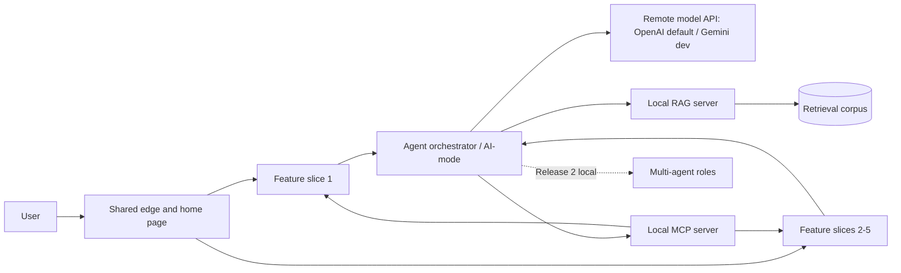
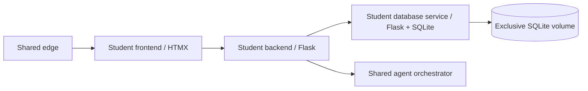
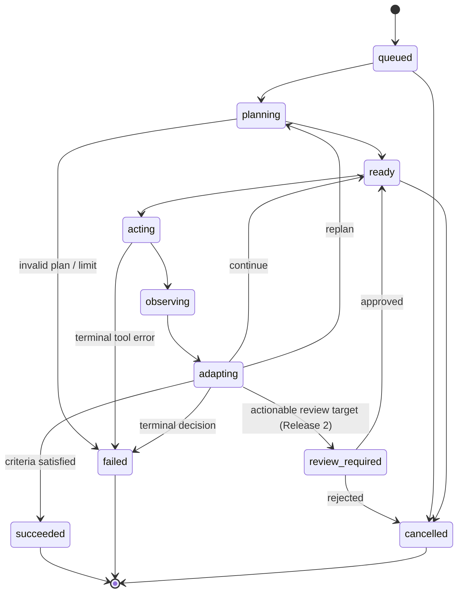

# Shared Platform and Agentic Harness Design

## Document control

| Field | Value |
|---|---|
| Status | Living architecture; Release 1 Shared/Feature 1 implementation, all five existing feature slices retained |
| Last verified | 7 September 2026; current implementation summary below, release evidence tracked separately |
| Scope | Shared services and integration contracts across Releases 0-2 |
| Primary audience | Project team, tutor, reviewers, and future maintainers |
| Related records | `docs/architecture/registered-feature-scope.md`, `docs/architecture/repository-architecture.md` and `docs/architecture/feature-integration-and-experience-contract.md` |

### Local placement and Release 1 implementation (7 September 2026)

The launcher supports reversible Docker and host placement for AI-mode, MCP and RAG. Fresh
developer setups default to Docker; `stack up --ai-runtime host` selects the assessment topology
and `stack up --ai-runtime docker` restores Docker visibility. Selection is persisted.
[ADR-044](decisions/ADR-044-dual-ai-runtime.md) records this user-authorised development alternative;
[the plan](../release-1/dual-ai-runtime-plan.md) defines its validation. Docker uses an optional
overlay; base and CI models retain the host topology. Both placements use the same exclusive
history and RAG index/model directories, stopping previous owners before switching. The loop
remains part of AI-mode, not a fourth service.

The user-supplied 6 September Release 1 marking rubric requires **AI-mode, MCP, RAG and the
shared agent loop to run locally outside containers**, with MCP/RAG disabled during CI/CD.
[ADR-043](decisions/ADR-043-local-grounded-runtime.md) records that assessment topology. Optional
Docker development placement does not satisfy its non-containerisation clause. The
[reviewed implementation plan](../release-1/shared-feature-1-implementation-plan.md),
[runtime guide](../release-1/host-runtime.md) and [handoff/evidence map](../release-1/shared-feature-1-handoff.md)
separate implemented behavior from validation and assessment items still owned by people.

The local topology retains the shared frontend and every enabled feature's independently owned
containers. AI-mode owns the same four-phase runner and durable SQLite run store in either placement.
MCP exposes
enabled catalogues through authenticated Streamable HTTP and invokes the existing owning backend
endpoints; it does not implement CRUD. RAG owns a separate bounded SQLite metadata/vector index
and prepared CPU embedding assets. Neither can open an AI-mode or student database.

Feature 1's first corpus contains ten explicitly licensed project-guidance topics about coverage,
publication and import diagnosis. It contains no private notes, warehouse data or current property
facts. Grounded runs retrieve this fixed feature/corpus scope, combine passages with successful
owning-tool results and validate citation/call IDs before completion. Server projections supply
source metadata and confidence policy; the shared assistant renders text-only findings, sources,
gaps and insufficient-context states within the Fieldbook experience. Legacy runs remain readable.

The shared transport/contracts, corpus recipe, browser component and disabled-CI configuration
are available to the other feature owners. Their existing enabled applications remain operational;
their individual MCP/RAG corpus integration, model evidence and submission sign-off are separate
owner responsibilities. Multi-agent runtime and Azure deployment remain Release 2 work.

### Retained Release 0 foundation

The redesigned shared shell is now a first-class, independently built Release 0 service in the
canonical root Compose and `scripts/dev.py` workflow. Feature 1 consumes the shared design tokens
from its own image/development mount and has begun the contract-preserving browser decomposition:
API, routing, formatting/evidence, forms, polling guards, reusable components, Overview,
Sources/Jobs, run planning and Runs are separately owned modules. AI-mode operations serves the
allowlisted common token asset while retaining its domain-neutral run projection and polling model.

PropertyScope Feature 1 now supplies the first assessed product slice. Its frontend, control
API, acquisition runner, database API, serial loader and PostgreSQL/PostGIS service are wired
through the root Compose model. ADR-016 is implemented as a narrow exception: only the
database API/loader receive the PostgreSQL URL; only PostgreSQL mounts its database volume;
the runner writes the Feature 1 artifact volume and the loader reads it. Architecture checks
enforce those imports, credentials and mounts. Deterministic CI uses a finite checked-in fixture;
the default development runtime connects official sources. Feature 1 updates default to the
complete registered source; ADR-035 additionally permits explicit completed PSI publisher-year
candidates that remain partial and non-publishable. Tutor approval of the narrow
exception has been confirmed; preserving a durable copy/link remains a submission-evidence task.

The first Release 0 foundation increment implemented the strict shared agent
contracts, deterministic state graph, limits and tool policy, persistence-independent
ports, bounded four-phase runner, deterministic fake provider, SQLite run/step/review
store, prompt registry, OpenAI Responses API adapter, opt-in Gemini development compatibility,
serial worker, and
create/read/cancel/review HTTP endpoints. JSON Schema and OpenAPI artefacts are generated
and drift-checked by the canonical quality gate. The historical Release 0 AI-mode image is
superseded by the host process required for Release 1 assessment and the optional unified Docker
AI image recorded in ADR-044; remote model inference remains outside the application topology.

A subsequent domain-neutral Release 0 increment added validated feature manifests,
feature-scoped/versioned tool registration, fail-fast YAML tool composition, a bounded
HTTP executor, create-run idempotency, safe append-only progress events, and an opt-in
redacted development evidence page. Feature 1 proves the agent/core/backend/database boundary
over real HTTP while retaining its exclusive persistence ownership. A validated model
registry now maps stable logical profiles to provider model IDs and explicit
context/output/reasoning budgets; ADR-017 records the provider and readiness policy.

The current hardening increment makes repository import/dependency boundaries executable in
the canonical gate, preserves validation during immutable state evolution, enforces aware and
internally coherent persisted snapshots, rejects model/profile role mismatches before network
I/O, centralises Problem Details responses, and verifies truthful feature-side idempotency
replay status. The opt-in operations projection and browser dashboard are implemented for
trusted local use. The canonical gate includes deterministic Python and frontend tests,
enforces at least 90% branch coverage for the shared/AI core, and separately ratchets Feature 1
while its broader integration-heavy suite is improved.

The Feature 1 reliability increment also treats cancellation and source-scale progress as durable
protocol outcomes. A cancellation request can be retried after a lost response and is reconciled
from the stored `cancel_requested_at` evidence; the credential-owning loader cancels the exact
Psycopg connection that owns the active statement. Import operations persist stable phase keys for
artifact verification, typed staging, identity/revision derivation, address resolution, candidate
materialisation and verification. Publication activation records its verification,
materialisation and accepted-pointer phases separately. Set-based work deliberately has no total
or percentage until it has a truthful measure. Failed and cancelled imports retain a
relation-scoped, measure-first space-recovery policy rather than running broad maintenance
automatically.

The source-scale materialisation increment keeps that transaction boundary while replacing the
wide JSONB PSI and BOCSAR staging paths with typed temporary tables populated through
`COPY ... FREEZE`. PSI derives retransmission identity and deterministic revisions in a narrow,
analysed phase, resolves each distinct eligible eight-component address once, and only then joins
the earliest wide fact into the destination. BOCSAR preserves separate sparse observations and
coverage evidence without an ordinal destination sort. Candidate inserts retain conflict guards
and the accepted pointer remains untouched until the complete transaction succeeds. A loader-local
PostgreSQL temporary-file limit and a pre-COPY disk-capacity check bound failure; neither setting
changes the database globally. Disposable real-shape benchmarks, not production artifacts, gate
100,000 then 1,000,000-row evidence and enforce the 30-minute statement ceiling.

ADR-039 moves constant warehouse provenance validation to one `warehouse.import_batch`
registration per release/artifact/run tuple in the import transaction. Migration 050 retains
existing tuples and removes the three per-row operational metadata foreign keys from warehouse
facts. Property identity foreign keys remain. The owning loader guarantees that written facts
use their registered tuple; direct administrative SQL can bypass that relationship, an accepted
throughput tradeoff. BOCSAR selects the first source row per natural key in one ordered pass,
replacing its grouped-ordinal join. Checksums, complete counts and atomic activation remain.

PSI batch-joins unique addresses against materialized dictionaries of accepted G-NAF warehouse identities, including
the street-type equivalents already recognised by its source parser. Only missing registry anchors
needed by resolved sales are inserted, with source provenance, inside the atomic candidate import.
The dictionaries avoid a correlated database search for every sales address while retaining
exact cardinality and ambiguity checks. The unchanged foreign key remains enforced. Canonical property reads exclude those registry
snapshots from legacy fallback, so withdrawal or replacement of an accepted address cannot reveal
stale fields. ADR-038 records this extension to the ADR-028 identity and ADR-032 import boundaries.

The supported consumer-platform increment aligns the public contract with that runner output:
portable products are gzip-compressed NDJSON, and a versioned producer-owned contract set binds
runtime registry entries, record schemas, manifest evidence, guide examples and drift tests. Shared
provides only the domain-neutral transport and validation protocol; product schemas and import rules
remain in their owning features. External delivery is a durable consumer-import operation, separate
from immutable release identity and from any genuine consumer-issued operation identity. A bounded
connect request queues or discovers consumer work, leased reconciliation retains progress and a final
receipt independently of producer publication. Under
[ADR-041](decisions/ADR-041-producer-owned-publication.md), producer verification queues local
activation; its final transaction publishes the generation and persists downstream delivery together.
Consumer acceptance or failure never gates or rolls back that publication. Browser requests do not
wait for source-scale work, and accepted pointers retain the ADR-028 atomic activation boundary.
Consumers discover the deterministic contract ZIP through
`GET /api/data-platform/v1/product-contracts/v1` and download only its digest-bound immutable path;
the package includes current record schemas and the unchanged legacy schemas needed to interpret
accepted releases. ADR-033 records the contract distribution, trust boundary and replay rules.
[ADR-040](decisions/ADR-040-publication-recovery-and-current-state.md) adds independent publication
reconciliation, transient control-error recovery, immutable failed-receipt retries and current
publication state in the UI. Feature 3 retains fenced staging on recovery and compiles the same
producer schemas, including format checks, without weakening full-artifact verification.

The onboarding and operations increment makes `deployment/features.yaml` the explicit enablement
selection and projects it through validated feature-owned onboarding metadata. Enabled routes,
frontend assets, AI catalogue bindings, feature quality inputs, database/volume owners and optional
shell evidence adapters now share one domain-neutral projection; disabled features contribute none of
those runtime surfaces. Generated JSON/browser artifacts and Compose/architecture/workspace validators
make drift fail the canonical gate. Typed health responses distinguish required failure from optional
provider degradation, Feature 1's edge re-resolves a recreated backend through Docker DNS, and the
read-only operator report exposes release/publication readiness without crossing the human-review
boundary. ADR-034 records these decisions.

Feature 1's maintenance pass separates HTTP mechanics, correlation, approval verification,
run-scope policy and registered source transport from the backend API composition surface. The
database repository retains atomic PostgreSQL operations but delegates immutable preview/builder
query registration, retry/task planning, serialization and replay matching to deterministic modules.
PSI acquisition is disk-backed and member-streamed under the same registered limits.

The September 2026 Feature 1 performance review retains complete gzip-NDJSON products and the
existing consumer protocol. Only the private database-to-runner export hop negotiates
`layout=columns` (`propertyscope.export-columns.v1`): an ordered field-name array and row-value
arrays replace repeated JSON keys. Ordinary object pages remain the compatibility default.
The runner prefetches at most one page and rejects generation drift, invalid/cyclic cursors,
malformed rows and inconsistent totals before registering a product. Slow reads and projection
waits renew the task lease and check cancellation.

Large flat-record builds use a bounded queue of two spawned CPU projection processes by default (configurable
0..4). Children receive registered builder identity, validated build context and row batches;
they perform no HTTP, artifact writes, database access or publication. The runner retains ordered
collection, one deterministic gzip stream, manifest aggregation and artifact registration.
Address/sale batches contain 5,000 rows. Crime series retain serial projection with linear-time
coverage membership checks; the benchmark can additionally compare 32-series process batches,
but that mode is slower for the measured nested workload. Small products retain serial projection. This is intra-task
CPU parallelism; acquisition tasks and database import/activation ownership remain unchanged.
See [the review and measured limits](../reviews/shared-feature-1-improvements-55.md).

The September 9 data pass adds a versioned G-NAF Parquet canonical handoff, retaining legacy
JSON/NDJSON replay, existing row hashes and database ownership. BOCSAR streams ZIP members,
reuses bounded immutable month metadata, and exports each series with one indexed observation
aggregation. Native JSON handles the private page hop and validated portable records. The
runner defaults to gzip level 3 (configurable 1..9) and batches serial projection; compression
bytes may change between settings but every release registers its actual checksum. Consumer
schemas and the human publication boundary are unchanged. See the
[flow, benchmark evidence and tradeoffs](../reviews/feature-1-data-performance-2026-09-09.md).

The five feature slices now have implemented manifests and enabled routes. Their approved owners
and boundaries remain in [`registered-feature-scope.md`](registered-feature-scope.md). This shared
increment does not establish each owner's complete Release 1 submission evidence. Live diagnostics
prove the particular boundary exercised, not every feature's assessed behavior or future runtime.

This document is both a high-level design and a detailed build guide. The shared platform was
deliberately defined before the project domain and five feature schemas were known; the approved
scope record now supplies those ownership boundaries without moving them into the shared kernel.
Feature-specific entities, prompts, and business rules remain owned by the student responsible for
that feature.

### Feature 3 deployment integration (3 September 2026)

Feature 3 additionally implements the ADR-033 consumer callback/status protocol for BOCSAR and
government schools. A backend worker downloads validated releases and sends bounded staging batches
to its exclusively owned SQLite database service; durable fenced leases, invisible staging and an
atomic receipt/current-release pointer protect retry and crash recovery. Population is explicitly
pulled from Feature 1's accepted ABS SEIFA product, preserving its Feature 1 target rather than
re-registering the product. No shared database credentials or files cross this boundary. The
backend also reconciles accepted releases at startup and every fifteen minutes, independent of
browser traffic; this never acquires publisher data or approves a release. The feature's
Published evidence panel is independent of its original demonstration fixtures and
does not silently substitute them for unavailable official evidence. See the Feature 3 README for
limits, source semantics, routes and activation prerequisites.

The root selection now enables `student-3-suburb-analytics`. Its explicit Compose topology comprises
`f3-frontend`, `f3-backend` and `f3-database`; only the database mounts `f3-suburb-data`. The public
frontend binds loopback port 5600 (override: `PROPERTYSCOPE_SUBURB_ANALYTICS_PORT`) and is routed by
the shared edge at `/features/suburb-analytics/`. Internal ports 5301/5302 remain container-local.
The backend calls its store, Feature 1 and shared AI-mode over HTTP; its read-only catalogue and
quality inputs are projected from its owned manifest. Gunicorn serves the WSGI factories with
source reload in the development overlay. Data remains a deterministic partial demonstration
fixture and saved comparisons retain the documented single-user demo assumption. Enablement does
not claim official-data ingestion, authentication, or completion of remaining delivery evidence.

## 1. Executive decision

Build a compliance-first, contract-driven microservices platform with five repeated
student-owned feature slices and a small set of shared integration services.

Each feature slice owns its frontend, backend/API, database service, tests, and
container artefacts. Shared services provide the unified web entry point, agentic
orchestration, remote model access, common contracts, test utilities, MCP and RAG. Multi-agent and
Azure integration remain Release 2 extensions. Shared services must not absorb feature business
logic or erase evidence of individual ownership.

The central design pattern is a deterministic state machine around a probabilistic
model:

```text
validated request
  -> bounded Plan
  -> policy-checked Act
  -> structured Observe
  -> validated Adapt
  -> success, human review, another bounded iteration, or failure
```

The state machine, contracts, persistence model, telemetry fields, prompt registry,
and provider interface should be built in Release 0. MCP, RAG, and multi-agent
implementations may have interfaces and disabled placeholders early, but their runtime
capabilities and assessment evidence must be introduced only in their specified
releases.

## 2. Sources, constraints, and interpretations

### 2.1 Authoritative course requirements

The design is grounded in the 22-page `ASD_2026_Project_Specifications.pdf`, the Canvas
page **Assessment overview**, the Canvas page **AI Agent Configuration Guide**, and the
Week 1 lab **DevOps and Agentic AI Foundations**.

The main architectural constraints are:

- one integrated Agentic AI application;
- five student-owned frontend, backend/API, and database microservice sets;
- CRUD and at least ten records per table for every individual feature;
- successful LLM interaction from every frontend/backend feature;
- one shared home page and CSS theme;
- one shared Docker Compose application;
- a shared Plan -> Act -> Observe -> Adapt loop in every release;
- local MCP and RAG in Release 1;
- non-containerised local AI-mode, MCP, RAG and shared loop in Release 1, with MCP/RAG
  disabled during CI/CD, as clarified by the 6 September marking rubric;
- local Planner, Worker, Reviewer, and human review in Release 2;
- Azure or AWS deployment in Release 2;
- AI-mode with remote OpenAI model access enabled in the cloud while MCP, RAG, and multi-agent services are
  disabled; and
- individual workflows, integrated testing, diagrams, execution evidence, and reports.

### 2.2 Recorded interpretations

1. **Database choice.** Section 5.3 allows SQLite or PostgreSQL, but the release deliverables
   and cloud tables repeatedly name SQLite. Features 2–5 therefore retain independently owned
   stores following the shared SQLite baseline. ADR-016 records the Feature 1-only
   PostgreSQL/PostGIS exception needed for verified statewide scale. Its database API/loader
   form the sole credential-owning trust boundary; all callers continue to use HTTP.
2. **Database microservice.** SQLite is embedded rather than a network database server.
   To satisfy the course topology, each database container owns its SQLite file and
   exposes a narrow internal API. No other container mounts or opens that file.
3. **Workflow names.** Use `student-1.yml` through `student-5.yml`, matching the written
   requirements. The PDF repository diagram's `student-N-ci.yml` labels are treated as
   a documented inconsistency.
4. **Early foundations.** Later-release interfaces, schemas, feature flags, and test
   doubles may exist from Release 0. Later capabilities remain off, are excluded from
   the relevant release demo, and are not claimed as completed early.
5. **Model provider.** ADR-017 supersedes the earlier local-runtime decision. AI-mode calls
   OpenAI through the existing provider port, routes planner/implementer work to
   `gpt-5.6-luna` and adaptation/review to `gpt-5.6-terra`, and keeps direct
   feature behavior independent of provider availability. Credentials come only from the
   runtime environment or deployment secret manager. ADR-018 adds Gemini Chat Completions as an
   opt-in development provider without changing that production default.

### 2.3 Requirement traceability

| Course requirement | Design response | Primary evidence |
|---|---|---|
| Five student frontend/backend/database sets | Repeated, separately owned feature slices | Manifests, Compose graph, per-student workflows and tests |
| CRUD and ten records per table | Feature backend plus exclusive DB service and idempotent seeds | CRUD contract tests, migration/seed report, UI recording |
| LLM interaction per feature | Feature backend calls shared orchestrator with a feature namespace | Per-feature AI smoke test and trace |
| Unified home page and CSS | Shared edge, manifest links, common design tokens | Browser E2E test and screenshot |
| Plan -> Act -> Observe -> Adapt | Persisted bounded state machine | Run-detail evidence, state-model tests, workflow diagram |
| Docker/Compose integration | One root Compose model with release profiles | `docker compose config`, health report, full-stack test |
| Individual CI/CD | Path-filtered `student-N.yml` workflows | Five successful workflow runs |
| Release 1 MCP/RAG/grounding | Adapters over existing tools plus citation-bearing retrieval | MCP Inspector/contract output and RAG evaluation report |
| Release 2 multi-agent/human review | Planner, Worker, Reviewer roles over the same run model | Role traces, approval/rejection cases, architecture diagram |
| Pre/post testing | Deterministic pre-commit pytest and isolated AI-assisted test stage | JUnit/coverage artefacts and generated-test evidence |
| Azure deployment | Container Apps, ACR, Bicep, OIDC, smoke/rollback workflow | Deployment output, endpoint tests, infrastructure diagram |
| Advanced services disabled in cloud | Services absent from Azure graph and flags false | Automated negative reachability/configuration assertions |
| Reports, diagrams, logs, screenshots | Evidence paths and reproducible scripts built into the platform | Release evidence manifest tied to one commit/tag |

## 3. Goals and non-goals

### 3.1 Goals

- Make ownership and contribution evidence unambiguous.
- Let five teams build features independently against stable contracts.
- Keep the agent loop observable, bounded, resumable, and testable without a real LLM.
- Support weak and capable developer machines through configuration rather than forks.
- Run on Windows, macOS, Linux CI, Docker Compose, and Azure with the same service APIs.
- Make prompt, model, retrieval, cache, and tool behaviour measurable.
- Produce assessment evidence as a normal build output rather than a last-minute task.
- Prefer mature, understandable patterns over framework-specific magic.

### 3.2 Non-goals

- Moving approved feature-domain entities or business rules into shared packages.
- Sharing feature database tables or ORM models.
- Building a general-purpose autonomous agent platform.
- Storing hidden chain-of-thought or using it as audit evidence.
- Introducing Kubernetes, Kafka, a service mesh, or distributed event sourcing.
- Scaling beyond the needs of a semester demonstration.
- Treating an LLM recommendation as authorization to mutate data.

## 4. Quality attributes and measurable targets

| Attribute | Initial target |
|---|---|
| Correctness | All external and tool inputs schema-validated; invalid state transitions rejected |
| Boundedness | Default maximum 6 agent iterations, 12 tool calls, and one configurable time budget per run |
| CRUD performance | Non-AI endpoints meet the course lab baseline of 19/20 calls at or below 500 ms locally |
| Resilience | CRUD remains available when the LLM provider is unavailable; malformed structured output receives bounded repair; one failed read-only evidence call can Observe/Adapt before an identical repeat stops the run |
| Idempotency | Retried mutation tool calls do not create duplicate effects |
| Portability | One documented command path each for Windows PowerShell, macOS/Linux, and Compose |
| Testability | Shared core tests use a deterministic fake model; real-model tests are a separate suite |
| Coverage | At least 90% shared/AI core branch coverage in the canonical gate; isolated feature ratchets |
| Traceability | Every run, step, model call, tool call, and retrieval item has a correlation/run identifier |
| Maintainability | No feature imports another feature's Python package or accesses another database directly |
| Security | Only allowlisted typed tools; destructive effects require policy approval and idempotency |

LLM response-time and task-success targets must be established from representative
benchmarks on the team's actual machines. Model latency is not folded into the 500 ms
CRUD target.

## 5. Architecture principles

1. **Vertical ownership.** A student owns one end-to-end feature slice.
2. **Minimal shared kernel.** Share protocol types, configuration conventions, tracing,
   and test utilities; do not share business entities.
3. **Contract first.** HTTP APIs, events, and tools are versioned schemas before they are
   implementation details.
4. **Deterministic shell, probabilistic core.** Code controls state, permissions,
   retries, validation, and stop conditions. The LLM proposes structured decisions.
5. **Single writer per data store.** Only its database service opens a feature's SQLite
   file. Only the orchestrator opens the agent-state store.
6. **API composition, not database integration.** Cross-feature behaviour uses APIs or
   tools, never joins across SQLite files.
7. **Explicit release gates.** Disabled means the service is not started and its routes
   reject use; it is not merely hidden in the UI.
8. **Evidence by design.** Logs, test reports, contract artefacts, diagrams, and release
   manifests are reproducible.
9. **Graceful degradation.** Deterministic feature functionality does not depend on LLM
   availability.
10. **Human authority.** Model output is data. Policy-checked code and the user authorize
    actions.

## 6. System context and service topology



The edge and feature slices are containers. The Release 1 assessment topology runs AI-mode
(including the loop), MCP and RAG as local host processes. Fresh developer setups default to the
optional Docker AI placement; `stack up --ai-runtime host` selects the assessment topology.
Azure is a separate future topology, not an extra destination in this runtime.
Feature 1's PostgreSQL/PostGIS exception replaces the generic SQLite branch below only within
its credential-owning database API/loader boundary.

One feature slice is repeated five times:



### 6.1 Shared service catalogue

| Service/package | Release | Responsibility | Must not own |
|---|---:|---|---|
| `shared/frontend` edge | 0 | Unified home page, shared assets, same-origin routing, health landing page | Feature business rules |
| `shared/contracts` | 0 | Pydantic/JSON Schema types, error envelope, identifiers, headers | Feature entities |
| `shared/testkit` | 0 | Fake model, contract fixtures, factories, assertion helpers | Production orchestration |
| `shared/tool-runtime` | 1 | Neutral catalogue parsing, bounded HTTP dispatch and signed MCP context | Feature rules or orchestration implementation |
| `ai-services/agent-core` | 0 | State machine, policies, provider/tool ports, cache interfaces | Flask routes or feature code |
| `ai-services/ai-mode` | 0 | Orchestrator API, run persistence, remote-provider adapter, prompt registry | Direct feature DB access |
| OpenAI API | 0 | Remote model inference | Application workflow state or feature data |
| Gemini API | 0 dev | Opt-in local model inference through OpenAI-compatible Chat Completions | Production default or application workflow state |
| `ai-services/mcp-server` | 1 | Host MCP tools and approved catalogue metadata resource | Duplicate CRUD logic or arbitrary URL dispatch |
| `ai-services/rag-server` | 1 | Ingestion, chunking, retrieval, citations, corpus versions | Final response authority |
| `ai-services/multi-agent-server` | 2 | Planner/Worker/Reviewer coordination and human-review API | A second incompatible run model |
| Optional OTel collector | 0+ | Local trace/metric export when enabled | Required runtime dependency |

### 6.2 Student service catalogue

Each `student-N` slice contains:

- a static/HTMX frontend service;
- a Flask backend containing feature use cases and AI-facing endpoints;
- a Flask database service containing SQLAlchemy mappings, migrations, seeds, and its
  exclusive SQLite database;
- unit, contract, integration, and browser tests; and
- container targets and a path-filtered CI workflow.

The single student-root `Dockerfile` uses explicit named build targets (`frontend`,
`backend`, and `database`) so Compose produces three independently runnable images
without contradicting the supplied repository layout. If the tutor later confirms that
separate Dockerfiles are preferred, these targets can be split without changing service
contracts.

The backend is the feature's business boundary. The database service is deliberately
narrow: persistence CRUD, filtering, pagination, health, migrations, and seed-state
inspection. It does not call the LLM.

### 6.3 Dependency and call direction

There are two different shared elements and they must not be confused:

1. **Shared packages** are small compile-time dependencies. Student services and shared
   AI services may import `shared_contracts`; tests may also import `shared_testkit`.
   Student services do not import `agent-core` or another student's package.
2. **Shared services** are independent runtime processes. The edge is containerised;
   AI-mode, MCP and RAG run in the selected local host or Docker placement. Student backends call the shared orchestrator
   over HTTP; they do not embed its implementation.

The normal runtime flow is:

```text
student frontend
  -> student backend starts an agent run
  -> shared orchestrator plans and selects an allowlisted feature tool
  -> shared orchestrator calls MCP with signed invocation context
  -> MCP dispatches to that student's owning backend tool endpoint
  -> student backend applies its business rules and calls its database service
  -> tool result returns to the orchestrator
  -> orchestrator observes/adapts and returns the final result
```

This controlled callback is intentional. The feature initiates the run, while the
orchestrator may call feature-owned capabilities as tools. The orchestrator never calls
a student database directly, and a feature never imports orchestration implementation.
Release 1 exposes the same tools through MCP without changing their owner or duplicating business
logic. Direct mode retains Release 0 HTTP dispatch. Read-only RAG retrieval is a separate bounded
tool path inside the same Act phase; its corpus scope comes from the persisted run, not model text.

### 6.4 Frontend ownership and public exports

The same compile-time rule applies to browser code. `shared/frontend` owns domain-neutral tokens,
DOM helpers, mapping behavior and accessibility utilities; it must not import a
`student-N/frontend` implementation. A feature owns response-envelope projection, labels and
workflow routing. Release 0 has one explicit, bounded Feature 1 runtime bridge served below that
feature's existing ingress. It is not a speculative generic plugin protocol: another feature needs
a reviewed real call site and its own allowlisted public ingress. The Shared shell renders before
the short optional adapter load, so a service outage degrades that projection rather than blocking
the shell or creating a compile-time dependency.

Public Shared browser imports are intentionally narrow:

| Public entrypoint | Shared responsibility | Feature responsibility |
|---|---|---|
| `browser/index.js` | Safe DOM, bounded JSON transport, cancellation, polling and common product-header geometry | Domain envelopes/errors, terminal states, labels, actions and screen composition |
| `mapping/index.js` | Map lifecycle, provider validation and bounded GeoJSON behavior | API calls, layer meaning, popup fields and evidence claims |
| `design-system/` documented assets | `--ps-*` tokens and `.ps-*` primitives | Density, domain tables/forms and feature-specific layout |

Files beside an `index.js` barrel are private. `scripts/validate_architecture.py` checks JavaScript
imports as part of the canonical gate: Shared cannot import feature source, one feature cannot import
another, network-URL module imports fail closed, and consumers of the Shared browser/mapping packages
must use their public barrels. For
example, a property release payload is projected in `student-1/frontend/integration/shell.js`; a
generic readiness card remains in Shared. Exact database readiness fields, accepted-release filters
and Property data routes therefore stay with Feature 1.

Feature transitions into the Shared AI activity view use one bounded metadata tuple. Unknown keys,
spoofed labels, protocol-relative destinations and any non-matching return route are ignored; query
parameters are not a general-purpose branding or redirect contract.

#### 6.4.1 Release 0 HTMX request paths

The integrated shared shell serves a pinned local HTMX 2.0.10 asset and replaces its home-page
research-area fallback with `/fragments/research-areas.html`. Registry/fragment parity is executable,
so only manifest-enabled features expose live links. All five research areas are currently enabled.

Feature 1 demonstrates the assessed write path without changing service ownership:

```text
browser HTMX Source form/list
  -> Feature 1 Nginx /fragments/data-platform/v1/sources
  -> Feature 1 Flask/Jinja fragment adapter
  -> injected DataStoreClient over private HTTP
  -> Feature 1 database API
  -> Feature 1-owned PostgreSQL/PostGIS
```

The fragment adapter is presentation-only and reuses the existing Pydantic validation and private
client boundary. Its error/status responses are HTML; the public JSON Source API remains a separate,
compatible surface. Correlation headers, safe errors, autoescaping, optimistic versions, exclusive
database credentials, and the architecture import/mount checks continue to apply. Maps, AI chat,
adaptive polling, charts, run timelines and other state-heavy routes deliberately remain JavaScript.

### 6.5 Compose naming convention

Compose names expose ownership before implementation detail. The production-like base project is
`ps`, and the reloadable local overlay is `ps-dev`. Official and finite-fixture acquisitions share
this runtime and consume their complete registered source by default. ADR-035 permits only PSI to
select completed annual publisher partitions; that scope remains explicit, partial and unable to
replace the accepted complete generation.
Shared services use `shared-<role>`; student-owned services use `f<number>-<role>`. Images mirror
the service key below the descriptive `propertyscope/` namespace, and
durable volumes use the same ownership prefix.

Do not set `container_name`. Compose-generated names preserve project isolation and produce
scannable container names such as `ps-dev-shared-frontend-1` and `ps-dev-f1-backend-1`. The
canonical gate verifies project names, ownership
prefixes, overlay membership, image alignment, and the absence of hard-coded container names.

The developer entry point mirrors those boundaries: `scripts/dev.py stack` coordinates container
and host lifecycle, `scripts/dev.py ai` manages the selected AI placement and local validation modes,
`scripts/dev.py ui` owns deterministic browser fixtures, and `scripts/dev.py data` owns
source acquisition. `scripts/check.py` remains the single source-quality runner instead of being
proxied through the lifecycle command. The development overlay bind-mounts every enabled built
service. Static frontend source is visible on refresh and request-serving Python processes reload
workers in place. Durable background workers require an explicit targeted restart so an edit cannot
silently interrupt an active job. Ordinary `stack up` reuses images and containers; image rebuilds
remain explicit after dependency or Docker input changes.
AI Python source changes in either placement require an explicit `ai stop` / `ai start`; bind
mounts alone do not restart AI workers. Ordinary shutdown preserves AI state and all Docker data.

## 7. Shared contracts

### 7.1 General conventions

- HTTP JSON APIs are namespaced under `/api/v1`.
- JSON uses `snake_case`; timestamps use UTC RFC 3339; IDs use UUIDv7 when the selected
  Python library supports it consistently, otherwise UUIDv4.
- Every request accepts or creates `X-Request-ID`; agent traffic also carries
  `X-Agent-Run-ID` and W3C `traceparent`.
- Errors use one common Problem Details-compatible envelope with `type`, `title`,
  `status`, `detail`, `instance`, `code`, `request_id`, and field errors.
- List endpoints use `items`, `page`, `page_size`, `total`, and stable ordering.
- OpenAPI 3.1 documents are checked into source and linted in CI.
- Additive changes remain within `v1`; breaking changes require a new version.

### 7.2 Feature manifest

Every student owns a validated `feature.yaml` containing:

```yaml
schema_version: 1
feature_key: student-1-propertyscope-data-platform
display_name: PropertyScope Data Platform and Property Discovery
owner: student-1
frontend_base_path: /features/data-platform/
backend_base_path: /api/data-platform/v1
health_path: /health/ready
ai_capabilities: []
onboarding:
  frontend: {asset_root: student-1/frontend, service: f1-frontend}
  backend: {service: f1-backend}
  ai: {tool_catalog: student-1/tool-catalog.yaml, runtime_path: /etc/ai-mode/tools.yaml}
  quality: {python_test_paths: [student-1/tests], node_test_files: []}
  databases: [{database_service: f1-postgres, volumes: [f1-postgres-data]}]
```

The closed root deployment selection explicitly enables feature keys. Shared joins that selection to
the owner manifests and projects only enabled routes, assets, tool catalogues, quality inputs,
database/volume owners and optional evidence adapters. Generated artifacts and integration tests
cross-check the browser registry and Compose wiring. Product-facing labels and reserved placeholders
may remain visible as planned work, but only selected complete manifests expose runnable routes or
tools. Compose service definitions remain explicit; manifests do not generate hidden runtime topology.

### 7.3 Agent contract model

The following domain-neutral objects form the stable harness contract.

| Object | Essential fields |
|---|---|
| `AgentRun` | `id`, `feature_key`, untrusted `objective`, typed `trusted_identifiers`, `status`, `prompt_set`, `model_profile`, limits, timestamps, final result/error |
| `AgentStep` | `id`, `run_id`, `sequence`, `phase`, `status`, input/output references, timestamps |
| `Plan` | `goal`, ordered typed actions, success criteria, risk level, assumptions |
| `ToolDefinition` | unique name, description, input/output JSON Schemas, side-effect class, timeout, approval rule |
| `ToolCall` | `id`, `step_id`, tool name/version, validated arguments, idempotency key, approval status |
| `ToolResult` | call ID, outcome, typed content, error, duration, retryability, evidence references |
| `Observation` | facts derived from tool results, success-criteria state, new constraints |
| `Adaptation` | `continue`, `replan`, `request_review`, `complete`, or `fail`, plus concise justification |
| `HumanReview` | run/step, requested action, risk summary, decision, reviewer, timestamp |
| `ModelInvocation` | provider, model name/digest, prompt template versions, parameters, durations, token counts, cache metadata |
| `RetrievalCitation` | corpus/document/chunk IDs, source URI, content hash, rank, score, excerpt |
| `Artifact` | type, content hash, media type, safe location, producer step |

Do not persist private hidden reasoning. Persist the validated plan, requested action,
tool result, concise decision summary, and evidence needed to reproduce or audit the
run.

Objective text is narrative intent, not an identifier trust boundary. Feature backends project
identifiers they have validated from routes, records, or typed page context into the bounded
`trusted_identifiers` ledger. The runner may also reuse identifiers from successful prior tool
results. Feature-owned input/output schemas use the optional `x-identifier-kind` annotation when
an alias or bare `id` needs a stable kind; exact `_id` and `_ref` names are the fallback. Bare
`id` fields require annotation, and unavailable historical tool definitions fail closed. These
`x-*` fields are orchestration metadata and do not alter payload validation, so metadata-only
corrections do not version a feature tool's HTTP contract. One domain-neutral schema traversal
in `agent-core` supplies both deterministic authorization and AI-mode's bounded prompt ledger;
feature-specific identifier kinds and field aliases exist only in each feature's tool schemas.

### 7.4 Tool naming and ownership

Use namespaced names such as `student_1.records.search.v1`. Each tool has exactly one
student owner and calls that student's backend API. Shared tools are limited to genuine
cross-cutting capabilities such as retrieval or run status.

Tool side-effect classes are:

- `read_only` - may execute automatically;
- `reversible_write` - requires policy approval and an idempotency key;
- `destructive_write` - requires explicit human confirmation; and
- `external_effect` - disabled unless specifically approved for the project.

Never expose generic SQL, shell execution, arbitrary URLs, or unrestricted filesystem
access as model-callable tools.

### 7.5 Orchestrator HTTP surface

| Method and path | Behaviour |
|---|---|
| `POST /api/v1/agent-runs` | Validate, persist, and accept a run; return `202`, run ID, status, and `Location` |
| `GET /api/v1/agent-runs/{run_id}` | Return current state, safe step summaries, limits, and final result/error |
| `GET /api/v1/agent-runs/{run_id}/events` | Page ordered safe progress events after an explicit resumable cursor |
| `POST /api/v1/agent-runs/{run_id}/cancel` | Idempotently request cancellation |
| `POST /api/v1/agent-runs/{run_id}/reviews` | Approve or reject exactly one pending protected action |
| `GET /health/live` | Process liveness only; no dependency calls |
| `GET /health/ready` | Migration/store readiness and configured provider reachability state |

`AgentRunRequest.tool_allowlist` is an optional persisted capability boundary. When present, the
planner sees only the intersection of feature-visible tools and that list, and execution resolves
only names in the same list. Feature adapters use this for narrower modes such as informational
chat; older fixed workflows that omit it retain their feature-level catalogue and effect policy.

The first implementation uses one controlled background executor with concurrency one
inside a single `ai-mode` process. Its `RunQueue` port is deliberately small so a later
Redis/RQ-style adapter can be introduced only if measurements justify another service.
Because transitions are persisted before and after each effect, startup reconciliation
can safely resume queued runs and route uncertain mutations to review. The public API
does not change if the queue implementation changes.

## 8. Agentic harness detailed design

### 8.1 Run state machine



Run status and step phase are separate enums so reports can distinguish, for example,
an active run currently in `observe` from a completed observation step.

The implemented transition invariants, phase checkpoints, effect-aware startup
recovery, repair turns, and idempotency obligations are maintained in
[`agent-run-state-machine.md`](agent-run-state-machine.md). That document is normative
for runner behavior when this broader roadmap and the implementation differ.

### 8.2 Execution algorithm

1. Validate and persist the request before calling a model.
2. Resolve the immutable prompt-set version and model profile.
3. Ask the planner for a JSON-schema-constrained plan.
4. Validate tool names, argument schemas, limits, and policy.
5. Execute one action or an explicitly safe parallel read-only group.
6. Persist results before asking the model to interpret them.
7. Compute deterministic success checks where possible.
8. Ask for a structured adaptation only when code cannot decide.
9. Stop on success, rejection, cancellation, non-retryable failure, or any limit.
10. Return a typed result containing evidence links and degradation warnings.

Retries use exponential backoff with jitter for transient transport failures. A model
format failure gets at most one repair attempt using the validation error; it must not
loop indefinitely. Mutation retries reuse the original idempotency key.

### 8.3 Planner, Worker, and Reviewer evolution

- **Release 0:** one orchestrator process performs the four phases. The LLM may propose
  a plan or adaptation, while code executes tools and enforces policy. Planner and
  adapter are separate, stateless inference requests (currently to the same configured
  model), not independent persistent agents. Each request receives its own versioned
  system prompt and reconstructs context from persisted safe run data.
- **Release 1:** the same orchestrator can call MCP tools and obtain RAG context. These
  become new adapters, not a new loop.
- **Release 2:** Planner, Worker, and Reviewer become explicit roles sharing the same
  `AgentRun` and `AgentStep` records. The reviewer checks evidence and success criteria;
  it cannot silently execute tools. Human review remains the final authority for
  protected actions.

This is an orchestrator-worker pattern, not free-form multi-agent debate. Parallel work
is allowed only for independent read-only actions and only when the configured machine
and provider limits can support it.

### 8.4 Failure and cancellation semantics

- Client cancellation marks the run and prevents new tool dispatches.
- A timed-out tool returns a structured timeout result; the planner never sees a Python
  exception or stack trace.
- If the LLM provider is unavailable, deterministic checks and CRUD continue; the AI operation
  becomes `degraded` or `failed` according to its contract.
- A restarted orchestrator resumes only from a persisted safe boundary. An `acting`
  mutation with unknown outcome goes to human review rather than being repeated.
- Poisoned or repeatedly failing runs are terminal after the configured retry budget.

## 9. Prompts, model access, and caching

### 9.1 Provider boundary

`agent-core` defines an `LLMProvider` protocol for structured generation, health, and
invocation metrics. `ai-mode` supplies an OpenAI Responses API implementation and an opt-in
Gemini Chat Completions compatibility mode using the official OpenAI SDK inside its adapter
boundary. Both request JSON-Schema-guided output and record
token/timing/cache/request-ID metrics, disables response storage, enforces configured context,
and performs bounded retries within the persisted deadline. Stable prompt prefixes use explicit
OpenAI provider caching and model readiness uses a short TTL. No feature backend imports
or calls a model-provider SDK/API.

Configuration selects a model profile rather than embedding model names in feature
code. Profiles can reduce context, output length, concurrency, or agent discretion on
less capable or more costly models. The versioned registry records the provider, exact model
ID, advertised context/output maxima, official source, reasoning effort, and conservative
runtime budgets. Startup and CI validate it; the public API exposes the same typed view. The same
evaluation set should run against every supported profile before a default changes.

### 9.2 Prompt registry

```text
ai-services/ai-mode/src/ai_mode/prompt_assets/
|-- planner/
|   |-- v1.system.j2
|   `-- v1.meta.yaml
|-- adapter/
|   |-- v1.system.j2
|   `-- v1.meta.yaml
`-- reviewer/
    |-- v1.system.j2
    `-- v1.meta.yaml
```

Every prompt invocation records the logical prompt ID, semantic version, Git content
hash, rendered-input hash, and model digest. Stable instructions, schemas, and tool
definitions appear before dynamic user and retrieval content. Prompt changes require
evaluation results in the pull request.

The shared registry owns only domain-neutral orchestration prompts: how to produce a
bounded plan and how to adapt from typed evidence. Feature-specific terminology,
task recipes, grounding rules, examples, and final-result expectations belong to the
owning feature. The current Release 0 manifest declares capabilities but does not yet
carry a versioned feature-guidance reference; add that contract before product features
need domain-specific prompting. AI-mode should load allowlisted, hashed feature guidance
at startup and inject it as delimited task data. A feature must not replace the shared
authorization, limit, output-validation, or adaptation policy instructions.

Retain prompt assets referenced by persisted runs for replay and evidence. Startup
validation should enumerate the declared prompt-set registry rather than maintain a
second hand-written list of versions. Retire an old prompt set only through a documented
compatibility and retention decision, not as routine file cleanup.

### 9.3 Cache layers

| Layer | Key | Invalidation | Allowed content |
|---|---|---|---|
| Provider prompt cache observation | provider model + prompt hash | provider-managed | Non-sensitive token-count metadata only |
| Embedding cache | embedding model digest + chunk content hash | content/model change | Embedding vectors |
| Retrieval cache | normalized query + corpus version + retriever config | corpus/config change | Ranked chunk IDs |
| Deterministic response cache | model digest + prompt-set hash + normalized input + relevant data version | TTL or any dependency version change | Read-only, non-personal, non-agentic responses |

Do not cache mutation plans, approval decisions, tool outputs over mutable data, error
responses, or responses containing secrets/personal data. Cache hits and misses are
metrics, not assumptions. A cache is adopted only after an A/B benchmark shows a useful
latency or compute improvement without reducing task success.

Provider-reported cached input tokens are recorded as metrics only. AI-mode does not depend on,
control, or claim provider prompt caching, and does not persist provider response state.

### 9.4 Performance experiment

Do not claim prompt caching from anecdotal timing. For each release candidate, run a
versioned benchmark containing at least 10 initial requests and 30 repeated-prefix
requests per supported showcase profile. Export CSV/JSON with model ID, profile,
context length, prompt hash, input/output/cached/reasoning tokens, total duration, and task-success
assertion. Compare:

1. stable-prefix versus semantically identical reordered prompts;
2. configured reasoning efforts and output budgets;
3. retrieval cache disabled versus enabled; and
4. application response cache disabled versus enabled for an eligible read-only case.

Adopt an optimisation only when the dataset shows lower median and p95 latency or lower
prompt evaluation work with no task-success regression. Store an owned benchmark alongside its
tests, and keep generated raw results in a Git-ignored runtime directory with bounded summaries
under `docs/evaluations/`.

## 10. Persistence design

### 10.1 Feature data

- One SQLite file and named volume per student database service.
- WAL mode locally where verified; short transactions; a busy timeout; foreign keys on.
- SQLAlchemy 2 unit-of-work sessions and Alembic migrations.
- Migrations run as an explicit one-shot Compose/CI task, not concurrently in every web
  replica.
- Seed scripts are idempotent and verify at least ten records per required table.
- Database endpoints expose application-level operations, never arbitrary SQL.
- Backups for assessment evidence use SQLite's online backup API or a stopped service,
  not a raw copy during writes.

### 10.2 Agent state

`ai-mode` owns a separate SQLite file for runs, steps, invocations, reviews,
and cache metadata. This is operational workflow state, not a sixth student feature
database. It does not require another public database API or separately assessed
database microservice: only the `ai-mode` process opens the file. Large artefacts live
outside rows and are referenced by hash. Database rows store only safe, bounded
excerpts.

The schema includes an integer schema version and forward-only migrations. Schema
version 2 adds create-request idempotency records and append-only safe progress events.
Step append, run-status update, review where present, and its event occur in one
transaction. Optimistic version numbers prevent two workers advancing the same run.
The event decision and cursor semantics are recorded in
[`ADR-014`](decisions/ADR-014-append-only-safe-agent-run-events.md).

MCP, RAG and future multi-agent services do not open this file. They interact through
the orchestrator's internal contracts, leaving `ai-mode` as the single state owner.
The host launcher preserves historical Compose-volume state through consistency-checked migration
and never overwrites an existing host store. RAG owns its own index/model directory. Lifecycle
ownership checks include PID creation time and command identity before signalling a process.

### 10.3 Azure persistence constraint

Azure Container Apps offers persistent Azure Files mounts, while SQLite cautions
against multi-client access over network filesystems. For the course-mandated SQLite
cloud topology:

- run exactly one replica of each database service;
- mount each database file into only that service;
- never share a database volume between services;
- prohibit scale-out for database services and the state-owning `ai-mode` service;
- run backup/restore and write-concurrency tests in Azure before Release 2; and
- record the residual availability risk in the report.

If the tutor permits PostgreSQL, Azure Database for PostgreSQL is the preferred
production correction. It is not the baseline until that permission exists.

## 11. MCP and RAG design

### 11.1 MCP

The host server uses the official Python MCP SDK and stateless Streamable HTTP at loopback
`/mcp`. Enabled tool definitions retain their owning catalogue's JSON Schemas and side-effect
annotations. The `propertyscope://tools/catalog` resource contains public approved metadata;
it does not expose service origins or database records. No MCP prompt registry is needed for
this increment: versioned model prompts remain owned by AI-mode.

Bearer authentication and signed short-lived invocation metadata bind feature/run/step/call,
tool/version, argument hash, approval, idempotency and deadline outside the model's arguments.
The server rechecks schema/scope/approval and dispatches through `shared-tool-runtime` to fixed
startup-defined feature HTTP origins. No mutation is automatically replayed or routed through a
fallback transport. The owning backend's durable idempotency and human-review policy remain
authoritative across MCP restarts. See [the MCP contract](../../ai-services/mcp-server/README.md).

### 11.2 RAG

The RAG server owns an explicit ingestion pipeline:

```text
approved source
  -> parse
  -> normalize
  -> chunk
  -> content hash
  -> embed
  -> index under corpus version
  -> retrieve
  -> return citations
```

Each chunk records source URI, document ID, chunk ID, content hash, position, ingestion
time, and corpus version. Responses must cite retrieved chunks; missing evidence is
reported rather than invented. Retrieved text is untrusted data, not executable
instructions. Ingestion and retrieval are independently testable.

The implemented index is single-owner SQLite with bounded local CPU FastEmbed
`BAAI/bge-small-en-v1.5` embeddings (384 dimensions). Preparation explicitly downloads and hashes
model artifacts; ordinary startup loads prepared files offline and never substitutes fixtures.
Fixture embeddings are injected only for tests or explicitly labelled mechanical validation.
Ingestion accepts a complete approved feature/corpus batch; URLs are display metadata and never
fetched. Unicode/newline normalization, bounded character chunks, source metadata, model hashes
and preprocessing identity determine the immutable corpus version. Identical replay preserves the
original ingestion timestamp; changed content activates atomically; failed refresh retains the
previous active version; omitted documents are withdrawn. Only registered public project guidance
is admitted. See [the RAG bounds and HTTP contract](../../ai-services/rag-server/README.md).

### 11.3 Grounded completion and evidence limits

`GroundingRequest` fixes the corpus on an eligible run. Every grounded plan must retrieve again;
the latest response controls the usable citations. `GroundedAnswer` distinguishes document
`guidance` with retrieved citation IDs from `tool_fact` findings with successful owning call IDs.
Scope/version checks and a current-corpus recheck prevent invented references or silently current
claims from withdrawn context. Citation metadata is projected from persisted retrieval results,
never accepted from model-authored source cards. Citations cannot authorize mutations.

No matching/available context produces `insufficient` confidence and no guidance findings. A model
may also refuse when high-ranked retrieved text does not answer the question, with explicit gaps.
The server caps high confidence at moderate; recorded material gaps cap it at low. Confidence
describes evidence support, not cosine similarity or numeric model probability. Validation binds
references; it cannot prove semantic entailment. The [measured evaluation](../release-1/retrieval-evaluation.md)
records both source recall and irrelevant, historical and malicious passages ranking highly.

The shared UI renders text-only findings, literal excerpts, evidence kind, source date, indexing
date and version, with safe HTTP(S) links and native keyboard disclosures. Polling preserves focus
and open sources. Capability health is separately observed at `/api/v1/capabilities` (shared edge:
`/api/ai-mode/capabilities`); healthy MCP/RAG does not establish per-feature corpus coverage.

Eligible local grounded runs now select immutable `default.v9` (planner v8, adapter v9).
Successful tool facts can answer a factual question without adding irrelevant document citations.
Retrieval remains mandatory; missing guidance still produces insufficient document support, while
independently referenced tool facts retain their direct answer. Historical v8 validation is unchanged.
The adapter receives a compact successful-call identity index alongside the recorded results.
This improves attribution instructions without claiming semantic entailment validation.

Shared chat owns the page, embedded sidecar, source/activity inspection panel and fast word reveal
of an already validated overview and findings. This visual reveal is not provider token streaming. Phase/check
updates come from persisted run snapshots, including parallel calls; time never implies evidence.
A failed event request does not discard a successful run snapshot. Closing the sidecar hides it and
retains its local conversation; route departure aborts browser polling, not server work. Full activity
history continues to render the same structured results with independently inspectable run steps.
The operations projection carries all calls in `tools`, matching results by call ID, while keeping
the legacy first `tool` field for existing clients. Projection version 3 invalidates earlier ETags.
The shared gateway resolves the AI service through Docker DNS at request time so recreating the
local AI container does not strand activity links on its previous container address.
Before nginx template substitution, its entrypoint resolves explicit `/etc/hosts` mappings
(including Linux `host.docker.internal:host-gateway`) to an address. Nginx's asynchronous resolver
does not read that file. Unmapped service names retain runtime DNS resolution.

Feature 1 owns readable context lookup through its existing public search/inventory endpoints.
The context contract accepts either a canonical UUID plus optional bounded `display_label`, or a
bounded `query` for a declared route. Only the UUID enters the trusted identifier ledger. Labels and
queries remain untrusted display/search data; ambiguous results require selection. No shared
component imports feature entities, and no service gains direct access to another owner's database.
See the [implementation and validation plan](../prototype/chat-experience/implementation-plan.md).

## 12. Security and responsible-AI baseline

The project is low sensitivity, so use a proportionate baseline:

- secrets only in local untracked environment files or GitHub/Azure secret stores;
- least-privilege internal routes and private Azure ingress;
- request-size, output-size, iteration, tool-call, timeout, and queue limits;
- allowlisted tools with strict schemas and server-side authorization;
- approval for destructive or external effects;
- HTML escaping and no direct rendering of untrusted model output;
- URL allowlists for ingestion and protection against server-side request forgery;
- retrieved content clearly delimited as untrusted evidence;
- structured logs with secret and personal-data redaction;
- dependency, container, and secret scanning in CI; and
- a short AI risk register organised around Govern, Map, Measure, and Manage.

Model prompts are not a security boundary. Enforcement belongs in the tool executor and
service authorization code.

## 13. Observability

Release 0 needs useful instrumentation, not a monitoring platform project.

### 13.1 Required signals

- JSON logs to stdout with timestamp, level, service, request ID, trace ID, run ID, step
  ID, event name, duration, and outcome;
- request and dependency latency histograms;
- provider request duration and HTTP outcome;
- input/output/cached/reasoning token counts, queue time, model/profile, and structured-output repair count;
- agent run and step outcome counters;
- tool retries, timeouts, policy rejections, and human-review counts;
- cache hit/miss/invalidations; and
- retrieval count, score distribution, citation count, and corpus version.

Use OpenTelemetry APIs and W3C trace context, but keep exporter configuration optional.
Console JSON is the required baseline; a local collector and Jaeger-compatible viewer
may be enabled through a development profile.

### 13.2 Evidence view

Provide an authenticated development-only run-detail page showing the state sequence,
typed actions, observations, timings, citations, approvals, and final outcome. Redact
prompts or fields that could contain secrets. This page will materially improve demos,
debugging, and report screenshots.

## 14. Test architecture

### 14.1 Test layers

| Layer | Runs when | Main purpose |
|---|---|---|
| Unit | Every commit/PR | State transitions, policies, domain logic, validation, cache keys |
| Property/state-model | Every shared-core PR | Invalid transitions, limit enforcement, retry/idempotency invariants |
| Contract/schema | Every affected PR | OpenAPI compatibility, Pydantic/JSON Schema examples, MCP schemas |
| Component | Every affected PR | Flask service with real SQLite and fake dependencies |
| Compose integration | Integration workflow | Edge -> frontend -> backend -> DB and backend -> orchestrator flows |
| Browser E2E | Integration workflow | Unified navigation, CRUD, AI degraded/success states, shared styling |
| Security/static | Every PR | Ruff, type checks, dependency/secret/container scanning |
| Real-model evaluation | Manual/nightly/release candidate | Structured-output validity and representative agent task success |
| Azure smoke | Deployment workflow | Health, CRUD, AI-mode, persistence, disabled-service assertions |

### 14.2 Deterministic model test double

`shared/testkit` provides a scripted provider that can return:

- a valid plan;
- malformed JSON followed by a repaired response;
- unknown tools or invalid arguments;
- timeout, overload, and transport failures;
- a reviewer rejection; and
- deterministic token/duration metadata.

Deterministic CI does not call a paid remote API. Live provider diagnostics are manual or
secret-gated and produce separate evidence because model output and provider latency vary.

### 14.3 Agent evaluation set

Before Release 0, define representative cases for each approved feature:

- happy path;
- ambiguous request;
- impossible request;
- unavailable dependency;
- invalid or adversarial tool instruction;
- mutation requiring confirmation; and
- stop-condition/loop-limit case.

Record task success, schema-valid response rate, correct tool selection, unsupported
claim rate, tool-call count, iterations, latency, and human-review requirement. Prompt
or model changes compare against the same versioned cases. LLM-as-judge may supplement
but never replace deterministic assertions or human review.

### 14.4 Minimum release gates

- no failing deterministic tests;
- Compose configuration validates and all required health checks pass;
- no breaking contract change without versioning and consumer updates;
- no migration that fails on a copy of the prior release database;
- every enabled feature passes CRUD and AI interaction smoke tests;
- advanced services are enabled locally in their release and provably disabled in
  CI/CD and cloud; and
- reports and screenshots are generated from the same release commit/tag.

## 15. CI/CD and evidence production

### 15.1 Student workflows

`student-N.yml` uses path filters for `student-N/**` plus relevant shared contracts. It
runs lint, type checks, unit/component tests, schema validation, image build, and
container health checks. Shared-contract changes deliberately trigger all consumers.

The current canonical quality gate is centralised in `integration-ci.yml`; student workflows add
their owned browser/build/integration checks. All explicitly disable MCP/RAG. Tests may exercise
real SDK objects through in-process transports and inject embedders without starting shared
servers, downloading weights or using provider credentials. Separate local named `ai validate mcp`
and `ai validate rag` commands exercise the production loop with real services and deterministic
model decisions; actual provider/browser evidence remains a separate requirement.

### 15.2 Integration workflow

`integration-ci.yml` runs after or alongside student validation as appropriate:

1. validate configuration and contracts;
2. build all images with immutable commit tags;
3. start the required Compose profile;
4. wait on health/readiness checks;
5. run migrations and idempotent seeds;
6. execute integration and browser smoke tests;
7. capture JUnit, coverage, Compose status, image metadata, and selected redacted logs;
8. tear down reliably.

### 15.3 Release 2 testing language

Establish local `pre-commit` hooks and deterministic pytest early, but retain explicit
Release 2 workflow steps named `pre-commit pytest validation` and `post-commit
AI-assisted unit testing` to match the specification. AI-generated tests are reviewed,
executed in isolation, and uploaded as evidence; they do not receive secrets or direct
write permission to the repository.

### 15.4 Cloud deployment workflow

`cloud-deployment.yml` is manually dispatchable by every team member and deploys only
after required image/test jobs succeed. It records the commit, image digests,
infrastructure plan, deployment result, endpoint, smoke-test report, and rollback
target. Use GitHub OIDC to Azure rather than long-lived cloud credentials.

## 16. Local and Azure deployment

### 16.1 Local Compose and host modes

The base model, enabled-feature projection and development overlay contain the shared frontend
and student feature services. The retained `release-0` profile selects that feature application.
`docker-compose.ai.yml` adds AI-mode (with its loop), MCP and RAG under the `ai-container` profile
for optional local development. `stack up` defaults to Docker on a fresh setup and remembers the
selection. Use `stack up --ai-runtime host` for the required non-containerised Release 1 assessment
topology. Docker placement is a development convenience and does not satisfy that rubric clause.

Both placements reuse `.propertyscope-runtime/host/ai-mode/` and `host/rag/` under exclusive
service ownership. Switching stops the previous owners before opening those stores; no database
copy or reset is implied. Saved placement/mode metadata is validated before lifecycle effects.
An unreadable or malformed state file must be repaired from known ownership evidence, not deleted
to force a guessed placement. Configuration and authentication helpers are shared by both entries,
while configurable published host ports remain distinct from fixed container listener ports.

| Capability mode (either placement) | AI-mode dispatch | MCP | RAG |
|---|---|---|---|
| `direct` / `stack up --offline` | Direct owning HTTP tools | Stopped | Stopped |
| `mcp` | MCP owning tools | Running | Stopped |
| `rag` | Direct owning tools plus retrieval | Stopped | Running |
| `combined` / normal `stack up` | MCP owning tools plus retrieval | Running | Running |

Host AI-mode binds port 5005 for Docker access through `host.docker.internal`; generated container
configuration includes Linux `host-gateway`. MCP (5011) and RAG (5012) bind authenticated loopback
only. Host tool catalogue copies resolve approved owning APIs through published feature frontend
ports. Host listener ports remain configurable. Docker catalogues retain internal service origins;
only AI-mode receives the file-mounted provider secret. Host placement uses its process environment.
Local service tokens and state are ignored by Git. Managed AI-mode requires an internal
`X-PropertyScope-AI-Token` header on every route except `/health/live`; backend clients and the
shared nginx proxy attach it. It never enters browser assets. Both managed entrypoints require 32–128 URL-safe token characters
and return the same unauthorized response. Token rotation requires `stack up`
to align container and host configuration. This service authentication does not add production
end-user identity to the trusted local demo. [Host lifecycle documentation](../release-1/host-runtime.md)
defines stop/restart, migration and diagnosis without killing unrelated processes or deleting history.

### 16.2 Azure target

Use Azure Container Registry, Azure Container Apps, Log Analytics/Application Insights,
and Bicep under `infra/azure`.

- Only the shared edge has public ingress.
- Feature APIs, database services, and AI-mode use internal ingress/service discovery.
- Database services and the state-owning `ai-mode` service have exactly one replica and
  exclusive Azure Files storage.
- Begin cloud testing with a low-resource approved model and bounded context.
- GPU workload profiles are optional, quota-dependent, and selected only after a cost
  and latency benchmark.
- MCP, RAG, and multi-agent services are absent from the cloud deployment graph and
  their flags are false.
- An automated assertion calls their routes/service names and verifies they are not
  available.
- Infrastructure parameters, not source edits, select environment names, image tags,
  and capacities.

These are Release 2 design targets, not implemented Release 1 deployment evidence. The planned Azure
configuration is a demonstration architecture, not a claim that SQLite on
Azure Files is a high-availability production design.

## 17. Current Release 1 repository structure

The assessment-facing structure retains each owner's independent slice and makes the shared
runtime additions explicit. This is a bounded directory map; individual feature READMEs own their
internal modules. Future Azure/multi-agent folders are placeholders, not deployed R1 services.

```text
.
|-- .github/workflows/             # integration-ci.yml and student-1.yml ... student-5.yml
|-- ai-services/
|   |-- agent-core/                # deterministic Plan / Act / Observe / Adapt and grounding policy
|   |-- ai-mode/                   # HTTP API, provider adapters, prompts, exclusive run store
|   |-- mcp-server/                # local SDK transport and registered tool dispatch
|   |-- rag-server/                # local ingestion, embeddings, exclusive index
|   `-- multi-agent-server/        # Release 2 placeholder
|-- shared/
|   |-- contracts/                 # Python contracts, generated schemas/OpenAPI
|   |-- tool-runtime/              # neutral catalogues, HTTP boundaries, signed invocation metadata
|   |-- consumer-protocol/         # domain-neutral publication consumer protocol
|   |-- testkit/
|   `-- frontend/                  # container edge, Fieldbook shell and public browser/AI components
|-- student-1/
|   |-- backend/ database/ frontend/ # acquisition runner is owned by the backend package
|   |-- config/rag/                # complete corpus manifest, authored guidance and evaluation cases
|   |-- tests/
|   |-- feature.yaml
|   `-- tool-catalog.yaml
|-- student-2/ ... student-5/       # separately owned feature containers and databases
|-- deployment/                    # enablement, generated routes and Compose projection
|-- scripts/
|   |-- check.py
|   |-- dev.py
|   |-- devtools/host_runtime.py
|   |-- release1_validation.py
|   `-- evaluate_release1_retrieval.py
|-- docs/architecture/decisions/ADR-043-local-grounded-runtime.md
|-- docs/release-1/                # reviewed plan, runtime, adoption and evidence
|-- infra/azure/                   # Release 2 target
|-- pyproject.toml
|-- uv.lock
|-- docker-compose.yml
|-- docker-compose.dev.yml
`-- docker-compose.ai.yml          # optional local Docker AI placement
```

A root Python workspace and lock keep versions consistent without merging service ownership.
Students may import `shared_contracts` and test-only `shared_testkit`; HTTP crosses service
boundaries. The ignored `.propertyscope-runtime/host/` directory contains only local state,
prepared model assets, tokens and process metadata and must never be committed.

### 17.1 Recommended technology baseline

| Concern | Recommendation |
|---|---|
| Runtime | Python 3.12, pinned consistently across local, CI, and containers |
| Web/API | Flask 3 application factories and Blueprints; Gunicorn in Linux containers |
| Validation | Pydantic 2 and generated JSON Schema |
| Persistence | SQLAlchemy 2, Alembic, SQLite |
| Frontend | HTML5, HTMX, minimal JavaScript, shared CSS tokens/components |
| Edge | Nginx, serving static content and same-origin reverse proxy routes |
| LLM | OpenAI Responses default plus opt-in Gemini development compatibility behind `LLMProvider`; 128K profiles |
| MCP | Official Python MCP SDK |
| Packaging | `pyproject.toml`, `uv` workspace/lock, documented pip-compatible fallback |
| Quality | pytest, pytest-cov, Hypothesis, Ruff, mypy, pip-audit, Trivy, Gitleaks |
| E2E | Playwright for Python |
| Observability | standard logging + OpenTelemetry APIs; optional local collector |
| Infrastructure | Docker Compose locally; Bicep + Azure Container Apps in Release 2 |

Pin exact versions when implementation starts and update them through reviewed pull
requests. Do not paste floating `latest` image tags into release or deployment files.

## 18. Build sequence

### Foundation iteration

1. Approve this design and record the SQLite interpretation as an ADR.
2. Establish the root Python workspace, lock file, lint/type/test configuration, and
   dependency update policy.
3. Build `shared_contracts` and `shared_testkit` with schema snapshots.
4. Define `feature.yaml`, service naming, ports, routes, headers, and health contracts.
5. Turn the workflow placeholders into syntax/configuration and shared-contract checks.

### Release 0 shared platform

1. Implement `agent-core` state machine and persistence-independent ports.
2. Implement fake-provider tests, property tests, policies, limits, cancellation, and
   idempotency.
3. Implement `ai-mode` with SQLite run store, prompt registry, OpenAI adapter, and run
   detail endpoint.
4. Implement the edge/home page and manifest-driven feature links.
5. Prove the structural pattern through an allocated feature without editing another
   student's behavior before coordination.
6. Build Compose health checks and runtime-only remote-provider configuration.
7. Prove a complete Plan -> Act -> Observe -> Adapt case plus an unavailable-model case.

### Release 1 extension

1. Implement RAG ingestion and retrieval contracts with citations and evaluation data.
2. Expose existing feature tools and resources through MCP.
3. Enable the `release-1` profile and extend integration/evidence tests.

### Release 2 extension

1. Split Planner, Worker, and Reviewer roles over the existing run model.
2. Add the human-review UI and recovery tests.
3. Enable pre-commit and post-commit assessment workflow stages.
4. Implement Bicep, OIDC deployment, Azure persistence checks, and rollback.
5. Prove local advanced services enabled and cloud advanced services absent.

Avoid implementing all five domain features through the shared-platform workstream.
The reference slice should demonstrate contracts and patterns without deciding other
students' feature logic.

## 19. Architectural decisions to record

| ADR | Decision |
|---|---|
| ADR-006 | Follow the literal five-by-three ownership topology for assessment clarity |
| ADR-007 | Use an exclusive SQLite database service per feature with a repository escape hatch |
| ADR-008 | Centralise orchestration while keeping feature tools and business logic student-owned |
| ADR-009 | Use Pydantic/JSON Schema and OpenAPI 3.1 as shared contract sources |
| ADR-010 | Use a deterministic persisted state machine and bounded structured LLM outputs |
| ADR-011 | Superseded local Ollama provider decision; provider port retained |
| ADR-017 | Use the OpenAI Responses API; route Luna implementer and Terra reviewer roles |
| ADR-018 | Add Gemini Chat Completions as an opt-in development provider |
| ADR-019 | Continue one failed read through Observe/Adapt; stop an identical repeated failure |
| ADR-012 | Build later-release seams early but gate capabilities by release and deployment |
| ADR-013 | Target Azure Container Apps and document the SQLite/Azure Files limitation |

Each ADR should include context, decision, alternatives, consequences, owner, date, and
superseding decision where applicable.

## 20. Principal risks and mitigations

| Risk | Consequence | Mitigation |
|---|---|---|
| Shared platform becomes the project | Feature work and ownership become unclear | Strict service catalogue, minimal shared kernel, feature-owned tools/tests |
| Fifteen student containers overwhelm laptops | Slow startup or demos | Remove the local model container, start selected features during development, full stack on integration machine |
| Model produces invalid plans | Low task success | Schema guidance, deterministic validation, limited tool set, repair once, evaluation gates |
| Remote provider limits or outage | AI requests queue or fail | Bounded retries/deadlines, typed degradation, direct CRUD independence, provider metrics |
| SQLite network storage in Azure | Locking or persistence failure | Single replica/owner, exclusive mount, cloud write test, documented PostgreSQL escape hatch |
| Prompt/retrieval cache returns stale data | Incorrect answers | Dependency versions in keys, short TTLs, explicit invalidation, never cache mutation flows |
| Early placeholders are mistaken for release completion | Assessment credibility issue | Flags off, docs label status, release-specific acceptance tests |
| MCP duplicates business logic | Divergent behaviour | MCP adapter calls the same backend contracts/tools |
| RAG content injects instructions | Unsafe tool choice or claims | Treat retrieval as untrusted data, tool policy outside prompt, citations and adversarial tests |
| Shared work obscures individual contribution | Marking dispute | Owners/CODEOWNERS, issue/PR links, contribution ledger, paired shared-service allocation |
| Ten-minute demo is overloaded | Features or evidence omitted | Script the demo early; run-detail page and deterministic seeded scenarios |

## 21. Definition of done for the shared foundation

The foundation is complete when:

- all shared packages have owners, README files, tests, and stable public interfaces;
- one allocated feature proves frontend -> backend -> database CRUD and backend ->
  orchestrator -> OpenAI interaction;
- the orchestrator persists and displays a bounded four-phase run;
- fake-model tests cover success, invalid schema, tool failure, timeout, approval,
  cancellation, retry, and loop limit;
- schema and OpenAPI artefacts validate in CI;
- host provider and container-to-host configuration are documented and tested;
- the full topology starts on the nominated integration machine;
- advanced services follow explicit local modes and remain disabled in CI/CD and cloud;
- cache metrics exist before caching is claimed as an optimisation;
- architecture diagrams can be regenerated from version-controlled sources; and
- the release evidence checklist maps every course requirement to a file, test, log,
  screenshot, workflow run, or demonstration step.

## 22. Open decisions

- Bounded Release 0 datasets, routes and schema details within each approved feature boundary.
- Team ownership of each shared service and review responsibility.
- Authentication/identity needs implied by the eventual domain.
- Additional feature-owned corpora, private-scope authentication and source licensing beyond the
  bounded Feature 1 public-guidance corpus.
- Measured model profiles and context sizes on representative low-end and showcase
  machines.
- Azure subscription limits, GPU quota, budget alert, region, and final persistence
  acceptance test.

## 23. Evidence and references

### Course sources

- **ASD 2026 Project Specifications** (`ASD_2026_Project_Specifications.pdf`)
- Canvas page **Assessment overview**
- Canvas page **AI Agent Configuration Guide**
- Week 1 lab **DevOps and Agentic AI Foundations**

### External primary sources

- [Flask application factories](https://flask.palletsprojects.com/en/stable/patterns/appfactories/)
  and [Blueprints](https://flask.palletsprojects.com/en/stable/blueprints/)
- [OpenAI GPT-5.6 luna model](https://developers.openai.com/api/docs/models/gpt-5.6-luna)
- [OpenAI GPT-5.6 terra model](https://developers.openai.com/api/docs/models/gpt-5.6-terra)
- [OpenAI Responses create reference](https://developers.openai.com/api/reference/cli/resources/responses/methods/create)
- [OpenAI model retrieval reference](https://developers.openai.com/api/reference/typescript/resources/models/methods/retrieve)
- [Gemini OpenAI compatibility](https://ai.google.dev/gemini-api/docs/openai)
- [Gemini Models API](https://ai.google.dev/api/models)
- [Model Context Protocol architecture](https://modelcontextprotocol.io/docs/learn/architecture)
  and [tool specification](https://modelcontextprotocol.io/specification/2025-11-25/server/tools)
- [Docker Compose profiles](https://docs.docker.com/compose/how-tos/profiles/)
- [SQLite appropriate uses](https://www.sqlite.org/whentouse.html)
- [SQLAlchemy unit-of-work documentation](https://docs.sqlalchemy.org/en/20/tutorial/orm_data_manipulation.html)
- [OpenAPI specification](https://spec.openapis.org/oas/)
- [OpenTelemetry documentation](https://opentelemetry.io/docs/)
- [NIST AI Risk Management Framework](https://airc.nist.gov/airmf-resources/airmf/)
- [ReAct: Synergizing Reasoning and Acting in Language Models](https://arxiv.org/abs/2210.03629)
- [Azure Container Apps workload profiles](https://learn.microsoft.com/en-us/azure/container-apps/workload-profiles-overview)
  and [storage mounts](https://learn.microsoft.com/en-us/azure/container-apps/storage-mounts)

## 24. Review checkpoints

Review this design at four points:

1. after tutor approval of the topic and feature allocation (completed in August 2026);
2. after the reference vertical slice and first measured remote-provider evaluation;
3. before enabling MCP/RAG for Release 1; and
4. before committing to the Azure persistence and compute profile for Release 2.

Update the decisions, risks, topology, and evidence mapping rather than creating an
unrelated replacement document.


[ADR-042](decisions/ADR-042-durable-streaming-sales-import.md) extends Feature 2's sales importer
with a durable 202/status workflow, bounded streaming and invisible replayable generation batches.
Feature 1 pushes release metadata; each consumer pulls bytes and owns its own accepted-generation
switch. Full-size consumer import is independent of producer publication under ADR-041.

Feature 1 operator observability stays inside its existing database/backend HTTP boundary.
Migration 052 adds a bounded `ops.run_activity` projection of task changes: status, stage, attempt,
phase, row/byte counters and error code. It records changes in the task transaction, skips pure
heartbeats, and retains at most 1,000 events per run. Existing tasks get labelled current-state
snapshots. Public activity reads relay through the backend; browsers never read the database or
container logs. Overlapping recent-window polling plus event-ID deduplication deliberately avoids
treating PostgreSQL sequence allocation as transaction commit order. No event broker or SSE
service is needed for this scale. Local browser notifications derive from observed run transitions,
with bounded origin-local read/deduplication state and explicitly opt-in desktop delivery.
