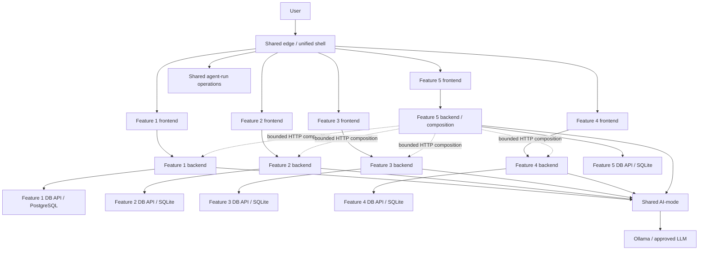

# PropertyScope NSW — executive repository and product audit

## 1. Decision

**Keep the engineering foundation. Rebuild the shared/product presentation layer. Refactor—not
replace—Feature 1's frontend.**

The repository is not generally “slop.” It is closer to the opposite problem: a serious and often
well-engineered platform that has accumulated a disproportionate amount of architecture prose and
backend sophistication before establishing a coherent, demonstrable five-feature product.

A full restart would discard the strongest assets—contracts, architecture guards, durable AI-mode,
Feature 1 services and tests—while increasing the chance of missing the assignment's explicit
microservice, CRUD, DevOps and release evidence. A selective restart targets the actual weaknesses:
the common shell, design system, frontend composition, cross-feature experience and documentation
signal-to-noise ratio.

## 2. Basis of review

This assessment is based on:

- the supplied ASD 2026 Project Specifications;
- the extracted repository at `41026ASDProject-main`;
- the existing PropertyScope product/architecture plan and Feature 1 implementation plan;
- source, workflow, contract, Docker and test files;
- static validation that could run in the isolated environment; and
- a full product prototype created as part of this redesign.

The specification makes the shared layer unusually important: the team must provide one integrated
application, a unified home page, a consistent theme, five independently owned frontend/backend/
database slices, AI interaction and progressively extended release architecture. This redesign is
organised around making those requirements visible rather than merely documented.

## 3. Quantitative snapshot

| Area | Observed size | Interpretation |
|---|---:|---|
| Shared landing page | 33 lines / 1.2 KB | Far too small to carry the integrated product and release story |
| Shared landing CSS | 82 lines / 1.2 KB | A theme sample, not a design system |
| Feature 1 main browser module | 1,351 lines / 86 KB | Functional but monolithic and costly to extend/test |
| Feature 1 CSS | 286 lines / 23 KB | Reasonable visual effort, isolated from common tokens |
| Shared AI operations browser module | 845 lines / 35.6 KB | Another substantial UI with a separate visual/component system |
| Main product plan | 2,035 lines / 125.7 KB | Strong thinking, too large to act as an implementation control document |
| Feature 1 implementation plan | 2,024 lines / 113.8 KB | Detailed, but competes with code and tests as the source of truth |
| All `docs/` content | 7,844 lines / 437.6 KB | High documentation burden for an early semester build |
| Features 2–5 non-placeholder content | 116 lines / 4.1 KB | Effectively unimplemented; no balanced integrated product yet |

The imbalance is clear: more than four thousand lines of plans define the product, while the shared
page that must communicate it consists of three links and a notice.

## 4. What is strong and should be retained

### 4.1 Architecture enforcement

`scripts/validate_architecture.py` is an unusually valuable asset. It encodes project rules rather
than relying on memory, including student-service separation, HTTP database boundaries, Docker
volume/secret constraints and common repository expectations. Preserve it and extend it as services
2–5 arrive.

### 4.2 Domain-neutral AI foundation

`ai-services/agent-core/` is decomposed into limits, state-machine, run, review, recovery, tool and
model abstractions with dedicated tests. Shared AI-mode has durable run evidence and a read-only
operations interface. This is a credible base for the required Plan → Act → Observe → Adapt story
and later planner/worker/reviewer orchestration.

### 4.3 Shared contracts and test utilities

`shared/contracts/` and `shared/testkit/` respect the correct boundary: cross-cutting protocol and
testing concerns are shared without centralising PropertyScope domain entities. That is exactly the
seam to preserve.

### 4.4 Feature 1 backend/data implementation

Feature 1 is materially implemented rather than scaffold-only:

- source and adapter configuration;
- bounded ingestion profiles and adapters;
- backend, database API and runner separation;
- PostgreSQL/PostGIS persistence and migrations;
- release manifests, artifacts, checksums and quality evidence;
- API contracts and tool catalogue;
- deterministic fixture paths; and
- component, contract and unit tests.

This is the highest-risk code to rewrite and the lowest-value place to restart.

### 4.5 Operational discipline

The repository has Docker profiles, health checks, resource limits, persistent volumes, workflows,
request IDs, idempotency concepts and explicit cloud/local differences. The project already thinks
about failure and evidence—an excellent match for the proposed product identity.

## 5. What is weak or risky

### 5.1 The integrated product is not visible

The current shared page exposes only Property Discovery, Data Operations and AI-mode operations.
Features 2–5 are represented by a sentence. A marker or first-time user cannot see the intended
property-research journey, ownership split, release runway or common system quality from the home
page.

### 5.2 There is no executable design system

Colours and components are recreated separately in:

- `shared/frontend/styles.css`;
- `student-1/frontend/styles.css`; and
- `shared/frontend/operations/ai-mode/styles.css`.

This creates immediate drift and makes “consistent CSS theme” a visual claim rather than a governed
implementation. The redesign introduces explicit tokens, base rules and components.

### 5.3 Feature 1's frontend has become a single change hotspot

`student-1/frontend/app.js` renders every route, dialog, form, table, polling loop and workflow in
one file. It is not inherently bad code, but its size makes Feature 1 harder to review, test and
extend across releases. It also encourages a bespoke JavaScript SPA despite the specified HTMX
stack.

The target is not a framework rewrite. It is a decomposition into route modules, reusable view
primitives, HTMX fragments for server-owned data and small JavaScript islands for maps, charts,
polling and complex dialogs.

### 5.4 The AI operations UI is visually and structurally separate

The AI-mode dashboard is a real operational surface, but its large independent code and stylesheet
risk making it feel like a different product. It should consume the same tokens, evidence badges,
status vocabulary and layout primitives while retaining domain-neutral ownership.

### 5.5 Documentation is acting as a parallel implementation

The existing plans contain many strong decisions, but their size makes it difficult to distinguish:

- approved requirements;
- proposed options;
- current implementation;
- deferred scope; and
- evidence of completion.

The redesign preserves the source plans and adds shorter control documents: screen inventory, API
mapping, release matrix, definition of done and migration plan. New code should be verified by tests
and contracts, not by continually expanding prose.

### 5.6 Features 2–5 are only plans

This is acceptable at the present moment, but it is the project's largest delivery risk. Each
student ultimately needs a real frontend, backend, database, CRUD workflow, ten records per table,
AI interaction, Docker container and CI evidence. The prototype solves product ambiguity, not
implementation ownership.

## 6. Preserve / refactor / replace / defer matrix

| Asset | Decision | Reason |
|---|---|---|
| `ai-services/agent-core` | Preserve | Good domain-neutral seam, tested and release-extensible |
| `ai-services/ai-mode` | Preserve, visually align | Required shared runtime; operations UI should adopt common tokens |
| `shared/contracts` | Preserve | Correct protocol ownership |
| `shared/testkit` | Preserve | Correct reusable test boundary |
| `scripts/validate_architecture.py` | Preserve and extend | Converts architectural intentions into executable controls |
| Docker topology and workflows | Preserve, incrementally extend | Strong assessment evidence and hard-won integration work |
| Feature 1 backend/database/runner | Preserve | Substantial, credible implementation |
| Feature 1 OpenAPI and tool catalogue | Preserve as contract source | Existing clients/tests depend on them |
| Feature 1 frontend information architecture | Refactor | Useful capability, but navigation and composition should align to the new system |
| Feature 1 frontend module structure | Replace incrementally | 1,351-line module is a maintainability bottleneck |
| Shared landing page | Replace | Does not satisfy the intended integrated product role |
| Shared CSS | Replace with design system | Current file is not a reusable system |
| AI operations visual styles | Migrate gradually | Avoid a risky one-shot rewrite of a working operational client |
| Existing long-form plans | Preserve as source archive | Valuable reasoning and attribution; stop treating as day-to-day backlog |
| Features 2–5 runtime services | Defer implementation, freeze contracts now | Prevent premature shared-domain coupling while eliminating product ambiguity |

## 7. Recommended target architecture

Feature 1 may publish governed artifacts to consumer import paths, but no consumer receives Feature
1 database credentials or reads its runtime tables. Feature 5 owns cross-feature dossier composition;
AI-mode remains a domain-neutral orchestrator rather than a hidden sixth product backend.

## 8. Highest-value work order

1. Land the shared design tokens and new unified shell.
2. Freeze five feature names, owners, CRUD aggregates, API namespaces and release capability flags.
3. Refactor Feature 1 frontend route-by-route without changing backend contracts.
4. Make one thin vertical slice for each of Features 2–5 before adding rich data.
5. Align AI-mode operations styling and evidence vocabulary.
6. Implement one deterministic integrated dossier journey and one deliberate missing-data/failure
   journey.
7. Add MCP/RAG only after ordinary CRUD and direct service operation are demonstrably independent
   of those optional services.
8. Add local multi-agent review and cloud capability gating in Release 2.

## 9. Full-rewrite risk assessment

| Full-rewrite risk | Likelihood | Impact |
|---|---:|---:|
| Lose existing architecture/test evidence | High | High |
| Break working Feature 1 contracts | High | High |
| Spend time rebuilding infrastructure rather than five CRUD slices | High | High |
| Reduce individual contribution traceability | Medium | High |
| Miss release deadlines while polishing a new framework | High | High |
| Produce a visually better but architecturally non-compliant monolith | Medium | Critical |

A full restart is justified only if the current Feature 1 backend cannot be run or understood by its
owner after a bounded handover. The inspected code and passing static checks do not support that
conclusion.

## 10. Final assessment

PropertyScope already has the bones of a high-mark engineering project. The redesign turns those
bones into a product a marker can understand in the first thirty seconds and a team can implement
without collapsing independent ownership. The standard to aim for is not “more architecture.” It is
**visible evidence that every architecture decision improves a real user journey, a failure state or
an assessment criterion.**
