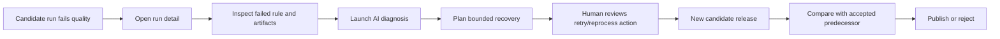

# PropertyScope NSW — product and UX blueprint

## 1. Product definition

### Product promise

**PropertyScope NSW is an evidence-first property research workspace that helps a buyer organise
what is known, what is missing and what should be verified next.**

It combines property identity, source provenance, recorded market evidence, suburb context,
site/building observations and a human-reviewed research dossier. It does not estimate value,
certify compliance, rank neighbourhood safety or recommend whether to buy.

### One-sentence marker explanation

> Search a curated NSW property, inspect source-linked evidence across five independently owned
> services, then use a reviewable agent workflow to assemble a dossier and follow-up questions
> without inventing certainty.

### Primary users

| User | Need | Product response |
|---|---|---|
| Prospective home buyer | Bring scattered public evidence into one research workflow | Property view, shortlist, dossier and follow-ups |
| Evidence-conscious investor | Understand recorded history and context without an opaque score | Market cases, trend methodology and coverage |
| Data/platform operator | Know which source release is accepted and why a candidate failed | Sources, jobs, runs, quality and release review |
| Team demonstrator/marker | See five feature boundaries, AI evidence and release compliance | Unified shell, feature labels, agent timeline, system/release status |

### Non-goals

- automated valuation models or “fair value” estimates;
- investment, lending, conveyancing, planning, engineering or insurance advice;
- “safe suburb,” “good school,” desirability or protected-trait inference;
- scraping commercial listing portals;
- claiming source completeness where only a curated footprint is supported;
- allowing a model to execute unreviewed publication, messaging, booking, offer or negotiation
  actions; and
- hiding unavailable, stale, partial or conflicting evidence behind a single confidence score.

## 2. Experience principles

### 2.1 Evidence before interpretation

Every substantive fact must expose enough of its evidence envelope to answer:

- Where did this come from?
- Which release/effective date applies?
- What geographic/entity match was used?
- Is coverage observed, partial, unavailable, stale or failed?
- Was the value calculated deterministically, supplied by the user or generated by AI?

Interpretation is visually subordinate to evidence and never overwrites it.

### 2.2 Unknown is a useful answer

The product must distinguish at least four presentation states:

| State | Meaning | Typical treatment |
|---|---|---|
| Confirmed / observed | Supported by an accepted source observation | Teal badge, source/date visible |
| Partial / requires verification | Some evidence exists but coverage or interpretation is incomplete | Amber badge, gap and next action |
| Conflicting | Two relevant sources/versions disagree | Coral badge, both records shown, human review required |
| Unknown / unavailable | No supported observation for the request | Neutral badge, never rendered as zero/false |

Domain-specific states can extend this vocabulary—such as `intersects`, `nearby`, `not_covered`,
`source_failed`, `stale`—but should map back to one of these understandable user states.

### 2.3 Progressive disclosure

The first screen answers “what matters now?”; detail screens answer “show me exactly why.”

- Cards summarise status and next action.
- Drawers/detail panels expose lineage, method, identifiers and raw bounded evidence.
- Tables remain available for charts and maps.
- Agent trace is accessible without dominating the buyer-facing report.

### 2.4 Deterministic core, optional intelligence

Search, CRUD, recorded calculations and evidence retrieval must work when the LLM provider, MCP, RAG or the
multi-agent service is unavailable. AI adds explanation, planning, review and gap detection. It is
not the only path to basic functionality.

### 2.5 Human ownership of consequential output

Draft reports, proposed retries/publications and generated follow-up tasks carry an explicit review
state. The UI makes approval a deliberate action with a visible before/after summary rather than an
implicit side effect of “Generate.”

### 2.6 Curated depth over fake statewide breadth

Release 0 should make a small set of properties and localities excellent. Search clearly indicates
the supported footprint. Empty data is not filled with generic AI prose.

## 3. Information architecture

### 3.1 Global shell

The shared shell owns only product-neutral navigation and status language:

```text
PropertyScope NSW
├── Home
├── Explore properties
├── Property research
├── Evidence ledger
├── Agent runs
├── System status
├── Release roadmap
├── Feature 1 · Data platform & discovery
├── Feature 2 · Market intelligence
├── Feature 3 · Suburb context
├── Feature 4 · Site due diligence
└── Feature 5 · Buyer workspace
```

Feature-specific sub-navigation lives in that feature's independently built frontend. The shared
shell may display a feature's configured/implemented/planned state, but does not fetch or combine its
domain data.

### 3.2 Feature navigation

**Feature 1**

```text
Overview · Sources · Jobs · Runs · Releases · Quality · Artifacts · Coverage · Discovery · AI diagnosis
```

**Feature 2**

```text
Market cases · Property history · Comparables · Suburb trends · Methodology · AI explanation
```

**Feature 3**

```text
Saved comparisons · Suburb overview · Crime trends · Schools/places · Methodology · AI explanation
```

**Feature 4**

```text
Site reviews · Constraint map · Planning facts · Building/strata evidence · Coverage · AI question pack
```

**Feature 5**

```text
Buyer profiles · Watchlist · Shortlist · Dossiers · Follow-ups · Report history · Human review
```

## 4. Core screen model

Every substantial screen should contain a predictable sequence:

1. **Context header** — owner/feature, page title, task description, primary action.
2. **Evidence/release metadata** — accepted release, freshness, coverage, user-supplied status.
3. **Primary task area** — table, form, map, comparison, report or run timeline.
4. **Method/limitations** — concise by default, expandable detail.
5. **Next action** — edit, compare, diagnose, verify, review or return.
6. **Operational trace** — request/run/evidence IDs where relevant.

This consistency matters more than making every feature visually identical. Market charts and site
maps can differ; evidence state, forms, tables, badges, focus and error behavior should not.

## 5. Golden user journeys

### 5.1 Buyer research journey

```mermaid
flowchart LR
  A[Search address] --> B[Confirm canonical property]
  B --> C[Review property evidence summary]
  C --> D[Add to buyer workspace]
  D --> E[Compare market, suburb and site evidence]
  E --> F[Build dossier objective]
  F --> G[Agent retrieves bounded evidence]
  G --> H[Reviewer checks citations and gaps]
  H --> I[Human approves / requests changes]
  I --> J[Create stakeholder follow-up tasks]
  J --> K[Print or revisit dossier]
```



**Critical UX moment:** a missing flood observation remains “not assessed for this supported
release,” not “no flood risk.” The report converts that gap into a conveyancer/council question.

Storyboard: `../design-assets/storyboards/01-buyer-research-journey.jpg`.

### 5.2 Data release diagnosis and recovery



**Critical UX moment:** the accepted release remains live while the candidate is failed. Service
health, run status and data readiness are separate visual concepts.

Storyboard: `../design-assets/storyboards/02-data-release-recovery.jpg`.

### 5.3 Grounded answer journey — Release 1

1. User asks a bounded question from a feature screen.
2. The feature backend builds an objective and context budget.
3. Structured facts are requested through feature-owned MCP tools.
4. RAG retrieves approved methodology/document passages.
5. The response returns evidence IDs, document citations, grounding state and unassessed criteria.
6. The user can open each citation and inspect the exact supporting record/chunk.
7. Conflicts or insufficient evidence route to human review rather than being silently reconciled.

### 5.4 Multi-agent review journey — Release 2 local

1. Planner decomposes a dossier into bounded evidence questions.
2. Worker retrieves approved evidence and drafts sections.
3. Reviewer checks numeric consistency, citation coverage, prohibited conclusions and gaps.
4. Human reviews the reviewer findings and chooses approve, revise or reject.
5. Protected persistence occurs only after approval.

In cloud mode, the UI replaces this with a simpler AI-mode summary because MCP, RAG and multi-agent
services are intentionally disabled. Capability labels must be derived from configuration, not from
optimistic copy.

## 6. Content and language system

### Use

- “recorded sale evidence”
- “supported source coverage”
- “no supported record found”
- “not assessed in this release”
- “asking price supplied by user”
- “straight-line distance”
- “requires professional verification”
- “insufficient evidence to answer”
- “observed change over the selected period”

### Avoid

- “safe / unsafe suburb”
- “good / bad school”
- “fair price / undervalued / overvalued”
- “no flood risk” when the actual state is no observation or no intersection in a partial layer
- “AI verified”
- “real-time” unless the refresh and source contract support it
- “official PropertyScope data” without distinguishing upstream publisher from platform release
- causal explanations for recorded crime/market changes without evidence

### Source attribution pattern

```text
Recorded crime count: 18
Source: NSW BOCSAR · Release 2026.05.1
Period: Jan–Dec 2025 · Geography: suburb
Coverage: 12/12 months · Measure: recorded count
```

### AI output pattern

```text
Grounding: Partially grounded
Supported: 4 observations · 2 methodology passages
Unassessed: current flood certificate, unapproved works, insurance availability
Review required: Yes
```

## 7. Search and property identity

Search is not merely a text box. It is a controlled identity workflow:

1. Query is bounded by state/support footprint.
2. Results show canonical display address, locality, property reference and match status.
3. Unit/alias ambiguity is visible.
4. User confirms a candidate before a dossier or cross-feature request.
5. Other services store the opaque `property_ref`; they do not parse G-NAF identifiers or assume a
   legal parcel/title relationship.

An unresolved user-entered address may still be saved to a workspace, but it is clearly excluded
from evidence requests that require a confirmed property identity.

## 8. Map and chart behavior

### Maps

- No live tile dependency is required for the showcase.
- A neutral background and local overlays must remain understandable when tiles fail.
- Maps have list/table alternatives and keyboard-accessible result cards.
- Layer legend includes owner, source, effective date and coverage meaning.
- The browser receives only bounded/simplified geometry.
- Colour is reinforced by icon, pattern, label or line style.

### Charts

- Same-period and same-measure validation occurs before comparison.
- Count/rate controls cannot silently mix measures.
- Zero and missing values are visually distinct.
- Tooltip values also appear in a table or accessible description.
- Sample size, exclusions and methodology sit adjacent to market charts.
- Charts never imply forecast unless forecasting is explicitly implemented and approved.

## 9. Empty, loading and failure states

| State | Required behavior |
|---|---|
| Initial loading | Skeleton preserving layout; meaningful `aria-busy` text |
| Empty user collection | Explain why empty and offer create action |
| No source evidence | Return a valid empty evidence state, not a generic error |
| Partial dependency failure | Preserve successful sections and show which provider failed |
| LLM provider unavailable | Keep CRUD/read views available; disable AI action with recovery guidance |
| MCP/RAG disabled | Hide/label grounded-answer controls; do not show broken buttons |
| Stale accepted release | Show age/effective date and allow investigation; do not call it current |
| Candidate failed | Accepted predecessor remains prominent and untouched |
| Version conflict | Explain that the record changed; offer reload/compare rather than overwrite |
| Permission/review gate | Explain action, proposed mutation and approver responsibility |

## 10. Responsive model

### Desktop

- Persistent top bar and feature rail.
- Two- or three-column evidence composition.
- Tables, chart + methodology, map + list split view.
- Detail drawers where context can remain visible.

### Tablet

- Collapsible rail.
- Two-column cards where possible.
- Tables use priority columns plus detail drill-in.
- Map/list can switch tabs.

### Mobile

- Single-column task flow.
- Navigation is an overlay with focus management.
- List-to-detail drill-in instead of squeezed split panes.
- Primary action remains reachable without relying on hover.
- Dense technical metadata moves into labelled disclosure sections.
- Print/report view is separate from mobile editing.

Storyboard: `../design-assets/storyboards/05-responsive-mobile-storyboard.jpg`.

## 11. Accessibility requirements

- WCAG-conscious contrast using semantic tokens rather than ad hoc colours.
- Skip links and one logical `h1` per route.
- Keyboard-complete CRUD, filter, dialog, review and navigation flows.
- Visible focus on every interactive control.
- Form labels, descriptions and inline error associations.
- Native dialogs only with correct focus return; otherwise implement an accessible modal pattern.
- `aria-live` for mutations and run progress without flooding announcements.
- Status never communicated by colour alone.
- Tables or text alternatives for every chart/map.
- Reduced-motion support and no essential information in animation.
- Touch targets generally at least 42 × 42 CSS pixels.

## 12. Performance targets

For the curated local footprint:

- shell HTML/CSS interactive without a framework bootstrap;
- initial shared shell transfer under roughly 200 KB excluding screenshots/prototype;
- normal read p95 under 1 second locally;
- search p95 under 500 ms;
- route-specific JavaScript loaded only where required;
- bounded tables with server pagination/filtering;
- no statewide geometry or full source payload in the browser;
- polling uses adaptive cadence, aborts and visibility awareness; and
- model latency is represented as durable phases rather than a frozen spinner.

## 13. Product success criteria

The redesign is successful when a new viewer can answer these questions without reading the
architecture documents:

1. What problem does PropertyScope solve?
2. Which five features exist and who owns each domain?
3. Which capability is implemented now versus planned for later releases?
4. Where did a displayed fact come from and how current/complete is it?
5. What happens when evidence or a dependency is missing?
6. What did the agent plan, call, observe and adapt?
7. Which action requires human review?
8. Why is the application useful without pretending to provide professional advice?
