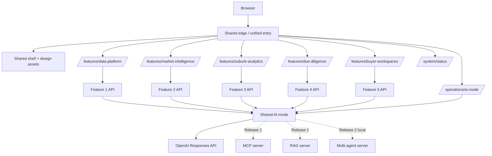

# Shared platform redesign

## 1. Objective

Turn the current shared directory from a navigation placeholder into a coherent, release-aware
product shell and design-system source while preserving strict feature ownership.

The shared layer should make the integrated application feel like one product. It should not become
a shared PropertyScope backend, database or cross-feature business-logic package.

## 2. Current state

### Existing strengths

- `shared/contracts` contains domain-neutral API/run contracts.
- `shared/testkit` contains reusable testing support.
- `shared/frontend/operations/ai-mode/` is a substantive read-only run evidence interface.
- `shared/configuration` provides team configuration conventions.
- the repository architecture validator already protects shared/feature boundaries.

### Existing gaps

- `shared/frontend/index.html` is only 33 lines and exposes three links.
- `shared/frontend/styles.css` is a small landing-page style, not a reusable system.
- there is no common component/token layer used by Feature 1 and AI-mode operations.
- there is no visible five-feature or three-release product story.
- current links use a Feature 1 `/operations` path that does not match the hash routes implemented
  by the frontend.
- there is no neutral capability model separating configured, implemented, enabled, ready and data
  accepted states.

## 3. Boundary rule

Use this test before adding anything to `shared/`:

> Would the component still make sense if the application were about museums, repairs or films?

Shared is appropriate for:

- edge routing and unified navigation;
- CSS tokens and domain-neutral components;
- request/correlation IDs and Problem Details;
- health/readiness conventions;
- agent run/event/review/tool-result contracts;
- AI-mode orchestration and operations UI;
- MCP/RAG protocol infrastructure in Release 1;
- planner/worker/reviewer orchestration infrastructure in Release 2;
- common test helpers and architecture checks; and
- capability/release configuration.

Shared is not appropriate for:

- `property_ref` matching rules;
- sale/comparable calculations;
- crime/liveability interpretation;
- site constraint intersection rules;
- buyer profiles/dossiers/follow-ups;
- combined property report composition; or
- a shared runtime property-data database.

## 4. Target shared architecture



The unified edge may initially be a small Nginx/Flask static container or a clearly documented local
entry page. The exact edge technology matters less than stable same-origin paths and honest service
states.

## 5. Unified shell specification

### Header

- PropertyScope wordmark and non-government descriptor;
- global property search that forwards to Feature 1 rather than implementing search itself;
- links to agent runs, release roadmap and system status;
- optional user/avatar placeholder only if authentication is actually in scope; otherwise label it
  as a prototype/non-functional element or omit it.

### Release/capability strip

Displays concise, configuration-derived facts such as:

```text
Release 0 · Local mode · AI-mode enabled · MCP/RAG disabled · Accepted data as of 12 Aug 2026
```

Do not infer “healthy” solely from the static shell. Readiness belongs to a real status endpoint or
feature link. A static page may say `configured`, `implemented`, `planned` or `not checked`.

### Home content

- clear product promise and address search;
- five task-oriented feature cards;
- Feature 1 marked implemented/priority;
- Features 2–5 marked planned until their services exist;
- shared operational cards for agent runs, data readiness and design/documentation;
- Release 0/1/2 roadmap;
- independent/non-government and professional-verification disclaimer.

### Footer

- product name and course context;
- source/decision-support disclaimer;
- prototype/design docs links; and
- no false privacy/auth/legal claims.

Reference implementation: `../repo-overlay/shared/frontend/`.

## 6. Design-system distribution

### Release 0 recommendation: versioned static copy

Each feature remains independently buildable. To avoid a runtime dependency on the edge, copy a
versioned design-system snapshot into each feature image during build or maintain an approved copy in
each frontend.

Advantages:

- feature containers still run independently;
- no shared CDN/edge failure breaks feature styling;
- CI can compare checksums/version metadata; and
- adoption is easy with plain HTML/HTMX.

### Later option: edge-served assets

Once the unified edge is part of every local/cloud test, feature pages may load:

```text
/assets/propertyscope-design-system/v0.2/tokens.css
/assets/propertyscope-design-system/v0.2/base.css
/assets/propertyscope-design-system/v0.2/components.css
```

Use immutable version paths and keep a local fallback in feature images. Do not use a mutable
`latest.css` in assessed builds.

## 7. Capability model

Create a domain-neutral endpoint or static configuration with these distinct concepts:

```json
{
  "release": "release-0",
  "deployment_mode": "local",
  "features": {
    "data-platform": { "implemented": true, "enabled": true, "href": "/features/data-platform/" },
    "market-intelligence": { "implemented": false, "enabled": false },
    "suburb-analytics": { "implemented": false, "enabled": false },
    "due-diligence": { "implemented": false, "enabled": false },
    "buyer-workspaces": { "implemented": false, "enabled": false }
  },
  "services": {
    "ai-mode": { "implemented": true, "enabled": true },
    "mcp": { "implemented": false, "enabled": false },
    "rag": { "implemented": false, "enabled": false },
    "multi-agent": { "implemented": false, "enabled": false }
  }
}
```

`implemented` means code exists. `enabled` means it is intended to run in this deployment. A separate
readiness response reports current health. Feature-specific data readiness is separate again—for
example, Feature 3 may be healthy while its crime release is stale.

### UI rules

| Condition | UI behavior |
|---|---|
| Not implemented | Planned card, no live-route button |
| Implemented but disabled by release/mode | Explain capability gate, link roadmap |
| Enabled but not ready | Show dependency unavailable and recovery/status link |
| Ready, but no accepted data | Feature works for CRUD; evidence views show unavailable/empty |
| Ready with stale/partial data | Feature opens; freshness/coverage is prominent |

## 8. Shared system status

The system status screen should aggregate only operational summaries, not domain data:

- edge and five frontend services;
- five backend APIs;
- five database APIs/stores;
- AI-mode and the remote LLM provider;
- MCP/RAG/multi-agent capability flags and readiness;
- deployment mode/release;
- last checked timestamp and request ID; and
- links to feature-owned data readiness pages.

A recommended contract:

```json
{
  "checked_at": "2026-08-15T00:14:30Z",
  "release": "release-0",
  "deployment_mode": "local",
  "overall": "degraded",
  "components": [
    {
      "id": "feature-1-api",
      "kind": "backend",
      "owner": "student-1",
      "enabled": true,
      "readiness": "ready",
      "latency_ms": 18,
      "detail_url": "/features/data-platform/#overview"
    }
  ]
}
```

The aggregator uses short timeouts and reports partial results. It does not block the shell from
rendering.

## 9. Agent-run operations alignment

Retain the existing AI-mode operations client, but migrate it incrementally:

1. import or copy the common token file;
2. map run states to the shared badge vocabulary;
3. adopt the common header/brand and evidence item styles;
4. preserve current safe rendering, polling and viewport behavior;
5. expose feature label, objective, prompt/model/tool versions and review state in the same language
   used by feature screens; and
6. link back to the originating feature entity/run when a safe URL is present.

Do not merge AI-mode operations into Feature 5 or Feature 1. It remains a shared, domain-neutral
observability tool.

## 10. Proposed repository shape

```text
shared/
├── contracts/
├── testkit/
├── configuration/
└── frontend/
    ├── index.html
    ├── app.js
    ├── styles.css
    ├── design-system/
    │   ├── tokens.css
    │   ├── base.css
    │   ├── components.css
    │   └── CHANGELOG.md
    ├── icons/
    │   └── symbols.svg
    └── operations/
        └── ai-mode/

docs/
├── design/
│   ├── 00-executive-audit.md
│   ├── 01-product-ux-blueprint.md
│   ├── 02-design-system.md
│   └── ...
└── prototype/
    └── propertyscope-v2/
```

## 11. Edge routing plan

Stable desired paths:

```text
/                                      shared home
/features/data-platform/               Feature 1 frontend
/features/market-intelligence/         Feature 2 frontend
/features/suburb-analytics/             Feature 3 frontend
/features/due-diligence/               Feature 4 frontend
/features/buyer-workspaces/            Feature 5 frontend
/operations/ai-mode/                   shared run evidence
/system/status/                        shared status
/api/data-platform/v1/                 Feature 1 API
/api/market-intelligence/v1/           Feature 2 API
/api/suburb-analytics/v1/              Feature 3 API
/api/due-diligence/v1/                 Feature 4 API
/api/buyer-workspaces/v1/              Feature 5 API
/api/ai-mode/v1/                       shared AI-mode API
```

During the transition, the shared shell uses the current local ports/hash routes. The supplied
`app.js` supports a `window.PROPERTYSCOPE_CONFIG` override so the same HTML can move behind an edge
without hard-coded rewrites.

## 12. Shared contract additions worth considering

Only after team review:

- `EvidenceMetadata` — source, release, effective/observed dates, coverage, freshness and match;
- `CapabilityManifest` — release/deployment/implemented/enabled URLs;
- `ComponentReadiness` — product-neutral status response;
- `PageInfo` — bounded pagination contract; and
- shared status vocabulary/mapping.

Do not place property, sale, suburb, crime, constraint, buyer or dossier entities into
`shared-contracts`.

## 13. Security and privacy

- Render all untrusted values as text; no direct `innerHTML` from API/model/source content.
- Use same-origin APIs through the edge where possible.
- No credentials, database URLs or internal service names in browser config.
- Capability and readiness responses expose only safe metadata.
- CSP should eventually restrict scripts/styles/connect/connect-src to known origins.
- Agent run detail must remain redacted and bounded.
- The shell collects no personal data; Feature 5 minimises free text and excludes identity/financial
  documents.

## 14. Testing

### Static shell

- HTML smoke test and keyboard navigation;
- configuration override tests;
- property search forwarding/encoding;
- planned-feature control behavior;
- viewport screenshots at desktop/tablet/mobile;
- no console/page errors; and
- link checker for current local and edge paths.

### Design system

- visual regression for button/badge/card/form/table states;
- contrast checks for semantic states;
- reduced-motion behavior;
- no one-off colour values in feature composition files except documented chart palettes; and
- version/checksum reported in each feature build.

### Status/capability

- timeout and partial result behavior;
- release 0 local, release 1 local, release 2 local and release 2 cloud fixtures;
- implemented-disabled distinction;
- no feature card becomes “healthy” solely because its frontend serves HTML; and
- shell remains usable when status API is unavailable.

## 15. Migration sequence

1. Add token/base/component files and the new static shell without changing Feature 1.
2. Add configurable links and validate current local routes.
3. Copy the prototype and design documents into `docs/`.
4. Introduce a design-system version marker.
5. Migrate Feature 1 colours/spacing/components route-by-route.
6. Migrate AI-mode operations tokens without altering polling/data behavior.
7. Add shared edge/capability/status only when Compose ownership and routing are agreed.
8. Activate Feature 2–5 cards as each frontend has a real health/readiness path.

## 16. Definition of done

The shared redesign is complete when:

- the home page visibly represents all five features and all three release stages;
- only implemented/enabled feature links are actionable;
- current Feature 1 and AI-mode links are correct;
- all shared screens use the common token and evidence-state vocabulary;
- the shell is keyboard- and mobile-usable;
- no domain data or composition logic exists in shared code;
- each feature remains independently buildable and demonstrable;
- capability/status failure does not break navigation;
- screenshots and storyboards match the implemented shell direction; and
- architecture validation still passes.
