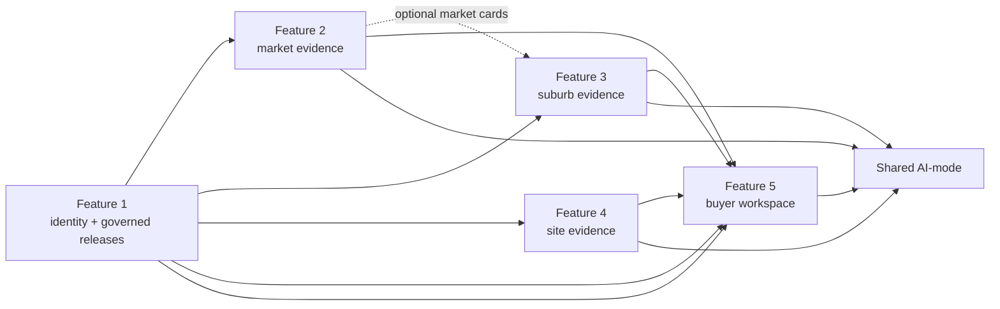

# Features 2–5 — full product and implementation scope

## 1. Purpose of this document

Features 2–5 are not implemented in the supplied repository. They should remain independently owned
and persisted rather than being prematurely folded into Feature 1 or a shared database. This
document freezes a balanced, full-release scope so each owner can build a thin compliant vertical
slice first and then deepen it without changing the integrated product model.

All proposed routes use the existing architecture plan's namespaces:

```text
Feature 2  /features/market-intelligence/   /api/market-intelligence/v1/
Feature 3  /features/suburb-analytics/      /api/suburb-analytics/v1/
Feature 4  /features/due-diligence/          /api/due-diligence/v1/
Feature 5  /features/buyer-workspaces/       /api/buyer-workspaces/v1/
```

## 2. Cross-feature rules

1. Each feature owns one frontend, one backend/API, one database API/store, one Dockerfile/service set,
   migrations/seeds, CRUD aggregate, AI action, workflow and evidence.
2. Every production table receives at least ten deterministic seed records under the team's approved
   interpretation.
3. Feature services communicate over published HTTP APIs only; they never import another student's
   Python package or access another database/volume/credentials.
4. Feature 1 owns canonical `property_ref`, release publication and source-aligned acquisition.
5. Consumer feature owners define their product semantics, schema, import acceptance and calculations.
6. Feature 5 owns cross-feature dossier composition; shared AI-mode does not become a product backend.
7. Direct CRUD and deterministic reads work without the LLM provider/MCP/RAG/multi-agent services.
8. Source-backed evidence is immutable/superseded where appropriate; assessed CRUD is prominent on
   legitimate user-owned work records.
9. Every AI response returns evidence/tool references, limitations and review state.
10. Cloud capability follows Release 2 rules: basic AI-mode only; MCP, RAG and multi-agent disabled.

## 3. Dependency graph



Keep calls acyclic in ordinary runtime. Feature 2–4 may validate property identity through Feature 1.
Feature 3 may call Feature 2 only for optional market cards, not as a hard dependency. Feature 5
composes partial results with short timeouts and does not call itself through AI-mode.

---

# Feature 2 — Sales and Market Intelligence

## 4. Product purpose

Own recorded sale evidence and deterministic market calculations around a verified property or
suburb. It explains what the selected records show and why records were included/excluded. It does
not estimate value, forecast price or declare a property under/overvalued.

## 5. Primary user stories

- As a buyer, I can see attributed sale history for a confirmed property.
- As a buyer, I can distinguish contract/settlement dates and sale record classes.
- As a researcher, I can create a market case with a bounded time window and comparable filters.
- As a researcher, I can inspect the stable comparable selection method, sample size and exclusions.
- As a researcher, I can view suburb period trends and transaction volume.
- As a user, I can ask AI to explain only the selected evidence and explicitly say when the sample is
  insufficient.

## 6. Owned data model

### `sale_observation`

```text
id TEXT PK
property_ref TEXT
source_record_id TEXT
contract_date TEXT NULL
settlement_date TEXT NULL
sale_price_aud INTEGER NULL
sale_class TEXT
property_type TEXT NULL
locality TEXT
state TEXT
match_method TEXT
match_confidence TEXT
source_release TEXT
coverage_status TEXT
effective_date TEXT NULL
source_metadata_json TEXT
created_at TEXT
```

Imported source evidence; ordinary users do not edit official sale facts. Controlled fixture/admin
replacement may exist for tests.

### `market_case` — primary CRUD aggregate

```text
id TEXT PK
name TEXT
property_ref TEXT NULL
state TEXT
locality TEXT NULL
from_date TEXT
to_date TEXT
property_type_filter TEXT NULL
sale_class_filters_json TEXT
radius_m INTEGER NULL
comparable_limit INTEGER
notes TEXT
status TEXT
agent_run_id TEXT NULL
created_at TEXT
updated_at TEXT
version INTEGER
```

### Optional `cpi_factor`

Use only if inflation-adjusted charts are actually demonstrated and the factor source/period is
clear. Do not add it solely to make the schema look complex.

## 7. Frontend screens

### Market cases

List/create/update/delete saved analysis cases. Each row shows property/suburb, period, sample size,
status and last update. Empty state offers a bounded case template.

Prototype: `../prototype/propertyscope-v2/standalone.html#/market-cases`.

### Market case detail

- verified property identity from Feature 1;
- recorded sale timeline/table;
- comparable distribution and selected records;
- suburb trend/volume chart;
- filters and methodology drawer;
- source/release/effective date;
- sample/exclusion summary;
- user notes/status; and
- AI evidence explanation.

Prototype: `../prototype/propertyscope-v2/standalone.html#/market-detail`.

### Required states

- no recorded sales for verified property;
- insufficient comparable sample;
- sale price withheld/unavailable;
- ambiguous property reference rejected/needs confirmation;
- Feature 1 temporarily unavailable but saved case remains editable;
- source release stale/partial; and
- AI unavailable while deterministic calculations remain.

## 8. Backend API

Relative to `/api/market-intelligence/v1`:

| Method | Path | Purpose |
|---|---|---|
| GET | `/properties/{property_ref}/sales` | Attributed ordered sale history |
| GET | `/properties/{property_ref}/comparables` | Deterministic bounded comparable selection |
| GET | `/suburbs/{state}/{locality}/market-summary` | Current summary with sample/method |
| GET | `/suburbs/{state}/{locality}/market-timeseries` | Bounded chart series |
| GET/POST | `/market-cases` | List/create cases |
| GET/PUT/DELETE | `/market-cases/{id}` | Detail/update/delete |
| POST | `/market-cases/{id}/agent-runs` | Start bounded explanation |

Comparable requests must expose the applied filters, stable ordering and exclusions. Use `422` for
invalid windows/limits and a valid empty result for insufficient evidence.

## 9. Deterministic calculations

- median/quantiles over explicitly included valid records;
- nominal percentage change with start/end/sample shown;
- transaction count/volume by period;
- distance only when coordinates/method are available;
- stable comparable ordering using declared keys;
- optional CPI adjustment only with versioned factor; and
- no model-generated arithmetic.

Every calculation has unit tests for null prices, duplicate records, date boundaries, sample size and
ordering.

## 10. AI capability

### Objective

> Explain the selected recorded sale history and asking-price context. State record classes, sample
> size, excluded records and methodological limits. Do not estimate value or advise whether to buy.

### Tools

- `market.property_history.v1`
- `market.comparables.v1`
- `market.suburb_snapshot.v1`
- `market.case_inspect.v1`
- optional review-gated `market.case_save_summary.v1`

### Release progression

- **R0:** direct AI-mode explanation of structured deterministic evidence.
- **R1:** MCP tools plus RAG methodology/data dictionary; exact citations and insufficient-evidence
  handling.
- **R2 local:** planner/worker/reviewer can check consistency between figures and narrative.
- **R2 cloud:** basic AI-mode summary only; no MCP/RAG/multi-agent assumption.

## 11. Acceptance evidence

- full `market_case` CRUD with ten-plus seed cases/table policy;
- sale-date/class cleaning and exclusion tests;
- stable comparable ordering;
- median/change/CPI tests if applicable;
- insufficient-sample UI and API state;
- AI response contains evidence IDs and no valuation/advice claims;
- independent container/database API/workflow; and
- consumer contract tests for Feature 1 identity/release input.

---

# Feature 3 — Suburb, Crime and Liveability Analytics

## 12. Product purpose

Own factual locality/place context, selected BOCSAR-derived crime time series and saved comparisons.
It gives the user controls to inspect recorded counts/rates over the same period without ranking
suburb safety, desirability or social worth.

## 13. Primary user stories

- As a buyer, I can compare two or more supported suburbs over the same period and measure.
- As a user, I can switch between recorded count and a supported published/calculated rate without
  mixing them.
- As a user, I can distinguish recorded zero from missing/unavailable data.
- As a user, I can inspect nearby schools/places and straight-line distance with a catchment caveat.
- As a user, I can save/update/delete a suburb comparison and my practical priorities.
- As a user, I can ask AI for a neutral trend description grounded in selected observations.

## 14. Owned data model

### `place_observation`

```text
id TEXT PK
place_type TEXT
name TEXT
state TEXT
locality TEXT
latitude REAL
longitude REAL
attributes_json TEXT
source_record_id TEXT
source_release TEXT
coverage_status TEXT
source_metadata_json TEXT
created_at TEXT
```

### `area_observation`

```text
id TEXT PK
state TEXT
locality TEXT
metric_key TEXT
period_start TEXT
period_end TEXT
value REAL NULL
unit TEXT
zero_missing_state TEXT
source_release TEXT
coverage_status TEXT
source_metadata_json TEXT
created_at TEXT
```

### `crime_series`

```text
id TEXT PK
geography_kind TEXT
state TEXT
geography_value TEXT
offence TEXT
subcategory TEXT NULL
month TEXT
count_value INTEGER NULL
rate_value REAL NULL
denominator REAL NULL
measure_source TEXT
zero_missing_state TEXT
source_release TEXT
coverage_status TEXT
source_metadata_json TEXT
created_at TEXT
```

### `suburb_comparison` — primary CRUD aggregate

```text
id TEXT PK
name TEXT
localities_json TEXT
from_month TEXT
to_month TEXT
selected_offences_json TEXT
measure TEXT
selected_indicators_json TEXT
priorities_json TEXT
notes TEXT
status TEXT
agent_run_id TEXT NULL
created_at TEXT
updated_at TEXT
version INTEGER
```

## 15. Frontend screens

### Saved comparison / suburb comparison

- comparison selector for supported state+locality identities;
- same-period/category/measure controls;
- summary cards with absolute and percentage change;
- schools/places map and list;
- practical context indicators with source notes;
- source freshness/coverage drawer;
- save/update/delete comparison; and
- AI trend explanation.

Prototype: `../prototype/propertyscope-v2/standalone.html#/suburb-comparison`.

### Crime trends

- selected offence/category;
- period and count/rate toggle;
- multi-series chart plus accessible data table;
- visible missing versus zero markers;
- denominator/methodology/source release;
- revision/freshness notice; and
- no “safe” score or causal explanation.

Prototype: `../prototype/propertyscope-v2/standalone.html#/crime-trends`.

### Required states

- selected locality not supported;
- offence category changed between releases;
- count available but denominator/rate unavailable;
- recorded zero in one month versus missing month;
- incomparable period/measure blocked;
- school proximity available but catchment unknown;
- Feature 2 optional market card unavailable; and
- AI disabled without breaking comparison CRUD/charts.

## 16. Backend API

Relative to `/api/suburb-analytics/v1`:

| Method | Path | Purpose |
|---|---|---|
| GET | `/suburbs/{state}/{locality}` | Factual summary/coverage |
| GET | `/suburbs/{state}/{locality}/places?type=&limit=` | Supported places |
| GET | `/properties/{property_ref}/nearby-places?radius_m=` | Deterministic nearby query |
| GET | `/suburbs/{state}/{locality}/crime-series?offence=&from=&to=&measure=` | Bounded series |
| GET | `/crime/compare?localities=&offences=&from=&to=&measure=` | Same-period comparison |
| GET | `/crime/methodology` | Geography/category/denominator metadata |
| GET | `/suburbs/{state}/{locality}/area-series?metric=` | Other selected indicators |
| GET/POST | `/suburb-comparisons` | List/create comparisons |
| GET/PUT/DELETE | `/suburb-comparisons/{id}` | Detail/update/delete |
| POST | `/suburb-comparisons/{id}/agent-runs` | Start grounded explanation |

Validate state+locality together; never use locality name alone as a durable identity.

## 17. Responsible analytics rules

- validate same geography kind, period and measure before comparison;
- show absolute counts and denominators where relevant;
- label calculated versus source-published rates;
- preserve source revisions/releases;
- do not infer crime causes from correlation or trend;
- do not describe a suburb as safe/unsafe or good/bad;
- do not use SEIFA or place data as a proxy for protected traits/desirability;
- school proximity is not catchment/eligibility; and
- data gaps produce neutral verification language.

## 18. AI capability

### Objective

> Compare the selected recorded offence trends for the chosen suburbs over the same period. Clearly
> distinguish counts from rates, cite periods/releases, state zero/missing data and describe
> observations without claiming causes, predicting crime or ranking safety.

### Tools

- `suburb.snapshot.v1`
- `crime.series.v1`
- `crime.compare.v1`
- `crime.methodology.v1`
- `neighbourhood.nearby_places.v1`
- `suburb.comparison_inspect.v1`
- optional review-gated `suburb.comparison_update_notes.v1`

### Release progression

- **R0:** structured series/comparison and neutral AI summary.
- **R1:** MCP tools plus approved methodology/source documents through RAG.
- **R2 local:** reviewer checks measure/period/citation and prohibited language.
- **R2 cloud:** deterministic comparison + basic AI-mode summary using cloud fixtures.

## 19. Acceptance evidence

- `suburb_comparison` CRUD and deterministic seeds;
- same-period/geography/measure validation;
- count/rate and denominator tests;
- zero versus missing tests and visuals;
- category filtering/revision behavior;
- nearby distance labelled straight-line;
- accessible chart table;
- AI prohibited-language/evidence tests; and
- independent service/container/workflow and Feature 1 release acceptance contract.

---

# Feature 4 — Site, Planning and Building Due Diligence

## 20. Product purpose

Own selected property-level constraints and public building/strata evidence for curated properties.
It organises observations and verification questions; it does not certify compliance, risk, title or
fitness for purchase.

## 21. Primary user stories

- As a buyer, I can create a site review for a confirmed property.
- As a buyer, I can inspect selected planning/environmental layers with source/effective date.
- As a buyer, I can distinguish intersection, non-intersection, partial coverage and unavailable data.
- As a buyer, I can see selected strata/building/tribunal observations with match confidence.
- As a buyer, I can track checklist items, notes, disposition and reviewer comments.
- As a buyer, I can ask AI to draft questions for a conveyancer, council or qualified inspector.

## 22. Owned data model

### `constraint_observation`

```text
id TEXT PK
property_ref TEXT
evidence_type TEXT
result_state TEXT
coverage_status TEXT
distance_m REAL NULL
geometry_ref TEXT NULL
effective_date TEXT NULL
source_record_id TEXT NULL
source_release TEXT
match_method TEXT
match_confidence TEXT
source_metadata_json TEXT
created_at TEXT
```

### `building_observation`

```text
id TEXT PK
property_ref TEXT
observation_type TEXT
plan_number TEXT NULL
event_date TEXT NULL
summary TEXT
coverage_status TEXT
match_method TEXT
match_confidence TEXT
source_record_id TEXT NULL
source_release TEXT
source_metadata_json TEXT
created_at TEXT
```

### `site_review` — primary CRUD aggregate

```text
id TEXT PK
name TEXT
property_ref TEXT
checklist_json TEXT
questions_json TEXT
disposition TEXT
reviewer_notes TEXT
status TEXT
agent_run_id TEXT NULL
created_at TEXT
updated_at TEXT
version INTEGER
```

## 23. Frontend screens

### Site reviews

List/create/update/delete reviews with property identity, attention items, owner/status and last
update.

Prototype: `../prototype/propertyscope-v2/standalone.html#/site-reviews`.

### Site review detail

- canonical property header;
- source-aware layer map and list alternative;
- planning fact cards;
- constraint/coverage matrix;
- strata/building event timeline;
- match method/confidence;
- editable checklist/questions/disposition/reviewer notes;
- AI due-diligence question pack; and
- add approved questions to Feature 5 follow-ups through its public API, not its database.

Prototype: `../prototype/propertyscope-v2/standalone.html#/site-detail`.

### Required states

| State | Meaning |
|---|---|
| `intersects` | Property point/bounded geometry intersects the supported layer |
| `does_not_intersect` | Supported layer was assessed and no intersection found |
| `nearby` | Supported distance relation, not intersection |
| `not_covered` | Property/geography outside the loaded layer footprint |
| `unknown` | Evidence could not establish an outcome |
| `source_failed` | Retrieval/import failed; not a negative result |

These states must never collapse into a green/red “risk” score.

## 24. Backend API

Relative to `/api/due-diligence/v1`:

| Method | Path | Purpose |
|---|---|---|
| GET | `/properties/{property_ref}/constraints` | Evidence and coverage states |
| GET | `/properties/{property_ref}/layers.geojson?types=` | Bounded simplified geometry |
| GET | `/properties/{property_ref}/building-evidence` | Strata/building/tribunal evidence |
| GET | `/strata/{plan_number}` | Scheme summary where supported |
| GET/POST | `/site-reviews` | List/create reviews |
| GET/PUT/DELETE | `/site-reviews/{id}` | Detail/update/delete |
| POST | `/site-reviews/{id}/agent-runs` | Start due-diligence explanation |

Geometry endpoints apply strict type/viewport/feature limits and never return statewide raw layers.

## 25. AI capability

### Objective

> Explain the recorded planning, site and building evidence. Distinguish non-intersection from
> unavailable coverage and draft questions for qualified verification. Do not certify safety,
> compliance, insurability or legal status.

### Tools

- `site.constraints.v1`
- `site.layer_coverage.v1`
- `building.evidence.v1`
- `site.review_inspect.v1`
- optional review-gated `site.review_update.v1`

### Release progression

- **R0:** structured selected observations + review CRUD + question pack.
- **R1:** MCP facts plus RAG over approved planning definitions, council methodology and team-authored
  limitations; citations remain exact.
- **R2 local:** reviewer checks coverage language and prohibited certification.
- **R2 cloud:** curated deterministic site evidence + basic AI-mode only.

## 26. Acceptance evidence

- `site_review` CRUD and deterministic seeds;
- intersection/non-intersection/unknown/not-covered tests;
- geometry bounds/simplification tests;
- match confidence and provenance;
- no-certification language tests;
- source-failure treatment;
- map table/list alternative; and
- independent service/container/workflow plus Feature 1 identity/release contract tests.

---

# Feature 5 — Buyer Journey and Agent Workspace

## 27. Product purpose

Own buyer intent, watchlists, shortlist comparison, dossier/report lifecycle, follow-up tasks, human
review and bounded cross-feature composition. It is an evidence-organising assistant, not a licensed
buyer's agent and not an autonomous external actor.

## 28. Primary user stories

- As a buyer, I can create/edit/delete a simple research profile and practical priorities.
- As a buyer, I can save a verified or unresolved candidate with user-supplied asking price/source.
- As a buyer, I can compare two-to-four candidates without reducing them to one opaque score.
- As a buyer, I can build a dossier objective and select evidence sections.
- As a buyer, I can watch a durable agent timeline and receive partial results if a provider fails.
- As a reviewer, I can approve, reject or request changes to a source-linked draft.
- As a buyer, I can create/edit/delete stakeholder follow-up tasks linked to evidence gaps.
- As a buyer, I can print a reviewed HTML dossier.

## 29. Owned data model

### `buyer_profile`

```text
id TEXT PK
name TEXT
intended_use TEXT
practical_priorities_json TEXT
notes TEXT
status TEXT
created_at TEXT
updated_at TEXT
version INTEGER
```

No identity documents, financial approval data or protected-trait profiling.

### `watchlist_entry`

```text
id TEXT PK
buyer_profile_id TEXT
property_ref TEXT NULL
entered_address TEXT NULL
asking_price_aud INTEGER NULL
source_url TEXT NULL
user_claims_json TEXT
notes TEXT
status TEXT
created_at TEXT
updated_at TEXT
version INTEGER
```

Asking price/listing text is always marked user-supplied unless a permitted authoritative source
exists.

### `follow_up_task`

```text
id TEXT PK
buyer_profile_id TEXT
dossier_id TEXT NULL
property_ref TEXT
stakeholder_type TEXT
action_text TEXT
rationale TEXT
due_date TEXT NULL
evidence_ids_json TEXT
status TEXT
notes TEXT
created_at TEXT
updated_at TEXT
version INTEGER
```

### `property_dossier`

```text
id TEXT PK
buyer_profile_id TEXT
title TEXT
property_refs_json TEXT
primary_property_ref TEXT
asking_price_aud INTEGER NULL
objective TEXT
report_sections_json TEXT
evidence_as_of TEXT
agent_run_id TEXT NULL
agent_prompt_set TEXT NULL
model_profile TEXT NULL
status TEXT
human_disposition TEXT NULL
reviewer_comment TEXT NULL
created_at TEXT
updated_at TEXT
version INTEGER
```

Optional `dossier_event` only if product history needs more than durable AI-mode run events.

## 30. Frontend screens

### Buyer workspace

Profile summary, saved properties, active dossiers, evidence gaps and next actions. Avoid a gamified
“readiness score”; show section-level evidence states.

Prototype: `../prototype/propertyscope-v2/standalone.html#/buyer-workspace`.

### Shortlist

Compare two-to-four properties across buyer priorities, recorded evidence states and open questions.
Personal fit may be user-authored; it does not override weak coverage.

Prototype: `../prototype/propertyscope-v2/standalone.html#/shortlist`.

### Dossier builder

Select property/profile, sections, deadline and objective. Preview what is deterministic, AI-assisted
and unassessed. Save draft separately from generation.

Prototype: `../prototype/propertyscope-v2/standalone.html#/dossier-builder`.

### Dossier run

Durable phases, tool calls, provider outcomes, adaptation and review gate. A provider failure creates
a partial section rather than failing the entire report where safe.

Prototype: `../prototype/propertyscope-v2/standalone.html#/dossier-run`.

### Dossier review/print

- evidence-as-of date and property identity;
- section completeness matrix;
- source-linked evidence and generated interpretation;
- reviewer findings and unassessed criteria;
- approve/request changes/reject;
- reviewer comment/version; and
- semantic print layout.

Prototype: `../prototype/propertyscope-v2/standalone.html#/dossier-review` and full-page capture.

### Follow-ups

Create/update/delete tasks grouped by selling agent, conveyancer, inspector, council, lender/broker,
insurer or school authority. AI may propose tasks; the user reviews/edits/approves. The system never
sends messages, books appointments, negotiates or makes an offer.

Prototype: `../prototype/propertyscope-v2/standalone.html#/follow-ups`.

## 31. Backend API

Relative to `/api/buyer-workspaces/v1`:

| Method | Path | Purpose |
|---|---|---|
| GET/POST | `/buyer-profiles` | List/create profiles |
| GET/PUT/DELETE | `/buyer-profiles/{id}` | Detail/update/delete |
| GET/POST | `/watchlist-entries` | List/create candidates |
| GET/PUT/DELETE | `/watchlist-entries/{id}` | Detail/update/archive/delete |
| POST | `/watchlist-entries/{id}/agent-runs` | Claim-to-evidence planning |
| GET/POST | `/follow-ups` | List/create tasks |
| GET/PUT/DELETE | `/follow-ups/{id}` | Detail/update/delete |
| GET/POST | `/dossiers` | List/create dossier drafts |
| GET/PUT/DELETE | `/dossiers/{id}` | Detail/update/delete permitted draft |
| GET | `/dossiers/{id}/comparison` | Deterministic comparison projection |
| POST | `/dossiers/{id}/agent-runs` | Start integrated report run |
| GET | `/dossiers/{id}/agent-runs/{run_id}` | Report-safe run projection |
| POST | `/dossiers/{id}/review` | Human disposition |
| GET | `/dossiers/{id}/question-guide?stakeholder=` | Bounded guide |
| POST | `/dossiers/{id}/follow-up-agent-runs` | Propose evidence-linked tasks |
| GET | `/dossiers/{id}/print` | Printable semantic HTML |

## 32. Composition behavior

Feature 5 calls Features 1–4 with:

- short connect/read timeouts;
- propagated `X-Request-ID`, `traceparent` and `X-Agent-Run-ID`;
- bounded concurrency;
- per-provider result states;
- cached/durable evidence references where approved;
- no direct database calls; and
- no assumption that all providers succeed.

A canonical composition result:

```json
{
  "property_ref": "PS-NSW-...",
  "sections": {
    "identity": { "state": "complete", "provider": "feature-1", "evidence_ids": ["..."] },
    "market": { "state": "complete", "provider": "feature-2", "evidence_ids": ["..."] },
    "suburb": { "state": "partial", "provider": "feature-3", "unassessed": ["rate denominator"] },
    "site": { "state": "dependency_failed", "provider": "feature-4", "retryable": true }
  }
}
```

The model receives the structured section result, not unrestricted upstream payloads.

## 33. AI capability

### Objective

> Assemble a source-linked purchase research dossier for the confirmed property and buyer profile.
> Retrieve only selected sections, state missing/stale/conflicting evidence, avoid valuation or
> professional conclusions, draft verification questions and pause before saving or creating tasks.

### Tools

- `dossier.property_evidence.v1`
- `dossier.market_evidence.v1`
- `dossier.neighbourhood_evidence.v1`
- `dossier.site_building_evidence.v1`
- `followup.inspect.v1`
- review-gated `dossier.save_draft.v1`
- review-gated `followup.create_tasks.v1`

### Release progression

- **R0:** one integrated AI-mode run using all four providers, durable Plan/Act/Observe/Adapt and
  human-reviewed report save.
- **R1:** MCP discovery/tool calls plus RAG methodology/context, resolvable citations and explicit
  grounding status.
- **R2 local:** planner/worker/reviewer/human workflow with numeric/citation/prohibited-output checks.
- **R2 cloud:** direct provider APIs, CRUD, deterministic comparison and basic AI-mode summary;
  grounded/multi-agent controls disabled.

## 34. Acceptance evidence

- full profile/watchlist/follow-up/dossier CRUD;
- asking-price/user claim labels;
- two-to-four candidate deterministic comparison;
- four-provider composition with partial failure;
- evidence IDs preserved into report and tasks;
- durable run/review state and idempotent save;
- print layout and version/history;
- no external side effects;
- ordinary workspace usable without the LLM provider; and
- independent database API/container/workflow plus provider contract tests.

---

# 35. Balanced owner workload

| Feature | Main technical challenge | Guard against imbalance |
|---|---|---|
| 2 Market | cleaning/methodology/calculations/charts | Keep data footprint bounded; owner contributes comparable contract tests |
| 3 Suburb | large series, zero/missing/rate ethics | Limit categories/localities; make comparison tests a core deliverable |
| 4 Site | geospatial coverage and careful claims | Curate properties/layers; avoid broad DA/parcel scope until proven |
| 5 Buyer | orchestration, state and report UX | Providers own section contracts/fixtures; Feature 5 does not clean all domains |

Feature 1 must not absorb every import/semantic task. Each consumer owner specifies its release
schema and acceptance tests, imports into its own store and owns calculations/presentation.

## 36. Thin vertical slice required before rich scope

Each Feature 2–5 owner should first deliver:

```text
1 CRUD table + 10 deterministic rows
1 database API
1 backend API
1 list/create/edit/delete frontend flow
1 read-only evidence endpoint
1 AI-mode action using a fake client in tests
1 Dockerfile/service set
1 student workflow
1 health/readiness path
1 shared-shell link marked implemented
```

Only after all four slices work together should owners add larger extracts, charts, maps, RAG corpora
or multi-agent behavior.

## 37. Cross-feature integrated definition of done

- every feature has a visible, legitimate CRUD aggregate;
- all services run from one Compose configuration;
- all five frontends use the same design-system version and evidence vocabulary;
- Feature 1 publishes bounded governed releases; consumers accept/import independently;
- one verified property can be used across all feature APIs via opaque `property_ref`;
- Feature 5 composes all four providers and survives one provider failure;
- every feature exposes one distinct AI interaction and its own tool/corpus contribution;
- a grounded Release 1 answer has structured and document citations;
- a local Release 2 dossier shows planner/worker/reviewer/human roles;
- cloud mode visibly disables unsupported services; and
- each student has clear commits, workflow evidence, tests, screenshots and demonstration time.
