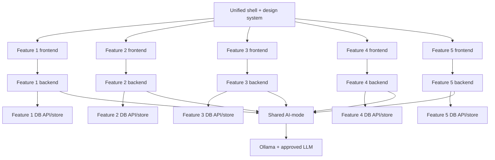
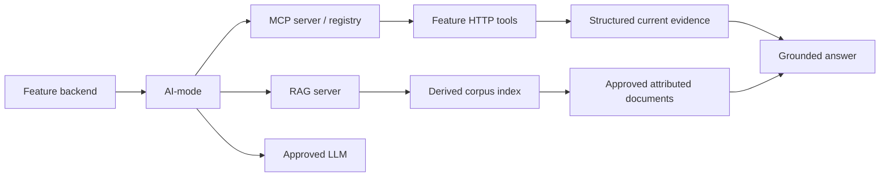
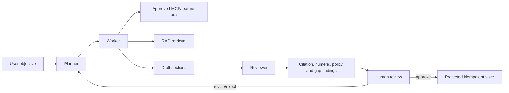

# Release roadmap and assessment alignment

## 1. Strategy

Design the product, contracts and capability states for all releases now, but implement them in the
order required by the project specification. “Support for all releases” means the repository and UI
can extend without structural rewrites; it does not mean showing MCP/RAG/multi-agent features as live
before their assessed release.

The strongest assessment strategy is a narrow, deterministic and polished vertical story with
traceable evidence for every student—not a broad demo that depends on live internet, uncontrolled
model behavior or statewide data.

## 2. Specification-to-product matrix

| Specification requirement | PropertyScope implementation/evidence |
|---|---|
| One integrated Agentic AI application | Unified shell, five feature cards/routes and shared AI-mode |
| Five frontend/backend/database microservice sets | One independently owned set per feature |
| CRUD per feature | Source/job/release; market case; suburb comparison; site review; buyer profile/watchlist/follow-up/dossier |
| Minimum ten records per table | Deterministic idempotent seed/migration tests for every owned production table |
| Approved open-source LLM through Ollama | Shared AI-mode model profiles and durable run metadata |
| Frontend → backend → Ollama → LLM | One distinct action from each feature frontend through its backend/AI-mode |
| Plan → Act → Observe → Adapt | Failed data-release recovery and integrated dossier journeys |
| Unified `index.html` and common CSS | New shared shell and design-system overlay |
| Docker/Compose | Existing topology extended with Features 2–5 and later AI services |
| Five student workflows | Path-filtered build/test/contract/container workflows |
| Release 1 MCP/RAG | Shared infrastructure, one tool/corpus/grounded interaction per feature |
| Release 2 multi-agent | Local planner/worker/reviewer/human workflow |
| Release 2 cloud | Integrated app with AI-mode; MCP/RAG/multi-agent disabled visibly |
| Testing evidence | Unit, DB, API, frontend, contract, architecture and golden-path tests |
| Technical-report screenshots | 38-view prototype plus implementation captures per release |

## 3. Release 0 — Agentic AI Foundation, Microservices and DevOps

### Required architecture



### Feature minimums

| Feature | CRUD | Deterministic read | AI action | Showcase moment |
|---|---|---|---|---|
| 1 Data | source/job/release | property search/coverage/run evidence | diagnose failed release | review recovery and accepted predecessor |
| 2 Market | market case | sale history/comparables/trend | explain selected market evidence | show sample/exclusions and no valuation |
| 3 Suburb | suburb comparison | crime/place series | neutral trend explanation | toggle count/rate and zero/missing |
| 4 Site | site review | constraints/building evidence | verification question pack | distinguish not-covered from no intersection |
| 5 Buyer | profile/watchlist/follow-up/dossier | cross-feature comparison | integrated dossier | human review and task creation |

### Release 0 product capability

- all direct CRUD and deterministic evidence remain usable without Ollama;
- each feature has one distinct AI objective and tool set;
- shared run operations show durable events and terminal state;
- at least one integrated dossier uses all features;
- at least one workflow deliberately adapts to missing/failed evidence;
- Feature 1 accepted data remains stable through candidate failure; and
- five workflows plus integration/architecture checks are green.

### Release 0 implementation order

1. Shared shell/design tokens and feature contract freeze.
2. Five thin CRUD/database/backend/frontend slices.
3. Five fake-client AI actions and tool catalogues.
4. Bounded evidence import/read endpoints.
5. Integrated dossier composition and durable agent run.
6. Failure/unknown/review states.
7. Compose/workflow/architecture hardening.
8. Accessibility, responsive and visual polish.
9. Evidence capture and timed showcase rehearsal.

## 4. Release 1 — MCP, RAG and Intelligent Agent Integration

### Architectural extension



### Division of responsibility

| Layer | Owns |
|---|---|
| Feature owner | narrow MCP capability, API tool behavior, domain corpus and acceptance/evaluation cases |
| Shared MCP | protocol gateway, registry, transport, auth/correlation and capability discovery |
| Shared RAG | extraction/index/retrieval, chunk metadata, filters and safe citation resolution |
| AI-mode | bounded orchestration, context budget, model call, run evidence and review |
| Human reviewer | conflict/insufficient-evidence disposition and protected writes |

### Structured tools versus documents

- Numeric/current property facts normally come from feature tools.
- RAG explains definitions, methodology, policy and limitations.
- A document never silently overrides an accepted structured observation.
- Conflicts display both source versions and force review.
- Retrieved text is untrusted and cannot expand tool permissions or alter system instructions.

### Per-feature Release 1 contribution

| Feature | MCP | RAG corpus | Grounded interaction |
|---|---|---|---|
| 1 | property/source/release/coverage tools | source methods, schemas, coverage and licence notes | “What data supports this property and what is missing?” |
| 2 | history/comparables/summary tools | market data dictionary and calculation methodology | explain selected market evidence and exclusions |
| 3 | crime/places/methodology tools | category/geography/denominator docs | compare selected trends with exact caveats |
| 4 | constraints/coverage/building tools | approved planning/layer definitions and limitations | explain observations and draft verification questions |
| 5 | dossier/follow-up composition tools | report methodology and stakeholder guides | answer dossier question with cross-feature citations |

### Grounding contract

Every grounded response returns:

```text
structured evidence IDs
RAG chunk/document citations
source title/publisher/effective date/URL where safe
answer grounding status: grounded | partially_grounded | insufficient_evidence
unassessed requested criteria
model, prompt, retrieval and corpus versions
tool/retrieval trace references
```

### Minimum Release 1 evaluation per feature

1. supported question with correct tool and document citations;
2. unanswerable question returns insufficient evidence;
3. stale/superseded document filtered or labelled;
4. conflicting tool/document evidence surfaced;
5. retrieved prompt injection ignored;
6. citation resolves to exact supporting passage;
7. MCP/RAG timeout returns partial result; and
8. ordinary CRUD works with MCP/RAG disabled.

## 5. Release 2 — Multi-Agent Systems, Testing and Cloud Deployment

### Local architecture



### Agent roles

- **Planner:** decomposes into bounded questions and chooses allowed capabilities.
- **Worker:** retrieves evidence and drafts; cannot persist protected output independently.
- **Reviewer:** checks citations, numeric consistency, source/release state, prohibited language and
  unassessed criteria.
- **Human:** approves any consequential persistence or follows up on unresolved evidence.

### Cloud architecture/capability

The cloud deployment must remain useful with:

```text
Enabled: frontends, backends, databases, AI-mode, Ollama/approved LLM
Disabled: MCP, RAG, multi-agent
```

The shell and feature frontends read a capability manifest and hide/disable grounded/multi-agent
controls. Cloud screenshots should prove the application degrades deliberately rather than failing.

### Release 2 testing

- pre-commit `pytest`/static/architecture tests per student;
- post-commit AI-assisted test generation/review evidence without treating generated tests as
  automatically correct;
- deterministic model/tool fakes in CI;
- local live-model evaluation kept separate from deterministic pass/fail gates;
- cloud deployment workflow after all individual workflows; and
- health, smoke, CRUD and capability-gating checks against deployed URLs.

## 6. Proposed semester backlog

Dates should be aligned to the team's actual teaching calendar; the sequence below is the control
plan.

### Foundation sprint

- confirm tutor approval and feature owners;
- lock names, routes, CRUD aggregates and data footprint;
- land shared design system/shell;
- make Feature 1 current tests reproducible on team machines; and
- create one contract/fixture directory per Feature 2–5.

### Five-slice sprint

- create one table + ten seeds per feature;
- CRUD API + HTMX frontend;
- health/readiness;
- Docker and workflow;
- fake AI-mode client action; and
- activate shell card only after route works.

### Integration sprint

- publish/accept bounded Feature 1 data products;
- implement consumer calculations/read screens;
- cross-feature contract tests;
- integrated dossier partial-results composition; and
- genuine agent trace/review.

### Release 0 hardening sprint

- failure/empty/AI-unavailable states;
- responsive/accessibility;
- one-command Compose;
- architecture/contract/workflow evidence;
- screenshots/report diagrams; and
- ten-minute video rehearsal.

### Release 1 sprint

- shared MCP/RAG services and contracts;
- per-feature tool/corpus ownership;
- grounded-answer UI;
- security/evaluation cases; and
- updated Compose/workflows/report evidence.

### Release 2 sprint

- planner/worker/reviewer/human flow;
- pre/post testing automation;
- cloud capability configuration;
- integrated deployment workflow;
- cloud smoke/CRUD/AI-mode checks; and
- final report/video/evidence archive.

## 7. Assessment evidence matrix

| Evidence item | Owner | Capture method | Release(s) |
|---|---|---|---|
| Unified home and consistent theme | Group/shared owner | screenshot + browser test | 0–2 |
| Five feature allocations/descriptions | Group + individuals | registration/report table | 0 |
| Individual frontend/backend/database architecture | Each student | Mermaid/diagram + code paths | 0–2 |
| CRUD operation matrix | Each student | tests + UI screenshots/video | 0–2 |
| Ten records/table | Each student | seed/migration test output | 0–2 |
| AI frontend→backend→AI-mode→Ollama | Each student | run trace/request IDs | 0–2 |
| Plan→Act→Observe→Adapt | Group + Feature 1/5 | durable event timeline | 0–2 |
| Docker Compose | Group | `docker compose ps`, health and logs | 0–2 |
| Five workflows | Each student | GitHub Actions run URLs/screenshots | 0–2 |
| MCP request/response | Each student | tool discovery/call trace | 1–2 |
| RAG retrieval/citations | Each student | retrieved chunks and answer | 1–2 |
| Multi-agent roles/review | Group + Feature 5 | run timeline/reviewer findings | 2 |
| Pre/post testing | Each student | command/workflow artifacts | 2 |
| Cloud deployment | Group | deployment URL, health/smoke evidence | 2 |
| Contribution/commit logs | Each student | Git history/report appendix | 0–2 |
| Known limitations | Group/individual | explicit report section and UI states | 0–2 |

Create an `evidence/` or report appendix index that maps each rubric row to a durable path/URL. Do not
collect screenshots in the final week without naming conventions.

## 8. Definition-of-done matrix by feature

| Check | F1 | F2 | F3 | F4 | F5 |
|---|:---:|:---:|:---:|:---:|:---:|
| Frontend container | ✓ | ✓ | ✓ | ✓ | ✓ |
| Backend API container | ✓ | ✓ | ✓ | ✓ | ✓ |
| Database API/store container | ✓ | ✓ | ✓ | ✓ | ✓ |
| Visible CRUD | source/job/release | market case | comparison | site review | profile/watchlist/follow-up/dossier |
| 10+ deterministic rows/table | ✓ | ✓ | ✓ | ✓ | ✓ |
| Direct read/insight | property/coverage | sale/market | crime/places | constraints/building | comparison/report |
| Distinct AI action | diagnosis | market explanation | trend explanation | question pack | dossier |
| Fake-model CI | ✓ | ✓ | ✓ | ✓ | ✓ |
| Workflow | student-1 | student-2 | student-3 | student-4 | student-5 |
| MCP capability R1 | ✓ | ✓ | ✓ | ✓ | ✓ |
| RAG corpus R1 | ✓ | ✓ | ✓ | ✓ | ✓ |
| Multi-agent contribution R2 | evidence provider | evidence provider | evidence provider | evidence provider | composition/review |
| Cloud CRUD/AI-mode R2 | ✓ | ✓ | ✓ | ✓ | ✓ |

## 9. Ten-minute showcase storyboard

| Time | Owner/action | Visible evidence |
|---:|---|---|
| 0:00–0:30 | Group: shared home/product promise | five features, release state, disclaimer |
| 0:30–1:45 | Student 1 | source/release CRUD, failed run, AI recovery, property discovery |
| 1:45–2:45 | Student 2 | market case CRUD, history/comparables, sample caveat, AI explanation |
| 2:45–3:50 | Student 3 | comparison CRUD, crime chart, count/rate + zero/missing, AI explanation |
| 3:50–4:50 | Student 4 | site review CRUD, layer/coverage distinction, AI question pack |
| 4:50–6:25 | Student 5 | profile/watchlist/dossier CRUD and integrated run |
| 6:25–7:20 | Group | Plan/Act/Observe/Adapt, partial evidence, human approval |
| 7:20–8:00 | Group | final report/follow-ups/print or deliberate recovery state |
| 8:00–8:45 | Individuals | five workflow/test evidence highlights |
| 8:45–9:30 | Group | Compose/architecture/deployment |
| 9:30–10:00 | Group | limitations and next release capability |

Pre-warm Ollama and keep a stored deterministic successful trace available. The recorded trace is a
fallback for model latency, not a fabricated substitute for having successfully run the live path
before recording.

## 10. Highest-value polish order

1. Consistent evidence/freshness/coverage badges.
2. Beautiful source-linked dossier and print view.
3. Synchronized local map/chart/table with deterministic fixture data.
4. Understandable agent tool/phase timeline and human review.
5. Deliberate unknown/partial/conflicting evidence states.
6. Responsive/accessibility and convincing seeded CRUD.
7. Only then: animation, broad geographic scope or complex modelling.

## 11. Release risk register

| Risk | Control |
|---|---|
| Features 2–5 remain plans too long | Thin vertical slice gate before any rich Feature 1 expansion |
| Feature 1 absorbs all data work | Consumer schemas/acceptance/tests owned by each student |
| Live data/model breaks demo | Versioned bounded fixtures, model fakes and stored traces |
| UI implies future capability | Capability manifest and planned/disabled states |
| MCP/RAG adds complexity before CRUD works | Release gate and optional-service failure tests |
| Multi-agent becomes role-play prompts only | Separate durable agent roles, inputs/outputs and reviewer checks |
| Cloud cannot run local data stack | Curated cloud fixtures and explicit disabled services |
| AI invents evidence/advice | deterministic calculations, citations, prohibited-output tests and human review |
| Screenshots/report not traceable | evidence matrix and named capture automation |
| Full rewrite consumes semester | selective restart with contract-preserving frontend refactor |

## 12. Exit criteria

The project is on a full-mark trajectory when every rubric statement can be demonstrated from the
running application, tests, workflow or report without explaining away a missing surface. The
prototype and scope documents remove ambiguity; only implemented, integrated evidence earns the
mark.
