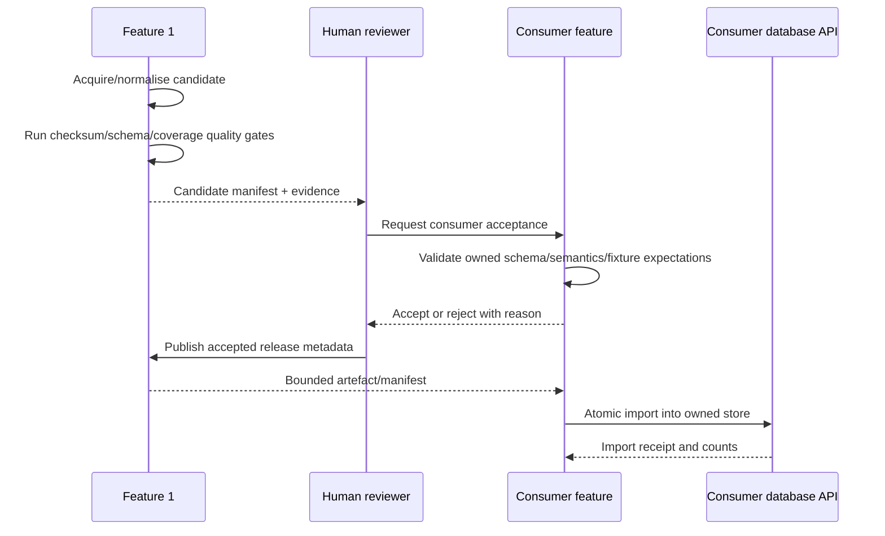

# Implementation and migration plan

## 1. Migration principle

Use a **strangler-style selective redesign**:

- introduce the new shared shell/design system alongside the working services;
- preserve existing API contracts and durable backend behavior;
- refactor Feature 1 browser routes in small reviewable slices;
- implement Features 2–5 as independent thin vertical services;
- activate navigation only after a route is genuinely available; and
- add Release 1/2 services behind explicit capability gates.

Do not combine a visual redesign, backend contract rewrite, database migration and framework change in
one pull request.

### Implementation checkpoint — 15 August 2026

- The shared shell now participates in the canonical root Compose and `scripts/dev.py` workflow as
  an independently built service; the temporary manual sidecar overlay has been retired.
- Feature 1 consumes shared design-system v0.1 assets and has extracted API, routing, formatting,
  forms, polling/generation guards, DOM/component primitives, Overview, Sources/Jobs, run planning,
  and Runs into focused modules without changing its backend contracts.
- Release/evidence/discovery/AI route extraction remains the next move-then-improve sequence; do not
  reintroduce cross-cutting behavior into `app.js` while completing it.

## 2. Repository branch strategy

Recommended branch/PR sequence:

```text
1 redesign/shared-shell-and-design-system
2 refactor/feature-1-frontend-foundations
3 refactor/feature-1-operations-routes
4 refactor/feature-1-discovery-routes
5 feature/student-2-market-thin-slice
6 feature/student-3-suburb-thin-slice
7 feature/student-4-site-thin-slice
8 feature/student-5-buyer-thin-slice
9 integration/release-0-golden-path
10 release-1/mcp-rag-foundation
11 release-2/multi-agent-cloud
```

Each student should own their feature branch/PR history. Shared changes require a group reviewer and
must avoid absorbing an individual's domain logic.

## 3. Phase 0 — baseline and safety

Before applying changes:

1. Commit or stash the current repository.
2. Record the current architecture/contract/frontend test output.
3. Confirm local Python/Docker/Ollama versions and `.env` handling.
4. Tag the baseline, for example `pre-propertyscope-redesign`.
5. Agree on feature owners and route/API names.
6. Keep the original long-form plans unchanged as source/attribution history.

Suggested commands:

```bash
git status
git add -A && git commit -m "chore: checkpoint before shared UX redesign"
git tag pre-propertyscope-redesign
python scripts/validate_architecture.py
python scripts/generate_contracts.py --check
node --test student-1/tests/frontend/core.test.mjs
```

Run the project's full documented quality gate on a connected development machine where `uv` can
resolve the pinned interpreter/dependencies.

## 4. Phase 1 — shared shell and design system

### Changes

- replace the minimal shared `index.html` and `styles.css`;
- add small `app.js` for configurable links/search and planned-feature feedback;
- add `design-system/tokens.css`, `base.css` and `components.css`;
- copy prototype/design documentation into `docs/`;
- retain the existing `operations/ai-mode/` implementation; and
- correct current Feature 1 hash links.

### Non-changes

- no Feature 1 API/backend/database changes;
- no new shared product database;
- no false Feature 2–5 routes;
- no health claims from static HTML; and
- no domain logic in shared JavaScript.

### Acceptance

- shell loads from file/static server;
- keyboard and mobile navigation work;
- property search forwards safely to Feature 1;
- current Feature 1 and AI-mode links are valid;
- future capabilities are labelled planned;
- architecture validation passes; and
- screenshots match the intended design direction.

## 5. Phase 2 — Feature 1 frontend foundations

### Refactor order

1. Extract API request/error handling from `core.js` without behavior changes.
2. Extract router/navigation and route parsing.
3. Extract formatting/status/evidence mapping.
4. Extract adaptive polling/generation guards.
5. Extract DOM components and dialogs.
6. Introduce shared design tokens and map existing classes to them.
7. Add route smoke tests before moving route implementations.

Use “move then improve”: first relocate code with tests green, then redesign layout/content in a
separate commit.

### Suggested commits

```text
refactor(feature-1): extract api and problem-details client
refactor(feature-1): isolate hash router and polling policy
refactor(feature-1): extract shared table form and dialog primitives
style(feature-1): adopt PropertyScope design tokens
```

## 6. Phase 3 — Feature 1 route redesign

Recommended route sequence based on risk:

1. Overview — presentation-only, establishes new layout.
2. Sources — ordinary CRUD.
3. Jobs and run plan — bounded form behavior.
4. Runs and run detail — polling/state complexity.
5. Releases and review — consequential state transitions.
6. Quality/artifacts/coverage — evidence primitives.
7. Discovery/property detail — maps/search/identity.
8. AI diagnosis — shared AI-mode integration/review.

For each route:

- implement success/loading/empty/error/partial states;
- keep API contract unchanged unless a separately reviewed contract gap is proven;
- add browser/DOM tests for the route;
- capture a desktop and mobile screenshot; and
- update the screen/API mapping.

## 7. Phase 4 — Features 2–5 thin slices

Do these in parallel, but use one shared template/checklist rather than one shared domain package.

### Per-feature first PR

```text
student-N/
├── feature.yaml
├── Dockerfile
├── pyproject.toml
├── contracts/<feature>-api.v1.openapi.yaml
├── frontend/
├── backend/
├── database/
├── tests/
└── tool-catalog.yaml
```

Minimum behavior:

- one user-owned CRUD aggregate;
- migration + ten deterministic seed rows;
- database API and public backend API;
- list/create/edit/delete HTMX/browser flow;
- one read-only evidence endpoint;
- one AI action with fake AI-mode client tests;
- health/readiness;
- Docker services and path-filtered workflow; and
- shared shell card activated only after integration.

### Avoid

- importing Feature 1 repositories/models;
- receiving Feature 1 DB URL/volume;
- putting all source records in a shared data volume;
- implementing rich charts before CRUD/tests/containers work; and
- using AI prose as a substitute for deterministic calculations.

## 8. Phase 5 — data publication and integration

### Publication flow



The consumer's database remains its runtime source of truth. Feature 1 is the governed publication
control plane, not a query service for all features.

### Integration tests

- provider contract fixtures for success/empty/partial/error;
- consumer acceptance rejects schema/checksum/semantic drift;
- no direct database access;
- request IDs/traces propagate;
- short timeout and partial-results behavior; and
- one property can be resolved and queried across all features.

## 9. Phase 6 — integrated dossier

Feature 5 implements composition only after providers publish stable contracts.

### Build order

1. buyer profile/watchlist/dossier CRUD;
2. deterministic provider client with fake fixtures;
3. partial section result model;
4. comparison projection;
5. AI-mode objective/tool registration;
6. durable run/progress UI;
7. human review and idempotent save;
8. follow-up task proposals and CRUD; and
9. print view.

The golden-path CI uses fake model/tool behavior. A live Ollama evaluation is additional evidence.

## 10. Phase 7 — Release 1 extension

- add shared MCP/RAG services and protocol contracts;
- register one narrow capability per feature;
- establish corpus metadata/licence/attribution policy;
- implement grounded response contract and UI;
- add prompt-injection, stale, conflict, insufficient-evidence and timeout tests;
- keep services optional for ordinary CRUD; and
- update Compose/workflows/docs/screenshots.

Do not dump all project documents into one unowned corpus. Each feature owns and evaluates its
approved documents; the shared RAG service owns extraction/index/retrieval mechanics.

## 11. Phase 8 — Release 2 extension

- implement planner/worker/reviewer interfaces and durable role outputs;
- make Feature 5 the primary integrated orchestration use case;
- implement human review of reviewer findings;
- add pre-commit and post-commit test evidence;
- add cloud capability configuration and UI gating;
- deploy integrated app; and
- run cloud smoke, CRUD, AI-mode and disabled-service tests.

Cloud deployment should use bounded fixtures and avoid copying the full local data profile.

## 12. Safe apply tooling supplied

### Apply script

`../scripts/apply_redesign.py` supports:

```text
--mode docs-only     Copy design/product docs and prototype only
--mode shared-shell  Replace/add shared shell and design-system files
--mode all           Apply both
--dry-run            Print operations without changing the target
--restore <path>     Restore files from a generated backup directory
```

The script:

- verifies `README.md`, `shared/frontend` and `student-1` exist;
- refuses to treat the redesign pack itself as a target;
- creates `.propertyscope-redesign-backup/<timestamp>/`;
- records added files so restore can remove them;
- backs up replaced files preserving relative paths;
- never overwrites Feature 1 backend/database/runner files; and
- prints the backup/restore command.

### Git patch

`../patches/propertyscope-shared-shell.patch` is generated from a clean copy and can be checked with:

```bash
git apply --check /path/to/propertyscope-shared-shell.patch
git apply /path/to/propertyscope-shared-shell.patch
```

Use the Python script when backup/restore behavior is preferred. Use the patch in a clean Git branch
when normal review and conflict handling are preferred.

## 13. Rollback

### Script-applied changes

Use the restore command printed by the script, for example:

```bash
python /path/to/apply_redesign.py /path/to/repo \
  --restore /path/to/repo/.propertyscope-redesign-backup/20260815T012233Z
```

The backup manifest differentiates replaced and newly added files.

### Git-applied changes

Before committing:

```bash
git restore shared/frontend docs/design docs/prototype/propertyscope-v2
```

After committing, revert the dedicated commit:

```bash
git revert <redesign-commit>
```

Avoid `git reset --hard` on a shared branch.

## 14. Pull request quality template

Each PR should answer:

```text
Scope:
Owned feature/shared boundary:
API/schema changes:
Release/capability impact:
CRUD path affected:
AI/tool/prompt impact:
Loading/empty/error/partial states:
Accessibility/mobile evidence:
Tests executed:
Compose/workflow evidence:
Screenshots:
Known limitations:
Rollback:
```

## 15. Documentation control

The existing long-form plans remain architectural background. Day-to-day control should move to:

- contract files;
- migration/seed files;
- executable architecture checks;
- feature README/definition of done;
- screen inventory/API mapping;
- sprint backlog/issues; and
- release evidence matrix.

When a contract and prose disagree, resolve the discrepancy explicitly. Do not silently update one
and leave the other as a misleading source of truth.

## 16. Exit criteria for the redesign program

- shared shell/design system merged and used by all frontends;
- Feature 1 browser decomposed with behavior/tests preserved;
- Features 2–5 each have compliant thin vertical services;
- integrated dossier and failure path are deterministic;
- R1/R2 capability is gated and tested;
- all five workflows and group integration workflow pass;
- local and cloud modes are honestly differentiated;
- screenshots/storyboards are reflected in working routes; and
- every marker-visible claim has corresponding code/test/run evidence.
