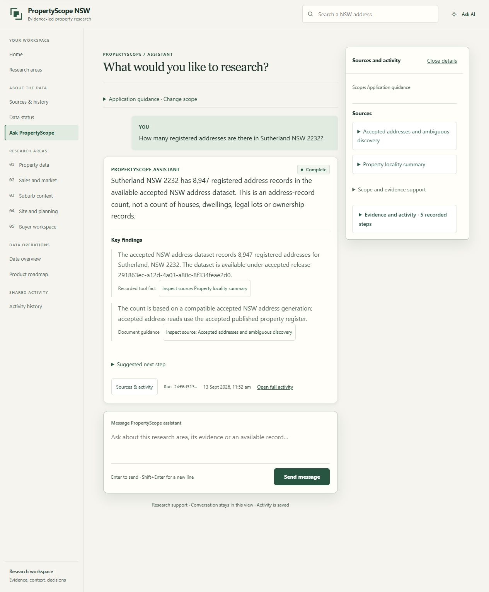

# Chat experience evidence

Open [the comparison index](index.html) for paired before/after captures of the Shared entry,
completed answer, property sidecar and mobile layout. Click an image to inspect it at full size.
The current scratch copy is served at <http://127.0.0.1:5318/evidence/index.html> and the
[prototype gallery](../../prototype/chat-experience/index.html) links to it.

Try the live implementation at <http://127.0.0.1:5100/#assistant> after
`uv run scripts/dev.py stack up`. On a property page, use **Ask about this property** to open
the shared assistant with its canonical identifier and readable address attached.

These are actual local application captures with the configured OpenAI provider and accepted
local dataset. Baseline and implementation runs have different IDs and model wording. The
[implementation record](../../prototype/chat-experience/implementation-plan.md) documents
observations, scope, validation and the limits of the independent review.

