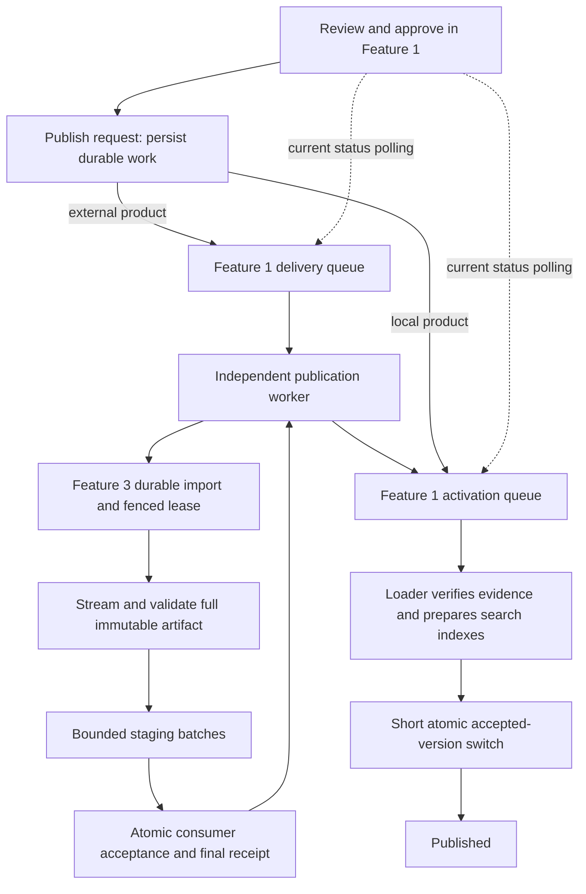

# Feature 1 publication investigation — 5 September 2026

Environment: retained local `ps-dev` Compose stack, inspected through the integrated browser,
service logs and read-only queries executed inside each owning database service. No direct
database repair was used. All publication/recovery actions used the supported browser flow.

## Flow and failure boundaries



The browser request already had a durable queue architecture. The incident exposed gaps in
scheduling, recovery and presentation around it; increasing request timeouts would not fix them.

| Finding | Evidence and consequence | Fix |
| --- | --- | --- |
| Raw review state shown during publication | Stored `awaiting_review` survives until activation; the page repeated it after approval | Publication-aware headings, notices, list and preview labels |
| Stale actions and stopped refreshes | Cached modules, preview work and finite polling kept old state visible | Asset revalidation, independent preview loading, continued slow polling, visibility refresh and version recheck |
| List rejected its own filters | UI sends `lifecycle` and `q`; repository supported both but database API omitted them from its allowlist | Allow those two supported parameters; retain rejection of unknown parameters and bounded search |
| Publication worker starvation | Publication reconciliation followed source acquisition/export in one runner loop | Independent publication loop with existing durable leases |
| Temporary control failure became permanent | Delivery `2181cdb5-7ea4-49c7-bb8a-c80048b1807e` ended `consumer_response_invalid` while its remote status was still running | Retry HTTP 408/429/5xx without interpreting proxy errors as receipts |
| Interrupted consumer download could never retry | Original receipt retained `artifact_transport_failed`, 4,741 received, zero accepted; release-wide coalescing returned it forever | Preserve old receipts and keys; permit a fresh operation after definitive failure |
| Recovery blocked status reads | Large staging deletion occurred inside the lease claim transaction | Retain identical staging on reclaim; WAL enables concurrent readers |
| Local retry rediscovered failed activation | Activation key came from stable receipt identity | Use the publication attempt key; same-request replay remains idempotent |
| Validation cost | Same 100 live BOCSAR records and producer schema: Python validator 1.918590 s; compiled validator 0.020578 s | Compiled Draft 2020-12 validation with formats and all existing semantic checks |
| GNAF preparation cost | Active query updates 5,190,134 candidate rows to populate partial search/geometry indexes | Keep this durable, leased work outside the publish request; expose Publishing until completion |
| Lightweight activation blocked by bulk work | BOCSAR had its accepted consumer receipt but waited behind GNAF in the serial loader | Separate fenced lightweight activation worker; keep full imports and index builds serial |

The validator sample is a single same-process microbenchmark on a busy local stack, approximately
93 times faster for schema validation alone. It is not a claimed full-import speedup.

The originally reported runner `httpx.ReadTimeout` occurred in the control-plane task claim. It
does not establish that the release data was invalid. The original artifact interruption coincided
with a development backend reload and worker termination. Later live edits also interrupted an
in-flight attempt; recovery testing retained these failed receipts as history.

## Live validation

- Original BOCSAR release: `71537336-0c2d-4f2b-9d2e-dbabc29fa9f9`, 10,114,565 source rows,
  318,122 portable series records, 499,779,743 compressed bytes.
- Large GNAF candidate: `291863ec-a12d-4a03-a80c-8f334feae2d0`, 5,190,134 portable address records,
  515,873,443 compressed bytes.
- Both were published/retried through the integrated browser. Queueing immediately displayed
  `Publishing` and removed Submit/Publish/Reject actions while background work was active.
- Recreated `f1-runner` during both operations; delivery continued with the same remote operation
  and GNAF activation retained its lease. No manual database state edits were needed.

The recovered BOCSAR operation `f30d8038-67a3-4a87-9211-bc1d1fd9c9f8` accepted all 318,122 records
on its first attempt, with zero rejections and a matching content digest. While GNAF was still
building indexes, the new lightweight activation path completed BOCSAR's artifact verification and
accepted-pointer switch in 0.815 seconds. This was exercised as one bounded claim/activation inside
the owning loader container, preserving the in-flight bulk worker. No lifecycle SQL was bypassed.

GNAF completed at 10:52:34 UTC. Its activation ran from 10:30:57 UTC for 21 minutes 36 seconds,
including search-index preparation. The integrated browser then showed **Published**, and the
accepted release retained all 5,190,134 records. This confirms that queue acceptance is quick but
full index preparation is not instantaneous on this local stack.

BOCSAR's delivery started at 10:30:45 UTC and its complete accepted consumer receipt was retained
at 10:42:18 UTC (about 11 minutes 33 seconds). Its final activation waited four minutes behind
GNAF before the lightweight worker fix was exercised; the new loader removes that queue dependency.
The browser showed **Published** for the original release, with the successful receipt first and
earlier failures retained in history.

The live Published data list loaded 19 versions after the allowlist correction. The Published
lifecycle returned six current versions; a `crime` search narrowed it to the accepted BOCSAR
release. The list now refreshes every thirty seconds and on visibility changes without replacing
unsubmitted search/status inputs; refresh failure retains results with an explicit retry notice.

After GNAF finished, the loader was restarted with the continuous lightweight worker enabled.
The complete 4,320-record SEIFA candidate `0320c071-6ee7-451e-83a6-8a7870252be4` was submitted,
approved and published through the browser. Queue-to-completion took 0.748 seconds, from
10:56:44.102 to 10:56:44.851 UTC, using the normal continuously running loader.

## Recovery procedure

1. Inspect the release page's current publication state, operation, receipt and failure details.
2. For a transient outage, allow automatic leased retries. A browser refresh or runner restart
   does not create a second delivery.
3. Once a terminal failure is understood and resolved, choose **Retry publication** and supply an
   approval note. Unknown remote outcomes are reconciled first; an old failed receipt remains in
   history. A fresh attempt follows once that failure is definitive.
4. Keep the predecessor accepted until consumer acceptance and local activation both succeed.
   Do not edit lifecycle rows or delete receipts to make the page appear recovered.

## Property-sales integration gap found during follow-up

The user subsequently tried release `a7078066-1bde-4b31-8b4d-4acab03939e6`: 7,402,643
`propertyscope.property-sales.v3` records and 952,728,964 compressed bytes. Feature 2 returned:

```text
HTTP 422 application/problem+json
code: invalid_sales_publication
detail: record_count: Input should be less than or equal to 5000
```

This is a real consumer capacity rejection, not a timeout or an invalid source release.
Feature 2's existing Release 0 importer also limits compressed artifacts to 25 MiB and expanded
artifacts to 75 MiB. It downloads into memory, decompresses the entire artifact, builds a list of
normalized records and synchronously sends them to its database API. It does not yet implement
the asynchronous status/receipt workflow required for full-size PSI releases. Raising these
constants alone would not make that integration ready for millions of records.

Feature 1 previously replaced the structured HTTP problem with `consumer_response_invalid`.
It now retains a bounded consumer rejection message on the durable failed delivery, without
inventing a consumer operation or receipt, and displays the cause directly on the release page.
Transient HTTP 408/429/5xx remain retryable. The previous accepted sales release stays active.

**Scope decision:** after discussing the required work, the user preferred leaving the larger
Feature 2 importer change out of this PR and documenting the integration gap. No Feature 2
capacity limit was introduced or increased here, and Feature 1 does not truncate the full release
to satisfy those limits. Publication of this full PSI release remains blocked by the existing
consumer until that integration is upgraded.

The follow-up integration should remove fixed dataset-size caps through streaming and bounded
batches, with a durable consumer-issued operation/status endpoint, fenced worker leases,
replayable staging, complete schema/digest/count validation and atomic accepted-generation
visibility. Existing Feature 2 case/sales reads must select the accepted generation. Consumer
acceptance must precede Feature 1 activation under ADR-033; bypassing that gate would change the
recorded publication contract.

Architecture: [ADR-040](../architecture/decisions/ADR-040-publication-recovery-and-current-state.md).

## Checks

- Canonical gate: `uv run python scripts/check.py` (format, lint, types, architecture, contracts,
  migrations, offline Python suites and frontend tests).
- Browser regression suite: `uv run pytest student-1/tests/e2e/test_form_behaviour_playwright.py
  --no-cov -q` — 41 passed.
- Disposable PostgreSQL suite: `student-1/tests/component/test_postgres_import_reliability.py`
  with `PROPERTYSCOPE_TEST_POSTGRES_URL` pointing to a separate temporary PostGIS container —
  20 passed. The retained live database was never supplied to this test suite.
- Live checks: integrated-browser review/publish/retry, lifecycle/search filters, final state,
  consumer receipt counts, accepted pointers, runner restart and continuous loader activation.

PostgreSQL opt-in suites are skipped by the ordinary canonical gate; the reliability suite above
was run separately. The Windows symlink test remains skipped when Developer Mode is unavailable.
