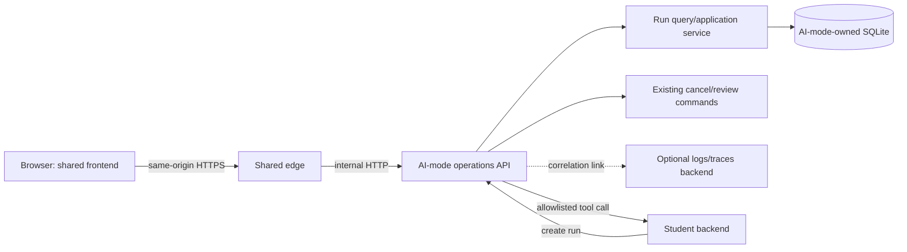

# AI-mode Operations Interface Implementation Plan

## Document control

| Field | Value |
|---|---|
| Status | Release 0 local read-only foundation implemented; remote access decisions remain open |
| Last verified | 9 August 2026 |
| Intended release | Release 0 read-only foundation; later releases extend the same model |
| Owner | Shared platform |
| Scope | Browser interface for discovering and inspecting live and completed AI-mode runs |
| Related design | [Shared run observability proposal](../architecture/shared-run-observability-proposal.md), [agent run state machine](../architecture/agent-run-state-machine.md), [ADR-014](../architecture/decisions/ADR-014-append-only-safe-agent-run-events.md) |

### Implementation status (9 August 2026)

Milestones 1-3 now have a working local read-only implementation behind
`AI_MODE_OPERATIONS_ENABLED=false` by default. It includes generated public contracts,
schema-v3 query columns and indexes, stable opaque cursor pagination, status/feature/model
filters, a policy-projected evidence endpoint with weak ETags, nested secret redaction,
cursor-event reconnect, and accessible framework-free assets under `shared/frontend`.

Until the unified shared edge is implemented, AI-mode serves the same dashboard asset paths
it will later expose through that edge. This keeps the feature usable now without creating a
temporary frontend service or a second API. Remote identity/authorization, mutating controls,
telemetry deep links, and selection of the team's one browser E2E tool remain deliberately
open; the dashboard stays disabled in those environments.

## 1. Purpose

Provide and evolve a shared web interface that makes AI-mode behavior understandable while
a run is executing and after it completes. It has two equally important uses:

1. **Showcase:** make the Plan -> Act -> Observe -> Adapt loop, deterministic guardrails,
   tool use, model timings, and human-review boundaries visible during demonstrations.
2. **Developer operations:** let maintainers locate a run, correlate it with requests and
   tools, inspect safe evidence, diagnose failures, and verify recovery without reading the
   SQLite file or attaching a debugger to AI-mode.

The interface is an operational read model over AI-mode-owned state. It is not a chat
product, a general log viewer, a replacement for feature UIs, or a second orchestration
service.

## 2. What the existing integration console is

`examples/integration-test-feature/frontend/` contains a non-product browser console used
to prove the current shared boundaries. It can:

- submit a run through the example Nginx proxy;
- poll `/api/v1/agent-runs/{id}/events` using a durable cursor;
- reload `/api/v1/agent-runs/{id}` when persisted events arrive;
- render Plan, Act, Observe, and Adapt steps as readable cards;
- show tool arguments/results, model invocation summaries, reviews, final output, and safe
  errors; and
- show the run, request, call, and trace identifiers needed for correlation.

It is called a console because it combines deterministic feature controls with a raw
integration/debug view. It is deliberately tied to a made-up records fixture and served only
under the optional `integration-test` Compose profile. It should remain executable test
infrastructure. The production shared interface may reuse its interaction lessons and visual
patterns, but must not import example code or become coupled to the fixture's record schema.

## 3. Goals and non-goals

### 3.1 Goals

- List active, review-blocked, failed, cancelled, and recently completed runs.
- Inspect a known run by ID without needing filesystem or database access.
- Update a displayed run within approximately two seconds of a durable state change.
- Explain which artifacts came from the user, deterministic orchestration, the model, a
  feature tool, or a human reviewer.
- Show bounded model/tool timings, counters, prompt/model versions, and safe errors.
- Preserve cursor-based reconnect across refreshes and temporary network failures.
- Provide copyable correlation identifiers and optional links to an external telemetry
  backend.
- Remain domain-neutral and useful for all five student features.
- Keep AI-mode as the only owner and reader of its SQLite workflow database.
- Work without Ollama when displaying historical or deterministically scripted runs.
- Add no WebSocket, event broker, second database, or mandatory monitoring stack.

### 3.2 Non-goals

- Durable multi-turn conversations or hidden chat history.
- Displaying private model reasoning or chain-of-thought.
- Returning arbitrary application log text through the workflow API.
- Querying feature databases from AI-mode or the shared frontend.
- Replacing feature-specific business interfaces or CRUD pages.
- Enabling multi-agent, MCP, or RAG behavior before their assigned releases.
- Horizontal worker scaling; this plan observes the current serial worker but does not
  redesign work claiming.
- Production authorization before the team selects an identity boundary.

## 4. Users and primary scenarios

| User | Scenario | Required view |
|---|---|---|
| Demonstrator | Explain what AI-mode is doing during a showcase | Live phase strip, readable action timeline, final result |
| Feature developer | Diagnose why a feature run selected or rejected a tool | Plan, registered tool/version, policy outcome, safe tool evidence |
| Shared-platform developer | Diagnose orchestration, provider, persistence, or recovery behavior | State/version history, timings, counters, errors, correlation IDs |
| Reviewer/operator | Find work awaiting a protected-action decision | Filtered run index and exact pending action |
| Tester | Reproduce and reference a deterministic scenario | Run ID, prompt/model metadata, ordered steps, evidence references |

Release 0 may support only trusted local demonstrator/developer use. Remote operators and
review actions require the access decision in section 13.

## 5. Architecture and ownership



Ownership rules:

- UI assets live under `shared/frontend/`; they contain no feature entities or business
  rules.
- AI-mode owns list/detail/event/evidence APIs and is the only process that opens its
  SQLite file.
- `agent-core` remains a library and receives no Flask or UI concerns.
- `shared_contracts` owns public, domain-neutral response models.
- The shared edge serves the browser assets and proxies operations API routes. The browser
  never connects to SQLite or Ollama.
- Feature services can supply safe evidence references but the operations interface does
  not call their databases.

### 5.1 Implemented repository locations

```text
shared/
  contracts/python/shared_contracts/operations.py
  frontend/
    operations/ai-mode/
      index.html
      app.js
      styles.css
ai-services/ai-mode/src/ai_mode/
  operations_api.py
  operations.py
  persistence/sqlite.py
ai-services/ai-mode/tests/
  test_operations_api.py
  test_operations.py
```

The implemented frontend uses accessible HTML, CSS, and small framework-free JavaScript. The
read/query implementation remains cohesive in `operations.py` and `persistence/sqlite.py`;
extract it only when a measured maintenance boundary justifies another module. Browser E2E
tests still await the team's single shared browser-tool choice. Do not add a second frontend
framework before common feature conventions are selected.

## 6. Information and sensitivity model

The interface must not treat every persisted field as equally safe.

| Information class | Examples | Default audience | UI behavior |
|---|---|---|---|
| Safe progress | run ID, status, phase, timestamps, counters | Authorized feature user/operator | Shown in list and live status |
| Restricted run evidence | objective, plan purposes, tool argument/result values, reviews | Developer/operator with feature scope | Redacted summary by default; expandable when authorized |
| Operational telemetry | structured logs, spans, exceptions, resource metrics | Operator only | External deep link; never copied into run events |
| Forbidden evidence | secrets, authorization headers, cookies, private reasoning, raw provider bodies | Nobody through this UI | Never persisted or rendered |

The existing `AgentRunDetail` is a useful persistence/API model but is too broad to become
the default operations projection for every future feature. The implementation should add an
allowlisted evidence projection and keep raw detail available only in a trusted development
mode until feature sensitivity rules are agreed.

## 7. Data contracts

All implemented public models extend `ContractModel`, reject extra fields, use bounded
collections/strings, and generate JSON Schema/OpenAPI artifacts.

### 7.1 `AgentRunSummary`

Compact row returned by the run index. It contains no tool arguments or results.

| Field | Type and bound | Source |
|---|---|---|
| `id` | UUID | `AgentRun.id` |
| `feature_key` | `Identifier` | `AgentRun.feature_key` |
| `objective_preview` | string, maximum 160; nullable by policy | Redacted/truncated objective |
| `status` | `RunStatus` | Current run snapshot |
| `latest_phase` | `StepPhase | null` | Latest persisted step |
| `latest_step_status` | `StepStatus | null` | Latest persisted step |
| `model_profile` | `Identifier` | Run snapshot |
| `prompt_set` | `Identifier` | Run snapshot |
| `iteration_count` | nonnegative integer | Run snapshot |
| `tool_call_count` | nonnegative integer | Run snapshot |
| `version` | nonnegative integer | Optimistic run version |
| `review_required` | boolean | Derived from status |
| `error_code` | `Identifier | null` | Safe run error code only |
| `created_at` | aware datetime | Run snapshot |
| `updated_at` | aware datetime | Run snapshot |
| `duration_ms` | nonnegative integer or null | Updated minus created; live elapsed may be client-derived |

`objective_preview` must be produced by an evidence policy, not by blindly slicing a value
after HTML rendering. Environments may configure it to `null` for a metadata-only list.

### 7.2 `AgentRunPage`

| Field | Type and bound | Meaning |
|---|---|---|
| `items` | tuple of `AgentRunSummary`, maximum 100 | Current page |
| `next_cursor` | opaque bounded string or null | Start position for the next page |
| `as_of` | aware datetime | Server time for stale-state display |

The cursor encodes a versioned `(created_at, run_id)` position using URL-safe base64. It is
validated and treated as opaque by clients. The stable ordering is `created_at DESC, id DESC`;
run status updates therefore do not reorder an in-progress pagination session. A refreshed
first page discovers newly created runs. Clients must still de-duplicate by run ID.

### 7.3 `AgentRunEvidenceDetail`

A read-oriented projection derived from existing persisted records. It is not another table.

| Field | Type | Meaning |
|---|---|---|
| `run` | `AgentRunSummary` | Safe current metadata |
| `objective` | string or null | Full objective only when policy permits |
| `steps` | bounded tuple of `AgentStepEvidence` | Ordered projected phase evidence |
| `reviews` | bounded tuple of `HumanReviewEvidence` | Authorized review audit data |
| `correlation` | `RunCorrelation` | Request/run/trace identifiers and optional telemetry URL |

### 7.4 `AgentStepEvidence`

| Field | Type | Meaning |
|---|---|---|
| `id`, `sequence`, `phase`, `status` | existing bounded types | Durable step identity/order |
| `started_at`, `completed_at`, `duration_ms` | datetime/integer | Timeline placement |
| `source` | `user | orchestration | model | tool | human` | Clear UI attribution |
| `summary` | bounded string | Deterministic, non-secret description |
| `plan` | `PlanEvidence | null` | Goal, ordered tool names/purposes, criteria; no hidden reasoning |
| `tool` | `ToolCallEvidence | null` | Safe action/outcome projection |
| `observation` | `ObservationEvidence | null` | Bounded facts/criteria projection |
| `adaptation` | `AdaptationEvidence | null` | Decision, justification, safe final summary |
| `model_invocation` | `ModelInvocationEvidence | null` | Reproducibility and performance metadata |
| `error` | `ToolError | null` | Existing safe structured error |

### 7.5 Tool and model evidence

`ToolCallEvidence` contains call/step IDs, tool name/version, side-effect class, approval
status, outcome, duration, retryability, safe error code, and bounded evidence references.
Arguments and result values are separate nullable `redacted_arguments` and
`redacted_result` objects populated only by the evidence policy.

`ModelInvocationEvidence` contains provider, concrete model/digest, logical profile, prompt
ID/version/hash, rendered-input hash, repair count, token counts, and load/prompt/evaluation/
total durations. It never contains prompt text, messages, or raw model output.

`HumanReviewEvidence` contains review/step IDs, decision, reviewed timestamp, authorized actor
display identifier, redacted comment, and the exact tool call identity/approval status. Remote
implementations derive the actor from authentication context; they do not trust a submitted
reviewer field.

`RunCorrelation` contains request ID, run ID, supported trace ID/traceparent, and an optional
preconfigured telemetry deep link. The telemetry URL is constructed server-side from a fixed
operator URL template; callers cannot provide it.

### 7.6 Existing live event contract

`AgentRunEvent` and `AgentRunEventPage` remain unchanged and intentionally small. Events are
notifications that durable state changed, not complete evidence payloads. The detail
projection remains authoritative.

## 8. Persistence and query design

### 8.1 SQLite migration

Add a forward-only schema migration that introduces query columns on `agent_runs`:

- `created_at TEXT`;
- `feature_key TEXT`;
- `model_profile TEXT`.

The migration backfills existing rows from their validated `payload_json`. New create/save
operations write indexed columns and payload atomically. Startup validation fails if a row
cannot be backfilled consistently; it must not silently omit corrupt runs.

Add only measured query indexes initially:

```sql
CREATE INDEX ix_agent_runs_created_id
    ON agent_runs (created_at DESC, id DESC);
CREATE INDEX ix_agent_runs_status_created_id
    ON agent_runs (status, created_at DESC, id DESC);
CREATE INDEX ix_agent_runs_feature_created_id
    ON agent_runs (feature_key, created_at DESC, id DESC);
```

Do not create a second CQRS database or event-stream projection. The current scale does not
justify it. Use `EXPLAIN QUERY PLAN` tests to ensure common list queries use indexes.

### 8.2 Query port

Add an AI-mode-specific `RunReader` protocol rather than putting UI concerns into
`agent-core.RunStore`:

```python
class RunReader(Protocol):
    def list_runs(self, query: RunListQuery) -> AgentRunPage: ...
    def get_evidence(
        self, run_id: UUID, policy: EvidencePolicy
    ) -> AgentRunEvidenceDetail | None: ...
```

`SQLiteRunStore` may implement both `RunStore` and `RunReader`, while `AppServices` exposes
the two interfaces explicitly. `RunListQuery` is an internal frozen dataclass containing
validated statuses, feature/model filters, cursor, and limit.

## 9. HTTP API

### 9.1 Run index

```http
GET /api/v1/agent-runs
    ?status=queued&status=planning&status=review_required
    &feature_key=student-1-example
    &model_profile=local-standard.v1
    &cursor=<opaque>
    &limit=50
```

Rules:

- default limit 50; maximum 100;
- repeated `status` values, maximum number equal to the known status enum;
- unknown filters, malformed cursors, and unsupported statuses return structured `400`;
- inaccessible feature scope returns no rows rather than leaking identifiers;
- response includes `X-Request-ID` and uses `AgentRunPage`;
- no unbounded substring search over objectives in Release 0.

### 9.2 Detail and evidence

- Keep `GET /api/v1/agent-runs/{id}` for existing feature clients and compatibility.
- Add `GET /api/v1/operations/agent-runs/{id}` for the policy-projected
  `AgentRunEvidenceDetail`, or version the existing detail endpoint only if the team agrees
  every consumer should receive the restricted projection.
- Return `404` for absent or inaccessible runs without revealing which case occurred.
- Add a weak ETag based on run ID/version. `If-None-Match` may return `304` to avoid
  transferring unchanged evidence during polling.

### 9.3 Events and commands

- Reuse `GET /api/v1/agent-runs/{id}/events`; do not create UI-specific events.
- Cancellation and review continue through the existing command endpoints.
- The first operations UI should be read-only unless an authenticated actor and feature
  authorization scope are available.
- Reviewer identity must come from authentication context before remote review controls are
  enabled; a browser-entered name is not production identity.

### 9.4 Health and model context

The UI may display `GET /health/ready` and `GET /api/v1/model-profiles` in a secondary
environment panel. Readiness must not be inferred from whether a historical run is visible.

## 10. Live update algorithm

Cursor polling is the Release 0 transport because it already has durable reconnect semantics
and works through Flask/Nginx without long-lived connection management.

For a selected run:

1. Fetch the projected detail and store its `run.version` and ETag.
2. Fetch events after the last locally stored cursor, initially zero.
3. Append new event metadata to the journal and advance to `next_cursor`.
4. If any event arrived, conditionally refresh the detail using its ETag.
5. Render only from the latest complete detail snapshot; events animate progress but do not
   invent plan/tool content.
6. Continue at 800 ms while actively planning/acting/observing/adapting.
7. Back off to two seconds while queued and five seconds while awaiting review.
8. On transient errors, use bounded exponential backoff with jitter and show disconnected/
   stale state without changing the persisted run status.
9. After `terminal=true`, perform one final detail refresh and stop.
10. Persist only run ID and cursor in session storage. Do not persist objectives or tool
    evidence in browser storage.

Additional client invariants:

- abort obsolete requests when the user selects another run;
- tolerate duplicate/empty event pages and event versions older than the detail snapshot;
- reduce polling when the tab is hidden and refresh immediately when it becomes visible;
- never cancel a run because the browser closes or disconnects;
- use one polling controller per selected run, not one interval per component.

The run index refreshes its first page every five seconds while visible. Selecting a run does
not stop index refresh, but DOM updates must preserve selection and keyboard focus.

Server-Sent Events may later expose the same stored events and `Last-Event-ID` cursor. Add it
only after measuring polling load and proxy behavior. WebSockets are not planned.

## 11. Interface design

### 11.1 Run index

- Status/feature/model filters with URL-addressable query state.
- Counts for visible active, review-required, failed, and completed items; label them as the
  current filtered page unless a dedicated aggregate endpoint is later added.
- Rows show status, feature, safe objective preview, current/latest phase, age, model,
  iteration/tool counters, and error code.
- Active and review-required work sorts visually by badges but retains server pagination
  order.
- Loading, empty, disconnected, unauthorized, and stale states are explicit.

### 11.2 Run detail

Use several complementary projections rather than one raw JSON dump:

1. **Phase strip:** current Plan/Act/Observe/Adapt state and completed cycles.
2. **Readable execution:** objective followed by attributed plan, tool, observation,
   adaptation, human-review, and final-result cards.
3. **Timeline:** ordered durable steps/events with timestamps and durations.
4. **Actions:** tool/version, policy class, approval, result, retryability, and evidence
   references.
5. **Model evidence:** profile/model, prompt version/hashes, repairs, token counts, and timing
   breakdown.
6. **Limits:** elapsed/time budget, iterations, tool calls, repairs, and cancellation state.
7. **Correlation:** copy buttons for request/run/step/call/trace identifiers and optional
   telemetry link.
8. **Raw projection:** escaped projected JSON behind an expandable developer control; never
   serialize internal objects directly into HTML.

Every card identifies its source with both text and color/icon treatment. Color alone must
not convey status. Generated, deterministic, tool, and human artifacts must not all be
presented as assistant chat messages.

### 11.3 Controls

- Copy IDs and deep-link to a run are safe first controls.
- Cancel appears only for cancellable states and requires confirmation.
- Approve/reject appears only for an exact pending action, displays the tool/version/
  side-effect and redacted arguments, and requires confirmation.
- Mutating controls are disabled in the initial local read-only milestone and in every
  environment without authenticated authorization.

## 12. Redaction and rendering policy

Introduce an injected `EvidenceProjector`/`EvidencePolicy` boundary in AI-mode. It receives
validated persisted contracts and returns only the public evidence contracts.

Baseline policy:

- allow IDs, enums, timestamps, counts, tool names/versions, timings, hashes, safe error
  codes/messages, and evidence references;
- deny keys matching secret/token/password/authorization/cookie/private-key conventions;
- deny authorization/cookie headers regardless of key spelling;
- bound depth, property count, array length, string length, and total serialized bytes;
- replace denied values with an explicit redaction marker, never an empty string that could
  be mistaken for source data;
- HTML-escape all rendered strings and use `textContent`, not dynamic `innerHTML`;
- do not place objectives, arguments, result text, run IDs, or error messages into metric
  labels;
- permit feature-specific redaction rules only as metadata/policy registered by the owning
  feature, not as imports of feature business code.

Key-name filtering alone is insufficient for production. Before approved product features
use the detailed view, decide whether sensitive values must be redacted before persistence or
may be retained and projected conditionally.

## 13. Access, environment, and deployment

### 13.1 Release 0 local mode

- Serve the interface through the shared edge on loopback/Compose only.
- Add `AI_MODE_OPERATIONS_ENABLED=false` by default; the route is absent when disabled.
- Do not put bearer tokens into built frontend assets or browser local storage.
- The integration-test profile may enable the read-only interface with non-sensitive fixture
  data for deterministic tests and demonstrations.
- AI-mode remains internal in the complete topology; only the shared edge has public ingress.

### 13.2 Remote/cloud mode

The operations route stays disabled until the team decides:

- authenticated identity source;
- operator versus feature-owner permissions;
- whether users can see only runs initiated through their feature/user scope;
- who may cancel or review;
- audit requirements for viewing/exporting evidence; and
- retention/deletion periods.

Do not treat knowledge of a UUID, a caller-supplied reviewer name, or a shared frontend secret
as authorization.

## 14. Testing strategy

### 14.1 Contract tests

- strict bounds and unknown-field rejection for summary/page/evidence models;
- JSON Schema/OpenAPI generation and drift;
- representative safe/redacted fixtures;
- additive compatibility checks once the first UI consumes the contract.

### 14.2 Persistence/query tests

- migration and backfill from every supported schema version;
- stable cursor pagination with identical timestamps and inserts between pages;
- all status/feature/model filters and invalid cursors;
- no duplicates within a page; deterministic `(created_at, id)` ordering;
- common filters use intended indexes;
- malformed persisted payloads fail closed;
- list queries do not mutate runs or events.

### 14.3 API tests

- default/maximum limits, repeated status filters, inaccessible/absent equivalence;
- request/run correlation headers and Problem Details responses;
- ETag `200`/`304` behavior;
- operations-disabled route absence;
- authorization matrix once identity exists;
- response-size and rate bounds.

### 14.4 Projection/security tests

- nested secrets and credentials embedded in free text fixtures;
- deeply nested/large tool results truncate deterministically;
- HTML/script strings render as text;
- raw prompts, headers, cookies, and provider bodies never appear;
- telemetry links accept no caller-controlled origin or query template.

### 14.5 UI/component tests

- event-to-refresh state machine, duplicate/empty pages, cursor reconnect;
- switching selected runs aborts obsolete polling;
- terminal final refresh, review pause, cancellation race, disconnect/backoff;
- accessible keyboard navigation, focus retention, live-region behavior, and non-color status;
- responsive layouts for demonstration/projector and laptop widths.

### 14.6 Integration and performance tests

- several queued independent runs plus one long multi-action run;
- success, provider failure, tool failure, cancellation, review, and restart recovery;
- page load and polling while SQLite is writing events;
- 10,000 synthetic run summaries with list-query p95 below 200 ms on the reference local
  machine;
- bounded network/event volume over a six-minute run;
- real Ollama evaluation remains separate from deterministic CI.

Use one browser test stack shared with the eventual unified frontend. Do not add both
Playwright and Cypress.

## 15. Delivery plan

### Milestone 0 — approve boundaries

- Confirm the UI is an operations interface, not durable conversation history.
- Approve local-only/read-only Release 0 access behavior.
- Choose whether objective previews are enabled for product features.
- Record remote identity, authorization, retention, and redaction as blockers rather than
  inventing them.

Exit criterion: team accepts the data classification and deployment gates in this plan.

### Milestone 1 — contracts and indexed run query

Implementation: complete for the Release 0 local read-only scope.

- Add `AgentRunSummary`, `AgentRunPage`, and projected evidence contracts.
- Add the SQLite migration, backfill, indexes, `RunReader`, and pagination codec.
- Add list and projected-detail routes plus generated artifacts.
- Add contract, persistence, API, migration, and query-plan tests.

Exit criterion: deterministic clients can page/filter runs and load a bounded safe projection
without accessing SQLite directly.

### Milestone 2 — read-only shared interface

Implementation: functional interface complete; browser E2E automation awaits selection of
the team's shared browser test stack.

- Add `/operations/ai-mode/` assets under `shared/frontend`.
- Implement run index, deep links, detail cards, event journal, reconnect, and status states.
- Reuse shared CSS tokens and preserve the integration console as the fixture harness.
- Add component/browser tests using scripted model scenarios.

Exit criterion: a demonstrator can start a fixture run elsewhere, locate it in the shared UI,
watch every durable phase, refresh/reconnect, and inspect its terminal result.

### Milestone 3 — safe developer evidence

Implementation: complete except optional evidence export, which remains intentionally absent
without an approved access and retention policy.

- Implement the evidence projector and explicit redaction/truncation policy.
- Add model/tool performance panels and correlation copy/deep-link controls.
- Add observability/security tests proving forbidden values are absent.
- Add an evidence export only if its access and retention policy is approved.

Exit criterion: developers can diagnose representative safe failures without raw database or
container access and without exposing test secret fixtures.

### Milestone 4 — authenticated commands and telemetry links

- Integrate the selected identity/authorization boundary.
- Enable cancel/review controls with exact action confirmation and actor-derived reviewer
  identity.
- Add optional trace/log backend links and OpenTelemetry child spans.
- Keep the UI disabled in cloud until authorization and cost/retention configuration pass.

Exit criterion: authorization tests cover view/cancel/review across operator and feature
scopes, and every mutation creates an attributable audit record.

### Milestone 5 — measure before transport/scale changes

- Measure polling, query latency, event growth, queue delay, and SQLite contention.
- Add SSE only if polling demonstrably harms usability or resource use.
- Address durable work claiming separately if model capacity justifies parallel workers.

Exit criterion: any new transport or concurrency design is supported by measurements and an
ADR.

## 16. Definition of done for the Release 0 interface

- Shared run index and detail interface are domain-neutral and served through the shared edge.
- AI-mode remains the sole workflow-state database owner.
- A known or listed run updates from durable events and survives browser reconnect.
- Plan, Act, Observe, Adapt, model, tool, deterministic, and human artifacts are distinctly
  labelled.
- Pagination, polling, payload size, rendering, and evidence are bounded.
- No secret fixtures, private reasoning, raw provider body, authorization header, or cookie
  appears in API/UI/log test captures.
- Disabled/unauthorized routes fail closed.
- Deterministic success, failure, cancellation, review, queue, and restart scenarios have
  browser-visible evidence.
- OpenAPI/JSON Schema and implementation behavior pass conformance tests.
- Operations UI checks join the canonical quality/integration workflow without requiring
  Ollama.
- Documentation explains how to enable, use, troubleshoot, and disable the interface.

## 17. Decisions still required

1. Which identity source and roles apply to remote operations access?
2. May a feature owner view only its feature's runs, or may shared-platform operators view all?
3. Are objective previews permitted for every approved feature?
4. Which feature fields require redaction before persistence rather than only before display?
5. How long are run state, events, detailed evidence, logs/traces, and exported evidence kept?
6. Are cancel/review controls needed in Release 0, or is read-only showcase/debug sufficient?
7. Which single browser test tool will the unified frontend use?
8. Which optional local/cloud telemetry backend should receive deep links?

None of these decisions blocks Milestone 1 contract/query design if the default projection is
metadata-only and the operations routes remain disabled outside trusted local tests.
