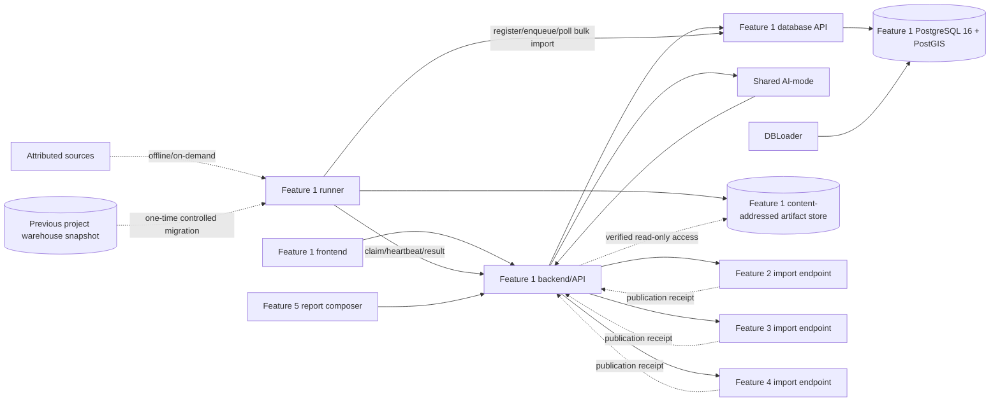

# PropertyScope Feature 1 implementation plan

## Document control

| Field | Value |
|---|---|
| Feature | Data Platform, Provenance, and Property Discovery |
| Status | Implementation-ready proposal; PostgreSQL exception and allocation require written tutor/team approval |
| Release | Detailed Release 0 plan with Release 1/2 extension seams |
| Related product plan | [`../architecture/propertyscope-product-and-feature-plan.md`](../architecture/propertyscope-product-and-feature-plan.md) |
| Platform baseline | [`../architecture/shared-platform-design.md`](../architecture/shared-platform-design.md) and proposed [`ADR-016`](../architecture/decisions/ADR-016-propertyscope-feature-1-postgresql-postgis.md) |
| Implementation baseline | [`feature-onboarding.md`](feature-onboarding.md) |

This plan defines the feature boundary and an incremental build sequence. It does not allocate a named student or authorise changes before the team and tutor approve the registered feature.

## 1. Feature decision

Build Feature 1 as the product's **data control plane plus property-discovery surface**.

It should answer two related questions:

1. **Data operator:** What sources and releases exist, what ran, what passed or failed, what is currently accepted, and what coverage can downstream features rely on?
2. **Buyer/researcher:** Can PropertyScope resolve this address, where is it, and which accepted evidence domains cover it?

The feature may be described informally as the data warehouse/ingestion feature. Its assessed boundary is not “a database somebody else queries.” It is an independently demonstrable frontend, backend/API and database microservice with CRUD, AI-mode interaction, operational evidence, property search and published contracts.

## 2. Why this is an assessable feature

| Requirement | Feature 1 evidence |
|---|---|
| Frontend microservice | Data Operations and Property Discovery interfaces |
| Backend/API microservice | Source/release/run/property APIs and AI-mode integration |
| Database microservice | Feature-owned PostgreSQL 16/PostGIS data service exposed only through its database API |
| CRUD | Visible source-definition and candidate-release create/read/update/delete workflows |
| Ten records per table | Deterministic source, run, release and property seeds |
| AI interaction | Release diagnosis and recovery planning callable from the frontend |
| Agentic loop | Inspect source → inspect failed run → compare accepted release → adapt plan → review-gated retry/publish |
| Integration | Publishes releases to Features 2–4 and canonical property/release evidence to Feature 5 |
| CI/CD | Feature-specific workflow validates services, contracts, manifests, state transitions and images |
| Showcase | One bounded failed-release recovery plus property search/coverage demonstration |

The buyer-facing Property Discovery surface prevents the feature from appearing to be internal DevOps work detached from the application.

## 3. Ownership boundary

### 3.1 Feature 1 owns

- source definitions, licences, cadence and attribution metadata;
- ingestion-run records, raw artefact checksums and validation summaries;
- dataset-release manifests and accepted/superseded/rejected lifecycle;
- canonical `property_ref`, display address, locality/state/postcode and map point;
- supported-geography and cross-feature coverage metadata;
- fixed ingestion/export adapters and release contract conventions;
- Feature 1-owned PostgreSQL/PostGIS source, registry and publication schemas;
- property search/discovery UI and data-operations UI;
- feature-specific prompts, tools, tests and evidence; and
- publication receipts proving a domain owner accepted/rejected a release.

### 3.2 Feature 1 does not own

- sale observations, comparable logic or market calculations;
- crime analytical semantics, runtime series or comparisons;
- school, amenity or other neighbourhood facts;
- planning, hazard, strata or building observations;
- buyer profiles, watchlists, dossiers or follow-up tasks;
- another feature's SQLite database, migrations or import decisions;
- arbitrary scraping selected by an LLM;
- shared AI-mode, MCP or RAG infrastructure; or
- report orchestration/rendering.

### 3.3 Crime hand-off

Feature 1 owns BOCSAR source registration, acquisition, raw checksum, run history and candidate release generation. Feature 3 defines the supported geography/categories/period/measure contract, validates zero-versus-missing and rate semantics, accepts the release, imports it into its SQLite service, and owns runtime crime APIs/UI/AI.

Feature 1 therefore owns **how the crime source becomes a governed release**. Feature 3 owns **what the crime data means in the product**.

## 4. Service and data topology



Only the Feature 1 database-service trust boundary—its API and one serial loader process—receives PostgreSQL credentials. The runner receives work and records progress through the Feature 1 backend worker API; it never imports the database package or connects to PostgreSQL. For bulk loads, the runner writes a verified artifact, registers/enqueues an internal database import, receives `202 Accepted`, and polls its durable operation. The database-service loader claims that operation, reads the artifact, uses PostgreSQL `COPY` and set-based SQL, heartbeats, and records an idempotent receipt outside any normal HTTP-request timeout.

A Feature 1-owned named artifact volume is mounted read/write by the runner and read-only by the database service/backend as needed. It is **not** a database and is never mounted by another feature. In cloud this port can become object storage.

Feature 1 calls another feature's **backend** import endpoint, never its database API. A consumer downloads a bounded artifact through Feature 1's fixed, policy-controlled release endpoint, validates it, and imports through its own database API. Release artifacts are schema/checksum validated; no cross-feature shared volume is used. Authentication is a required hook before remote/cloud mutation exposure, not a claim that Release 0 already has user identity.

### Database decision and approval gate

The implementation target is **PostgreSQL 16 with PostGIS for Feature 1**, while Features 2–5 retain their independently owned SQLite database services. This is not a shared team database: other features receive no SQL credentials, do not import Feature 1 code, and integrate only through Feature 1's backend/publication contracts.

This decision is justified by the verified corpus in Section 4.1. The course technology table explicitly permits “SQLite / PostgreSQL,” but several Release 0 deliverables and rubric statements specifically say SQLite. Before implementation, obtain written tutor approval and accept the proposed ADR that supersedes the SQLite choice for Feature 1 only. Update the shared architecture and executable boundary checks at the same time.

If approval is denied, use the same contracts with a small SQLite implementation containing bounded release extracts. That fallback can satisfy Release 0 demonstrations, but it must not be described as a full NSW warehouse or expected to ingest the verified statewide corpus.

### 4.1 Verified prior-data baseline

Previous project work completed by Matthew Shelton was inspected on 9 August 2026. The figures below are operational evidence, not promises that every table is immediately production-ready:

| Evidence | Verified approximate reality | Planning consequence |
|---|---:|---|
| Database | 29 GB, PostgreSQL 16/PostGIS 3.4 | PostgreSQL/PostGIS is required for full scale |
| Address rows | 9.59 million, 7.96 GB | Includes multiple states/releases; do not equate rows with canonical NSW properties |
| Canonical-address materialisation | 5.19 million rows, 831 MB | Existing canonical logic needs identity/unit/state correction before reuse |
| Current raw G-NAF address/geocode tables | about 4.39 million rows each from the most recently loaded state/release | Raw staging is not an authoritative multi-release/state history |
| Raw PSI sales | 7.34 million, 2.4 GB | Requires partitioned loading, source-key deduplication and date quarantine |
| Promoted sales | 5.42 million, 2.13 GB | About 760,000 locality-fallback or unmatched rows are not defensible property-level matches |
| Raw BOCSAR wide rows | about 318,000 | Compact source form is preferable for archival evidence |
| Promoted BOCSAR long rows | 38.16 million, 9.95 GB | Avoid materialising every explicit zero in downstream SQLite |
| Schools | 2,210 government-school points | Schools are proven; catchments are not yet a promoted data product |
| Flood polygons | 94,431 total: 622 LEP plus about 93,809 SES | Coverage is fragmented and must never imply statewide “no risk” |
| Bushfire polygons | 146,400 | Spatial extent/edition and geometry validity must be recorded |
| Planning features | 25,000 | This is a capped/partial extract, not a complete planning certificate substitute |
| Strata schemes | 88,468 | Useful source evidence, with linkage/coverage caveats |
| Ingestion runs | 79: 51 succeeded, 23 failed, 5 abandoned/still `running` | Durable tasks, heartbeats, stale-run detection and recovery are justified |
| Empty promoted products | listings, ePlanning/DA and GTFS/transit | Mark unavailable/deferred; do not expose empty features as coverage |

The prior database also shows why direct migration is unsafe: address data from overlapping releases/states coexist, some materialised views are stale, only the earliest migrations appear in canonical Flyway history, and expensive mart refreshes caused otherwise successful loads to fail. The new platform imports through versioned migrations and source contracts; it does not adopt the old schema or run history as authoritative without validation.

### 4.2 Runtime profiles

Use one PostgreSQL schema and code path across profiles; do not maintain divergent SQLite/PostgreSQL implementations after PostgreSQL is approved:

| Profile | Data | Purpose |
|---|---|---|
| `test` | Ten-plus deterministic rows per persistent table and tiny source fixtures | Unit/component/contract CI with network disabled |
| `showcase` | Curated properties/localities plus deterministic successful and failed release cases | Fast group Compose and repeatable video |
| `full-data` | Persistent PostgreSQL volume populated from live/cached full snapshots | Real statewide property search and data-engineering work |

The default developer profile may be `showcase` so teammates do not download tens of gigabytes. Feature 1's owner can enable `full-data`. APIs, migrations, quality rules and UI states remain identical; only source scopes and row volumes differ.

## 5. User stories

### Data operator

1. Create, view, update, disable and delete a source definition.
2. See source owner, URL, licence, cadence, adapter and last accepted release.
3. Request a fixed, bounded run using an allowlisted source/adapter/profile.
4. Inspect run status, counts, checksum, quality checks and structured errors.
5. Compare a failed candidate with the previous accepted release.
6. Create/update/delete draft release metadata.
7. Submit a validated candidate for human review.
8. Publish, reject or supersede a release without destroying prior evidence.
9. See whether each owning feature accepted or rejected its release.
10. Ask AI to diagnose a failed/stale run and propose a recovery plan.

### Buyer/researcher

11. Search a bounded NSW address dataset.
12. Confirm the canonical address and map position.
13. See match quality, source release and supported/unsupported state.
14. See which sales, crime/neighbourhood and due-diligence releases cover the candidate.
15. Receive an explicit unsupported result instead of a fabricated property.

### Demonstrator/reviewer

16. Show direct CRUD working with the LLM provider unavailable.
17. Show a failed crime candidate release leaving the accepted release untouched.
18. Run the Plan → Act → Observe → Adapt diagnosis and review-gated retry/publish path.
19. Trace the release into Feature 3 and then into a Feature 5 dossier.

## 6. Release 0 logical data model

Use PostgreSQL schemas to separate concerns:

```text
ops          source/job/run/task/artifact/quality/release/receipt control plane
registry     stable PropertyScope identity and versioned external identifiers
warehouse    accepted source-aligned normalised observations used to build releases
serving      Feature 1 search/coverage projections and materialised views
stage        durable-until-cleaned load tables keyed/partitioned by candidate release/run; never queried by product APIs
```

The nine `ops` tables below are the durable orchestration model. Registry and warehouse tables follow in Sections 6.10–6.12. Every persistent table used in Release 0 receives at least ten deterministic test/showcase records, even though full-data tables are much larger. Run-scoped staging tables are transient implementation artifacts, not seeded product tables.

### 6.1 `ops.source_definition`

```text
id UUID PRIMARY KEY
name TEXT NOT NULL
publisher TEXT NOT NULL
source_url TEXT NOT NULL
adapter_key TEXT NOT NULL
cadence TEXT NOT NULL
licence_id TEXT NOT NULL
licence_url TEXT NOT NULL
redistribution_policy TEXT NOT NULL
target_features_json JSONB NOT NULL
status TEXT NOT NULL
notes TEXT NOT NULL
created_at TIMESTAMPTZ NOT NULL
updated_at TIMESTAMPTZ NOT NULL
version INTEGER NOT NULL
```

Primary CRUD aggregate. `adapter_key` must be allowlisted in code; it is not an import path or command. `source_url` is attribution/discovery metadata. The runner may request only adapter-defined hosts/path patterns, so editing this field cannot create an arbitrary server-side request.

### 6.2 `ops.job_definition`

```text
id UUID PRIMARY KEY
source_definition_id UUID NOT NULL
name TEXT NOT NULL
profile_key TEXT NOT NULL
profile_version TEXT NOT NULL
adapter_key TEXT NOT NULL
release_builder_key TEXT NOT NULL
import_profile_key TEXT NOT NULL
import_profile_version TEXT NOT NULL
target_feature TEXT NOT NULL
dataset_id TEXT NOT NULL
refresh_strategy TEXT NOT NULL
default_run_mode TEXT NOT NULL
scope_json JSONB NOT NULL
quality_policy_key TEXT NOT NULL
quality_policy_version TEXT NOT NULL
max_parallelism INTEGER NOT NULL
timeout_seconds INTEGER NOT NULL
max_objects INTEGER NOT NULL
max_bytes BIGINT NOT NULL
max_rows BIGINT NOT NULL
status TEXT NOT NULL
schedule_text TEXT NULL
created_at TIMESTAMPTZ NOT NULL
updated_at TIMESTAMPTZ NOT NULL
version INTEGER NOT NULL
```

Second operator CRUD aggregate. `schedule_text` is descriptive/disabled in Release 0; runs are manual. Keys refer to registered code, never commands/import paths.

### 6.3 `ops.ingestion_run`

```text
id UUID PRIMARY KEY
job_definition_id UUID NOT NULL
source_definition_id UUID NOT NULL
adapter_version TEXT NOT NULL
release_builder_version TEXT NOT NULL
import_profile_version TEXT NOT NULL
normalisation_version TEXT NOT NULL
profile_key TEXT NOT NULL
run_mode TEXT NOT NULL
requested_scope_json JSONB NOT NULL
source_snapshot_json JSONB NULL
input_checkpoint_json JSONB NULL
output_checkpoint_json JSONB NULL
accepted_watermark_json JSONB NULL
attempt_number INTEGER NOT NULL
parent_run_id UUID NULL
requested_at TIMESTAMPTZ NOT NULL
started_at TIMESTAMPTZ NULL
finished_at TIMESTAMPTZ NULL
status TEXT NOT NULL
rows_discovered BIGINT NOT NULL
rows_staged BIGINT NOT NULL
rows_accepted BIGINT NOT NULL
rows_rejected BIGINT NOT NULL
error_json JSONB NULL
lease_owner TEXT NULL
lease_expires_at TIMESTAMPTZ NULL
heartbeat_at TIMESTAMPTZ NULL
request_id TEXT NOT NULL
idempotency_key TEXT NOT NULL
created_at TIMESTAMPTZ NOT NULL
UNIQUE (job_definition_id, idempotency_key)
```

Run facts become immutable after terminal status. Retry and cached reprocess create linked child runs; a PSI/spatial backfill is simply an explicit bounded full-refresh scope. Snapshot fingerprints/partition manifests are bounded versioned JSON; secrets are forbidden.

### 6.4 `ops.run_task`

```text
id UUID PRIMARY KEY
ingestion_run_id UUID NOT NULL
logical_key TEXT NOT NULL
partition_json JSONB NOT NULL
stage TEXT NOT NULL
status TEXT NOT NULL
attempt_number INTEGER NOT NULL
started_at TIMESTAMPTZ NULL
finished_at TIMESTAMPTZ NULL
input_artifact_id UUID NULL
output_artifact_id UUID NULL
rows_in BIGINT NOT NULL
rows_out BIGINT NOT NULL
error_json JSONB NULL
lease_owner TEXT NULL
lease_expires_at TIMESTAMPTZ NULL
created_at TIMESTAMPTZ NOT NULL
updated_at TIMESTAMPTZ NOT NULL
version INTEGER NOT NULL
```

The durable work ledger. A task represents a source object/partition and stage, enabling failed-partition retry and restart recovery without replaying a whole source.

### 6.5 `ops.import_operation`

```text
id UUID PRIMARY KEY
ingestion_run_id UUID NOT NULL
run_task_id UUID NOT NULL
candidate_release_id UUID NOT NULL
import_profile_key TEXT NOT NULL
import_profile_version TEXT NOT NULL
artifact_record_id UUID NOT NULL
status TEXT NOT NULL
attempt_number INTEGER NOT NULL
idempotency_key TEXT NOT NULL
lease_owner TEXT NULL
lease_expires_at TIMESTAMPTZ NULL
heartbeat_at TIMESTAMPTZ NULL
requested_at TIMESTAMPTZ NOT NULL
started_at TIMESTAMPTZ NULL
finished_at TIMESTAMPTZ NULL
rows_in BIGINT NOT NULL
rows_staged BIGINT NOT NULL
rows_accepted BIGINT NOT NULL
rows_rejected BIGINT NOT NULL
result_json JSONB NULL
error_json JSONB NULL
version INTEGER NOT NULL
UNIQUE (run_task_id)
UNIQUE (idempotency_key)
```

This is the durable asynchronous command promised by the private bulk-import API. `artifact_record_id` references one verified canonical import artifact or a registered bundle-manifest artifact for the same run; source bytes never appear in JSON. The database API creates/plans and enqueues operations, while the database-service loader alone claims and executes them. A lost HTTP response is reconciled by ID/idempotency key; interruption may increment this operation's attempt, while repair after terminal failure creates a new run task and operation linked through the child run.

### 6.6 `ops.artifact_record`

```text
id UUID PRIMARY KEY
ingestion_run_id UUID NOT NULL
run_task_id UUID NULL
logical_key TEXT NOT NULL
artifact_kind TEXT NOT NULL
storage_key TEXT NOT NULL
source_uri_redacted TEXT NULL
content_sha256 TEXT NOT NULL
media_type TEXT NOT NULL
bytes BIGINT NOT NULL
etag TEXT NULL
source_last_modified TIMESTAMPTZ NULL
schema_version TEXT NULL
retention_class TEXT NOT NULL
created_at TIMESTAMPTZ NOT NULL
```

Metadata only. The actual content lives in a content-addressed artefact store or a licence-compatible checked-in fixture. `storage_key` cannot escape the configured root.

### 6.7 `ops.quality_result`

```text
id UUID PRIMARY KEY
ingestion_run_id UUID NOT NULL
dataset_release_id UUID NULL
rule_key TEXT NOT NULL
rule_version TEXT NOT NULL
dimension TEXT NOT NULL
severity TEXT NOT NULL
status TEXT NOT NULL
observed_value_json JSONB NOT NULL
expected_value_json JSONB NULL
message TEXT NOT NULL
sample_json JSONB NULL
created_at TIMESTAMPTZ NOT NULL
```

One row per quality rule result makes the UI, AI tools and technical-report evidence queryable without parsing logs.

### 6.8 `ops.dataset_release`

```text
id UUID PRIMARY KEY
dataset_id TEXT NOT NULL
source_definition_id UUID NOT NULL
ingestion_run_id UUID NOT NULL
target_feature TEXT NOT NULL
release_version TEXT NOT NULL
schema_version TEXT NOT NULL
coverage_json JSONB NOT NULL
record_count BIGINT NOT NULL
content_sha256 TEXT NOT NULL
artifact_record_id UUID NOT NULL
manifest_json JSONB NOT NULL
status TEXT NOT NULL
review_comment TEXT NULL
accepted_at TIMESTAMPTZ NULL
supersedes_release_id UUID NULL
created_at TIMESTAMPTZ NOT NULL
updated_at TIMESTAMPTZ NOT NULL
version INTEGER NOT NULL
```

Draft/candidate metadata supports CRUD. Accepted releases are superseded, not edited in place.

### 6.9 `ops.publication_receipt`

```text
id UUID PRIMARY KEY
dataset_release_id UUID NOT NULL
target_feature TEXT NOT NULL
consumer_operation_id TEXT NOT NULL
status TEXT NOT NULL
schema_version TEXT NOT NULL
content_sha256 TEXT NOT NULL
rows_received BIGINT NOT NULL
rows_accepted BIGINT NOT NULL
rows_rejected BIGINT NOT NULL
error_json JSONB NULL
request_id TEXT NOT NULL
created_at TIMESTAMPTZ NOT NULL
completed_at TIMESTAMPTZ NULL
UNIQUE (target_feature, consumer_operation_id)
```

Receipts are immutable evidence. Keeping them out of a JSON array enables retries, filtering and idempotent reconciliation.

All references above are enforced with foreign keys; delete behaviour is restrictive except for explicitly disposable staging generations. Migrations add `CHECK` constraints for registered status/mode/severity values, non-negative counts and valid lease ranges, plus uniqueness for run logical task keys, release versions and content-addressed artifacts. State transitions use optimistic `version` checks and compare-and-set updates. Large JSON samples are bounded and redacted; they are evidence summaries, not a place to store source datasets.

### 6.10 Stable property/address registry

`registry.property` represents a PropertyScope **addressable location** in Release 0. It is not a legal title, parcel or guarantee that two units/aliases refer to the same physical asset.

```text
property_ref UUID PRIMARY KEY
address_display TEXT NOT NULL
flat_type TEXT NULL
unit_number TEXT NULL
street_number_first INTEGER NULL
street_number_suffix TEXT NULL
street_number_last INTEGER NULL
street_name TEXT NOT NULL
street_type TEXT NULL
locality TEXT NOT NULL
postcode TEXT NOT NULL
state TEXT NOT NULL
address_search TEXT NOT NULL
geom geometry(Point, 4326) NOT NULL
resolution_status TEXT NOT NULL
created_at TIMESTAMPTZ NOT NULL
updated_at TIMESTAMPTZ NOT NULL
version INTEGER NOT NULL
```

`property_ref` is a platform-generated UUID treated as an opaque string by consumers. **Do not encode a G-NAF PID in it.** G-NAF identifiers can retire/change between releases and are evidence about the identity, not the permanent platform identity.

`registry.property_identifier` records those external identities:

```text
id UUID PRIMARY KEY
property_ref UUID NOT NULL
scheme TEXT NOT NULL
identifier_value TEXT NOT NULL
source_release_id UUID NOT NULL
is_current BOOLEAN NOT NULL
valid_from DATE NULL
valid_to DATE NULL
match_method TEXT NOT NULL
match_confidence NUMERIC(5,4) NOT NULL
evidence_json JSONB NOT NULL
created_at TIMESTAMPTZ NOT NULL
UNIQUE (scheme, identifier_value, source_release_id)
```

`registry.address_alias` preserves alternate searchable/display strings and principal/alias relationships without deleting evidence:

```text
id UUID PRIMARY KEY
property_ref UUID NOT NULL
alias_display TEXT NOT NULL
alias_search TEXT NOT NULL
alias_kind TEXT NOT NULL
source_release_id UUID NOT NULL
source_identifier TEXT NULL
is_current BOOLEAN NOT NULL
created_at TIMESTAMPTZ NOT NULL
UNIQUE (property_ref, alias_search, source_release_id)
```

`registry.unresolved_match` makes ambiguity reviewable:

```text
id UUID PRIMARY KEY
dataset_release_id UUID NOT NULL
source_record_key TEXT NOT NULL
source_address_json JSONB NOT NULL
candidate_property_refs JSONB NOT NULL
reason_code TEXT NOT NULL
resolver_key TEXT NOT NULL
resolver_version TEXT NOT NULL
status TEXT NOT NULL
review_comment TEXT NULL
resolved_property_ref UUID NULL
created_at TIMESTAMPTZ NOT NULL
resolved_at TIMESTAMPTZ NULL
UNIQUE (dataset_release_id, source_record_key)
```

Both tables are first-class QA data rather than log messages. Candidate arrays are bounded and contain IDs/scores/reasons only, not duplicated property records.

The resolver can carry a stable `property_ref` across a new G-NAF release only when deterministic evidence supports continuity. A missing/retired PID, unit ambiguity or multiple plausible candidates becomes a reviewable result, never a silent merge or “lowest UUID wins” choice.

### 6.11 Source-aligned warehouse tables

Release 0 implements these accepted-generation tables, partitioned or indexed by `dataset_release_id`:

| Table | Key facts retained | Purpose |
|---|---|---|
| `warehouse.gnaf_address` | Release/PID, complete address components, source status, selected geocode/type, source CRS, WGS84 point, normalisation version | Rebuild/search the registry and explain identity evidence |
| `warehouse.psi_sale` | Stable source key, era/format, district/property/dealing IDs, contract/settlement dates, integer AUD price, original and square-metre area, sale fields, nullable `property_ref`, match tier/confidence/geographic precision | Produce Feature 2 releases without inventing address matches |
| `warehouse.bocsar_observation` | Release, geography kind/value, exact offence/subcategory labels, month and **non-zero** count | Compact accepted source facts for Feature 3 export |
| `warehouse.bocsar_coverage` | Release, actual geography kind/value and category key, observed month array/range/count, source-row hash and blank-as-zero convention | Distinguish source-defined zero from missing/unsupported data without inventing a Cartesian product |
| `warehouse.school` | School code, government-school fields, original/normalised locality/LGA, coordinates, source release | Produce Feature 3 school/proximity releases; no catchment claim |
| `warehouse.spatial_feature` | Dataset/layer/source feature key, native CRS/extent metadata, source geometry and WGS84 geometry, effective dates, attributes JSONB, geometry-transform version | Hold accepted cached planning/hazard extracts for Feature 4 publication |

These are **source-aligned publication tables**, not the runtime business stores for Features 2–4. Each downstream owner validates and imports a bounded product contract into its own database. Use declarative partitioning by release or source partition only where measurement proves it valuable; do not create a generic table-per-run explosion.

Every warehouse row carries `dataset_release_id UUID`, a stable source record/business key, `source_row_sha256`, `normalisation_version`, lineage to its artifact/run, and `created_at TIMESTAMPTZ`. Source-specific uniqueness is enforced as follows:

| Table | Minimum uniqueness / lookup contract |
|---|---|
| `gnaf_address` | unique `(dataset_release_id, gnaf_pid)`; B-tree postcode/locality/PID and GiST WGS84 point |
| `psi_sale` | unique `(dataset_release_id, source_business_key, source_revision)`; indexes for property/date, locality/date and dealing/source identifiers |
| `bocsar_observation` | unique `(dataset_release_id, geography_kind, geography_value, source_category_key, month)`; `count > 0` because accepted zeroes are represented by coverage |
| `bocsar_coverage` | unique release/source-part descriptor with bounded geography/category/month universes and completeness checksum |
| `school` | unique `(dataset_release_id, school_code)`; GiST point plus locality/LGA lookup indexes |
| `spatial_feature` | unique `(dataset_release_id, dataset_key, layer_key, source_feature_key)`; GiST source/WGS84 geometries and dataset/layer lookup |

Raw source fidelity lives in immutable artifacts; warehouse tables retain only the source fields required for reproducible normalisation, matching, quality and publication. Unknown source fields may be retained in bounded `source_attributes JSONB`, but promoted API contracts use typed columns. Large source binaries, whole BOCSAR rows and arbitrary HTML do not belong in JSONB.

### 6.12 Staging, serving and indexing

- Load each run into registered tables in the fixed `stage` schema, keyed or partitioned by candidate release/run ID and inaccessible to public queries; do not interpolate untrusted identifiers into schema/table names.
- Use PostgreSQL `COPY` for G-NAF, PSI, BOCSAR and other tabular loads.
- Use PostGIS `geometry` with explicit SRID checks and GiST indexes for accepted spatial tables.
- Add B-tree indexes for release/natural keys, PSI date/property lookup, BOCSAR geography/category/month and school code.
- Use `pg_trgm` only for bounded address search columns after query-plan measurement.
- `serving.property_search` and coverage projections reference only accepted releases.
- Expensive aggregate/materialised-view refreshes are separate retryable tasks after accepted source load; they cannot roll back or falsely fail the source ingestion.
- Migrations must rebuild an empty test database and produce a checked schema fingerprint. Manual production DDL is prohibited.

### 6.13 Seed plan

Every table must contain at least ten deterministic records:

- 10–15 source and job definitions spanning address, sales, crime, schools, planning, flood, bushfire, strata and building evidence;
- 12–20 runs including successful, failed, cancelled, full-refresh, cached-reprocess and recovery cases;
- 20+ run tasks spanning stages/partitions and retry outcomes;
- 10+ import operations spanning planned/queued/running/interrupted/succeeded/failed/cancelled and response-reconciliation cases;
- 10+ artefact records with realistic hash/size/media/retention metadata;
- 20+ quality results across pass/warn/fail/skip states and all quality dimensions;
- 10–15 releases and receipts across Features 1–4 with draft/candidate/accepted/rejected/superseded states;
- at least 30 registry properties plus ten-plus identifiers, aliases and unresolved matches; and
- ten-plus rows in every R0 warehouse table, including explicit BOCSAR coverage and non-zero observations.

Seed one golden failure: a BOCSAR candidate release missing required months while an older accepted release remains usable.

## 7. State machines

### 7.1 Ingestion run

```text
queued
  -> planning
  -> discovering
  -> acquiring
  -> staging
  -> normalising
  -> validating
  -> building_release
  -> succeeded | failed | cancelled
  -> interrupted
interrupted -> queued | cancelled
```

- No transition out of a terminal status.
- Retry/cached-reprocess creates a child run with `parent_run_id`; explicit resume may continue an interrupted run and increments task attempts.
- A run can succeed without a release being accepted.
- Failure records structured safe error details, not secrets or arbitrary logs.
- Stale task leases move a run to `interrupted`; the dashboard offers a controlled resume/retry instead of leaving it indefinitely `running`.
- Cancellation is cooperative between tasks; an in-flight HTTP/file operation observes a cancellation token/time limit.

### 7.2 Dataset release

```text
draft
  -> candidate
  -> awaiting_review
  -> accepted | rejected
accepted
  -> superseded
```

- Only a validated candidate can enter review.
- Publish is idempotent and review-gated.
- At most one accepted release exists per `(target_feature, dataset_id)`.
- Failed publication leaves the previous accepted release unchanged.
- Delete is allowed for drafts/rejected local candidates; accepted evidence is superseded/retained.

### 7.3 Source definition

```text
draft -> active <-> disabled -> retired
```

Deleting a source with referenced accepted releases should return a conflict or perform documented soft retirement, while unused draft/test sources support literal delete.

### 7.4 Run task

```text
pending -> claimed -> running -> succeeded
                  \-> retry_wait -> pending
                  \-> failed | cancelled | skipped
```

- A `(run_id, logical_key, stage)` task is unique.
- Claim uses an atomic lease with worker ID and expiry.
- Attempts and safe errors are retained.
- Retry policy is error-class aware and bounded; validation failures are not blindly retried.
- Resume reclaims expired leases and skips tasks whose output artefact/checksum already verifies.

### 7.5 Bulk import operation

```text
planned -> queued -> claimed -> running -> succeeded
                             \-> failed | cancelled
claimed/running -> interrupted -> queued | cancelled
```

- `POST /{operation_id}/execute` validates the immutable registered request, enqueues it and returns `202 Accepted`; it never holds an HTTP request open for `COPY`.
- The one serial database-service loader claims with a lease, heartbeats between bounded phases and reconciles its durable result after restart.
- The operation is unique per load-stage task. Repeating create/execute with the same idempotency key returns the existing operation/status.
- Cancellation is cooperative before accepted-generation activation. An interrupted or failed operation cannot advance the accepted pointer.
- A repair attempt retains the predecessor and links to the failed operation/run evidence.

### 7.6 Job definition

```text
draft -> active <-> disabled -> retired
```

Active jobs can be run manually. Release 0 stores schedule intent but has no automatic scheduler. Retired job history remains readable.

### 7.7 Checkpoint and watermark rule

Maintain two concepts:

- **Acquisition checkpoint:** last source object/cursor safely captured in the content-addressed artefact store.
- **Accepted watermark:** last cursor/partition represented in a consumer-accepted dataset release.

They must not be conflated. A rejected candidate may update the acquisition cache/fingerprint, but it never advances the accepted watermark. A cached reprocess can rebuild from verified artifacts without re-downloading source bytes.

## 8. Ingestion and publishing design

### 8.1 Vocabulary and separation of concerns

| Term | Meaning |
|---|---|
| Source definition | Human-managed metadata for an upstream publisher/feed and its legal/operational policy |
| Adapter | Registered source-specific acquisition implementation |
| Job definition | Reusable configuration joining one adapter, refresh strategy, scope, target data product and quality policy |
| Run | One immutable requested execution of a job in a declared mode |
| Task | Durable work unit for a source object, time period, geography/tile or pipeline stage |
| Artifact | Content-addressed input/intermediate/output bytes plus metadata |
| Checkpoint | Adapter-owned acquisition cursor showing what has been captured safely |
| Accepted watermark | Consumer-accepted source range represented in the live data product |
| Release builder | Registered transformation from staged source data into one versioned consumer contract |
| Quality rule | Versioned deterministic assertion/metric over discovery, artifacts, staging or release output |
| Dataset release | Bounded immutable candidate/accepted data product plus manifest |
| Publication receipt | Consumer response proving schema/checksum/domain validation and atomic import outcome |

The Feature 1 **run coordinator** owns ingestion sequencing/state/retry. This is distinct from the shared AI-mode agent orchestrator. Adapters own source transport/wire semantics. Import profiles own registered database loading/normalisation. Release builders own export mapping. Quality rules own deterministic assertions. Feature 2–4 owners remain accountable for their domain contract and acceptance.

### 8.2 Registered implementation contracts

Use typed protocols/value objects rather than a deep inheritance hierarchy. Keep source acquisition separate from database loading so the runner never needs PostgreSQL credentials.

```python
class SourceAdapter(Protocol):
    descriptor: AdapterDescriptor

    def discover(
        self,
        context: RunContext,
    ) -> SourceSnapshot: ...

    def acquire(
        self,
        context: RunContext,
        item: SourceObject,
        artifacts: ArtifactWriter,
    ) -> ArtifactRef: ...

    def validate_artifact(
        self,
        context: RunContext,
        artifact: ArtifactRef,
    ) -> ArtifactValidation: ...
```

`SourceSnapshot` contains the source release/version, complete ordered object manifest, source metadata and any supported partition keys. A full refresh is therefore deterministic even when unchanged objects are satisfied from the artifact cache.

```python
class ImportProfile(Protocol):
    descriptor: ImportProfileDescriptor

    def load_and_normalise(
        self,
        context: ImportContext,
        artifacts: Sequence[VerifiedArtifact],
        candidate_generation: GenerationRef,
    ) -> ImportReceipt: ...
```

Import profiles live in the Feature 1 database service. They receive only registered artifact IDs/storage keys, expected hashes, run/release IDs and bounded configuration. They use `COPY`, set-based normalisation and PostGIS operations; callers cannot supply SQL, a table name, a filesystem path or an arbitrary transformation.

```python
class QualityRule(Protocol):
    descriptor: QualityRuleDescriptor

    def evaluate(
        self,
        context: QualityContext,
        candidate: QualitySubject,
    ) -> QualityResult: ...
```

```python
class ArtifactStore(Protocol):
    def put_stream(self, request: ArtifactWriteRequest) -> ArtifactRef: ...
    def open_verified(self, ref: ArtifactRef) -> BinaryIO: ...
    def exists(self, sha256: str) -> bool: ...
```

```python
class ReleaseBuilder(Protocol):
    descriptor: ReleaseBuilderDescriptor

    def build(
        self,
        context: ReleaseContext,
        accepted_generation: GenerationRef,
        contract: ReleaseContract,
        output: ArtifactWriter,
    ) -> ReleaseCandidate: ...
```

Infrastructure dependencies are explicit: HTTP client, clock, cancellation token, artifact port, secret resolver, logger/correlation IDs and resource limits. A source adapter never creates a global client, connects to PostgreSQL or silently reads environment variables. The import profile receives its transaction/session through the database service.

Registries are static application configuration:

```text
ADAPTERS[adapter_key]
IMPORT_PROFILES[import_profile_key]
RELEASE_BUILDERS[release_builder_key]
QUALITY_POLICIES[quality_policy_key]
```

An API, job record, CLI user or model selects only a known key. No dynamic module path, arbitrary URL, command or SQL is accepted.

### 8.3 Adapter descriptors and capabilities

Every adapter advertises:

```text
key and semantic version
publisher/source family
supported refresh strategies
supports cached reprocess: yes/no
partition dimensions
default/max parallelism
request timeout and rate limit
maximum objects/bytes per run profile
required secret names (names only)
expected media types
licence/attribution policy key
required object/member patterns and source release parser
import profile and normalisation version
```

The job service rejects an unsupported strategy/scope before creating tasks. Capability discovery is displayed in the UI and later exposed through MCP resources.

### 8.4 Refresh strategies

Refresh strategy describes how the upstream source changes. It is fixed by the job/adapter contract, not guessed during a run.

| Strategy | Behaviour | Suitable examples | Checkpoint/dedup rule |
|---|---|---|---|
| `full_snapshot` | Discover the complete current source and build a complete replacement candidate | G-NAF, BOCSAR, schools, SEIFA, strata/building snapshot sources | Source release/object manifest/hash; compare complete key set before supersession |
| `append_only_partitioned` | Discover immutable periods/archives and acquire only unseen hashes | NSW PSI yearly/weekly archives | Partition key + source hash; duplicate partition is a no-op |
| `partitioned_snapshot` | Refresh bounded geography/layer/tile partitions independently | ArcGIS planning/hazard layers | Layer/geography/tile key, object ID and source edit/version |
| `manual_versioned_import` | Operator registers an approved local artefact | Gated/email/licensed/manual sources | Version/hash supplied and verified; never treated as live |

Release 0 is deliberately **full-refresh-first**. Full refresh does not mean “download every byte again” or “delete current data first.” It discovers the complete source manifest, reuses content-addressed objects with matching hashes, builds an isolated complete candidate, evaluates drift/deletions, and atomically changes the accepted release pointer only after approval.

Do not implement a generic incremental cursor in R0. Add one later only for a proven source API. PSI's years/weeks are explicit partitions, not an opaque cursor.

### 8.5 Run modes

Release 0 has only two run modes:

| Mode | Purpose | Network use | Checkpoint behaviour |
|---|---|---|---|
| `full_refresh` | Build a complete candidate for the selected registered scope/partition set | Fetches only missing/changed objects | Does not erase or modify prior accepted generation |
| `reprocess_cached` | Re-load/re-normalise verified cached artifacts after code/contract change | No | Does not change source acquisition evidence |

Plan preview is a read operation, not a run. Backfill is an explicit bounded PSI/spatial partition scope. Retry/resume/cancel are run actions, not modes. `force_reacquire` is a privileged option requiring confirmation; it still creates a new immutable artifact.

### 8.6 Run coordinator and runner

The orchestration service is generic and deterministic:

```text
validate job + requested mode/scope
  -> create idempotent run
  -> adapter.discover()
  -> persist deterministic run tasks
  -> claim/execute acquire tasks
  -> verify/hash/persist artifact metadata
  -> register/enqueue bulk load; poll durable import operation
  -> database-service loader COPYs, normalises and evaluates database quality
  -> build isolated warehouse generation and release artifact
  -> create candidate release or fail closed
  -> await human/domain publication workflow
```

Recommended deployment:

- Feature 1 backend is the control API and never performs long work in an HTTP request.
- A small Feature 1 runner process uses the same owned package/image and claims work through private backend worker endpoints.
- The runner is an additional Feature 1 container/process, not a database owner; it never connects to PostgreSQL.
- Only the database-service API and its serial loader process are PostgreSQL clients. The API persists/enqueues the operation; the loader reads verified artifacts and performs `COPY`/set-based work.
- Bulk-load requests use an operation/idempotency ID. If the runner loses the response, it reconciles operation status instead of issuing an uncontrolled second load.
- For Release 0 CI, use an in-process deterministic runner harness with fake adapters/artifact store.
- For the showcase, the real runner executes bounded fixture/cached-artifact work; no internet is required.

### 8.7 Task planning, leases and concurrency

- Discovery output is sorted by stable `logical_key` before tasks are created.
- `(run_id, logical_key, stage)` is unique, making planning idempotent.
- Worker claims a task with an atomic lease/expiry and records heartbeat.
- Expired leases are reclaimable after restart; successful verified outputs are skipped.
- Default parallelism is one. Adapter descriptor caps any increase.
- Per-host rate/concurrency limits apply independently of worker count.
- Network acquisition and parsing occur outside PostgreSQL transactions. Bulk loads target isolated staging; final activation transactions are short.
- Cancellation is checked between tasks and during bounded streaming operations.
- A run succeeds only after all required tasks succeed or are explicitly allowed skips.

### 8.8 Retry, rerun, resume and idempotency semantics

| Operation | Behaviour |
|---|---|
| Retry task | New task attempt within policy; prior attempt evidence retained |
| Retry run | New child run, normally targeting failed tasks/partitions |
| Resume interrupted run | Reclaim expired leases and continue pending tasks within the same non-terminal run |
| Reprocess cached | New child run using verified cached artifacts, new import/normalisation/builder/quality versions recorded |
| Rerun same request | Idempotency key returns existing run; deliberate new run requires a new key |
| Backfill scope | Full-refresh child run with explicit bounded PSI years/weeks or spatial partitions |
| Full refresh | New run/candidate; current accepted release remains live until atomic acceptance |

Retry classification:

- retryable: timeout, connection reset, 429 with bounded `Retry-After`, selected 5xx, expired worker lease;
- non-retryable: invalid config, unsupported media/schema, checksum mismatch, licence block, authentication missing, deterministic parse error, domain-quality failure;
- review required: source format drift, large row-count/coverage deletion, force reacquire, publish/supersede.

Use exponential backoff with jitter, adapter-defined maximum attempts and total deadline. Never retry indefinitely or sleep inside request handlers.

### 8.9 Full-refresh database algorithm

For each dataset/profile:

1. Allocate the draft `dataset_release_id`/candidate generation from the run/idempotency request before loading.
2. Create or truncate only that candidate's registered partitions/rows in the fixed `stage` schema.
3. `COPY` verified artifact rows while recording parsed, rejected and quarantined counts.
4. Run source-specific normalisation into candidate warehouse partitions.
5. Reconcile source trailer/object counts and candidate natural keys.
6. Execute quality rules and candidate-versus-current drift checks.
7. If blocking checks fail, retain evidence and leave the current generation untouched.
8. Build bounded downstream artifacts/manifests from the candidate.
9. After human and consumer acceptance, update the accepted-generation pointer in one short transaction.
10. Refresh non-critical serving aggregates as separate retryable tasks.
11. Retain the accepted predecessor and clean abandoned staging only through a reviewed maintenance policy.

Never `TRUNCATE` an accepted table during a run. In particular, a suburb-only BOCSAR task must not erase postcode observations, and a failed materialised-view refresh must not convert a successful source load into lost accepted data.

### 8.10 Source catalogue and implementation scope

Catalogue status is visible as `catalogued`, `fixture_backed`, `executable_cached`, `executable_live`, `blocked`, or `deferred`.

| Source/data product | Observed data reality | Refresh | R0 commitment | Target owner |
|---|---|---|---|---|
| Deterministic fixtures | Tiny licensed synthetic/derived samples | Full | **Executable in CI/showcase**; success, unchanged and failed cases | All |
| Previous warehouse migration snapshot | 29 GB, useful but inconsistent migrations/generations | Manual versioned import | One controlled bootstrap/import tool; never a permanent arbitrary-SQL adapter | Features 1–4 |
| G-NAF Open NSW | About 5.19M NSW records in the earlier accepted core; full ZIP about 1.7 GB | Full snapshot | **Executable live/cached full NSW adapter** plus small profiles | Feature 1 |
| NSW Valuer General PSI | 7.34M raw rows across 1990–2026; multiple formats/package eras | Partition replacement | **One year executable in CI/showcase; opt-in all-year full-data backfill** | Feature 2 |
| BOCSAR suburb + postcode | About 318k wide rows; 38.16M current long rows, 35M explicit zeros | Full snapshot | **Executable live/cached**, sparse normalisation, bounded Feature 3 export | Feature 3 |
| NSW government schools master | 2,210 unique, geocoded government-school points | Full snapshot | **Executable live/cached**; nearest-school facts only | Feature 3 |
| School catchments | Spike evidence exists, but no promoted current warehouse table | Separate full snapshot | Deferred until independently validated; never inferred from school point | Feature 3 |
| ABS SEIFA | 14,495 prior rows | Full/manual snapshot | Cached accepted reference; direct adapter after core four | Feature 3 |
| Planning EPI | Exactly 5,000 rows for each of five layers due to a run cap | OID-partitioned snapshot | Cached **partial** release only; direct complete adapter is next phase | Feature 4 |
| LEP flood overlay | 622 polygons | Partitioned snapshot | Cached partial planning overlay; not complete flood risk | Feature 4 |
| SES flood studies | About 93,809 polygons from 71 resources but only five datasets; access gaps and unknown AEP labels | Dataset-partitioned snapshot | Cached partial selected-study release | Feature 4 |
| RFS bushfire-prone land | 146,400 polygons in prior run | Partitioned snapshot | Cached accepted release; direct ArcGIS-family port after core four | Feature 4 |
| DCCEEW hazards | 17,483 landslide plus 517 Hunter flood-mitigation polygons | Layer snapshot | Cached exact-layer release; do not relabel as generic risk | Feature 4 |
| Strata schemes | 88,468 schemes | Full snapshot | Cached accepted release; address/plan linkage confidence required | Feature 4 |
| Building orders/undertakings | 10 orders and 54 undertakings | Full/manual snapshot | Cached evidence with strong coverage caveat | Feature 4 |
| NCAT/StrataHub | Bounded/experimental; browser automation reliability issues | Manual/full by source | Deferred from critical R0 path | Feature 4 |
| NBN/mobile/traffic | Populated but very large geometry/derived workloads with observed failures | Full/partitioned | Deferred from critical R0 path | Later |
| Listings, ePlanning/DA, GTFS | Current promoted tables contain zero rows; terms/access/source issues | N/A | **Unavailable/deferred**; do not advertise coverage | None |

The platform is “fully implemented” in Release 0 when the common framework, browser operations, PostgreSQL load/publication path and four real source jobs—schools, BOCSAR, G-NAF and bounded PSI—meet their definitions of done. It does **not** mean porting all 24 prior adapters. Cached secondary data can still power Feature 4/market demonstrations through attributed versioned imports while its live adapters remain honest follow-on work.

Recommended porting order:

1. fixture adapter and complete full-refresh state machine;
2. schools master, proving a small real full snapshot;
3. BOCSAR, proving sparse normalisation and downstream publication;
4. G-NAF NSW, proving multi-million-row `COPY`, PostGIS and address search;
5. PSI one-year partition, then opt-in all-year backfill; and
6. one corrected ArcGIS family only after the first five are stable.

### 8.11 Artifact handling and retention

- Content-address every acquired/staged/exported artifact with SHA-256 while streaming.
- Store unrestricted/raw artifacts outside Git and service images.
- Commit only licence-compatible bounded fixtures/manifests.
- Use stable ordering, UTF-8, ISO dates, explicit nulls and declared schema version.
- Record media type, source `ETag`/last-modified where trustworthy, bytes and logical key.
- Do not place credentials, signed URLs, full raw HTML or private paths in metadata/logs.
- Enforce adapter/job/run/artifact byte/object/row limits before acquisition.
- Prevent path traversal: callers receive artifact IDs, never filesystem paths.
- Retain accepted release artifacts and their immediate predecessor for Release 0; raw retention is source/licence/profile-specific.
- Cleanup is a reviewed maintenance action and never removes evidence referenced by an accepted release/run/report.

### 8.12 Normalisation policy

Normalisation must be versioned and deterministic. Preserve source fidelity in raw artifacts, then apply documented transforms:

| Concern | Rule |
|---|---|
| Text | UTF-8, Unicode normalisation, trim/control-character policy; preserve original where evidentially useful |
| Missing values | Explicit null/missing status; never silently convert blank to zero |
| Dates | Parse declared source format; ISO-8601 output; retain contract vs settlement/effective vs observed semantics |
| Time | UTC timestamps for operations; source-local calendar dates stay dates |
| Money/counts | Integer AUD/cents/count where appropriate; no floating price math |
| Identifiers | Preserve source ID and generate stable opaque product ID; no meaning inferred from opaque ID |
| NSW geography | Upper/trimmed matching plus explicit state and documented crosswalk/match tier |
| Coordinates | Record source CRS; convert output consistently (normally WGS84 lat/lon); test axis/order/range |
| Geometry | Validate/repair only with recorded method; simplify bounded display copy without replacing source geometry |
| Categories | Preserve source label/code; map to product groups through a versioned lookup |
| Duplicates | Natural/business key plus source release/hash; retain duplicate/rejection metrics |
| Zero vs missing | Separate `observed_zero`, `missing`, `suppressed`, `not_applicable` where source semantics allow |
| Provenance | Attach source/release/run/artifact/transform versions to every published row or batch |

#### 8.12.1 G-NAF address registry

- Treat G-NAF PID as a versioned **address-record identifier**, not a parcel/building/property identifier and not permanent `property_ref`.
- Validate the required NSW locality, street-locality, address-detail, default-geocode and authority-code archive members before load.
- Preserve original release fields and separate display versus comparison forms.
- Model flat type/number, unit, number-first/suffix/last, street name/type/suffix, locality, postcode and state separately; never deduplicate without unit/state/range.
- Load the authoritative street-type code mapping from the release rather than the prior small hard-coded subset.
- Record whether the source is GDA94 or GDA2020; transform with PostGIS to EPSG:4326 and never merely relabel coordinates.
- Select a default/property-centroid geocode deterministically by documented geocode-type preference, retaining source type and rejected alternatives.
- Compare full snapshots to identify new, unchanged, changed and missing/retired PIDs. Missing PIDs are closed/retired in the identifier history, not deleted from evidence.
- Treat search/dedup clusters as advisory candidate sets. The previous canonical view omitted units/state and selected the lowest random UUID, so it must not be ported as identity logic.

Property-reference continuity algorithm (`property-resolver.v1`):

1. A PID still present in the new accepted snapshot retains its existing `property_ref`; update versioned address/geocode evidence, not the identity.
2. A new PID inherits an existing `property_ref` automatically only through an authoritative G-NAF principal/alias/supersession relationship whose address components/state do not conflict and whose target is unique.
3. A unique complete normalised-signature match—flat type/unit, number first/suffix/last, street name/type/suffix, locality, postcode and state—with compatible selected geocode is a **review candidate**, not an automatic merge.
4. Multiple candidates, unit disagreement, conflicting geometry or missing authority evidence create `registry.unresolved_match`; no candidate is chosen by UUID order or nearest-only heuristics.
5. A PID absent from the complete new snapshot becomes non-current. Its `property_ref` and history remain; it is retired/unverified unless an accepted authoritative relationship resolves it.
6. A genuinely new unambiguous address record receives a new UUID. Property refs are never recycled.

Fixtures must cover unchanged PID, authoritative alias, retired PID, new PID, unique-signature review, high-density unit ambiguity and geometry conflict before Chunk 6 starts.

#### 8.12.2 NSW Valuer-General PSI sales

- Parse source eras independently: pre-2001 root DAT/legacy encoding and date format; later multi-record DAT; and newer yearly archives containing weekly ZIPs.
- Preserve raw source year, format, district/property/dealing/sale-counter identifiers, download metadata and row hash.
- Define a versioned source business key for yearly/weekly deduplication and a revision history; a generated raw row ID is not stable across reloads.
- Preserve contract and settlement dates separately. Derive an analysis date only in Feature 2 logic, never by overwriting either source field.
- Quarantine impossible/source-year-inconsistent dates. Prior data includes dates parsed into years 0015/0016, a small number of future dates and legitimate missing settlement dates.
- Preserve price as integer AUD and raw area/area type. Convert `M` unchanged, `H` by ×10,000 to square metres; malformed/unknown legal-description values become null plus quality evidence.
- Preserve sale code, percentage interest, strata lot, zoning, nature, primary purpose and dealing number. Apply a versioned sale-class mapping rather than silently discarding non-market transfers.
- Normalise unit/number/suffix/range, street name/type, locality and postcode using the same authoritative address mappings as the registry.
- Only high-confidence, unit-aware address matches can power property price history. Tier D locality/postcode fallback and unmatched rows remain valid suburb-level evidence but have `property_ref = null`.
- Expose match tier, confidence, resolver version and evidence so Feature 2 can state limitations.

Source identity/revision contract (`psi-source-key.v1`):

- **2001 onward:** `source_business_key = (district_code, property_id, sale_counter)`. Repeated yearly/weekly occurrences with the same canonical B/C content hash are one revision occurrence. Changed canonical content for the same key becomes a new ordered revision using `download_datetime`, archive identity and row hash. Dealing number is not the row key because one dealing can cover multiple lots.
- **Before 2001:** the public format has no sale counter, settlement date or dealing number. `source_business_key` is the SHA-256 of the complete canonical published B record after typed parsing, including source, valuation/property IDs, complete address, contract date, price, land description, area/unit and zoning. Semantically identical rows across archives are occurrences of that key. A changed row is a distinct record and is **not** silently inferred to be a revision; any later linkage is a separately versioned, reviewable rule.
- Preserve every package/year/week/line occurrence in lineage so deduplication never destroys evidence. Choose the latest valid post-2001 revision only in an accepted serving projection; retain all revisions in the source-aligned table.
- Post-2001 C records join their B parent on `(district_code, property_id, sale_counter, download_datetime)` and preserve legal description. Pre-2001 land description remains on the B record.

Contract fixtures cover both eras, yearly/weekly retransmission, same-key correction, multi-lot same dealing, duplicate identical pre-2001 row and changed pre-2001 row before Chunk 7 starts.

#### 8.12.3 BOCSAR crime

- Treat suburb and postcode ZIPs as parts of one snapshot unless a registered complete part-specific data product says otherwise.
- Decode BOM-safe CSV and discover the quarter-stamped inner filename rather than hard-code it.
- Preserve postcodes as strings, exact source geography labels, offence and subcategory labels; user-facing groups use a versioned mapping.
- Convert valid month headings to first-of-month dates and validate one declared continuous month universe.
- A blank cell becomes observed zero only because the BOCSAR row/month convention defines it that way. An absent file, row, category, geography or month is missing coverage.
- Store non-zero observations plus `bocsar_coverage`; the verified current materialisation is about 38.16M rows of which roughly 35M are zeros.
- Publish counts. Rates require a separately attributed, versioned population/geography denominator and belong to Feature 3 semantics.
- A bounded Feature 3 release selects declared geography kind, string geography IDs, category mapping and period; it does not copy the 38M-row warehouse table.

Coverage grain is exact, not a Cartesian product of independent dictionaries. `warehouse.bocsar_coverage` has one row per `(dataset_release_id, geography_kind, geography_value, source_category_key)` with `observed_months DATE[]`, first/last month, month count, source-row hash and the recorded `blank_means_observed_zero` convention. `warehouse.bocsar_observation` stores only positive counts for those covered keys/months. An absent coverage row or absent month in `observed_months` is missing; a covered month without an observation is zero. Acceptance checks the actual geography/category row set and required month sequence before sparse publication.

Fixtures cover a leading-zero postcode, suburb and postcode sources, blank observed zero, positive count, absent source row, missing month column and category-label drift before Chunk 5 starts.

#### 8.12.4 Schools

- The proven product is 2,210 NSW government-school points, not all schools and not catchments.
- Preserve school code as the source key and retain display text separately from upper/trim locality/LGA join keys.
- Validate coordinate bounds, unique school code, status/type/gender/selective enum drift and nullable ICSEA/enrolment/demographic fields.
- School master and catchment polygons are separate jobs/releases. Proximity must never be described as catchment eligibility.

#### 8.12.5 Planning, flood, bushfire and other geometry

- Record source layer, edition/effective date, native CRS, source extent and discovered source object count before paging.
- Partition ArcGIS sources by stable OID/range where supported; an offset page ending after a server error is not a successful complete snapshot.
- Preserve ring/hole topology. The previous generic ring converter approximated each ring as a polygon and is not safe to port unchanged.
- Validate with `ST_IsValid`; quarantine or repair only through a versioned recorded operation. Preserve source geometry and simplify a separate display geometry.
- Store dataset/geographic coverage independently from point/polygon intersection. `coverage_unavailable`, `covered_no_intersection` and `intersects` are different results.
- Label the known planning sample, LEP flood and SES sources partial. RFS is bushfire-prone planning land evidence, not an insurance-risk score. DCCEEW layers retain their exact landslide/Hunter flood-mitigation meaning.

#### 8.12.6 Strata/building evidence

- Preserve plan number/source record ID, dates and original address fields.
- Link by plan/source evidence first and address only with recorded match confidence.
- Keep source coverage and collection-method caveats with every release; absence is not proof of no issue.
- Browser-automated/gated sources remain manual or deferred until repeatability and terms are proven.

Release builders cannot silently discard records. Rejections include reason counts and bounded samples in quality evidence.

### 8.13 Data-quality framework

Quality dimensions:

```text
schema/conformance
completeness
validity
uniqueness
consistency
timeliness/freshness
coverage
referential/match quality
distribution/drift
lineage/reproducibility
```

Rule descriptor includes key/version, stage, dimension, severity, threshold/profile, applicability and safe remediation guidance. Results are `pass`, `warn`, `fail`, or `skipped_with_reason`.

Generic required checks:

- schema/media/encoding/version;
- file/hash/size/object limits;
- non-empty/expected row range;
- key uniqueness/duplicate rate;
- required/null/type/range constraints;
- date and coordinate plausibility;
- source/effective/observed timestamps;
- manifest count/hash reconciliation;
- deterministic output hash for same inputs/versions;
- candidate-versus-accepted row/null/category/geography drift; and
- supported-locality/period coverage matrix.

Source/domain examples:

| Data product | Required checks |
|---|---|
| Property | unique `property_ref`, NSW state, coordinate bounds, address completeness, locality/state collision tests |
| Sales | plausible dates/prices, source sale uniqueness, address-match tiers/rate, sale class and future-date quarantine |
| Crime | month continuity, geography/category set, zero versus missing, same measure/period, rate denominator metadata, large revision drift |
| Schools | unique school code, coordinate bounds, school status/type enums, catchment evidence separated from proximity |
| Spatial | valid CRS/geometry, geometry count/extent, layer/effective date, candidate-level coverage and simplification tolerance |
| Building/strata | source record uniqueness, event-date validity, plan/address match method/confidence and coverage caveat |

Reference bands are versioned profile metadata and review aids, never universal hard-coded truths. Initial evidence-informed bands include roughly 4–6 million NSW G-NAF address records, about 2,200 NSW government-school points with near-complete coordinates, archive-specific PSI row/week expectations, and a BOCSAR manifest whose declared geography/category/month universe is continuous. A source release outside a band is investigated; it is not automatically coerced to the old count. The dashboard also surfaces PSI year gaps, match-tier distributions, duplicate/revision rates and source-specific coverage changes.

Quality policy controls publication:

- any blocking failure prevents candidate/review;
- warnings require visible acknowledgement but may proceed;
- large deletion/coverage/schema/category drift always requires review;
- skipped rules require an explicit reason and remain visible;
- a consumer can reject on stricter domain rules; and
- quality results are immutable evidence linked to run/release.

### 8.14 Domain publication

Recommended Release 0 handshake:

1. Feature 1 creates a candidate release and manifest.
2. Generic quality policy passes and warnings are acknowledged.
3. Human review approves publication attempt.
4. Feature 1 calls the owning feature backend with release ID/schema/checksum/registered artifact ID.
5. Consumer obtains the bounded artifact through the fixed contract.
6. Consumer validates checksum, schema and domain semantics.
7. Consumer calls its own database API for an atomic import/swap.
8. Consumer returns accepted/rejected receipt with counts/version/request ID.
9. Feature 1 records receipt and accepts or rejects the release.
10. Prior accepted release is superseded only after successful consumer commit.

No shared volume and no direct database write is necessary. Publication is idempotent: the same release/checksum returns the same receipt.

### 8.15 Error taxonomy and safe observability

Use structured codes such as:

```text
configuration_invalid
capability_unsupported
secret_unavailable
source_unauthorised
source_rate_limited
source_unavailable
source_format_changed
artifact_limit_exceeded
artifact_checksum_failed
stage_parse_failed
quality_gate_failed
release_contract_failed
consumer_rejected
publication_failed
cancelled
lease_expired
```

Every run/task/error carries request/run/task/source/job/adapter-version correlation. Logs contain safe identifiers and metrics, never secrets/full payloads. The UI provides a friendly summary, structured check evidence and a request ID—not raw stack traces.

### 8.16 Maintainability improvements carried into the new platform

Retain the strongest prior ideas—versioned adapters, content-addressed artifacts, raw/source provenance, reproducible rebuilds and spatial export capability—while improving:

- adapters are transport/wire-format plugins, not database-owning scripts;
- typed results/capability descriptors replace implicit conventions;
- durable run/task state and checkpoints support resume/partial retry;
- refresh strategy and operator run mode are explicit and testable;
- accepted watermark is separate from acquisition cursor;
- release building and quality rules are composable/versioned;
- domain-owner acceptance is explicit;
- immutable accepted releases enable atomic rollback/supersession;
- JSON/OpenAPI contracts and consumer fixtures precede implementation;
- bounded artifacts replace statewide runtime queries;
- network, clock, filesystem, secrets and warehouse access are injected;
- safe errors/correlation IDs replace raw exceptions; and
- operator UI explains freshness, failure, coverage and provenance in product language.

These changes make the data work operable by another teammate without knowledge of the prior warehouse internals.

### 8.17 Release 0 technology decisions

The following choices remove implementation ambiguity while keeping future replacement points explicit:

| Concern | Release 0 decision | Reason / future seam |
|---|---|---|
| Control plane | Feature 1 Flask backend | All browser, AI, CLI and worker actions share one application-service boundary with an authentication/authorisation hook for later cloud exposure |
| Durable state/data plane | Feature 1 database API + PostgreSQL 16/PostGIS | Required by verified statewide scale/spatial operations; no other service gets credentials |
| Execution | One Feature 1 runner container using the backend worker API | Survives HTTP requests/restarts and gives the web UI real durable progress without Celery/Redis |
| Acquisition queue | `ops.run_task` rows claimed through an atomic database-service operation exposed by the backend | One serial runner is sufficient; observed abandoned prior runs justify leases/recovery |
| Import execution | One serial database-service loader process claims `ops.import_operation` | Keeps multi-million-row `COPY` outside request timeouts while retaining one credential-owning database trust boundary; no Celery/Redis |
| Scheduling | Manual web launch only; schedule fields are descriptive | Avoids an unassessed scheduler. A later scheduler must call the same create-run API with an idempotency key |
| Configuration | Version-controlled registered YAML profiles loaded and validated at startup, with safe editable fields persisted in job records | Reviewable and deterministic; no arbitrary executable configuration |
| HTTP/config validation | Pydantic models at service boundaries | Produces JSON Schema/OpenAPI-compatible contracts and structured errors |
| Domain/state logic | Typed immutable value objects plus explicit transition functions | Testable without Flask, network, filesystem or clock |
| Artifacts | `ArtifactStore` port with local content-addressed filesystem implementation | Avoids duplicating source binaries inside PostgreSQL; can later use Azure Blob |
| Bulk loading | Durable async registered database-service operations using `COPY` into run-scoped staging | Millions of rows must not traverse ordinary JSON CRUD APIs or depend on a long Flask request |
| Spatial work | PostGIS with declared native CRS, geometry validation/transform and separate simplified display geometry | Supports real NSW layers without weakening provenance |
| Logs/metrics | Structured logs plus persisted run/task/quality summaries | Durable evidence is queryable even when container logs rotate |
| Secrets | Source credentials only in the runner; PostgreSQL credentials only in the database-service API/loader | Secret values never enter job records, manifests, logs or the browser |

Do **not** add Celery, Redis, Kafka, Airflow, Dagster or Kubernetes for Release 0. They add infrastructure without improving the rubric evidence for five bounded pipelines. The protocols, durable task model and runner boundary preserve a migration path if a later release genuinely needs one.

### 8.18 Registered job profile contract

Each executable job starts from a reviewed profile similar to the following. The file is declarative input to validation, not an instruction interpreter:

```yaml
schema_version: propertyscope.job-profile.v1
key: bocsar-crime-quarterly
display_name: BOCSAR crime quarterly release
source_key: bocsar-crime
adapter:
  key: bocsar-bulk
  version: 1.0.0
refresh_strategy: full_snapshot
supported_modes: [full_refresh, reprocess_cached]
release_builder:
  key: crime-series
  version: 1.0.0
import_profile:
  key: bocsar-sparse
  version: 1.0.0
target:
  feature: feature-3
  contract: propertyscope.crime-series.v1
scope_profiles:
  showcase:
    geography_kind: postcode
    geography_values: ["2000", "2007", "2010"]
    start_month: 2021-01
    end_month: 2025-12
quality_policy: crime-quarterly.v1
limits:
  max_objects: 4
  max_bytes: 50000000
  max_rows: 100000
  deadline_seconds: 900
publication: human_review
```

Startup validation rejects unknown keys, unsupported modes, unbounded scopes, missing quality policies, invalid target contracts and limit values above the adapter descriptor. The BOCSAR source cadence is stored as source-release-driven/quarterly-expected until verified at implementation time rather than assuming a calendar schedule. The stored job record refers to the registered profile/version and holds only explicitly editable safe overrides.

### 8.19 Adapter conformance suite

Every adapter, including fixtures and the controlled previous-work migration exporter, must pass the same reusable tests:

1. descriptor/schema validation and capability honesty;
2. deterministic discovery ordering for identical source metadata;
3. bounded scope, object, byte, row, timeout and rate-limit enforcement;
4. content hash and media-type verification while streaming;
5. no secret/path/payload leakage in results, errors or logs;
6. idempotent rediscovery and reacquisition of an unchanged object;
7. correct checkpoint production and no accepted-watermark mutation;
8. interruption followed by lease expiry/resume without duplicate successful work;
9. classified timeout/rate-limit/format/checksum failures;
10. deterministic staged output or an explicitly documented nondeterministic field policy;
11. cancellation at safe boundaries; and
12. operation with injected fake HTTP, clock, artifact and staging ports.

Refresh-strategy-specific tests are additive. For example, a full snapshot must detect deletions and retain the accepted predecessor, while a lookback job must re-fetch its overlap and deterministically upsert corrected records.

## 9. Public/backend API

Base path: `/api/data-platform/v1`.

### 9.1 Source definitions

| Method | Path | Purpose |
|---|---|---|
| GET | `/sources` | Bounded/filterable list |
| POST | `/sources` | Create an allowlisted source definition |
| GET | `/sources/{id}` | Detail with latest run/release links |
| PUT | `/sources/{id}` | Full optimistic update |
| DELETE | `/sources/{id}` | Delete unused draft/test source or return conflict |

### 9.2 Job definitions

| Method | Path | Purpose |
|---|---|---|
| GET/POST | `/jobs` | List/create reusable bounded jobs |
| GET/PUT/DELETE | `/jobs/{id}` | Detail/update/delete unused draft job |
| POST | `/jobs/{id}/runs` | Request `full_refresh` or `reprocess_cached` with a registered bounded scope |
| GET | `/jobs/{id}/capabilities` | Registered adapter/builder strategies, modes and limits |
| POST | `/jobs/{id}/plans` | Validate a mode/scope request and return a deterministic task/impact preview without execution |

### 9.3 Runs, tasks, artifacts, quality and releases

| Method | Path | Purpose |
|---|---|---|
| GET | `/ingestion-runs` | Filtered/paged run list; creation is canonical through `/jobs/{id}/runs` |
| GET | `/ingestion-runs/{id}` | Run/quality/error evidence |
| GET | `/ingestion-runs/{id}/tasks` | Paged stage/partition/attempt ledger |
| GET | `/ingestion-runs/{id}/artifacts` | Safe metadata only |
| GET | `/ingestion-runs/{id}/quality-results` | Paged/filterable rule outcomes |
| POST | `/ingestion-runs/{id}/resume` | Resume non-terminal interrupted run |
| POST | `/ingestion-runs/{id}/retry` | Create bounded child repair run |
| POST | `/ingestion-runs/{id}/reprocess-cached` | Create cached-artifact child run |
| POST | `/ingestion-runs/{id}/cancel` | Cooperative cancellation |
| GET/POST | `/dataset-releases` | List/create draft release metadata |
| GET/PUT/DELETE | `/dataset-releases/{id}` | Draft/candidate lifecycle CRUD |
| POST | `/dataset-releases/{id}/submit-review` | Move validated candidate to review |
| POST | `/dataset-releases/{id}/publish` | Protected publish/import handshake |
| POST | `/dataset-releases/{id}/reject` | Human rejection with reason |
| GET | `/dataset-releases/{id}/manifest` | Bounded manifest |
| GET | `/dataset-releases/{id}/artifact` | Bounded allowlisted artefact, if redistributable |

### 9.4 Property discovery

| Method | Path | Purpose |
|---|---|---|
| GET | `/properties/search?q=&state=NSW&limit=` | Bounded canonical search |
| GET | `/properties/{property_ref}` | Property snapshot and evidence envelope |
| GET | `/properties/{property_ref}/map-context` | Point/display metadata |
| GET | `/properties/{property_ref}/coverage` | Accepted domain-release coverage |

### 9.5 AI-mode projection

| Method | Path | Purpose |
|---|---|---|
| POST | `/dataset-releases/{id}/agent-runs` | Start diagnosis/recovery objective |
| GET | `/agent-runs/{run_id}` | Feature-safe AI-mode run projection |
| GET | `/agent-runs/{run_id}/events` | Bounded event polling/projection |

### 9.6 Private runner API

Base path: `/internal/data-platform/v1/worker`. These endpoints are unavailable through the shared edge route and require a runner credential or equivalent private-network policy:

| Method | Path | Purpose |
|---|---|---|
| POST | `/tasks/claim` | Atomically claim the next compatible pending task with a bounded lease |
| POST | `/tasks/{id}/heartbeat` | Extend the matching live lease and report bounded progress |
| POST | `/tasks/{id}/artifacts` | Register verified artifact metadata produced by the leased task |
| POST | `/tasks/{id}/complete` | Commit typed task receipt/counts/checkpoint proposal |
| POST | `/tasks/{id}/fail` | Record classified safe failure and retry recommendation |
| GET | `/runs/{id}/cancellation` | Check cooperative cancellation state |

Every mutation includes `worker_id`, lease token, task version, request ID and idempotency key. A stale/mismatched lease returns conflict and cannot mutate task/run state. The runner streams artifact bytes only to the Feature 1 artifact store; it sends metadata and hashes—not payloads—through these APIs.

### 9.7 Private bulk-import API

Base path: `/internal/data-platform/v1/imports`. It belongs to the Feature 1 database service and is callable only by the Feature 1 control-plane runner:

| Method | Path | Purpose |
|---|---|---|
| POST | `/` | Create/idempotently obtain a registered import operation for run, profile, generation and one verified artifact/bundle manifest ID |
| GET | `/{operation_id}` | Reconcile status after timeout/ambiguous response |
| POST | `/{operation_id}/execute` | Validate and enqueue registered work, returning `202`; no arbitrary SQL/path/table and no long request |
| POST | `/{operation_id}/cancel` | Cooperative cancellation before atomic activation |
| POST | `/{operation_id}/activate` | Short reviewed accepted-generation pointer change |

Large row payloads never pass as JSON. The database-service loader resolves artifact IDs under the read-only Feature 1 artifact root, re-hashes before load, checks the registered import profile and persists counts/check IDs/generation ID. The runner observes them with `GET`; operation identity makes repeated create/enqueue/status calls safe.

All endpoints propagate request/run correlation, use shared Problem Details, validate versions and impose pagination/size limits.

## 10. Internal database API

The database service exposes private routes for:

- source-definition CRUD;
- job-definition CRUD and persistence/schema constraints (the backend registry validates adapter capabilities);
- run create/read/list and controlled transition;
- task plan/create/claim/heartbeat/complete/fail/reclaim operations;
- import-operation create/enqueue/read/cancel and loader claim/heartbeat/complete/fail operations;
- artifact metadata create/read/list with uniqueness/limit checks;
- quality-result batch create/read/list;
- release CRUD/transition/publication-receipt update;
- property registry/identifier/alias CRUD and accepted-release search projections;
- idempotency/operation reconciliation if required; and
- health/readiness.

The backend and runner never import the database module or receive PostgreSQL credentials. Only the database-service API and loader use its repository/credentials; they enforce uniqueness, optimistic versions, state transitions and registered bulk-operation policy even if callers already validated them.

## 11. Cross-feature release contract

Minimum manifest:

```json
{
  "release_id": "crime-nsw-r0-2026-08-09.1",
  "dataset_id": "bocsar-crime-monthly",
  "owner_feature": "suburb-crime-liveability",
  "publisher": "NSW Bureau of Crime Statistics and Research",
  "source_release": "2025-Q4",
  "schema_version": "crime-series.v1",
  "content_sha256": "...",
  "record_count": 4320,
  "geographies": ["PARRAMATTA", "MOSMAN", "WOLLONGONG"],
  "period": {"from": "2021-01", "to": "2025-12"},
  "measures": ["count"],
  "redistribution_policy": "approved-bounded-extract",
  "known_limitations": ["suburb names require documented crosswalk"]
}
```

The schema belongs to the receiving feature. Feature 1 owns the generic manifest envelope and transport/publication status. Contract fixtures must include success, invalid checksum, wrong schema, stale/superseded and domain-rejected examples.

## 12. AI-mode implementation

### 12.1 Prompt asset

Proposed prompt key: `data-platform.release-diagnosis.v1`.

The model must:

- inspect evidence before proposing action;
- distinguish acquisition, validation, domain rejection and publication failure;
- compare candidate versus previous accepted release;
- preserve the accepted release on uncertainty/failure;
- cite run/check/release IDs;
- propose only allowlisted operations;
- never invent source results, commands, URLs, SQL or credentials; and
- stop at human review before retry/publish.

### 12.2 Read tools

```text
data.sources.v1
data.runs.v1
data.run_inspect.v1
data.release_inspect.v1
data.release_compare.v1
data.coverage.v1
property.search.v1
property.inspect.v1
```

### 12.3 Protected tools

```text
data.run_retry.v1
data.release_publish.v1
```

Both require review, idempotency and operation-status reconciliation. Tool arguments contain IDs/profile keys only, never commands or arbitrary URLs.

### 12.4 Golden agent scenario

Objective:

> Diagnose why the candidate crime release is not publishable, determine whether existing buyer analytics remain usable, and prepare the safest recovery action.

Expected phases:

1. **Plan:** inspect source, failed run, candidate release and accepted predecessor.
2. **Act:** call four bounded read tools.
3. **Observe:** missing months violate the Feature 3 release contract; accepted predecessor remains current.
4. **Adapt:** preserve predecessor, propose a retry using the fixed fixture/profile, and pause for human review.
5. **After approval:** invoke one idempotent retry/publish operation and record outcome.

Maintain a deterministic scripted-model test and a stored successful live-provider trace.

## 13. Frontend plan

### 13.1 Interfaces offered

| Interface | Audience | Release 0 capability |
|---|---|---|
| Property Discovery web UI | Buyer/researcher | Search, map/list, property detail, match evidence and domain coverage |
| **Data Operations web UI (primary orchestration interface)** | Team data operator/reviewer | Source/job CRUD, visual plan preview, launch, live run/task progress, quality, releases, review and retry/resume/cached-reprocess controls |
| Public/backend HTTP API | Other frontends/features | Versioned property, coverage, source/run/release and report-section contracts |
| Private worker API | Feature 1 runner only | Claim/heartbeat/complete tasks and record bounded artifacts/results |
| Database API/bulk loader | Feature 1 backend/runner call the private API; database-service loader executes queued imports | PostgreSQL persistence, search, async registered `COPY`/normalisation and atomic generation activation; private trust boundary |
| CLI (secondary) | Developer/CI troubleshooting | Scriptable list/validate/plan/status/verify operations over the same backend API; it is not required for ordinary operation |
| AI-mode tools | Approved model via AI-mode | Bounded reads and review-gated retry/publish |
| MCP resources/tools | Release 1 local | Protocol exposure of the same backend operations, never direct database access |

R0 operator controls are local-development/showcase tools. Before any public cloud exposure, add authentication/authorisation or disable mutation endpoints. Property Discovery can remain read-only/public.

The web interface is the product interface for orchestration. An operator must be able to complete the golden ingestion, failure diagnosis, retry and publication journey without opening a terminal. The CLI exists for deterministic CI, development recovery and accessibility to automation—not as a substitute for missing web functionality.

### 13.2 Navigation

```text
Overview
Sources
Jobs
Runs
Dataset releases
Quality
Artifacts
Coverage
Property discovery
AI diagnosis
```

### 13.3 Key screens

| Screen | Required content |
|---|---|
| Overview | Active/stuck/failed/stale run cards, per-source last accepted release/freshness, recent runs, supported localities and service health |
| Source list/detail | CRUD forms, licence/attribution, cadence, adapter key, latest evidence |
| Job list/detail | CRUD, adapter/builder capabilities, strategy, scope, limits, plan preview and run-mode actions |
| Run list/detail | Stage timeline, task/partition attempts, checkpoints/watermarks, row/byte metrics, safe errors and resume/retry/reprocess/cancel actions |
| Release detail | Manifest, checksum, coverage, schema, comparison with predecessor, receipts and review controls |
| Quality explorer | Rule/dimension/severity filters, candidate-versus-accepted drift, bounded failing samples and acknowledgement |
| Artifact explorer | Safe hash/type/size/source metadata, retention and lineage graph; no raw secret/licence-restricted download |
| Coverage matrix | Dataset × locality/feature with accepted/partial/unavailable/stale states |
| Property discovery | Search/map/list, canonical detail, match evidence and feature coverage |
| AI diagnosis | Objective presets, live phase/tool trace, review request and terminal result |

Use HTMX for CRUD fragments, filters, polling and review controls. Map interaction can use small JavaScript/Leaflet enhancement with an accessible list/table equivalent.

### 13.4 Web orchestration journeys

#### Create and validate a job

1. Select an active source and one compatible registered adapter/profile.
2. The page shows capabilities, permitted refresh strategies/modes, target contract, source licence and limits.
3. Enter only safe overrides such as scope profile, cadence note and warning thresholds.
4. Preview validation results and the resolved immutable configuration.
5. Save a draft, activate it, or return to fix blocking errors.

#### Plan and launch a run

1. Open a job and choose **Plan run**.
2. Keep the default **Full refresh**, or choose **Reprocess cached**, then select a bounded scope and view proposed partitions/tasks, prior checkpoint, accepted watermark, estimated rows/bytes/cache/network work and hard limits.
3. Any statewide full refresh, historical PSI/spatial backfill scope, force reacquire or large drift-sensitive scope receives a conspicuous explanation.
4. Confirm once; the backend creates an idempotent run and redirects to its live detail page.
5. The runner claims tasks independently. HTMX polls lightweight projections and progressively renders the stage timeline.

#### Monitor and recover

The run page exposes:

- overall state, active stage, elapsed time, heartbeat and cancellation state;
- task groups by stage/partition with attempt and lease history;
- artifacts by safe logical key/hash/size, not filesystem path;
- input checkpoint, candidate checkpoint and accepted watermark side by side;
- throughput/count metrics and structured warnings/failures;
- `Resume`, `Retry failed`, `Reprocess cached`, `Cancel` and `Diagnose with AI` only when the state policy permits them; and
- request/correlation IDs suitable for report evidence.

Buttons first open an impact/confirmation fragment. They never infer a mode or erase successful evidence. A retry redirects to the new child run and links both directions.

#### Review and publish a candidate

1. Compare candidate with the accepted predecessor: schema, row/category/geography/period coverage, warnings, deletions and hashes.
2. Drill into bounded failing samples and quality-rule explanations.
3. Acknowledge warnings individually; blocking failures cannot be bypassed.
4. Submit the protected publication action for human approval.
5. Display the consumer import attempt and receipt, then update the release/coverage views only after acceptance.

If publication fails, the page clearly states that the prior accepted data remains live. It offers retry/reprocess based on the error classification rather than a generic rerun button.

#### Compare and audit

Operators can filter historical runs by source, job, mode, state, date and correlation ID; compare any two releases; traverse source → job → run → task → artifact → quality result → release → receipt; and export a bounded evidence summary. This makes provenance demonstrable from the browser.

### 13.5 Run creation wizard

The operator should choose only bounded registered values:

1. active job;
2. supported run mode;
3. predefined scope profile or explicit validated partition/date selection;
4. cached versus permitted acquisition behaviour;
5. preview plan or launch; and
6. final confirmation showing object/byte/row/time limits.

The UI previews the deterministic plan and expected impact. It never accepts shell commands, Python paths, SQL or arbitrary URLs.

### 13.6 CLI surface

The CLI is a thin client over the same backend/service layer, not a second orchestration implementation:

```text
propertyscope-data sources list
propertyscope-data jobs list
propertyscope-data jobs validate <job-id>
propertyscope-data jobs plan <job-id> --mode full_refresh
propertyscope-data runs status <run-id>
propertyscope-data releases verify <release-id>
```

Mutation commands can be added for controlled developer recovery, but the assessed R0 path uses the web console. CLI output is human-readable by default and supports bounded JSON for evidence/automation. Protected publish remains a web-based human review workflow rather than a `--yes` shortcut.

### 13.7 UX rules

- Never use green “healthy” for a source merely because the service is running.
- Separate source freshness, run success, release acceptance and geographic coverage.
- Display accepted and candidate versions together during review.
- Require confirmation for delete/reject/publish actions.
- Render structured safe errors and request IDs.
- Preserve page functionality when the LLM provider is unavailable.
- Do not require knowledge of adapter class names, database tables or internal task codes; translate these to operator language with an expandable technical detail panel.
- Preserve filters and scroll position across HTMX polling; announce state changes through an accessible live region.
- Use colour plus icons/text, never colour alone, for run/quality/coverage states.

## 14. Proposed repository structure

Adapt to the final repository conventions during onboarding:

```text
student-1/
  README.md
  feature.yaml
  tool-catalog.yaml
  Dockerfile
  pyproject.toml
  frontend/
    index.html
    app.js
    styles.css
    nginx.conf
  backend/
    src/propertyscope_data_platform/
      app.py
      api.py
      clients.py
      domain.py
      jobs.py
      run_coordinator.py
      runner.py
      tasks.py
      artifacts.py
      manifests.py
      adapters/
      release_builders/
      prompts/
  database/
    src/propertyscope_data_store/
      app.py
      api.py
      repository.py
      imports.py
      loader.py
      generations.py
      normalisation/
      import_profiles/
      quality_rules/
      migrations/
      seeds/
  data/
    source-register.yaml
    job-profiles/
    manifests/
    fixtures/
  contracts/
    data-platform-api.v1.openapi.yaml
    release-manifest.v1.schema.json
    fixtures/
  tests/
    unit/
    database/
    contract/
    component/
    frontend/
```

Acquisition adapters may parse hostile source formats into bounded, verified interchange artifacts, but source-to-core normalisation and bulk-load profiles live inside the owning database service. The database API and serial loader may be separate commands/containers from the same image, but together form the sole credential-owning trust boundary. This placement keeps PostgreSQL credentials, `COPY`, staging, geometry transforms and accepted-generation activation inside that boundary. The backend owns coordination and public product APIs; it does not become a second persistence client.

Do not add domain-specific types to shared packages. A generic evidence envelope may be proposed separately with architecture tests and team approval.

## 15. Implementation chunks

Each chunk should end in runnable, reviewable software rather than a partially connected layer.

### Chunk 0 — approval and contract freeze

Deliver:

- tutor-approved feature description;
- user stories, non-goals and risk register;
- service/Compose diagram and ERD;
- state-transition tables;
- OpenAPI and release-manifest draft fixtures;
- source/licence register; and
- selected supported localities/golden properties.

Exit gate: written tutor approval covers Feature 1 PostgreSQL/PostGIS and its database-service boundary; the team agrees stable `property_ref`, release manifest and ownership hand-off. If approval is denied, the scope is formally reduced to bounded SQLite extracts before coding.

### Chunk 1 — data-control vertical slice

Deliver:

- application factories and DI boundaries;
- PostgreSQL/PostGIS migrations from empty and ten-plus deterministic seeds for every persistent R0 table;
- source-definition and job-definition database CRUD APIs;
- backend source/job CRUD, capability and validation APIs;
- registered fixture adapter/job/quality profiles;
- HTMX source and job list/detail/create/edit/delete/activate flows;
- health/readiness and Problem Details;
- frontend/backend/database/runner Docker targets and initial workflow; and
- unit/database/component/frontend tests.

Exit gate: browser → backend → database API → PostgreSQL source/job CRUD works with the LLM provider absent, and the fixture adapter passes the reusable conformance suite.

### Chunk 2 — property discovery vertical slice

Deliver:

- bounded property snapshot import/seeds;
- indexed canonical search and exact lookup;
- match/source/coverage evidence envelope;
- map/list/detail UI with accessibility fallback;
- property search/inspect tool endpoints; and
- provider contract fixtures for Features 2, 4 and 5.

Exit gate: supported, ambiguous, unmatched and unsupported search cases are deterministic.

### Chunk 3 — durable orchestration and release lifecycle

Deliver:

- run/task/import/artifact/quality/release state policies and atomic lease operations;
- ten-plus seeded historical cases per table covering normal and failure states;
- runner plus database-loader processes with injected clocks, HTTP/artifact boundaries and durable lease recovery;
- full-refresh/reprocess-cached plus bounded partition-scope and retry/resume policy validation;
- checkpoint and accepted-watermark separation;
- run/task/import/artifact/quality/release APIs and browser operations console;
- plan preview, launch, polling, cancel, resume and child-run retry flows;
- manifest/checksum/schema validation;
- accepted/candidate comparison;
- publish/reject/supersede and publication receipts; and
- failure leaves accepted release unchanged.

Exit gate: a browser operator can plan, start, monitor, interrupt, resume, retry, review and publish a bounded fixture job without a model, CLI or external source; restart/lease recovery creates no duplicate accepted output.

### Chunk 4 — schools real-source proof

Deliver:

- schools master source/adapter/import/normalisation/quality profiles;
- full-refresh and unchanged-hash/cache behavior;
- 2,210-row expected-band, unique-code, coordinate and enum/null checks;
- school accepted generation and bounded Feature 3 release;
- explicit `government_school_point` coverage wording; and
- browser source/run/quality/release evidence.

Exit gate: a real/cached full snapshot completes through the web console and no catchment eligibility is claimed.

### Chunk 5 — BOCSAR and first cross-feature publication

Deliver:

- bounded crime-release contract agreed with Feature 3;
- registered BOCSAR adapter and crime release-builder profiles;
- combined suburb/postcode source snapshot with BOM-safe/inner-filename parsing;
- sparse non-zero observation plus coverage-universe storage;
- successful and missing-month fixture artefacts;
- normalisation and quality-policy results for month continuity, geography/category coverage, zero/missing semantics and drift;
- Feature 3 import endpoint/contract fake initially, real service when available;
- reviewed publication handshake and receipt;
- coverage matrix updates; and
- consumer contract tests in both workflows.

Exit gate: Feature 3 reads imported data after Feature 1 is stopped.

### Chunk 6 — G-NAF full NSW registry

Deliver:

- G-NAF required-member/release/authority-code discovery;
- cached and live full-snapshot acquisition with approximately 1.7 GB limits/profile;
- PostgreSQL `COPY`, declared CRS transform and deterministic geocode selection;
- stable platform `property_ref`, G-NAF identifier history and unresolved/alias evidence;
- multi-million-row source-aware quality gates and prior-release drift;
- indexed address search/map/coverage UI; and
- small test/showcase scope using the identical importer/contracts.

Exit gate: a full-data run can build and atomically activate NSW address generation without stacking releases or collapsing units, while the showcase profile remains fast.

### Chunk 7 — PSI partition replacement

Deliver:

- versioned parsers/fixtures for each required PSI wire/package era;
- one-year executable source scope and opt-in all-year backfill profile;
- stable source business key/revision handling;
- date, area, price, sale-field and classification normalisation;
- unit-aware address match evidence with Tier D/MISS excluded from property history;
- bounded Feature 2 publication contract; and
- PSI gap/match-tier/data-quality dashboard panels.

Exit gate: one selected year refreshes idempotently end to end; the all-year plan is bounded/previewable and uses the same code path.

### Chunk 8 — AI diagnosis and protected recovery

Deliver:

- versioned prompt;
- bounded read tools and tool catalogue;
- fake AI-mode client for frontend/backend tests;
- real AI-mode HTTP integration;
- durable run/event projection in Feature 1 UI;
- idempotent protected retry/publish with approve/reject/reconcile from the browser; and
- deterministic golden scenario plus live-provider evaluation.

Exit gate: Plan/Act/Observe/Adapt uses real stored evidence and never performs an unreviewed write.

### Chunk 9 — integration, polish and evidence

Deliver:

- unified-index/theme integration;
- live default Compose runner with only bounded fixture/cached profiles enabled;
- Feature 5 report-section endpoint for property/release evidence;
- partial dependency/failure UI;
- responsive/accessibility pass;
- workflow/container/Compose evidence;
- diagrams, screenshots, prompt/context records and contribution logs; and
- rehearsed 60–70 second individual demonstration.

Exit gate: canonical quality gate and full group Compose/golden journey pass.

## 16. Test and quality plan

### Unit

- source/job/run/task/release transition matrices;
- adapter/job capability and scope validation;
- deterministic task planning and stable logical keys;
- full-snapshot, partition-replacement and cached-reprocess behavior;
- checkpoint versus accepted-watermark rules;
- retry classification/backoff policy and cancellation decisions;
- lease claim/heartbeat/expiry/reclaim policy;
- import-operation create/enqueue/claim/heartbeat/terminal/reconcile policy;
- normalisation rules, rejection accounting and stable IDs;
- G-NAF component/unit/state/CRS/identifier-history cases;
- PSI source eras, business-key revisions, date quarantine, hectare conversion and match precision;
- BOCSAR BOM/month/category/leading-zero postcode/zero-versus-missing cases;
- schools and spatial coverage/catchment/proximity language rules;
- adapter and release-builder conformance suites;
- manifest canonicalisation/checksum;
- property query normalisation and bounds;
- coverage-state calculation;
- quality-gate thresholds;
- safe error mapping; and
- prompt/tool-output policy assertions.

### Database

- migrations from empty database;
- checked PostgreSQL schema fingerprint with no manual-DDL dependency;
- idempotent seed/import;
- ten-plus rows per table;
- CRUD/optimistic version/conflict behaviour;
- unique accepted release invariant;
- terminal run immutability; and
- unique task logical key/stage, attempt history and atomic lease claims;
- unique import task/idempotency keys, loader lease claims and terminal-operation immutability;
- artifact hash deduplication and immutable quality evidence;
- idempotency-key/child-run/checkpoint constraints; and
- candidate-generation isolation and short atomic accepted-pointer swap;
- registered bulk `COPY` operation replay/reconciliation; and
- indexed bounded search with representative query plans.

### Contract

- backend ↔ database API;
- Feature 1 provider fixtures for Features 2–5;
- release manifest success/failure fixtures;
- job profile, adapter descriptor and quality-result schemas;
- private worker claim/heartbeat/complete/reject contracts;
- Feature 3 import/publication receipt consumer contract;
- tool catalogue JSON Schema; and
- Problem Details/correlation headers.

### Component/integration

- frontend → backend → database over HTTP;
- verified artifact → registered database-service bulk import → candidate generation;
- `202` import enqueue → loader restart/lease recovery → status reconciliation without a duplicate `COPY`;
- web plan → create run → runner claim → progress polling → candidate review;
- runner restart/expired lease → resume without duplicate successful artifact/task;
- unchanged full-source manifest reuses cached artifacts but still proves complete candidate scope;
- full refresh and failed quality gate leave the accepted release/watermark intact;
- cached reprocess uses the same artifacts with network disabled;
- bounded PSI/spatial backfill scope and failed-only retry create correctly linked child runs;
- fake-model diagnosis run;
- protected action approval/rejection/idempotent replay;
- accepted release survives failed candidate/import;
- Feature 3 continues serving accepted data after Feature 1 outage; and
- Feature 5 report obtains identity/release evidence.

### Evaluation

- complete/stale/failed/conflicting release evidence;
- unanswerable question returns insufficient evidence;
- model cites exact run/release/check IDs;
- model never proposes arbitrary command/source/URL;
- model preserves previous accepted release; and
- provider-unavailable state leaves direct functionality usable.

### Source acceptance matrix

For every executable source, keep a compact evidence fixture covering:

| Case | Expected evidence |
|---|---|
| First successful load | Discovery/tasks/artifacts/checks/candidate/receipt all linked |
| Unchanged full refresh | Complete discovery evidence, cached artifact reuse and no duplicate accepted generation |
| Source correction | Full/partition-replacement strategy replaces the affected candidate deterministically |
| Missing partition/period | Blocking coverage result; predecessor remains accepted |
| Duplicate source object | Dedup metric/result and a single logical output |
| Source schema/category drift | Classified failure/review; no silent column/category loss |
| Interrupted worker | Lease recovery and successful resume |
| Reprocess after transform change | Same raw hashes, new transform/builder version and candidate hash |
| Consumer rejection | Rejection receipt visible; accepted watermark does not advance |
| Internet/LLM provider unavailable | Cached/direct non-AI product paths still work |

## 17. CI, Docker, and operations

The student workflow should:

1. install the owned package with the locked workspace;
2. run formatting/lint/type checks;
3. validate feature manifest/tool catalogue/OpenAPI/release schema;
4. run unit, database, contract, frontend and component tests;
5. verify seed counts and migrations;
6. run adapter conformance and deterministic fixture orchestration tests with network disabled;
7. build frontend, backend, database API/loader and runner targets (API/loader share the database image; the runner may reuse the backend image with a different command);
8. start backend/database API/database loader/PostgreSQL/runner for health, CRUD and one bounded fixture full-refresh smoke; and
9. publish no raw data, secrets or live-source artefacts.

Default Compose runs the Feature 1 frontend, backend/control API, database API, one idle/lightweight database loader, PostgreSQL/PostGIS and the serial acquisition runner. Only fixture/cached jobs are launchable by default, so ordinary startup, CI and the showcase never depend on internet acquisition or a 29 GB seed. PostgreSQL is seeded with the small showcase profile unless the persistent full-data volume/profile is selected.

The runner shares code/image with the backend where practical but has a distinct command and health signal. It has no database credentials or mount. Live-source credentials and large resource limits belong in the opt-in `full-data` profile; enabling it does not change contracts or grant other features database access.

## 18. Non-functional targets

| Area | Target |
|---|---|
| Property search | p95 under 500 ms on Release 0 extract |
| Ordinary API read | p95 under 1 second locally |
| Pagination | Default 25, hard maximum 100 unless contract says otherwise |
| Release artefact | Explicit row/byte ceiling per schema |
| Runner defaults | One task at a time, bounded polling/backoff, lease/heartbeat and graceful shutdown |
| Reliability | Accepted release survives any failed candidate/import |
| Security | No arbitrary URL/command/SQL/model-selected adapter; safe logs only |
| Reproducibility | Hash, adapter version, source release and transform version for every release |
| Operability | Every run is startable, inspectable and recoverable from the web console; no terminal required |
| Accessibility | Keyboard-complete CRUD and table alternative for map/status visualisation |
| Availability | CRUD, discovery, manifests and release history work without the LLM provider/internet/prior warehouse |

## 19. Release 1 MCP/RAG extension

### MCP

Expose the same backend capabilities through the shared MCP server:

- source/release/run resources;
- property resolution and coverage tools;
- reviewed retry/publish operations; and
- resource links for manifests and safe evidence.

MCP delegates to Feature 1 over HTTP. It never receives PostgreSQL credentials or bypasses the Feature 1 backend.

### RAG

Feature 1 curates:

- source data dictionaries and release notes;
- licence/attribution guidance;
- adapter runbooks and failure recovery guides;
- validation methodology; and
- property/address matching methodology.

RAG indexes these bounded documents, not raw G-NAF, PSI, crime or geometry rows. Structured warehouse facts remain tool/API queries with exact run/release/quality identifiers; retrieved documents supply cited meaning, licence, methodology and recovery instructions.

The grounded AI can combine run facts from MCP with cited recovery guidance from RAG. A response should cite both the structured failed check and the relevant runbook passage.

Evaluation includes stale runbooks, superseded source definitions, prompt injection inside a retrieved document, missing guidance and exact citation resolution.

## 20. Showcase vignette

Within approximately 70 seconds:

1. Open Feature 1 Data Operations and edit one source definition.
2. Show a candidate crime release with a failed missing-month check and its accepted predecessor.
3. Start “Diagnose release”; show bounded Plan/Act/Observe/Adapt evidence.
4. Approve the proposed safe retry/publish operation or show the retained successful trace.
5. Open Property Discovery, resolve the golden address and show Feature 2–4 coverage.
6. Link to Feature 3's imported crime chart or Feature 5's dossier evidence.

This demonstrates CRUD, AI-mode, the agentic loop, integration and a polished product surface without relying on live scraping.

## 21. Start gate

Do not begin domain implementation until the team/tutor confirms:

- the Feature 1 name and buyer-facing Property Discovery component;
- written approval for one Feature 1-owned PostgreSQL/PostGIS database service while Features 2–5 retain their required independent stores;
- a proposed ADR/shared-platform boundary update for that exception, including database API/bulk loader and architecture-validator rules;
- fallback acknowledgement that without approval only bounded SQLite extracts—not a full NSW warehouse—will be implemented;
- stable platform `property_ref` policy with G-NAF PID kept as a versioned address identifier;
- source/release CRUD interpretation;
- one accepted release per dataset/target feature;
- Feature 3 owns runtime crime semantics and serving;
- the Release 0 test/showcase scopes and the full-data G-NAF/PSI/BOCSAR/schools profiles;
- redistribution rules for every committed fixture; and
- cross-feature release/import contracts;
- R0 executable source/profile list and explicit deferred/blocked catalogue entries;
- registered adapter, release-builder and quality-policy schema versions;
- refresh strategy, source object manifest, full/partition scope, byte/row/time limits and cache/fingerprint rule for each executable job;
- local artifact directory/retention policy and proof it is ignored by Git;
- runner lease/heartbeat/restart policy and default Compose command; and
- operator permission plan: local-only in R0, authenticated or mutation-disabled before public cloud deployment.

## 22. Release 0 definition of done

- Frontend, backend and database containers are independent and healthy.
- Only Feature 1's database-service API/loader trust boundary has PostgreSQL credentials; the runner/backend/other features do not connect directly.
- PostgreSQL/PostGIS migrations rebuild from empty and the CI/showcase profile seeds every persistent R0 table with at least ten records.
- Every table has at least ten deterministic records.
- Source and job definitions have complete visible CRUD; draft releases support the agreed lifecycle interpretation.
- The web console supports job validation, plan preview, launch, live progress, evidence navigation, cancel, resume, failed-only retry, cached reprocess and protected publication.
- The fixture, schools, BOCSAR, G-NAF and bounded PSI jobs implement the common adapter/import/release-builder/quality contracts; large G-NAF/PSI profiles may use retained evidence outside the short showcase.
- Full refresh and cached reprocess are the only R0 modes; plan preview, retry, resume, cancel and bounded backfill scope have explicit semantics.
- Run/task/release state transitions, task leases, idempotency, checkpoint/watermark separation and accepted-release protection are enforced through the database service.
- Acquired and produced artifacts are content-addressed, bounded, verified and excluded from Git unless an explicitly licensed fixture.
- Normalisation versions, rejected-record reasons and quality results are preserved and visible.
- Registered `COPY` loading, isolated candidate generations and atomic acceptance ensure no refresh truncates live data.
- Interrupted runner recovery, unchanged full-refresh cache reuse, failed full refresh and cached reprocess are proven by deterministic tests.
- Property search, detail, map context and coverage are operational.
- One crime release is accepted by Feature 3 through HTTP contracts.
- Feature 3 remains operational with Feature 1 unavailable after import.
- Feature 5 can retrieve Feature 1's bounded report-section evidence.
- Feature-specific AI is callable from the frontend and uses an approved model.
- The golden agent run records real Plan/Act/Observe/Adapt tools and pauses before a protected write.
- Direct functionality degrades cleanly when the LLM provider or internet is absent; cached/showcase data remains usable.
- Student workflow, root Compose, shared theme/index and full integration tests pass.
- Architecture, ERD, API, data provenance, prompt/evaluation, screenshots, run logs and contribution evidence are ready for the technical report/video.
