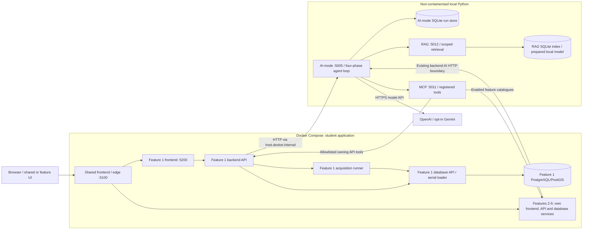

# Release 1 Shared and Feature 1 handoff

Status: implementation and measured evidence; final aggregate/review/workflow evidence is tracked
below. Owner: Matthew Shelton. Branch: `Matt/Release_1_Shared_and_Feature_1`.
Repository: [MattShelton04/41026ASDProject](https://github.com/MattShelton04/41026ASDProject).

This increment implements shared Release 1 tooling and Feature 1's grounded coverage/import
guidance. It retains the merged Fieldbook UI and existing enabled student applications. It does
not claim other owners' complete MCP/RAG integration, their assessment evidence or a finished
five-person submission. The marking rubric supplied on 6 September overrides the older archived
plan where it requires **host-local, non-containerised AI-mode/MCP/RAG/loop and disabled MCP/RAG
in CI/CD**. Release 2 multi-agent coordination and Azure remain future work.

Read the [reviewed implementation plan](shared-feature-1-implementation-plan.md),
[ADR-043](../architecture/decisions/ADR-043-local-grounded-runtime.md),
[living architecture](../architecture/shared-platform-design.md),
[host runtime](host-runtime.md), [feature adoption](feature-adoption.md) and
[retrieval evaluation](retrieval-evaluation.md) for the maintained contracts and exact limits.
The original [five-feature delivery plan](release-1-delivery-plan.md) retains wider assessment
context; its earlier runtime assumptions are superseded by this rubric/ADR.

## Architecture and repository



The generic `Others` box represents independently owned services, not a combined database or
Shared business module. Feature 1's database API/loader alone receive PostgreSQL credentials;
PostgreSQL alone mounts its volume. Only AI-mode opens its run store; only RAG opens its index.
MCP and AI-mode never query feature databases directly. The host loop is part of AI-mode, not an
additional Compose service. Managed AI-mode requires an internal service token from the backend
clients/shared proxy on every route except liveness. This protects the Docker-reachable host
entrypoint; end-user production authentication remains outside this trusted local demo.

The [current repository tree](../architecture/shared-platform-design.md#17-current-release-1-repository-structure)
shows `ai-services/{agent-core,ai-mode,mcp-server,rag-server}`, `shared/{contracts,tool-runtime,frontend}`,
the retained `student-1` through `student-5` slices, `student-1/config/rag`, deployment projections
and local validation scripts. The single workspace lock pins service dependencies. Generated
schema/OpenAPI and deployment projections remain drift-checked.

## MCP and RAG interaction

```mermaid
sequenceDiagram
  actor User
  participant UI as Feature 1 / shared assistant
  participant Backend as Feature 1 backend
  participant AI as Host AI-mode and loop
  participant MCP as Host MCP
  participant RAG as Host RAG
  participant Model as Model provider
  User->>UI: Ask about coverage or import evidence
  UI->>Backend: POST /api/data-platform/v1/assistant/turns
  Backend->>AI: POST /api/v1/agent-runs (owned scope / context / tools)
  AI-->>Backend: Durable queued run
  Backend-->>UI: Accepted run identity
  AI->>Model: Plan with registered tools and fixed corpus
  Model-->>AI: Bounded structured plan
  par Act: current owning facts
    AI->>MCP: tools/call + signed invocation metadata
    MCP->>Backend: Registered HTTP tool path after scope / approval checks
    Backend-->>MCP: Structured owning result
    MCP-->>AI: Validated ToolResult
  and Act: project guidance
    AI->>RAG: POST /api/v1/retrieve (fixed feature / corpus)
    RAG-->>AI: Status, version, excerpts and citations
  end
  AI->>AI: Observe recorded public results
  AI->>Model: Adapt using untrusted evidence and support requirements
  Model-->>AI: Typed findings, confidence, gaps and next step
  AI->>RAG: Recheck active corpus identity before grounded completion
  AI->>AI: Validate IDs / scope / confidence; persist final result
  loop Until terminal or route leaves
    UI->>Backend: Read owned turn and events
    Backend->>AI: Read persisted run
    AI-->>Backend: Persisted answer and source metadata
    Backend-->>UI: Owned answer and events
  end
  User->>UI: Inspect source with keyboard or pointer
```

The parallel branches illustrate independent permitted Act paths; execution remains bounded by
the existing runner's actual plan/policy. Model text supplies neither service credentials nor
arbitrary dispatch URLs. A current-corpus mismatch fails completion rather than silently claiming
old guidance is current. No-context and outage answers retain a visible insufficiency boundary.

| Public/runtime surface | Input and output | Boundary |
|---|---|---|
| Feature assistant `.../turns` | Bounded message, scope, explicit page context/history → owned durable run | Frontend never calls MCP/RAG directly |
| MCP `/mcp` | SDK discovery and typed tool calls → original structured schemas plus correlated tool result | Bearer token and signed short-lived feature/run/call/argument/approval binding |
| MCP catalogue resource | `propertyscope://tools/catalog` → approved tool metadata | No service origins, database reads or arbitrary resources |
| RAG `POST /api/v1/corpora/ingest` | Complete `CorpusIngestRequest` → immutable `CorpusVersion` | Authenticated, registered public feature corpus; URLs are never fetched |
| RAG `POST /api/v1/retrieve` | `RetrievalRequest` → explicit status and bounded `EvidenceCitation` list | One fixed feature/corpus; top-k/context limits |
| RAG `GET /api/v1/corpora/{feature}/{corpus}` | Registered identity → active version | Completion freshness check |
| Shared `/api/ai-mode/capabilities` | GET → implemented/enabled/status/detail for MCP/RAG | Observed runtime health; no secret/internal target URLs |

Feature 1's [catalogue](../../student-1/tool-catalog.yaml) is the exact registered-tool authority.
The assistant allowlist contains `platform.capabilities.v1`, source/release/run lists and
inspection/explanation/comparison tools, `data.coverage.v1`, and property search/inspection/locality
summary. Their schemas remain feature-owned; MCP does not translate them into new domain entities.
`context.retrieve.v1` is the shared read-only guidance path added for registered grounded runs.
Publication approval and mutation workflows retain their existing separate protected boundaries.

## Knowledge, grounding and evaluation

The [corpus manifest](../../student-1/config/rag/corpus.json) contains ten authored CC0 guidance
topics. It explains publication, partial PSI years, accepted discovery, missing evidence, import
diagnosis, provenance, recovery, crime coverage, consumer boundaries and guidance limits. It is
not official methodology, a valuation/inspection source or proof of current database state.

FastEmbed 0.7.4 uses prepared local `BAAI/bge-small-en-v1.5` CPU assets, 384 dimensions. The measured
corpus version is `4ec85c9da899a9c086a76bed335aeaa1419793df2110bb2df8eed5a0d510f8c9`.
Full-batch replay preserves version/time; withdrawal and failed refresh preserve explicit state.
Source dates and indexing dates mean different things. Historical answers retain their excerpts
and version even after the active corpus changes.

The [versioned evaluation baseline](../../student-1/config/rag/evaluation-baseline-v1.json) measured
expected-document recall@5 of 1.0 on 12 authored supported cases. Five negatives expose important
limits: unrelated, historical and malicious passages can rank highly. The initial unrelated
recipe probe in local `validation-rag-insufficient.json` actually returned ready/moderate; it is
**not evidence of insufficient-context handling**. The explicit provider refusal below supplies
that separate evidence. Do not infer entailment, freshness, authorization or general research
quality from this small retrieval development set.

## Captured validation and evidence

Portable JSON in [evidence/](evidence/README.md) retains allowlisted public outputs and model metrics.
Original operational history, logs, provider credentials and model files remain outside Git.
The named validation files contain actual MCP/RAG transport and four-phase results, with
deterministic `extractive-validation.v1` decisions; they are not real-model response evidence.

| Requirement / check | Observed evidence | Limit |
|---|---|---|
| Named MCP loop mode | [Captured result](evidence/validation-mcp.json): run `56776025-5b0f-4388-978e-f89e850b6137`, succeeded through Plan/Act/Observe/Adapt and registered Feature 1 tool | Deterministic model decisions, real local transport |
| Named RAG loop mode | [Captured result](evidence/validation-rag.json): run `c94635e7-2a85-40fc-b693-e71ad44cecc7`, succeeded with cited guidance and moderate confidence | Extractive validation does not assess answer entailment |
| Actual Feature 1 provider + UI | [Public summary](evidence/live-feature1-provider-summary.json): run `31c68355-39ed-4441-8930-a563487fa6a7`, partial PSI publication question, 4 phases, 2 calls, 4 citations, low confidence for missing particular-release context | Guidance explanation; no specific release was inspected or approved |
| Actual insufficient answer + UI | [Public summary](evidence/live-feature1-insufficient-summary.json): run `8ce0978e-7e48-4e49-b95c-f51d60c4b5ac`, unrelated recipe, insufficient confidence, no citations | Prompt explicitly asked for refusal if project sources did not cover the topic |
| RAG stopped / ordinary reads retained | [Public summary](evidence/live-feature1-rag-outage-summary.json): run `c680054c-7129-4665-9bf6-e2e83b4ab5c0`, insufficient with no citations and one retained tool fact; MCP ready, RAG unavailable, sources HTTP 200 | Recorded before service-auth hardening; authenticated integration is separately captured below |
| MCP stopped / bounded failure | [Local integration checks](evidence/local-integration-checks.json): expected failed validation, `mcp_unavailable` in 2.156 s, `retryable=false`; RAG ready and sources HTTP 200 | The validation's `passed=false` is the expected outage result, not a healthy transport pass |
| Host restart persistence | [Local integration checks](evidence/local-integration-checks.json): same 10-document corpus version and ingestion timestamp after restart; prior succeeded run retained 4 citations | Bounded restart observation, not crash/recovery of a source-scale import |
| Ordinary source CRUD | [Local integration checks](evidence/local-integration-checks.json): synthetic create/read/update/delete/read-after-delete = 201/200/200/204/404 | Test record removed; does not mutate accepted production releases |
| Provider identity / usage | `default.v8`, `remote-standard.v1`, OpenAI planner `gpt-5.6-luna` and adapter `gpt-5.6-terra`; supported run 12.401 s, 17,106 input / 986 output tokens; refusal 9.058 s, 18,890 input / 490 output tokens | Single observed runs; not an SLA or comparative quality benchmark |
| Shared status / roadmap | Real `localhost:5100` pages displayed observed MCP/RAG readiness with no uncaught page errors | Health and enablement do not establish every feature's corpus coverage |
| Grounded presentation | Node tests plus explicitly injected real-origin fixture at 1440/390/320px: Enter opens/focuses source, literal malicious text, unsafe-link rejection, source/index dates/version, no horizontal overflow | Synthetic answer fixture, distinct from actual provider UI interaction |
| Required Feature 1 form browser suite | 41 passed in 51.62 s; local `feature1-browser-tests.log` | Existing deterministic form flows; not source-scale ingestion or model proof |
| Focused Shared UI checks | 35 Node tests; `check.py compile` and `check.py styles` passed after Fieldbook merge | Final aggregate gate passed; see Final verification below |
| Full canonical gate and independent final review | Two independent reviewers identified host authentication, bounded verification, retained-version metadata and explicit env-file loading; all verified and repaired with regressions | Final canonical gate passed; see results below |
| Workflow runs and final authenticated-stack checks | [Authenticated integration](evidence/final-authenticated-integration.json): direct host 401 without token / 200 with token; browser edge, sources and durable turn 200; two new actual provider runs succeeded | Final workflow links follow the PR |

Six existing accepted releases were retained. Live artifact checks exposed pre-existing local
evidence limits: one accepted fixture's artifact file is missing (503), and current G-NAF/SEIFA
public downloads return 403 under their metadata-only source policy. This increment did not change
licences, fabricate files or republish existing releases to manufacture an export pass. These
observations do not establish an immutable-artifact download/hash smoke; final report claims must
retain that limitation or attach separate valid evidence.

Local raw files are under `.propertyscope-runtime/release-1/`; browser fixture/status screenshots
are under `tmp/release-1-grounding-ui/`. They are intentionally ignored. The actual provider source
click was observed in the integrated browser. The [actual provider screenshot](evidence/live-grounded-answer.png)
captures run `f3372765-d9cd-49b7-a792-bc6d2d516b35` after the secured rebuild, with the fixed
composer visible in the full-page capture. The final showcase video remains a human submission item.

## Rubric and owner handoff

| Rubric area | Shared/Feature 1 delivery | Remaining submission responsibility |
|---|---|---|
| Project architecture | Host-only runtime, preserved student containers, current tree and diagrams above | Incorporate diagrams in the final group Technical Report |
| Student microservices | Existing Feature 1 data platform and merged UI retained | Each owner validates their own feature and records minimum-table interpretation |
| MCP | Shared registered transport and Feature 1 frontend/backend path | Every other owner supplies their feature interaction evidence |
| RAG / grounded responses | Explicit corpus, citations/confidence/gaps and insufficient example | Owner-specific corpus/tasks, ground truth and source permissions |
| Shared loop | Both named modes captured | Demonstrate and explain deterministic mode versus actual provider |
| DevOps / workflows | Five workflows retain builds/validation with MCP/RAG disabled | Successful final workflow links/logs and identifiable owner commits |
| Compose | Student-only topology with backend-to-host routing | Preserve final deployment/status/application evidence |
| Integrated software | Shared/F1 path plus retained other applications | Group-wide acceptance is not supplied by one owner's increment |
| Technical Report / project evidence | Portable outputs, architecture, limitations and contribution traceability | Final report, showcase URL, individual contribution logs and approvals |
| Demonstration / Q&A | Reproducible commands and boundaries documented | Each student's attendance, explanation and tutor assessment |

Other owners can begin from [feature-adoption.md](feature-adoption.md). No unagreed Feature 4 data
product, private corpus or domain business behavior has been invented. Durable tutor approval for
the OpenAI/PostgreSQL exceptions, the operational-table record minimum interpretation, a new group
video/showcase URL, each owner's contribution evidence and final Q&A remain human assessment
items. These do not become completed simply because Shared/Feature 1 tests pass.

Use focused commits on the requested branch and record the final PR link and CI checks here once
created. The [reviewed plan](shared-feature-1-implementation-plan.md#independent-plan-review-resolution-6-september)
retains the independent preimplementation review and resolution of all eight findings. Final
independent code review must be validated against the final integrated diff before merge.


Final local continuation (7 September): all 20 Docker containers are running; all configured
container health checks pass and the three shared AI processes run on the host. The secured
source-inventory run `6debe532-4a0c-4f44-9ae3-3e86caf24bd2` used four actual tool calls and
separated six current registered-source facts from cited missing-evidence guidance. The fresh
browser capture completed without page errors. `data collect fixture-property --timeout 90`
completed run `6e5f24a8-af27-40b0-89a1-dc786970f768`, creating a 10-record candidate
`f4a48747-0a65-40ef-ab82-720266fd6e7c`; it remains unpublished for human review. Download correctly
returns 409 before publication. This verifies the live acquisition/staging/build path without
changing accepted data or bypassing the approval boundary.

## Final verification

`uv run python scripts/check.py` completed successfully on 7 September 2026: formatting,
lint, strict typing, JavaScript compilation, styles, architecture and generated-contract checks,
then 1,837 Python tests and 208 frontend Node tests. Coverage: shared/core 90.80%, Feature 1
74.09%, Feature 2 79.78%, Feature 3 91.29%, Feature 4 90.02%, Feature 5 82.63%. All configured
thresholds passed. There were 38 expected skips: 36 tests requiring an explicit disposable
PostgreSQL administration URL and two Windows symlink-privilege checks. The live fixture import
used the running PostgreSQL stack; it does not replace that separate destructive recovery suite.
The required Feature 1 Playwright suite passed 41 tests. The final malformed-credential regression
was also rerun with all 13 host-runtime tests passing, then the host was restarted and the secured
edge/history checks passed again. Local full execution log: `.propertyscope-runtime/release-1/final-quality-gate.log`.

Independent plan review and both final code reviews are resolved; their verified findings and
fixes are listed in the reviewed plan. The PR associated with branch
`Matt/Release_1_Shared_and_Feature_1` carries the final GitHub Actions results and review discussion.
Those runs validate CI configuration with MCP/RAG disabled; the local captures validate the enabled runtime.

Activity-history follow-up (7 September): the shared operations page now reuses the grounded
chat renderer for findings, confidence, gaps, tool references and expandable citations. The
existing run `e3889f10-a094-4e85-bfe0-165a4c8ae18c` was inspected live through port 5100;
findings display as text and source inspection expands the recorded excerpt and provenance.
The homepage now explains that both assistant scopes use the Property data backend. Routing
and mandatory retrieval for configured grounded Feature 1 runs remain unchanged.
The canonical gate passed all static checks and 1,840 Python tests (38 expected skips).
Its only frontend failure was an assertion for the previous asset cache version; after updating
that assertion, the complete frontend stage passed all 209 tests. Local logs are
`.propertyscope-runtime/release-1/history-quality-gate.log` and `history-frontend-recheck.log`.

