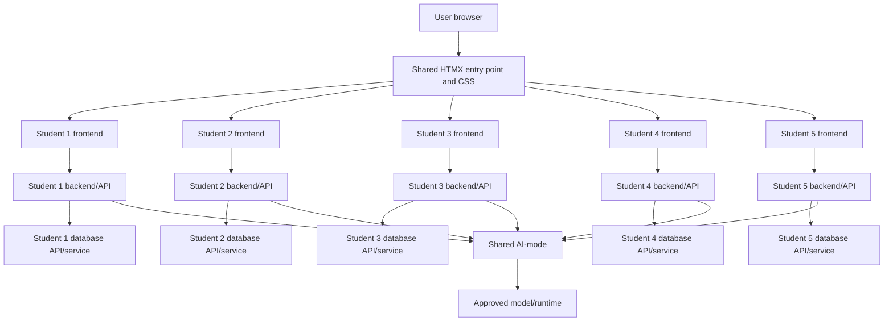
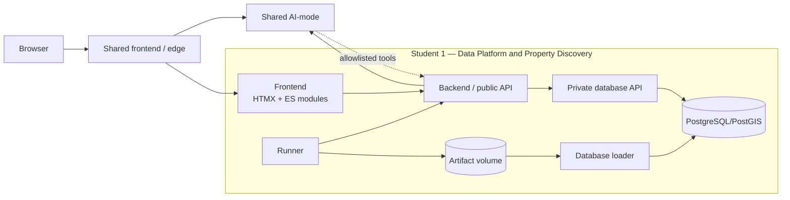
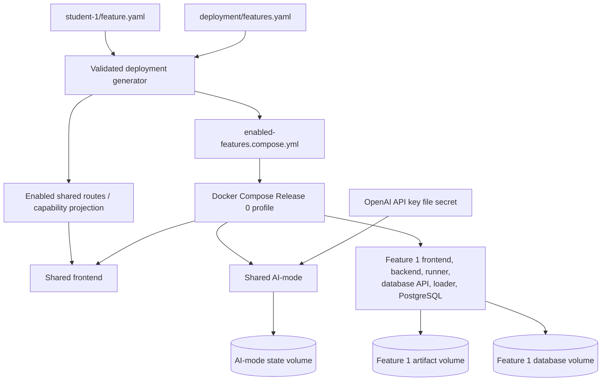
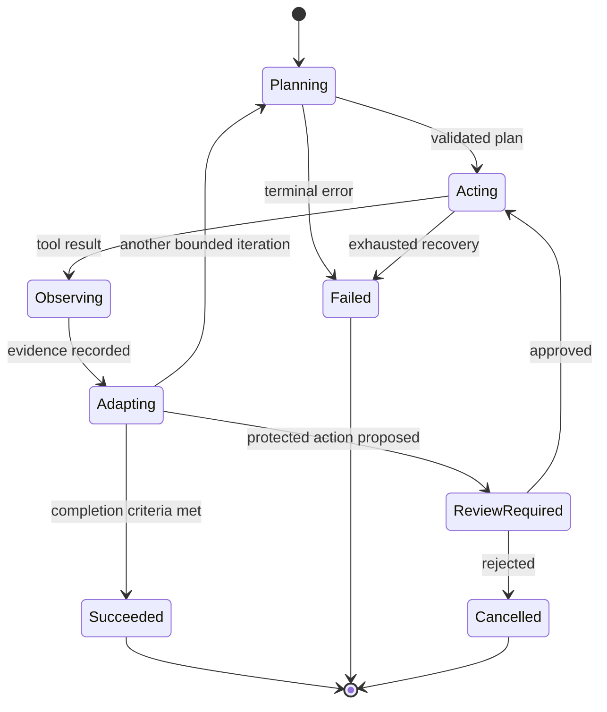
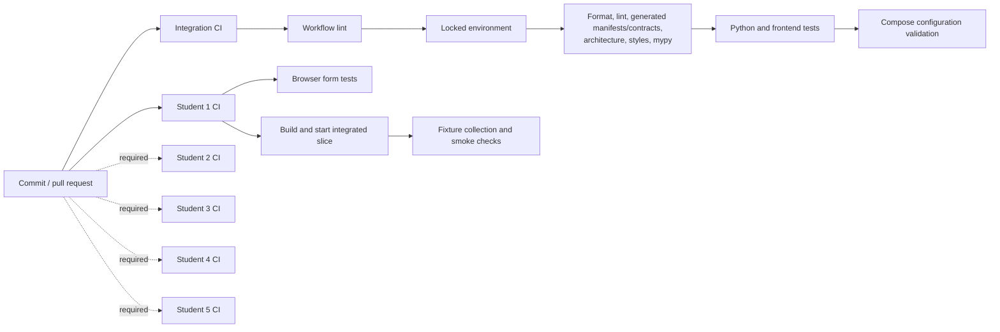

# 41026 Advanced Software Development

## Assessment 1 — Release 0 Technical Report

**Project:** PropertyScope NSW

**Canvas group:** 20

**Assessment:** Release 0 — Agentic AI Foundations, Microservices & DevOps

**Weight:** 20%

**Due:** 6 September 2026, 11:59 pm Sydney time

**Document status:** Working draft — **not ready for submission**

> This scaffold is deliberately honest about incomplete work. Replace every
> `[TODO]`, `[EVIDENCE NEEDED]`, and `[DECISION NEEDED]` marker before
> exporting the final report to PDF. Do not claim a planned feature as implemented.

## Document control

| Field | Value |
|---|---|
| Report owner | Group 20 |
| Current draft date | 1 September 2026 |
| Repository | [41026ASDProject](https://github.com/MattShelton04/41026ASDProject) |
| Release candidate commit | `[TODO: insert final immutable commit SHA]` |
| Published demonstration URL | `[TODO: insert public video URL; 10 minutes maximum]` |
| Canvas submission | One group PDF |
| Source priority | Published Canvas Release 0 assignment and ASD 2026 Project Specifications |

## Executive summary

PropertyScope NSW is an integrated property-research application designed to
help users examine NSW property information while keeping sources, coverage,
uncertainty, and limitations visible. The approved team design divides the
product into five independently owned vertical feature slices connected through
a shared product shell, shared visual system, shared AI-mode service, versioned
HTTP APIs, and one Docker Compose application.

At the date of this draft, the Shared platform and Feature 1 form an operational
Release 0 candidate slice. The shared shell and Feature 1 Source CRUD now use
vendored HTMX flows, while manifests generate enabled routes and Compose
profiles. Feature 1 provides the governed data platform and property-discovery
capability through independently deployed frontend, backend/API, runner,
database API/loader, and PostgreSQL/PostGIS services. Shared AI-mode provides
durable, bounded Plan → Act → Observe → Adapt runs, versioned prompts,
allowlisted tools, evidence, parallel read-only stages, and human-review gates.

**Current limitation:** Features 2–5 are approved and allocated but are not yet
implemented or integrated. The complete five-feature application, final group
evidence, technical-report artefacts, and demonstration video remain Release 0
completion gates. This report must be updated after those owners deliver their
vertical slices.

## 1. Project overview

### 1.1 Problem and product intent

Property research is fragmented across property identity, recorded sales,
suburb and crime evidence, planning and building information, and the buyer's
own notes and tasks. PropertyScope NSW aims to provide one research workspace
that:

- preserves source attribution, provenance, and freshness;
- distinguishes confirmed, partial, excluded, unavailable, and unknown evidence;
- provides deterministic functionality even when the model provider is unavailable;
- uses AI for bounded evidence synthesis rather than unsupported recommendations;
- keeps every feature's database and business rules under its owning service; and
- presents the five research areas through one shared entry point and visual system.

The product supports research and does not provide valuation, legal, safety,
lending, conveyancing, or buy/no-buy advice.

### 1.2 Release 0 scope

Release 0 is intended to deliver:

- five integrated frontend, backend/API, and database feature sets;
- visible CRUD for every assigned feature;
- at least ten deterministic records in every assessed database table;
- one shared, containerised home page and common CSS theme;
- AI-mode and the approved model/runtime configuration;
- a demonstrated Plan → Act → Observe → Adapt workflow;
- one shared Docker Compose application;
- `student-1.yml` through `student-5.yml` build/validation workflows;
- local testing and workflow evidence;
- one group technical report; and
- one published demonstration video of ten minutes maximum.

### 1.3 Team and feature allocation

| Student | Name | Student ID | Approved feature | Current implementation status |
|---:|---|---:|---|---|
| 1 | Matthew Shelton | 24763373 | Data Platform and Property Discovery | Implemented candidate slice |
| 2 | Burhan Naeem | 24764134 | Property Sales Explorer and Market Cases | Planned; implementation required |
| 3 | James Huang | 24970865 | Suburb, Crime, and Liveability Analytics | Planned; implementation required |
| 4 | Michael White | 24846267 | Site, Planning, and Building Due Diligence | Planned; implementation required |
| 5 | Derek Song | 24833978 | Buyer Journey and Agent Workspace | Planned; implementation required |

The approved purposes and persistence boundaries are recorded in
[PropertyScope approved team and feature scope](../architecture/registered-feature-scope.md).

## 2. Agile project analysis and planning

### 2.1 Team process

The repository uses short-lived branches and reviewed pull requests against
`main`. Work is accepted only after the canonical quality gate passes; shared or
boundary changes also update the relevant contracts, architecture records, and
tests. Feature owners remain responsible for their vertical slice, while shared
integration changes require review from affected owners.

`[TODO — team: add the actual sprint length, planning/review cadence,
communication channel, issue-board workflow, and blocker-escalation practice.
Do not infer these from repository history.]`

### 2.2 Release 0 sprint goal

Deliver one locally deployable PropertyScope application in which all five
students can navigate from the shared home page to their feature, demonstrate
frontend → backend/API → owned database CRUD, invoke the approved AI-mode path,
and show retained CI, Compose, testing, and agentic-workflow evidence.

### 2.3 Sprint backlog

| ID | Backlog item | Owner | Acceptance evidence | Status |
|---|---|---|---|---|
| R0-01 | Reproducible shared repository and contracts | Shared / Student 1 | Locked environment and canonical checks | Done |
| R0-02 | Shared product shell, HTMX entry flow, and CSS design system | Shared / Student 1 | HTMX research-area fragments, responsive captures, style validation | Done for Shared + Feature 1 |
| R0-03 | Shared AI-mode and persisted agent loop | Shared / Student 1 | APIs, prompts, tools, tests, live evaluation | Done for current slice |
| R0-04 | Feature 1 vertical slice | Student 1 | Frontend/API/database, CRUD, tests, Compose, evidence | Candidate complete |
| R0-05 | Feature 2 vertical slice | Student 2 | `[TODO]` | Not started in integrated repository |
| R0-06 | Feature 3 vertical slice | Student 3 | `[TODO]` | Not started in integrated repository |
| R0-07 | Feature 4 vertical slice | Student 4 | `[TODO]` | Not started in integrated repository |
| R0-08 | Feature 5 vertical slice | Student 5 | `[TODO]` | Not started in integrated repository |
| R0-09 | Integrate five slices into Compose and shared shell | Team | One-machine deployment and cross-feature smoke | Blocked by R0-05–R0-08 |
| R0-10 | Implement five student CI workflows | Each owner | Successful workflow run URLs | Student 1 only |
| R0-11 | Capture seed-count, test, UI, CI, and Compose evidence | Team | Attached tables/screenshots/logs | Partial |
| R0-12 | Complete report, video, rehearsal, and attendance | Team | Final PDF, URL, checklist | Not started |

### 2.4 Overall project plan

| Milestone | Target | Exit condition | Status |
|---|---|---|---|
| Approved team and feature allocation | End of Week 4 | Signed form and tutor approval retained | Reported complete; attach durable evidence |
| Feature thin slices | `[TODO: team date]` | Five CRUD-capable slices locally testable | Feature 1 only |
| Integration freeze | `[TODO: team date]` | Five healthy slices in Compose and shared shell | Not reached |
| Evidence and video freeze | `[TODO: team date]` | Screenshots, workflow runs, video and contribution records retained | Not reached |
| Report quality review | `[TODO: team date]` | Rubric traceability has no unsupported claims | Not reached |
| Canvas submission | 6 September 2026, 11:59 pm | One final PDF submitted | Pending |

## 3. Requirements and individual feature plans

### 3.1 Common functional requirements

Every feature must:

1. expose an independently deployed frontend;
2. expose a versioned backend/API;
3. own an exclusive database service and schema;
4. provide visible Create, Read, Update, and Delete operations;
5. contain at least ten deterministic records per assessed table;
6. use the shared entry point and common visual system;
7. interact with the approved AI-mode/model configuration;
8. demonstrate a bounded Plan → Act → Observe → Adapt workflow;
9. provide health/readiness and deterministic tests; and
10. communicate with other features only through versioned HTTP APIs or
    validated publication artefacts.

### 3.2 Common non-functional requirements

| Area | Requirement | Evidence |
|---|---|---|
| Reproducibility | Python 3.12 workspace and dependencies reproduce from `uv.lock` | Canonical CI and local quality gate |
| Isolation | No feature imports another student's production package or opens another database | Architecture validator |
| Resilience | Deterministic CRUD/evidence paths remain available when AI is unavailable | `[TODO: record five-feature test evidence]` |
| Security | Secrets remain outside images/config; tool inputs are allowlisted and validated | Compose secret and contract tests |
| Observability | Runs retain status, events, request IDs, evidence, and safe failures | AI-mode run APIs and UI |
| Accessibility | Keyboard, focus, labels, responsive layout, and non-colour state indicators | UI audit and browser tests |
| Performance | Feature 1 source-scale work is measured against explicit row, byte, time, disk, WAL, and cancellation bounds; each remaining feature still needs user-facing response targets | Source-scale benchmark and `[EVIDENCE NEEDED: Features 2–5]` |
| Maintainability | Typed boundaries, small modules, deterministic tests, documented decisions | Lint, mypy, ADRs, coverage |

### 3.3 Feature 1 — Data Platform and Property Discovery

**Owner:** Matthew Shelton

**Functional scope:** Source/job CRUD, complete registered-source acquisition,
run monitoring, cancellation and recovery, validation and provenance inspection,
release review, asynchronous publication/activation, property discovery, and
AI-assisted failure diagnosis.

**Current implementation:** Feature 1 is implemented as separate frontend,
backend, runner, database API, loader, and PostgreSQL/PostGIS containers. The
backend and runner access the database only through its private HTTP API; only
the database API and loader receive database credentials. The feature publishes
versioned, validated data products for downstream consumers.

**Data design:** The current persistence design separates operational source/job
state, immutable acquisition evidence, candidate/accepted releases, canonical
property/address and sale-history data, attributed datasets, durable consumer
imports, activations, and publication receipts. The [Feature 1 implementation
plan](../release-0/propertyscope-feature-1-implementation-plan.md#6-release-0-logical-data-model)
contains the logical/physical model and seed plan; the
[schema-fingerprint policy](../architecture/feature-1-schema-fingerprint-policy.md)
defines reproducible physical-schema drift evidence.

`[TODO: add the final report-sized conceptual model/ERD and a table-by-table
ten-record count report. Link the full design rather than copying its field-by-field detail.]`

**Feature 1 risk plan**

| Risk | Impact | Mitigation | Remaining action |
|---|---|---|---|
| Official source size/availability | Slow or incomplete acquisition | Complete-source adapters, caching, checksums, typed streaming, calibrated capacity and cancellation | Retain final run evidence |
| Incorrect or partial data presented as certain | Misleading research | Provenance, coverage states, quality gates, human publication review | Review final showcase candidate |
| Remote model failure | AI path unavailable | Deterministic CRUD remains usable; explicit provider health | Capture offline and live evidence |
| Database/runtime exception differs from brief | Marking compliance risk | Reported tutor approval for PostgreSQL/PostGIS | Attach written approval |
| Literal ten-record-per-table rule | Marking evidence gap | Reproducible seed/count report | Obtain interpretation and attach report |

See [Feature 1 README](../../student-1/README.md),
[marking evidence](../../student-1/MARKING_EVIDENCE.md), and
[AI evaluation](../../student-1/AI_EVALUATION.md).

### 3.4 Feature 2 — Property Sales Explorer and Market Cases

**Owner:** Burhan Naeem

**Approved scope:** Attributed sale history, deterministic market summaries,
market-case CRUD, filters/notes/status, and bounded AI explanations.

`[TODO — Student 2: add functional and non-functional requirements, feature
plan, risk plan, conceptual/ER/logical/physical data design, software
architecture diagram, API contract,
ten-record seed evidence, tests, screenshots, and implementation summary.]`

### 3.5 Feature 3 — Suburb, Crime, and Liveability Analytics

**Owner:** James Huang

**Approved scope:** Suburb search/filter/sort, saved/favourite suburb CRUD,
crime/liveability/amenity projections, cards, visualisations, and maps.

`[TODO — Student 3: add functional and non-functional requirements, feature
plan, risk plan, conceptual/ER/logical/physical data design, software
architecture diagram, API contract,
ten-record seed evidence, tests, screenshots, and implementation summary.]`

### 3.6 Feature 4 — Site, Planning, and Building Due Diligence

**Owner:** Michael White

**Approved scope:** Site-review CRUD, attributed planning/environmental/building
evidence, explicit coverage states, editable checklists, and bounded
AI-generated professional-verification questions.

`[TODO — Student 4: add functional and non-functional requirements, feature
plan, risk plan, conceptual/ER/logical/physical data design, software
architecture diagram, API contract,
ten-record seed evidence, tests, screenshots, and implementation summary.]`

### 3.7 Feature 5 — Buyer Journey and Agent Workspace

**Owner:** Derek Song

**Approved scope:** Buyer-case, shortlist, note and task CRUD; journey stages;
cross-feature evidence; AI summaries; suggested next actions; and explicit
missing-data/AI-unavailable states.

`[TODO — Student 5: add functional and non-functional requirements, feature
plan, risk plan, conceptual/ER/logical/physical data design, software
architecture diagram, API contract,
ten-record seed evidence, tests, screenshots, and implementation summary.]`

## 4. Repository and software architecture

### 4.1 Repository structure

| Path | Responsibility |
|---|---|
| `.github/workflows/` | Integration, student, and later cloud workflows |
| `shared/` | Contracts, testkit, shared frontend/edge, design system, and configuration |
| `ai-services/agent-core/` | Deterministic bounded agent state machine |
| `ai-services/ai-mode/` | Provider adapter, prompts, tools, durable run API, persistence |
| `student-1/` … `student-5/` | Independently owned feature slices |
| `scripts/` | Quality, development, Compose, fixture, and UI-audit tooling |
| `docs/` | Architecture, decisions, designs, release plans, evidence, and reports |
| `docker-compose.yml` | Integrated local Release 0 runtime |

### 4.2 Target Release 0 topology



### 4.3 Current implemented topology and Feature 1 architecture

The current Compose model contains eight services: shared frontend, shared
AI-mode, Feature 1 frontend, backend, runner, database API, database loader, and
PostgreSQL/PostGIS. Feature 1 is enabled from its validated manifest through a
generated deployment overlay. Features 2–5 are not yet represented by runtime
services.



### 4.4 Integration rules

- Each database has one owner and is never opened by another feature.
- Cross-feature reads use versioned APIs or validated publication artefacts.
- Feature 1 owns canonical property identity and accepted data releases.
- Feature 5 owns runtime cross-feature composition.
- AI-mode may call allowlisted feature tools but never feature databases.
- The shared layer owns the entry point, routes, common design tokens, global
  status/evidence surfaces, and domain-neutral browser capabilities.

See the [integration and experience contract](../architecture/feature-integration-and-experience-contract.md)
and [shared platform design](../architecture/shared-platform-design.md).

### 4.5 Shared index and HTMX implementation

The shared, containerised `index.html` now loads the research-area directory as
a same-origin HTMX fragment using a vendored, pinned HTMX build. Feature 1 also
uses backend-rendered HTMX fragments for visible Source Create, Read, Update,
Delete, filtering, retry, and error states. JavaScript remains for maps, chat,
complex state, and adaptive polling where it is the clearer interaction model.

This closes the earlier HTMX gap for the implemented slice. Each remaining
feature must still integrate through the shared HTMX entry point and common
theme when its independently owned frontend is delivered.

## 5. Docker Compose architecture

The production-like and development Compose models currently validate and run
the Shared + Feature 1 slice. Validated feature manifests generate the enabled
Compose profiles and shared routes, preventing disabled placeholders from being
presented as running services. Feature 1 uses explicit HTTP boundaries and keeps
its database volume and credentials private to its database API/loader services.



`[TODO: after Features 2–5 are added, replace the current topology with the
final rendered Compose diagram and include the exact release command, service
list, health results, ports, and screenshot/log evidence from one team member's
computer.]`

**Final local deployment command**

```text
uv run scripts/dev.py stack up
```

**Current verification commands**

```text
uv run python scripts/check.py
uv run python scripts/generate_deployment.py --check
docker compose --file docker-compose.yml --file deployment/enabled-features.compose.yml --profile release-0 config --quiet
docker compose --file docker-compose.yml --file deployment/enabled-features.compose.yml --file docker-compose.dev.yml --profile release-0 config --quiet
```

## 6. AI-mode and agentic workflow

### 6.1 AI-mode

Shared AI-mode provides:

- provider/model profiles behind an explicit adapter boundary;
- versioned planner and adapter prompt assets with bounded follow-up context;
- a serial durable run queue and SQLite workflow store;
- feature-scoped, schema-validated tool catalogues;
- ordered or parallel read-only tool stages, idempotency, bounded retries,
  cancellation, and recovery;
- human-review gates for protected actions; and
- redacted run, event, and evidence APIs.

The approved feature-scope record identifies the default `remote-standard.v1`
OpenAI Responses API profile: GPT-5.6 Luna for planning and GPT-5.6 Terra for
adaptation/review. Because the published project specification names Ollama and
approved open-source models, the final evidence bundle must include the signed
registration/tutor approval for this model/runtime selection.

### 6.2 Plan → Act → Observe → Adapt



Every material step records its state transition, prompt version, tool
arguments, result/evidence reference, timing, and safe outcome. The strongest
current Feature 1 demonstration is the failed-import recovery scenario described
in [Feature 1 AI evaluation](../../student-1/AI_EVALUATION.md).

### 6.3 Prompt engineering and context management

Prompt assets are stored outside application code, versioned, and accompanied
by metadata. The planner receives bounded feature scope and available tool
schemas; the adapter receives recorded observations and must preserve unknown
states. Feature tools validate input/output schemas and enforce ownership,
size, timeout, identifier, and approval rules. Shared/Feature 1 currently retains
planner and adapter revisions `v1`–`v7`; the run record identifies the prompt and
model profile actually used so the final report can cite a reproducible trace.

`[TODO: add each student's feature-owned prompt/context contribution, one
before/after improvement, and the resulting run evidence. Do not duplicate the
full prompt text.]`

## 7. DevOps and GitHub Actions

### 7.1 Pipeline



### 7.2 Workflow status

| Workflow | Current state | Final evidence |
|---|---|---|
| Integration CI | Implemented and passing | [1 September main run](https://github.com/MattShelton04/41026ASDProject/actions/runs/33402105179) |
| Student 1 CI | Implemented; browser and integrated container jobs passing | [1 September main run](https://github.com/MattShelton04/41026ASDProject/actions/runs/33402105173) |
| Student 2 CI | Disabled scaffold | `[TODO]` |
| Student 3 CI | Disabled scaffold | `[TODO]` |
| Student 4 CI | Disabled scaffold | `[TODO]` |
| Student 5 CI | Disabled scaffold | `[TODO]` |

## 8. Implementation summary

### 8.1 Shared platform

Implemented shared capabilities include the unified product shell, design
tokens and components, feature registry, status/evidence views, reusable AI
chat, bounded mapping provider, shared contracts and consumer protocol, testkit,
AI-mode, manifest-driven onboarding/deployment, operations reporting, and
architecture/quality validators.

### 8.2 Feature 1

Implemented Feature 1 capabilities include property discovery; source and job
CRUD; complete-source acquisition; durable run monitoring, cancellation and
recovery; validation; candidate review and publication; attributed releases;
checksum/schema-validated consumer publication and durable activation receipts;
accepted property/address and sale-history APIs; HTMX Source CRUD; source-scale
capacity evidence; and AI-assisted diagnosis.

### 8.3 Features 2–5

`[TODO: replace with honest implementation summaries after each feature is
merged. Include routes, APIs, tables, CRUD operations, AI workflow, tests,
Docker services, limitations, and evidence links.]`

## 9. Testing and validation evidence

### 9.1 Current deterministic quality gate — 1 September 2026

| Check | Result |
|---|---|
| Formatting and Ruff lint | Passed |
| Contract generation and architecture boundaries | Passed |
| Model registry and feature tool catalogues | Passed |
| Shared frontend style baseline | Passed |
| Mypy | Passed for 162 source files |
| Core/shared Python tests | 592 passed, 1 Windows symlink test skipped |
| Core/shared branch coverage | 90.36% |
| Feature 1 Python tests | 542 passed, 20 disposable-PostgreSQL tests skipped without the opt-in URL |
| Feature 1 branch coverage | 71.52% |
| Frontend behavior tests | 101 passed |
| Production Compose configuration | Passed |
| Development Compose configuration | Passed |

### 9.2 Final integrated evidence required

- `[TODO]` Five-feature health/readiness result.
- `[TODO]` CRUD create/read/update/delete evidence for every student.
- `[TODO]` Ten-record-per-table report for every assessed table.
- `[TODO]` Successful AI request from every frontend/backend path.
- `[TODO]` One full Plan → Act → Observe → Adapt trace per student.
- `[TODO]` Five student workflow run URLs.
- `[TODO]` One-machine Docker Compose startup, service list, and smoke results.
- `[TODO]` Cross-feature API/publication tests.
- `[TODO]` NFR/endpoint testing results and response-time measurements.
- `[TODO]` Integrated desktop and mobile screenshots.

## 10. Demonstration plan

The published video must be no longer than ten minutes and every student must
demonstrate their own feature in the integrated application.

| Time | Presenter | Demonstration |
|---|---|---|
| 0:00–0:40 | `[TODO]` | Project goal, shared home, five research areas |
| 0:40–2:15 | Matthew | Feature 1 property discovery/data operations and bounded AI recovery |
| 2:15–3:45 | Burhan | `[TODO: Feature 2 journey]` |
| 3:45–5:15 | James | `[TODO: Feature 3 journey]` |
| 5:15–6:45 | Michael | `[TODO: Feature 4 journey]` |
| 6:45–8:15 | Derek | `[TODO: Feature 5 journey]` |
| 8:15–9:15 | `[TODO]` | Docker Compose deployment and integrated status |
| 9:15–10:00 | `[TODO]` | GitHub Actions and Plan → Act → Observe → Adapt evidence |

Published URL: `[TODO]`

Q&A preparation:

- Explain database ownership and API-only cross-feature access.
- Explain why deterministic CRUD remains available without AI.
- Show the approved model/runtime and database-exception evidence.
- State known limitations without overstating planned capability.
- Be ready to identify each student's commits, workflow, and evidence.

## 11. Known issues, limitations, and release risks

| Issue | Impact | Required action before submission |
|---|---|---|
| Features 2–5 are unimplemented | Integrated group application cannot be demonstrated | Owners implement, test, containerise, and merge complete slices |
| Student 2–5 CI files are disabled | Four individual workflow criteria lack evidence | Replace scaffolds and retain successful run URLs |
| OpenAI is approved in the scope record while the published specification names Ollama/open-source models | Model/runtime compliance evidence may be challenged | Attach the signed registration/tutor approval |
| Feature 1 uses tutor-approved PostgreSQL/PostGIS | Release wording refers to SQLite services | Attach a durable link/copy of the written exception approval |
| No per-table seed-count report | Literal ten-record requirement is unproven | Generate reproducible count evidence |
| No final report/video/contribution/attendance evidence | Submission package incomplete | Resolve remaining markers, attach evidence, and export PDF |
| Only Matthew identities appear in current Git shortlog | Individual contribution evidence is absent for four students | Each owner makes attributable substantive commits |
| Feature 1 candidates require human publication review | Downstream/current-product demonstration may be stale | Review and publish the intended showcase candidate |

## 12. Contribution, commit, and attendance evidence

### 12.1 Contribution log

| Date | Student | Issue/PR | Contribution | Review/integration evidence |
|---|---|---|---|---|
| 26 July–1 September | Matthew | Selected PRs #20, #45, #51, #60–#64 | Shared platform, AI-mode, integration, and Feature 1 | Merged to `main`; current CI evidence in Section 7.2 |
| `[TODO]` | Burhan | `[TODO]` | Feature 2 | `[TODO]` |
| `[TODO]` | James | `[TODO]` | Feature 3 | `[TODO]` |
| `[TODO]` | Michael | `[TODO]` | Feature 4 | `[TODO]` |
| `[TODO]` | Derek | `[TODO]` | Feature 5 | `[TODO]` |

### 12.2 GitHub commit log

Current scaffold snapshot from `git shortlog -sne HEAD`:

| Student | Attributed commits | Current evidence | Remaining action |
|---|---:|---|---|
| Matthew | 53 across two Git identities | `f799c68` through `a5e2da7`; all current repository milestones | Regenerate from the final release commit and group selected SHAs by report contribution |
| Burhan | 0 | No attributable commit in the current shortlog | Add substantive Feature 2 commits and PR evidence |
| James | 0 | No attributable commit in the current shortlog | Add substantive Feature 3 commits and PR evidence |
| Michael | 0 | No attributable commit in the current shortlog | Add substantive Feature 4 commits and PR evidence |
| Derek | 0 | No attributable commit in the current shortlog | Add substantive Feature 5 commits and PR evidence |

`[TODO: replace this snapshot with a final table containing selected commit SHA,
date, summary, PR, and reviewed/merged status for every student.]`

### 12.3 Attendance checkpoints

| Checkpoint | Matthew | Burhan | James | Michael | Derek | Evidence |
|---|---|---|---|---|---|---|
| Planning | `[TODO]` | `[TODO]` | `[TODO]` | `[TODO]` | `[TODO]` | `[TODO]` |
| Integration review | `[TODO]` | `[TODO]` | `[TODO]` | `[TODO]` | `[TODO]` | `[TODO]` |
| Video recording | `[TODO]` | `[TODO]` | `[TODO]` | `[TODO]` | `[TODO]` | `[TODO]` |
| Week 6 showcase | `[TODO]` | `[TODO]` | `[TODO]` | `[TODO]` | `[TODO]` | `[TODO]` |

## 13. Rubric traceability

| Criterion | Evidence in this report/repository | Current readiness |
|---|---|---|
| 1. Project Setup | Sections 1, 4 and 5; repository; shared HTMX shell | Partial — four slices outstanding |
| 2. Service Implementation | Sections 3, 4 and 8 | Feature 1 only |
| 3. AI-Mode Integration | Section 6; AI-mode code/evaluations | Implemented for current slice; approval evidence required |
| 4. Agentic AI Workflow | Section 6; state-machine docs and retained runs | Strong for Feature 1; other features outstanding |
| 5. Prompt Engineering and Context Management | Section 6.3; versioned prompt assets | Strong for shared/Feature 1; other students outstanding |
| 6. DevOps and GitHub Actions | Section 7 | Integration and Student 1 only |
| 7. Docker Compose Integration | Sections 4–5 | Shared + Feature 1 only |
| 8. Working Software | Sections 3, 8 and 9 | Feature 1 only |
| 9. Technical Report | This document | Draft; substantial evidence outstanding |
| 10. Project Demonstration | Section 10 | Not recorded/published |

## Appendix A — Evidence index

- [Root project README](../../README.md)
- [Registered feature scope](../architecture/registered-feature-scope.md)
- [Feature integration contract](../architecture/feature-integration-and-experience-contract.md)
- [Shared platform design](../architecture/shared-platform-design.md)
- [Agent run state machine](../architecture/agent-run-state-machine.md)
- [Release 0 readiness assessment](../release-0/readiness-assessment-2026-08-27.md)
- [Feature 1 README](../../student-1/README.md)
- [Feature 1 marking evidence](../../student-1/MARKING_EVIDENCE.md)
- [Feature 1 AI evaluation](../../student-1/AI_EVALUATION.md)
- [Feature 1 data-product consumer guide](../../student-1/DATA_PRODUCT_CONSUMER_GUIDE.md)
- [Feature 1 schema fingerprint policy](../architecture/feature-1-schema-fingerprint-policy.md)
- [Complete-source benchmark](../release-0/feature-1-complete-source-benchmark-2026-08-29.md)
- [Source-scale benchmark attestation](../release-0/evidence/source-scale-benchmark-attestation-2026-08-30.md)
- [OpenAI API operations](../release-0/openai-api-operations.md)
- [Feature onboarding](../release-0/feature-onboarding.md)
- [Shared shell desktop capture](../design-assets/shared-shell-desktop.png)
- [Shared shell mobile capture](../design-assets/shared-shell-mobile.png)
- [Integration CI workflow](../../.github/workflows/integration-ci.yml)
- [Student 1 workflow](../../.github/workflows/student-1.yml)
- [Docker Compose model](../../docker-compose.yml)

## Appendix B — Final submission checklist

- [ ] No `[TODO]`, `[EVIDENCE NEEDED]`, or `[DECISION NEEDED]` markers remain.
- [ ] Five features are implemented, integrated, healthy, and honestly described.
- [ ] All five student workflows pass at the final immutable commit.
- [ ] Every assessed table has reproducible ten-record evidence.
- [ ] Shared HTMX entry flow remains functional and all five feature frontends are linked and themed.
- [ ] OpenAI/model and PostgreSQL/PostGIS approvals are attached.
- [ ] Architecture, Docker Compose, DevOps, data, and agentic diagrams are final.
- [ ] Tests, endpoint/NFR results, workflow runs, Compose output, and screenshots are included.
- [ ] Contribution, commit, and attendance records cover all five students.
- [ ] The maximum ten-minute published video includes every student and its URL is in the report.
- [ ] Known issues and limitations are accurate.
- [ ] The final report references the submitted commit SHA.
- [ ] PDF rendering, links, headings, tables, page breaks, and image readability are checked.
