# PropertyScope NSW

**Release 0 / Technical report**

An integrated NSW property-research workspace, built by five feature teams on a shared microservices foundation.

**41026 Advanced Software Development**

Assessment 1: Agentic AI Foundations, Microservices and DevOps

| Submission | Group 20 |
|---|---|
| Due | 6 September 2026, 11:59 pm Sydney time |
| Repository | [MattShelton04/41026ASDProject](https://github.com/MattShelton04/41026ASDProject) |
| Demonstration | [Watch the published group demonstration](https://drive.google.com/file/d/1L_S7Ez5-m4EHWBL7_O2PatsyJNqDDASq/view) |
| Showcase | Recorded and presented in Week 6 on 4 September 2026 |
| Software baseline | `7d5350d19023fb1e978e85127a72e3500a1556f3` |

**Five integrated features. One shared application.**

Property discovery / Market intelligence / Suburb analytics / Due diligence / Buyer journey

This report distinguishes implementation, retained execution evidence and remaining limitations. Repository evidence links are pinned to the software baseline above; report figures are regenerated from versioned Mermaid sources.

[[PAGEBREAK]]

[[TOC]]

## Executive summary

PropertyScope NSW is an integrated research application for NSW property information. It brings
property identity, recorded sales, suburb and crime context, planning and building evidence, and a
buyer's own cases into one shared interface. Five independently owned feature slices run behind a
containerised HTMX entry point and common visual system. Each feature has a frontend, backend API,
owned database service and visible CRUD workflow. Backends call the shared AI mode over HTTP and do
not import another student's implementation or open another feature's database.

The Release 0 baseline contains all five enabled features and 21 Compose services. The repository's
canonical quality gate passed locally on 4 September 2026. Each student workflow also has a retained
successful GitHub Actions run, and those runs build containers and exercise an isolated feature
stack. Features 2, 3 and 5 use SQLite behind an internal database API. Features 1 and 4 use
PostgreSQL/PostGIS. Feature 1's exception is recorded in the approved scope; no equivalent approval
record was found for Feature 4, so that difference from the published SQLite requirement remains a
Release 0 compliance risk.

AI mode implements a durable Plan, Act, Observe and Adapt state machine with versioned planner and
adapter prompts, schema-validated feature tools, bounded retries and human review for protected
actions. OpenAI is the approved Release 0 provider, recorded in the registered feature scope.
The OpenAI Responses API routes planning to GPT-5.6 Luna and adaptation to GPT-5.6 Terra.
The team selected this API for low-cost experimentation and its account's data-sharing token allowance (Section 5.1). Deterministic CRUD
and evidence views continue to work without a model credential.

The recorded demonstration and Week 6 presentation are complete. In accordance with the 30 August
showcase clarification, the video covers the integrated application, per-feature AI paths, deployment
and CI/CD; the agent-loop execution evidence is retained in this report instead of being repeated in
the video.

## 1 Project overview

### 1.1 Problem and product purpose

NSW property research is fragmented across government datasets, property identifiers, recorded sale
history, suburb indicators, planning constraints and personal notes. PropertyScope gives a user one
place to organise that evidence while keeping source, coverage, freshness and uncertainty visible.
It supports research and comparison. It does not provide valuation, legal, safety, lending,
conveyancing or buy and sell advice.

Release 0 establishes the software foundation: integrated microservices, owned persistence, visible
CRUD, AI mode, a shared agent loop, Docker Compose and continuous integration. Later-release MCP,
RAG, multi-agent and cloud deployment work is outside this report.

### 1.2 Team and feature allocation

| Student | Name | Student ID | Feature | Release 0 result |
|---|---|---:|---|---|
| 1 | Matthew Shelton | 24763373 | Data Platform and Property Discovery | Enabled and integrated |
| 2 | Burhan Naeem | 24764134 | Property Sales Explorer and Market Cases | Enabled and integrated |
| 3 | James Huang | 24970865 | Suburb Crime and Liveability Analytics | Enabled and integrated |
| 4 | Michael White | 24846267 | Site Planning and Building Due Diligence | Enabled and integrated with recorded database deviation |
| 5 | Derek Song | 24833978 | Buyer Journey and Agent Workspace | Enabled and integrated |

The approved ownership boundary is recorded in
[registered feature scope](../architecture/registered-feature-scope.md). Allocation does not permit
one student service to import another student's production code. Cross-feature integration occurs
through public HTTP APIs and versioned data products.

### 1.3 Release 0 acceptance map

| Assessed capability | Implemented evidence |
|---|---|
| Shared setup | Locked Python 3.12 workspace, five student folders, shared packages, AI services, Docker Compose, common CSS and HTMX entry point |
| Service implementation | Five enabled frontend, backend and database-service slices; 21 services in the generated release profile |
| AI mode | Shared durable run API, provider registry, versioned prompts and 25 registered feature tools with protected writes review gated |
| Agentic workflow | Plan, Act, Observe and Adapt state machine, events, evidence, recovery and review states |
| DevOps | Integration CI plus `student-1.yml` through `student-5.yml`, all with retained successful runs |
| Working software | Visible CRUD in every feature and deterministic offline paths |
| Evidence | Local quality results, CI URLs, container smoke results, screenshots, run IDs, commit and contribution records |

## 2 Agile project analysis and planning

### 2.1 Working method

The team used short-lived feature branches and pull requests into `main`. The repository moved from
the shared platform and Feature 1 baseline to five integrated slices between 26 July and 4 September.
Every merge triggered Integration CI, while path-filtered student workflows exercised the affected
slice. Shared boundaries were expressed as contracts, feature manifests and executable architecture
validators so integration decisions were checked by code rather than meeting notes alone.

The working cycle was:

1. define or refine a feature-level acceptance outcome;
2. implement the smallest vertical change across owned frontend, API, persistence and tests;
3. open a pull request and use CI evidence to find integration defects;
4. correct the defect without weakening the gate; and
5. merge only when the relevant checks passed.

This pattern is visible in the delivery history. Feature 3, for example, followed its initial vertical
slice with focused pull requests for ingestion, filters, comparisons and cross-platform CI. Feature 4
similarly separated initial integration, CRUD, evidence, mapping, AI and workflow work.

### 2.2 Release backlog and completion

| ID | Backlog outcome | Owner | Acceptance evidence | Result |
|---|---|---|---|---|
| R0 01 | Shared repository contracts and product shell | Shared and Student 1 | Locked workspace, shared route, CSS and architecture checks | Complete |
| R0 02 | Durable AI mode and agent loop | Shared and Student 1 | Run APIs, v7 prompts, tool catalogues and state-machine tests | Complete |
| R0 03 | Property discovery and governed data platform | Student 1 | CRUD, acquisition, publication, property search and CI | Complete |
| R0 04 | Sales explorer and market cases | Student 2 | Case CRUD, deterministic summaries, AI tools and CI | Complete |
| R0 05 | Suburb crime and liveability analytics | Student 3 | Search, comparison CRUD, import boundary, AI tools and CI | Complete |
| R0 06 | Site planning and building due diligence | Student 4 | Review CRUD, evidence states, AI questions and CI | Complete with database deviation |
| R0 07 | Buyer journey workspace | Student 5 | Case, shortlist, note and task CRUD, evidence and AI summary | Complete |
| R0 08 | One generated Compose application | Team | Five enabled manifests and 21-service release profile | Complete |
| R0 09 | Five student workflows | Each owner | Successful run URL and SHA for every workflow | Complete |
| R0 10 | Report video and Week 6 presentation | Team | This report and completed group demonstration | Complete subject to accessible video link |

### 2.3 Common requirements

Every slice contributes the following functional requirements: an independently deployed frontend;
a versioned backend API; an owned database API and schema; visible Create, Read, Update and Delete;
shared-shell navigation and visual tokens; a bounded AI-mode path; health endpoints; and deterministic
tests. The database API is the only process permitted to open its database file or use database
credentials.

| Quality area | Requirement | Evidence |
|---|---|---|
| Reproducibility | Python 3.12 and all workspace dependencies reproduce from `uv.lock` | Local and Integration CI locked sync |
| Isolation | No cross-student imports, shared database access or foreign volume mounts | `scripts/validate_architecture.py` |
| Resilience | CRUD and evidence paths remain available without a model provider | Offline tests and feature smoke jobs |
| Validation | Untrusted identifiers, payloads, pagination and tool arguments are bounded | API and domain tests; JSON schema tool catalogues |
| Observability | Requests and agent runs retain safe status, events and evidence | Run APIs, request IDs and activity views |
| Accessibility | Keyboard controls, labels, visible focus and non-colour state cues | Frontend behaviour tests and shared UI audit |
| Maintainability | Typed boundaries, application factories, migrations and deterministic tests | Ruff, Mypy, pytest and Node checks |
| Data integrity | One owning database service and idempotent migrations | Compose volumes, internal APIs and migration tests |

[[PAGEBREAK]]

### 2.4 Individual feature plans and risks

#### Student 1 Data Platform and Property Discovery

The feature registers official sources, runs bounded acquisition, preserves immutable artefacts,
validates candidates, requires human publication review and exposes accepted property evidence. Its
frontend also provides Source CRUD and property search. The runner and backend use the private
database API; only the database API and loader hold PostgreSQL credentials.

| Planning area | Release 0 design |
|---|---|
| Functional backlog | Source and job CRUD; acquisition monitoring and cancellation; release review; property search; evidence inspection; AI failure diagnosis |
| Non functional focus | Provenance, bounded source-scale processing, atomic publication, cancellation, idempotency and deterministic offline operation |
| Conceptual model | Sources produce runs and artefacts; runs produce candidate releases; accepted releases populate a property registry and attributed warehouses |
| Logical model | `ops` source, job, run, task, artefact, release, quality and publication records; `registry` property identity; `warehouse` G-NAF, PSI, BOCSAR, school and SEIFA facts; `serving` accepted generations and coverage |
| Physical model | PostgreSQL 16 with PostGIS, schema migrations, private database API, separate loader and named database and artefact volumes |
| Principal risks | Publisher scale or change, incomplete evidence presented as certain, model failure and the published SQLite wording |
| Controls | Content hashes, typed canonical artefacts, explicit coverage, safe capacity limits, human review, accepted-generation pointers and approved Feature 1 PostGIS exception |

Selected operational core; the full migration also defines registry, warehouse and publication tables. [Physical schema](../../student-1/database/src/propertyscope_data_store/sql/001_initial.sql).

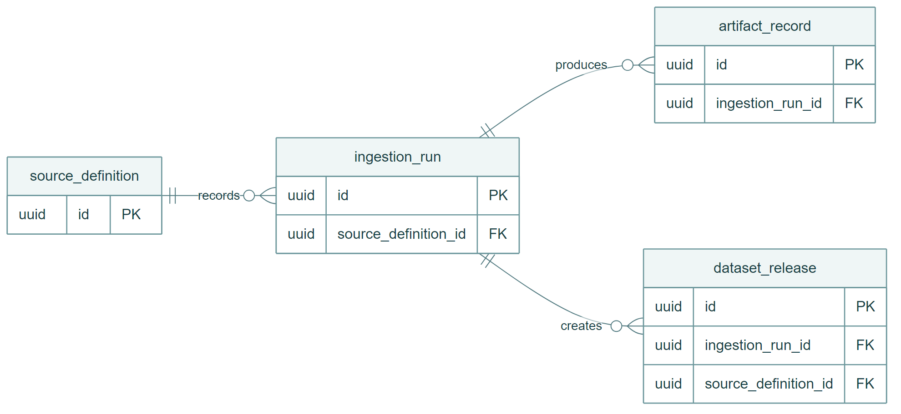


[[PAGEBREAK]]

#### Student 2 Property Sales Explorer and Market Cases

The feature stores market cases against externally owned property references, imports compatible
sale observations, calculates deterministic summaries and asks AI mode to explain the recorded facts.
Case CRUD uses optimistic versions and returns HTTP 409 for stale changes.

| Planning area | Release 0 design |
|---|---|
| Functional backlog | Select a known property, create and edit a case, filter attributed sales, show exclusions and source releases, delete a case and request an AI explanation |
| Non functional focus | Deterministic calculations, bounded imports, provenance, version conflicts and offline use |
| Conceptual model | A market case selects a property and filters reusable sale observations; observations are not owned by a case; a summary is derived rather than stored as model output |
| Logical model | `market_case` and `sale_observation`; unique source business key, revision and release; property and contract-date index |
| Physical model | SQLite volume owned by `f2-db-api`; Nginx frontend and Flask backend and database APIs |
| Principal risks | Synthetic demonstration data, weak or missing price records, unavailable Feature 1 validation and model overreach |
| Controls | Explicit exclusions, integer median, source metadata, `property_validation_state`, read-only tools and no valuation or recommendation language |

Selected keys and relationships; the physical schema defines the remaining fields, checks and indexes. Dashed associations labelled "no FK" are query relationships, not database constraints. [Physical schema](../../student-2/database/src/propertyscope_market_store/sql/001_initial.sql).

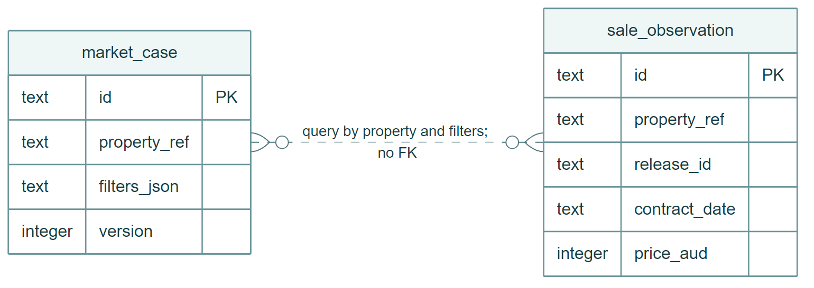


[[PAGEBREAK]]

#### Student 3 Suburb Crime and Liveability Analytics

The feature provides suburb search, filters, maps, amenities, factual comparison views, saved
comparison CRUD and optional AI explanation. It also implements a durable consumer for accepted
Feature 1 crime, school and SEIFA products, although those official products were not activated in
the audited Release 0 runtime.

| Planning area | Release 0 design |
|---|---|
| Functional backlog | Search and filter suburbs; show context and amenities; compare two to five suburbs; save, edit and delete comparisons; request bounded AI analysis |
| Non functional focus | Zero versus missing semantics, accessible chart tables, import integrity, bounded distances, recovery and deterministic degradation |
| Conceptual model | A suburb has an overview, many indicators and many amenities; a saved comparison references multiple locality and indicator keys |
| Logical model | `suburb_info`, `suburb_overview`, `suburb_indicators`, `suburb_amenity`, `user_suburbs`; separate durable import, delivery and current-release records |
| Physical model | SQLite volume opened only by `f3-database`; dependency-free WSGI backend and Nginx frontend |
| Principal risks | Partial fixture mistaken for current official data, incompatible periods or units, boundary ambiguity and unavailable upstream release artefacts |
| Controls | Source labels, count and rate separation, null preservation, exact manifest and hash checks, atomic current pointers and no safety or desirability ranking |

Selected keys and relationships; the physical schema defines the remaining fields, checks and indexes. Dashed associations labelled "no FK" are query relationships, not database constraints. [Physical schema](../../student-3/database/src/propertyscope_suburb_store/repository.py).

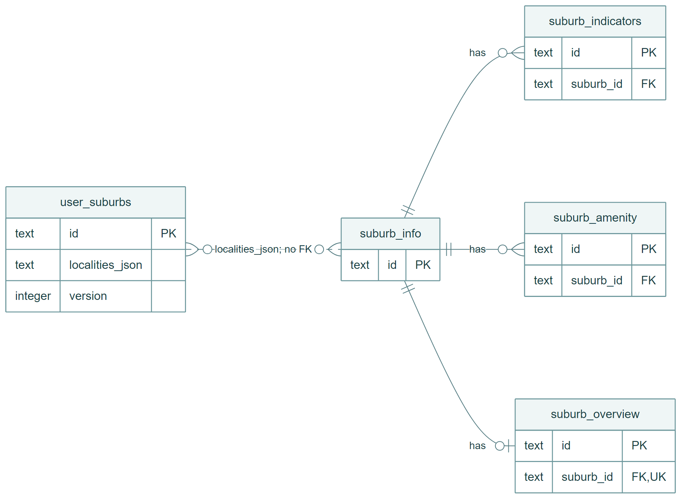


[[PAGEBREAK]]

#### Student 4 Site Planning and Building Due Diligence

The feature creates and manages site reviews, combines planning, environmental, strata and building
observations, shows explicit evidence states and generates questions for a qualified professional.
The map is a deterministic visualisation around Feature 1 coordinates; it is not a parcel-accurate
spatial intersection.

| Planning area | Release 0 design |
|---|---|
| Functional backlog | Create, read, edit and delete site reviews; change checklist, status and notes; inspect attributed evidence; view a map; generate professional-verification questions |
| Non functional focus | Visible uncertainty, bounded GeoJSON, database isolation, provider degradation and safe non-advisory language |
| Conceptual model | Site reviews and observation collections share a property reference; observations are not children of a review |
| Logical model | `site_review`, `constraint_observation`, `building_observation` with evidence-state, source and confidence fields |
| Physical model | PostgreSQL/PostGIS behind `f4-db-api`, Nginx frontend and Flask backend; this differs from the published SQLite requirement and has no recorded exception |
| Principal risks | Synthetic evidence mistaken for official parcel evidence, model treated as compliance advice and database-technology non-compliance |
| Controls | Evidence badges and sources, explicit professional verification, read-only AI tools and a disclosed implementation limitation |

Selected keys and relationships; the physical schema defines the remaining fields, checks and indexes. Dashed associations labelled "no FK" are query relationships, not database constraints. [Physical schema](../../student-4/database/src/propertyscope_due_diligence_store/sql/001_initial.sql).

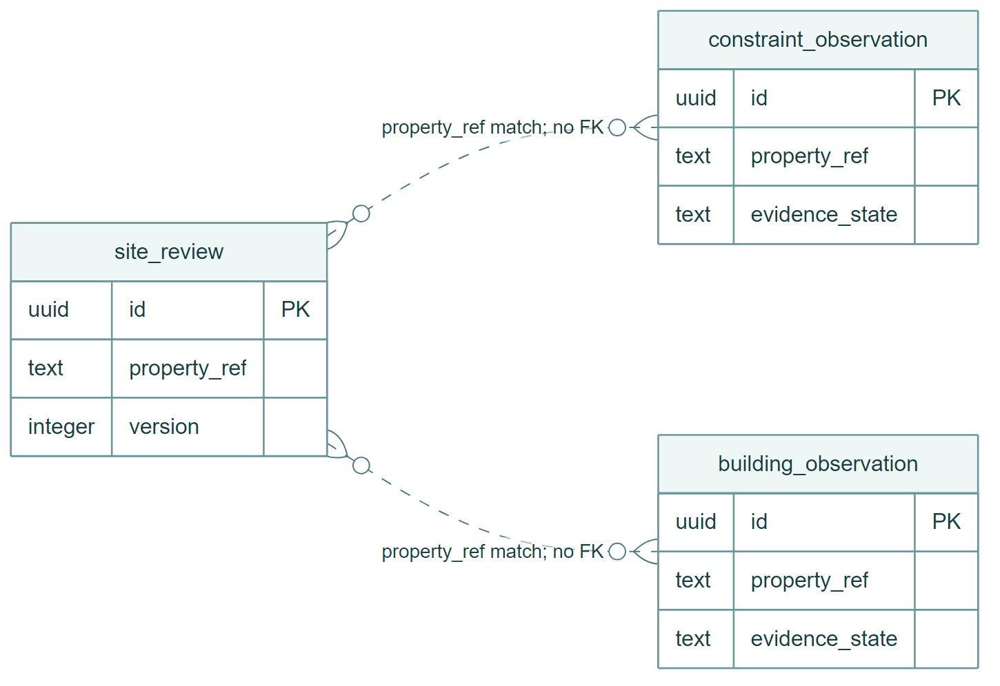


[[PAGEBREAK]]

#### Student 5 Buyer Journey and Agent Workspace

The feature manages buyer cases, shortlisted properties, notes and tasks, composes bounded evidence
from other public feature APIs and requests a short evidence-aware AI case summary. Optimistic
concurrency protects every mutable record.

| Planning area | Release 0 design |
|---|---|
| Functional backlog | Buyer-case CRUD; shortlist CRUD; stage, rating and priority; note CRUD; task CRUD and completion; evidence refresh; AI summary |
| Non functional focus | Owner scope, version conflicts, safe external evidence, bounded context, request correlation, accessibility and persistence across restarts |
| Conceptual model | One buyer case owns many shortlist properties, notes and tasks; a note or task may refer to one property in the same case |
| Logical model | `buyer_case`, `case_property`, `case_note`, `case_task`; cascading case deletion, same-case triggers and unique shortlist entries |
| Physical model | SQLite volume owned by `f5-db-api`, Nginx frontend and Flask backend and database APIs |
| Principal risks | Incomplete cross-feature evidence, no production identity service, stale writes and model-generated unsupported action |
| Controls | Explicit availability states, demo-owner scope, positive versions and HTTP 409, source references, short read-only tool context and human decision warning |

Selected keys and relationships; the physical schema defines the remaining fields, checks and indexes. [Physical schema](../../student-5/database/src/propertyscope_buyer_store/sql/001_initial.sql).

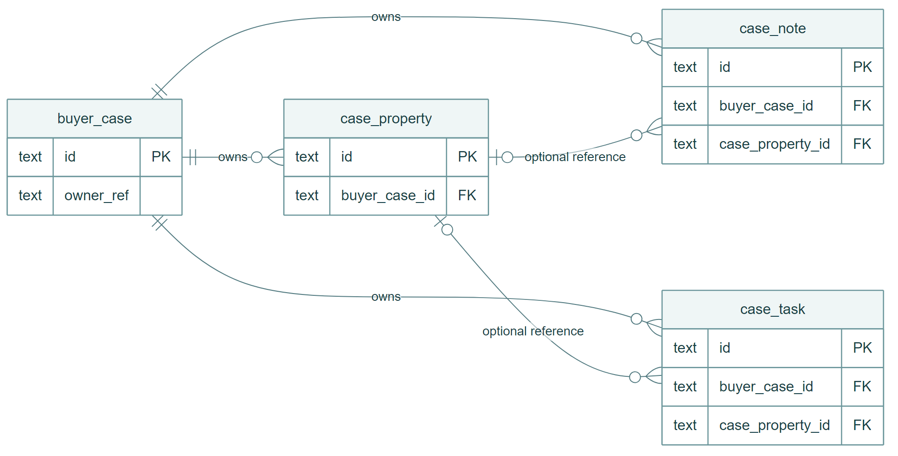


## 3 Repository structure

The monorepo keeps shared contracts domain-neutral and gives each student a vertical slice. Generated
deployment files expose only validated enabled features.

```text
.github/workflows/       Integration CI and student-1.yml through student-5.yml
ai-services/             Agent core and shared AI-mode service
deployment/              Enabled-feature registry and generated Compose overlay
docs/                    Architecture decisions release evidence and report sources
shared/                  Contracts consumer protocol testkit and shared frontend
student-1/ to student-5/ Independently owned frontend backend database tests and manifest
scripts/                 Quality deployment fixture and operator commands
docker-compose.yml       Shared base service model
docker-compose.dev.yml   Reloadable local development overlay
```

The boundary validator enforces the key ownership rules: student services may import shared
contracts and tests may import shared testkit, but a student service may not import another student
or `agent_core`. AI mode may call allowlisted feature endpoints, never a student database. Each
database volume is mounted only by its owner.

[[PAGEBREAK]]

## 4 Software architecture

### 4.1 Individual software architecture

#### Feature 1 / Data Platform and Property Discovery

Feature 1 is deliberately more than a frontend, backend and database. The credential-free runner
claims acquisition work through the backend's worker HTTP contract and is the only service that
writes content-addressed source artefacts. The DB API owns request-time persistence access, while the
separate credential-owning loader performs durable imports and accepted-generation activation. All
three services read the artefact volume, but only the runner writes it; only PostgreSQL mounts the
database volume. Publication remains a reviewed backend action and accepted releases are delivered
to downstream consumers through idempotent HTTP contracts.

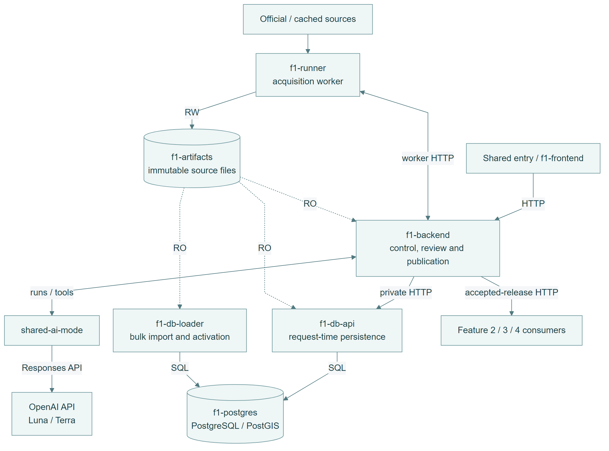

The Mermaid source for every architecture, state and pipeline figure is retained under
`docs/reports/diagrams/release-0`. The rendered PNG files are the PDF-compatible derivatives, not
independent drawings.

[[PAGEBREAK]]

#### Feature 2 / Market cases and recorded sales

Market-case CRUD crosses the frontend, backend and private database API. The backend validates property references through Feature 1 and derives sales statistics deterministically. Two read-only tools expose case context and summary facts to AI mode. The SQLite file remains exclusively with f2-db-api.

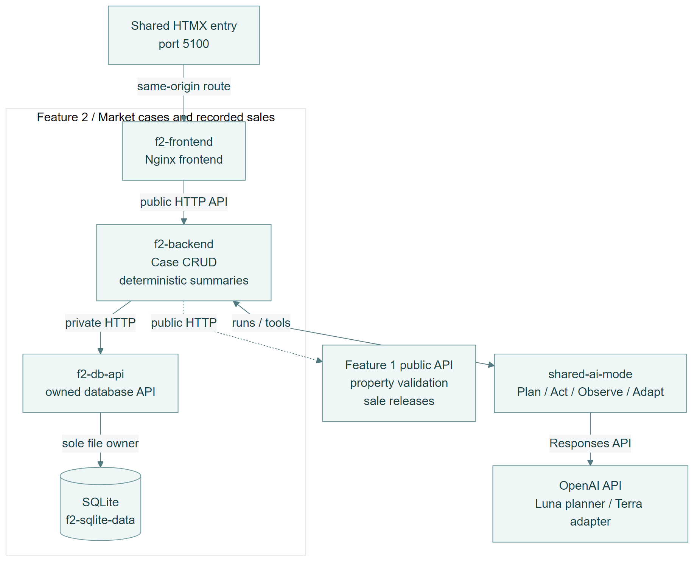

[[PAGEBREAK]]

#### Feature 3 / Suburb and liveability analytics

The backend owns query, comparison, nearby-place and assistant routes plus the fenced import worker. Only f3-database opens SQLite. Feature 1 products arrive over validated HTTP delivery contracts; the retained Release 0 demonstration uses labelled fixture data. Three read-only tools bound the assistant context.

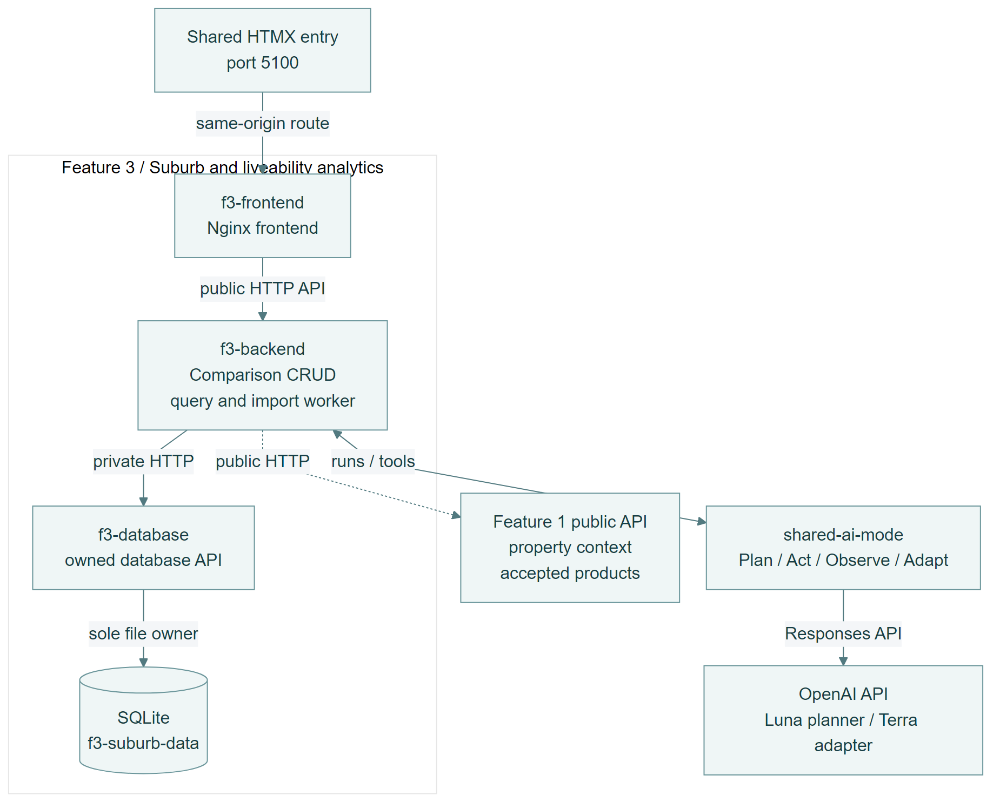

[[PAGEBREAK]]

#### Feature 4 / Site and building due diligence

The backend validates properties through Feature 1, manages reviews and prepares bounded evidence and map responses. The private database API alone receives PostgreSQL credentials; f4-postgres owns the database volume. Two read-only tools support professional-verification questions. The PostgreSQL requirement deviation is disclosed in Section 9.

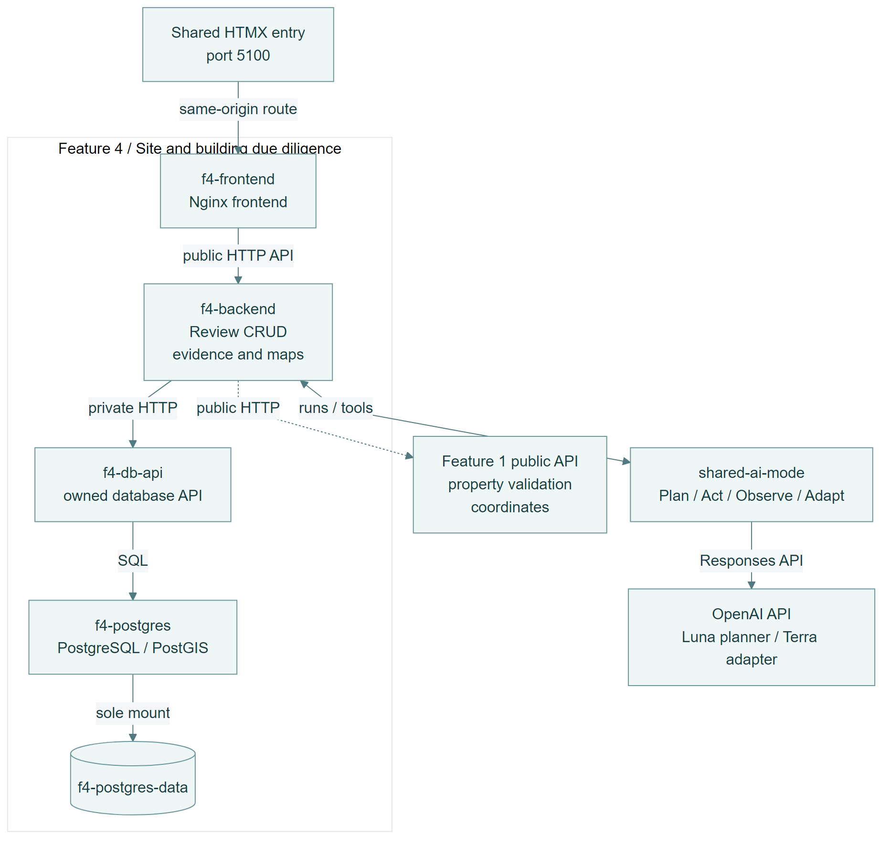

[[PAGEBREAK]]

#### Feature 5 / Buyer journey workspace

The backend manages cases, shortlist entries, notes and tasks through its private SQLite API. Public Feature 1, 2 and 4 APIs supply bounded research evidence. Feature 3 is reported as unavailable in this baseline. Four owner-scoped, read-only tools support the AI summary; version checks protect mutable records.

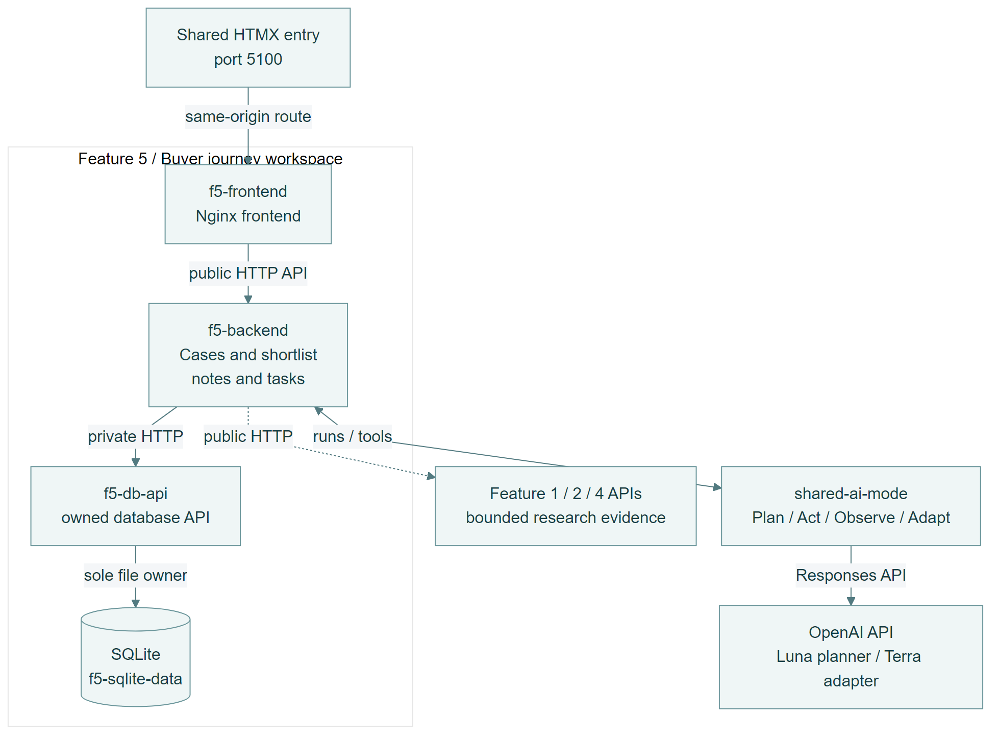

[[PAGEBREAK]]

### 4.2 Integrated architecture

The browser normally enters through `shared-frontend` on port 5100. The shared edge loads a
same-origin HTMX feature directory and proxies feature routes so users remain within one product
shell; per-feature frontend ports remain available for local development. Backends call only their
owned database service and the shared AI mode over private Compose networking. AI mode calls back to
allowlisted feature-owned HTTP tools and never opens a feature database. Feature 1 publishes accepted
dataset releases; downstream features consume those through supported HTTP contracts.

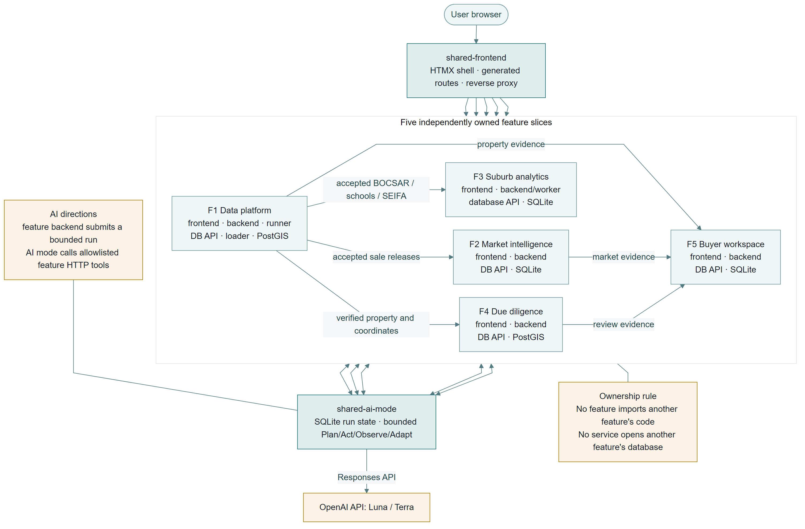

The integrated architecture contains additional workers only where durable background processing is
required. Feature 1 separates acquisition from database loading so the runner never receives
database credentials. Feature 3 performs fenced consumer imports through its backend worker. Feature
5 composes data at request time from public APIs and keeps the result's availability and limitations.

[[PAGEBREAK]]

### 4.3 Docker Compose architecture

`deployment/features.yaml` enables all five manifests. The generator creates
`deployment/enabled-features.compose.yml` and the shared route projection. The resulting Release 0
profile contains 21 services and seven named volumes.

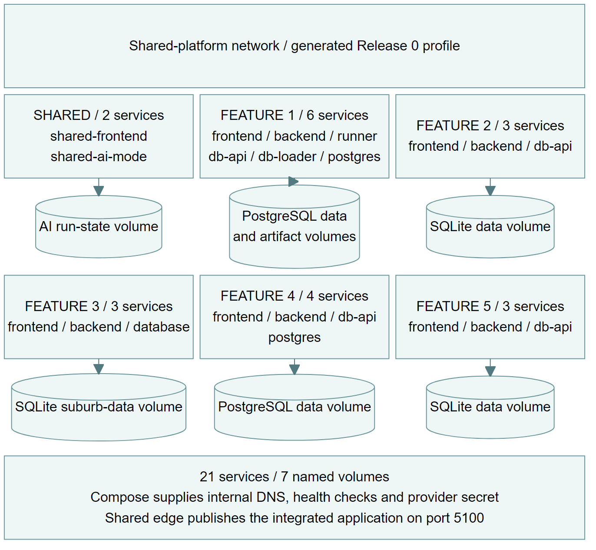

| Group | Services | Owned durable volume |
|---|---|---|
| Shared | `shared-frontend`, `shared-ai-mode` | `shared-ai-mode-state` |
| Student 1 | `f1-frontend`, `f1-backend`, `f1-runner`, `f1-db-api`, `f1-db-loader`, `f1-postgres` | `f1-postgres-data`, `f1-artifacts` |
| Student 2 | `f2-frontend`, `f2-backend`, `f2-db-api` | `f2-sqlite-data` |
| Student 3 | `f3-frontend`, `f3-backend`, `f3-database` | `f3-suburb-data` |
| Student 4 | `f4-frontend`, `f4-backend`, `f4-db-api`, `f4-postgres` | `f4-postgres-data` |
| Student 5 | `f5-frontend`, `f5-backend`, `f5-db-api` | `f5-sqlite-data` |

The canonical local deployment command is:

```text
uv run scripts/dev.py stack up
```

Compose configuration was validated on 4 September with all five features enabled. Docker Desktop
was unavailable during the final report edit, so this report relies on the retained successful
student workflow container jobs for runtime startup, health, seed and smoke evidence rather than
claiming a new local Docker run.

[[PAGEBREAK]]

## 5 AI mode and agentic workflow

### 5.1 AI mode design

Shared AI mode owns provider selection and the agent lifecycle. A feature backend submits an
objective, trusted context, prompt-set version, limits and a feature-owned tool allowlist. AI mode
validates the request, persists it to its SQLite run store and executes the bounded state machine.
Feature tools are ordinary HTTP endpoints with validated JSON schemas. Protected writes do not run
automatically; they require a separate reviewed action.

**Provider decision: OpenAI API.** The approved [registered feature scope](../architecture/registered-feature-scope.md#document-control)
records OpenAI with GPT-5.6 Luna and GPT-5.6 Terra. The remote-standard.v1 profile uses Luna for
planning and Terra for adaptation through the Responses API. This is the team's settled Release 0
selection under the approved registration, and replaces the brief's example Ollama runtime. No
feature selects a concrete model itself.

The team confirms that its data-sharing opt-in provides **2.5 million complimentary tokens per day
for its Luna/Terra use**. That account allowance makes repeated prompt refinement, bounded agent runs
and a five-student demonstration practical at low cost, without local model weights or GPU setup.
The allowance is an account-specific planning assumption supplied by the team, not a universal or
per-model entitlement. OpenAI's [data controls documentation](https://developers.openai.com/api/docs/guides/your-data)
explains that API data is not used for model improvement unless the customer explicitly opts in.

The demonstration uses public-source evidence and labelled fixtures; credentials remain in a file
secret outside the report and repository. Calls retain bounded iteration, tool and time budgets.
The historical gemini-development.v1 run in Section 5.4 is compatibility-test evidence; it does
not change the selected OpenAI deployment.

[[PAGEBREAK]]

### 5.2 Plan Act Observe Adapt

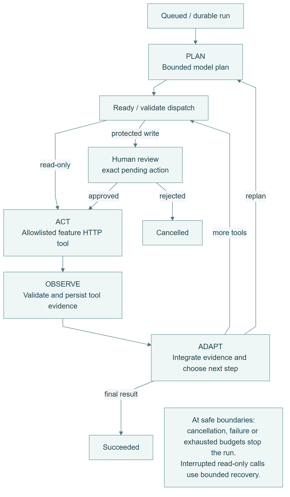

| Phase | Durable behaviour | Evidence retained |
|---|---|---|
| Plan | Model selects only allowlisted tools and valid arguments within iteration and time limits | Prompt ID and version, provider, model, plan status |
| Act | Agent core validates the call and invokes the feature HTTP endpoint | Tool name, call ID, safe arguments, timing and HTTP outcome |
| Observe | Tool result is validated and stored as evidence | Result summary, evidence reference and failure classification |
| Adapt | Model integrates observations and either finishes, replans or requests review | Final findings, limitations, recommendation and next state |

The diagram summarises the main execution path. The [normative state machine](../architecture/agent-run-state-machine.md) specifies every failure, cancellation and recovery transition. The run can terminate as succeeded, failed or cancelled, or pause at review required. Idempotency,
bounded recovery and durable checkpoints prevent an interrupted process from silently repeating a
protected action.

### 5.3 Prompt engineering and context management

The shared prompt set is stored under `ai-services/ai-mode/src/ai_mode/prompt_assets`. Planner and
adapter templates have matching metadata and immutable versions from v1 to v7. Version 7 added typed
provenance and deterministic parallel read-only stages to the planner, then taught the adapter to
report ordered results from sequential and parallel execution. Runs retain the exact prompt set and
model profile used.

| Contributor | Prompt or context asset | Bounded context and safety rule |
|---|---|---|
| Student 1 | Shared planner and adapter v1 to v7 plus data-platform tool catalogue | Typed provenance, recorded coverage, no automatic publication and explicit unknown states |
| Student 2 | Market-case objective in backend API and two-tool catalogue | Trusted case ID only; deterministic facts; no valuation, forecast or buy recommendation |
| Student 3 | General and saved-comparison objectives plus three-tool catalogue | Count and rate cannot be mixed; missing is not zero; no causal, safety or desirability claims |
| Student 4 | Professional-question objective plus two-tool catalogue | Questions for qualified review only; no legal, safety or compliance certification |
| Student 5 | Case-summary objective plus four-tool catalogue | User text is untrusted; summary at most 120 words; three to five short actions; cite limitations |

The feature objectives, IDs and tool catalogues are concrete prompt assets even where they are
defined beside the route rather than in a separate template file. Their request limits range from
three to four iterations, six to ten tool calls and a 120-second budget. Tool responses apply their
own list and record bounds before any content enters the model context.

### 5.4 Agent workflow record

The strongest retained failure-recovery record is Feature 1 run
`c7ca3ef0-c76f-47f5-bc42-acf03b20f8eb` from 22 August. It used prompt set `default.v4` under the
Gemini development profile, performed three evidence calls over three iterations and joined the
candidate release, failed ingestion run, quality results and accepted predecessor. It identified a
zero-record draft and `stage_execution_failed`, preserved the 104-record accepted predecessor and
recommended a bounded human-reviewed reprocess. It did not retry or publish.

| Record field | Retained value |
|---|---|
| Objective | Diagnose a failed Feature 1 import using durable release and run evidence |
| Plan | Select release, run and predecessor inspection tools within the feature allowlist |
| Act | Execute three read-only evidence calls over HTTP |
| Observe | Candidate contained zero records, zero quality results and a failed stage; predecessor remained accepted with 104 records |
| Adapt | Explain the failure boundary and propose human-reviewed reprocessing without executing a write |
| Outcome | Succeeded after three iterations with evidence and safety note |
| Reproducible pointer | `student-1/AI_EVALUATION.md` and the durable run ID above |

A later OpenAI run recorded in the report, `5a436835-e8e3-41f1-a00a-4c9a29b2454e`, used `default.v7`, Luna planning and
Terra adaptation. The retained report account describes two Plan, Act, Observe and Adapt cycles using property search and
property inspection. The final answer retained the verified address, accepted sale-history coverage,
zero returned rows and a warning against inferring that the property never sold. This demonstrates
the reported prompt refinement from operational recovery to typed provenance and ordered multi-tool evidence.
Its raw event export is not checked into the software baseline, so the run ID and narrative alone
are not an independently replayable execution log. The earlier failed-import scenario has a linked
[evaluation record](../../student-1/AI_EVALUATION.md#scenario-b--failed-import-recovery).

### 5.5 AI-assisted software review record

The retained [26 July scaffold review](../architecture/reviews/2026-07-26-gemini-antigravity-scaffold-review.md)
records an AI-assisted examination of the assignment, repository structure, database isolation,
Compose, workflows and shared UI. It is a historical development artefact: its six-person roster,
empty-Compose description and some proposed database patterns predate the approved five-feature
architecture and must not be treated as current instructions.

| Review area | Recorded finding | Current evidence to compare |
|---|---|---|
| Database design | Resolve store technology and ownership explicitly | Owned database APIs, migrations and registered Feature 1 PostGIS exception; Feature 4 limitation remains disclosed |
| Implementation | Build shared styling and a unified home page | Shared HTMX entry point and the application screenshots in Section 8.4 |
| Microservices | Populate the scaffold with container networking and service boundaries | Five individual diagrams, generated 21-service profile and architecture validator |
| DevOps | Align workflow names and configure branch triggers | The five student workflow files and retained successful runs in Section 7 |

This review provides retained development findings, while Section 5.4 provides application-loop
execution evidence. The repository does not retain the complete original specialised review prompt
and phase-by-phase terminal log for every student. The report therefore does not claim that the
runtime diagnosis record alone proves every software-development review requirement.

## 6 Implementation summary

### 6.1 Shared platform

The shared platform supplies the HTMX entry point, common design tokens, feature registry, status and
evidence views, reusable AI chat, mapping components, versioned contracts, consumer protocol,
testkit, model registry, feature onboarding and generated deployment. The platform exposes only
manifest-enabled routes, so placeholder folders do not appear as available features.

### 6.2 Feature capability and CRUD evidence

| Feature | Visible CRUD | Principal public API | Seed or data evidence | AI path |
|---|---|---|---|---|
| Student 1 | Source definitions and jobs; release review actions | `/api/data-platform/v1` | 10 fixture properties; official runs include 5,190,134 G-NAF addresses and 7,335,504 PSI revisions | Failure diagnosis and property evidence |
| Student 2 | Market-case create, list, detail, update and delete | `/api/market-intelligence/v1` | 10 market cases and 26 sale observations | Explain a deterministic case summary |
| Student 3 | Saved-comparison create, list, update and delete; browser bookmarks | `/api/suburb-analytics/v1` | 10 suburbs, 10 overviews, 400 indicators, 38 amenities and 10 comparisons | Suburb snapshot and responsible comparison |
| Student 4 | Site-review create, detail, edit, checklist and delete | `/api/due-diligence/v1` | 10 reviews, 70 constraints and 50 building observations | Generate professional-verification questions |
| Student 5 | Buyer cases, shortlist properties, notes and tasks | `/api/buyer-workspaces/v1` | 10 cases, 12 properties, 11 notes and 12 tasks | Evidence-aware case summary and actions |

Feature 1's operational schema contains lifecycle, idempotency and event tables whose counts depend on
actual acquisition and publication history. Its seed deliberately does not fabricate ten events in
every control table. This is more faithful to an auditable operations system, but it does not prove a
literal ten rows in every database table. Features 2 to 5 test at least ten rows in every assessed
business table; Feature 4's counts are in PostgreSQL rather than the specified SQLite store.

### 6.3 Cross feature integration

Feature 2 validates property references and imports compatible sale releases through Feature 1 HTTP
contracts. Feature 3 implements an idempotent consumer for accepted BOCSAR, schools and SEIFA
products. Feature 4 searches Feature 1 for a verified property and uses its coordinates for a
deterministic map. Feature 5 composes bounded evidence from Features 1, 2 and 4. It currently reports
Feature 3 evidence as unavailable. None of these paths opens another feature's database.

[[PAGEBREAK]]

## 7 DevOps and GitHub Actions

### 7.1 Pipeline architecture

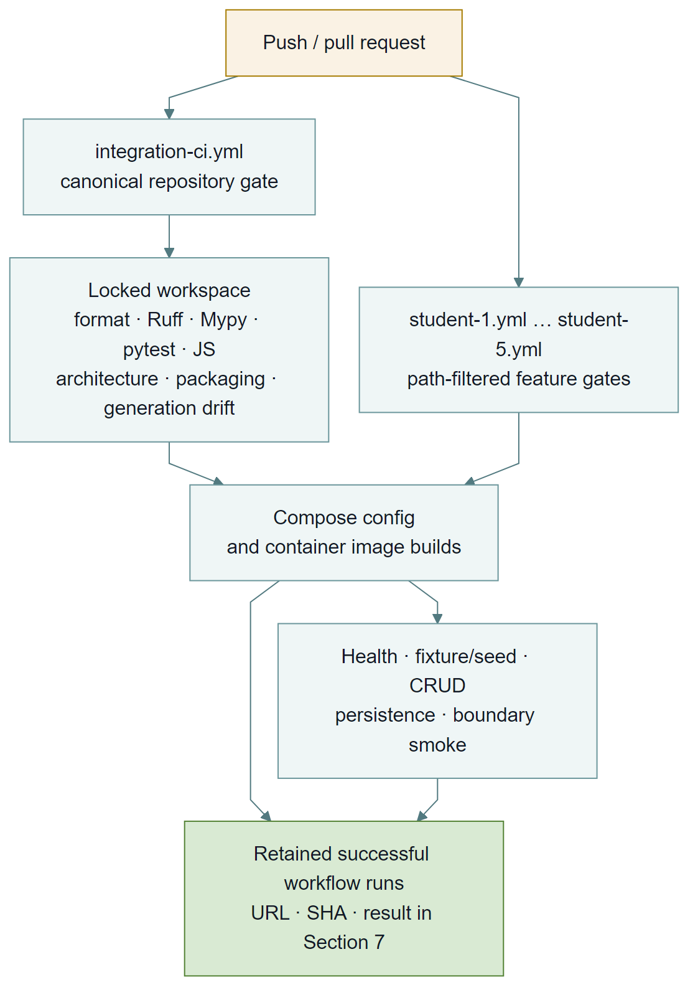

Integration CI is the canonical source gate. It installs the locked workspace, runs formatting,
linting, generation-drift checks, architecture and packaging validators, Mypy, Python tests,
frontend tests, coverage and Compose configuration validation. Student workflows are path-filtered
so each owner can build and test the assigned containers without repeating the entire gate.

### 7.2 Student workflow responsibilities

| Workflow | Trigger and scope | Feature checks | Container evidence |
|---|---|---|---|
| `student-1.yml` | Pull requests and pushes affecting Student 1 or its shared boundary | Browser forms, source tests and official-source Compose plan | Builds Shared and Feature 1, starts bounded fixture stack, runs acquisition and boundary smoke |
| `student-2.yml` | Student 2 paths and manual dispatch | Ruff, architecture, generated deployment, Mypy, pytest and JavaScript | Builds three images, starts fixture stack, checks CRUD, seeds and frontend |
| `student-3.yml` | Student 3 paths and manual dispatch | Ruff, Mypy, branch-aware pytest and frontend behaviour | Builds three images, starts stack, checks frontend, API and seeded DB |
| `student-4.yml` | Student 4 paths and manual dispatch | Ruff, architecture, deployment, tool catalogue, Mypy, pytest and JavaScript | Builds four images, starts PostgreSQL slice, checks reads and seed counts |
| `student-5.yml` | Student 5 paths and manual dispatch | Ruff, Mypy, pytest, JavaScript and architecture validators | Builds three images, performs real CRUD, evidence and AI degradation smoke, restarts and proves persistence |

Student 4's step name refers to CRUD but the shell body checks frontend GET, list GET and table counts;
its create, update and delete paths are covered by API tests rather than that live container smoke.

### 7.3 Successful workflow evidence

| Workflow | Evidence SHA | Successful run | Result |
|---|---|---|---|
| Integration CI | `7d5350d` | [Run 33836061545](https://github.com/MattShelton04/41026ASDProject/actions/runs/33836061545) | Canonical quality gate succeeded |
| Student 1 CI | `f478ca6` | [Run 33785766339](https://github.com/MattShelton04/41026ASDProject/actions/runs/33785766339) | Browser forms and integrated Feature 1 stack succeeded |
| Student 2 CI | `5d650a0` | [Run 33631792022](https://github.com/MattShelton04/41026ASDProject/actions/runs/33631792022) | Quality, images, Compose, CRUD, seeds and frontend succeeded |
| Student 3 CI | `7d5350d` | [Run 33836061467](https://github.com/MattShelton04/41026ASDProject/actions/runs/33836061467) | Quality and integrated-stack jobs succeeded |
| Student 4 CI | `cfbbe60` | [Run 33776708519](https://github.com/MattShelton04/41026ASDProject/actions/runs/33776708519) | Quality, four images, stack and seed smoke succeeded |
| Student 5 CI | `cce16b2` | [Run 33810163715](https://github.com/MattShelton04/41026ASDProject/actions/runs/33810163715) | Quality, CRUD, persistence and degradation smoke succeeded |

The runs occur at different SHAs because path filters execute a student workflow only when its owned
scope changes. The final baseline Integration and Student 3 runs succeeded after the last Feature 3
merge. The report does not imply that the five student jobs ran together at one SHA.

[[PAGEBREAK]]

## 8 Testing and validation evidence

### 8.1 Local canonical quality gate

The command `uv run python scripts/check.py` was executed on Windows against baseline `7d5350d` on
4 September 2026. Docker-dependent PostgreSQL component cases were skipped unless an opt-in
disposable administrator URL was supplied; deterministic source tests did not require credentials or
internet access.

| Test group | Result | Coverage or scope |
|---|---|---|
| Format and Ruff | Passed | 418 files formatted; lint clean |
| Contracts deployment architecture packaging models and tools | Passed | Five enabled feature catalogues and generated projections |
| Mypy | Passed | 185 typed source files in canonical scope |
| Shared agent core and AI mode | 602 passed 1 Windows symlink case skipped | 90.36 percent branch-aware coverage |
| Student 1 | 587 passed 29 opt-in PostgreSQL cases skipped | 72.60 percent coverage against 60 percent gate |
| Student 2 | 16 passed | 77.10 percent coverage against 70 percent gate |
| Student 3 | 67 passed | 90.25 percent branch-aware coverage against 80 percent gate |
| Student 4 | 60 passed | 90.43 percent coverage against 85 percent gate |
| Student 5 | 136 passed | 82.67 percent coverage against 80 percent gate |
| Frontend behaviour | Student 2 3 passed Student 3 12 Student 4 18 Student 5 21 | Node tests plus shared and Feature 1 syntax and behaviour checks |
| Compose configuration | Passed | Production and development models with all five manifests |

### 8.2 Endpoint and container evidence

| Boundary | Verification |
|---|---|
| Public frontend to backend | Student workflow smokes request each feature frontend and public API health route |
| Backend to owned database API | Component tests use the real HTTP contract; container jobs check readiness and seeded reads |
| CRUD | Features 2 and 5 perform public container CRUD smokes; all five have API and persistence tests for create read update delete |
| Database ownership | Architecture validation checks credentials, volume mounts and forbidden imports |
| AI tools | Tool registry tests validate catalogue ownership, input and output schemas and safe dependency failure |
| Persistence | Migration tests prove idempotency; Student 5 restarts without deleting its volume and checks created and deleted state |
| Docker Compose | Every student workflow builds its images; the generated all-feature profile validates to 21 services |

### 8.3 Non functional testing

| Quality characteristic | Test or measure | Result and limit |
|---|---|---|
| Source scale | Complete PSI cached reprocess | 7,079,728 staged and 6,667,588 accepted; 19 minute complete-source run evidence |
| Source integrity | Hash, byte and record verification | Content-addressed artefacts and exact manifest checks; corrupt or truncated input fails atomically |
| Cancellation | Runner and loader polling plus PostgreSQL statement cancellation | Active work observes durable cancellation and rolls back |
| Request size | Feature HTTP boundaries | Feature 4 256 KiB; Feature 5 1 MiB; import and tool limits are explicitly bounded |
| Concurrency | Mutable case and comparison resources | Features 2, 3 and 5 return 409 on stale versions |
| Accessibility | Static and behaviour tests | Labels, keyboard interaction, focus, live regions, table alternatives and 320 CSS-pixel floor |
| Degradation | Offline provider tests | CRUD and evidence remain available; AI returns an explicit unavailable state |
| Recovery | Import lease and receipt tests | Previous current release remains live after failure; replay is idempotent |

The project does not claim a single end-user latency service-level objective for every feature. The
source-scale benchmark measures real throughput and capacity; ordinary UI endpoints are bounded and
smoke-tested, but a common percentile latency benchmark was not retained for Release 0.

[[PAGEBREAK]]

### 8.4 Application screenshots


The screenshots are deterministic demonstration captures rather than proof of current official
publisher facts. Features 3 to 5 were demonstrated in the recorded and in-class presentation but do
not have committed report screenshots at the audited baseline.

## 9 Known issues and limitations

| Limitation | Effect on Release 0 evidence |
|---|---|
| Feature 4 uses PostgreSQL/PostGIS without a recorded exception | The feature is operational, isolated and tested, but differs from the brief's SQLite requirement for individual student stores |
| Feature 1 does not seed ten rows into every lifecycle and audit table | Real source tables contain large populations, while event counts reflect actual operations rather than fabricated assessment padding |
| Feature 3 accepted official products were unavailable at the audited runtime | Its Release 0 views and AI remain clearly labelled deterministic fixtures |
| Feature 4 evidence and map layers are synthetic | The map illustrates evidence states around a property coordinate and must not be read as a parcel intersection or current planning certificate |
| Feature 5 has no production authentication | A server-configured demonstration owner scopes records; it is not a multi-user identity system |
| Feature 5 queries only bounded candidate pages from Features 2 and 4 | A matching record outside the first 25 can appear unavailable |
| Feature-specific live AI evidence is uneven | Feature 1 has durable run IDs and Feature 4 records a live evaluation; Features 2, 3 and 5 rely mainly on deterministic tool and degradation tests |
| Original software-review prompts and terminal phase logs are incomplete | Section 5.5 retains the historical AI-assisted review, but a per-student development-loop transcript is not present |
| Screenshots for Features 3 to 5 are not retained at the software baseline | Their UI demonstration is in the published video; the PDF has screenshots of Shared and Features 1 and 2 only |
| No final local all-feature Docker execution log is retained | Per-feature CI stack runs and all-feature Compose validation are available; they do not prove one simultaneous local startup |
| No common percentile endpoint benchmark | Source-scale operations are measured, but ordinary feature endpoint latency is not reported as one cross-feature SLA |

These limitations preserve the distinction between implemented behaviour, deterministic fixture
evidence and official or production claims. They do not prevent the demonstrated local research
workflows, but they constrain how results may be interpreted.

## 10 Contribution and commit record

### 10.1 Group contribution summary

| Student | Principal contribution | Merged pull request evidence |
|---|---|---|
| Matthew | Shared platform, agent core, AI mode, contracts, deployment, Feature 1 data platform, HTMX migration and report foundation | 71 merged PRs by `MattShelton04`; selected PRs 45, 51, 60 to 64, 66, 70, 73, 74 and 83 |
| Burhan | Complete Feature 2 vertical slice, CI, walkthrough and friendly identifiers | [PR 78](https://github.com/MattShelton04/41026ASDProject/pull/78) and [PR 85](https://github.com/MattShelton04/41026ASDProject/pull/85) |
| James | Feature 3 vertical slice, ingestion, comparisons, filters, accessibility and workflow fixes | PRs 81, 86, 90, 92 to 99 |
| Michael | Feature 4 integration, CRUD, evidence, mapping, AI, CI and marking documentation | PRs 68, 69, 72, 75 to 80 and 87 to 89 |
| Derek | Feature 5 store, cases, shortlist, notes, tasks, evidence, AI, runtime, CI and presentation refinement | [PR 82](https://github.com/MattShelton04/41026ASDProject/pull/82) and [PR 91](https://github.com/MattShelton04/41026ASDProject/pull/91) |

### 10.2 Selected immutable commits

| Student | Date | Commit | Contribution |
|---|---|---|---|
| Matthew | 29 August | `2bf71fe` | Migrated shared shell and Feature 1 Source CRUD to HTMX |
| Matthew | 31 August | `34f36f0` | Added parallel read-only agent tool stages and v7 prompts |
| Matthew | 2 September | `0ac2c7f` | Integrated ABS SEIFA 2021 into Feature 1 |
| Burhan | 2 September | `5d650a0` | Delivered Release 0 sales explorer and market cases |
| Burhan | 3 September | `bd6be66` | Replaced internal identifiers with user-facing labels |
| James | 3 September | `a50dc70` | Added the initial Suburb Analytics vertical slice |
| James | 4 September | `37e0100` | Added comparison fixture data, units and loading state |
| James | 4 September | `7d5350d` | Corrected filters without clearing the selected suburb |
| Michael | 1 September | `3b17c3a` | Integrated the initial Due Diligence service slice |
| Michael | 2 September | `070163e` | Added review edit and delete flows |
| Michael | 4 September | `36dbf71` | Added bounded AI professional questions |
| Derek | 3 September | `7fc9c09` | Delivered the Buyer Journey Release 0 feature |
| Derek | 4 September | `cce16b2` | Refined evidence-aware AI presentation |

The baseline shortlog attributes 61 commits to Matthew's two identities, 2 to Burhan, 11 to James,
11 to Michael and 2 squash commits to Derek. Derek's first pull request contains five logical
commits before its squash merge. Pull request links provide the most useful review and integration
record because they include workflow checks and the final merge state.

### 10.3 Attendance and demonstration

| Checkpoint | Matthew | Burhan | James | Michael | Derek | Evidence |
|---|---|---|---|---|---|---|
| Feature implementation | Completed | Completed | Completed | Completed | Completed | Merged contribution record above |
| Recorded group demonstration | Completed | Completed | Completed | Completed | Completed | Published video linked on the cover |
| Week 6 class presentation | Attended | Attended | Attended | Attended | Attended | Group presentation and Q and A completed 4 September 2026 |

The published video is no longer than ten minutes and demonstrates the integrated product, each
student feature's AI path, deployment and CI/CD. Agent-loop execution is documented in Section 5 in
line with the later showcase instruction.

## 11 Rubric traceability

| Criterion | Report evidence | Repository evidence | Readiness |
|---|---|---|---|
| 1 Project Setup | Sections 1, 3 and 4 | Root structure, five manifests, shared shell and Compose | Strong with disclosed F4 database deviation |
| 2 Service Implementation | Sections 4 and 6 | Five enabled service slices and health checks | Strong |
| 3 AI Mode Integration | Section 5 | Shared run API and five feature tool catalogues | Implemented with registered OpenAI selection |
| 4 Agentic AI Workflow | Sections 5.2, 5.4 and 5.5 | Agent core state machine, evaluation record and retained run IDs | Runtime implemented; development-review log gap disclosed |
| 5 Prompt Engineering and Context | Section 5.3 | Versioned shared prompts and feature objectives and schemas | Strong, feature assets are split between templates and routes |
| 6 DevOps and GitHub Actions | Section 7 | Five student workflows and Integration CI | Strong |
| 7 Docker Compose Integration | Sections 4.3 and 8.2 | One 21-service profile and successful feature stack jobs | Strong; no final local Docker rerun |
| 8 Working Software | Section 6 | CRUD tests, feature smokes, seeds and presentation | Strong with Feature 1 literal table-count risk |
| 9 Technical Report | Sections 1 to 11 | Five individual architectures and ERDs; tests, screenshots, logs and contributions | Covered; evidence gaps disclosed in Section 9 |
| 10 Project Demonstration | Section 10.3 and cover link | Published recording and completed Week 6 presentation | Complete when URL access is verified |

[[PAGEBREAK]]

## Appendix A Evidence index

- [Root README](../../README.md)
- [Contributing guide](../../CONTRIBUTING.md)
- [Registered feature scope](../architecture/registered-feature-scope.md)
- [Shared platform design](../architecture/shared-platform-design.md)
- [Integration contract](../architecture/feature-integration-and-experience-contract.md)
- [Agent run state machine](../architecture/agent-run-state-machine.md)
- [Feature 1 README](../../student-1/README.md)
- [Feature 1 marking evidence](../../student-1/MARKING_EVIDENCE.md)
- [Feature 1 AI evaluation](../../student-1/AI_EVALUATION.md)
- [Feature 2 README](../../student-2/README.md)
- [Feature 3 README](../../student-3/README.md)
- [Feature 4 marking evidence](../../student-4/MARKING_EVIDENCE.md)
- [Feature 5 implementation evidence](../../student-5/docs/release-0-implementation-evidence.md)
- [Integration CI](../../.github/workflows/integration-ci.yml)
- [Student 1 CI](../../.github/workflows/student-1.yml)
- [Student 2 CI](../../.github/workflows/student-2.yml)
- [Student 3 CI](../../.github/workflows/student-3.yml)
- [Student 4 CI](../../.github/workflows/student-4.yml)
- [Student 5 CI](../../.github/workflows/student-5.yml)
- [Docker Compose model](../../docker-compose.yml)

## Appendix B Reproduction commands

```text
uv sync --locked --all-packages --all-groups
uv run python scripts/check.py
uv run scripts/dev.py stack up
uv run scripts/dev.py stack status
uv run scripts/dev.py operator report
```

To regenerate this report from a clean checkout:

```text
uv sync --locked --all-packages --all-groups
uv run python scripts/build_release0_report.py
```

When Mermaid sources change, install Node.js and run the builder with --render-diagrams.
The pinned renderer refreshes PNGs and their content-hash manifest before generating the PDF.
Normal builds use those checked-in assets offline and reject stale figures. Review the rendered
pages after changing Markdown, figures or layout; a successful build alone is not a visual check.

The final submission filename is `group20.pdf`. The PDF contains the repository and published
demonstration links required by the assignment. The Canvas due date is 6 September 2026 at 11:59 pm
Sydney time.
