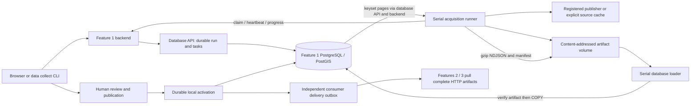

# Feature 1 data performance review

Work in progress on `codex/feature-1-data-performance`, starting at `9459a11`.
Measurements below distinguish retained historical timings, controlled component benchmarks,
and new end-to-end runs. Network download time is not counted as a CPU improvement.

## Flow and ownership

The four actual task stages are discover, acquire, import and build_release. Import contains
validation, typed staging, materialisation and quality checks; these are not separate worker
queues. A cached reprocess skips discovery/acquisition and reuses registered canonical bytes,
but still repeats validation, COPY, materialisation and release building into a new generation.
Neither startup nor acquisition automatically publishes. Publication verifies the export and
switches the accepted generation atomically; consumer delivery cannot block that switch.

| Source | Acquisition and staging | Materialisation and reads |
| --- | --- | --- |
| G-NAF | CKAN discovery or explicitly mounted ZIP; NSW locality/street dictionaries; disk-backed SQLite geocode join; bounded address batches | Typed COPY, coordinate transform to EPSG:4326, insert into isolated warehouse generation; keyset export by G-NAF PID. Accepted addresses use partial search/spatial indexes. |
| PSI | Registered annual archives since 1990 and current weekly archives; disk-backed nested ZIP processing; typed Parquet in archive order | COPY; group business key + source hash to first transmission; window-derived revisions; distinct eligible addresses joined against accepted G-NAF and fallback registry dictionaries; materialise missing reference anchors and sales; export by business key/revision. |
| BOCSAR | Postcode/suburb archives; sparse positive observations plus explicit month coverage; typed Parquet | COPY; ordered DISTINCT ON keeps first source occurrence; separate fact/coverage inserts; complete series export by geography kind/value/category, including empty positive-observation series. |
| Schools | Official CSV; small canonical JSON document | JSONB COPY staging, fixed projection and geometry; school-code keyset export. |
| ABS SEIFA | Official XLSX; NSW SAL rows with four indexes and population | Small canonical JSON, fixed SQL projection; SAL-code keyset export. |
| Fixture | Checked-in synthetic records | Same durable pipeline and review boundary, never substituted for official jobs. |

Relevant implementation: `runner.py`, `adapters/`, `loader.py`, `import_profiles.py`,
`source_materialisation.py`, `query_specs.py`, `_release_records.py`, `release_builders.py`.
Backend code is under `student-1/backend/src/propertyscope_data_platform`; SQL/store code is
under `student-1/database/src/propertyscope_data_store`.

## Baseline evidence

The retained live database contains 5,190,134 accepted G-NAF addresses and 7,402,643 PSI revisions.
The September 5 cached reprocesses recorded:

| Source | Import | Export | Total processing |
| --- | ---: | ---: | ---: |
| G-NAF | 356.09 s | 201.74 s | 557.84 s |
| BOCSAR | 808.60 s | 234.76 s | 1,043.37 s |
| PSI | 1,571.28 s | 438.50 s | 2,009.80 s |

These historical jobs are context, not a controlled before/after experiment. BOCSAR's 318,122
release records are series, not the much larger number of staged positive observations plus
coverage rows. First-page SQL uses indexes and counts only once for complete exports; a cold
20,000-row G-NAF/PSI page took 2.59/4.72 s, while warm pages took roughly 32–65 ms. Do not mistake
cache warming for an implementation gain.

## G-NAF canonical handoff

New acquisitions write `propertyscope.canonical-gnaf-parquet.v1`, Zstandard level 3, in at most
65,536-row groups. The database validates the exact schema/metadata and applies the identical
existing normalization and row hashing. Legacy JSON/NDJSON remains replayable. No dataset rows,
geocode policy, quality checks or publication gates are removed.

On the first 200,000 rows of the retained registered canonical artifact, in the database API
container: NDJSON was 85,636,783 bytes and Parquet 7,241,399 bytes (**91.5% smaller**). Write time
was 1.927 vs 1.257 s; read plus validation was 5.765 vs 6.252 s. Combined CPU time was effectively
flat (7.692 vs 7.509 s). The gain is smaller artifact storage and less hashing/file traffic;
the tradeoff is a slightly slower typed decode in this sample. Exact ordered normalized row
hashes matched. This is not a claim of an 11.8x end-to-end speedup.

Reproduce with `uv run python scripts/benchmark_feature1_gnaf.py --rows 200000`; add `--source`
pointing to a registered legacy canonical NDJSON file for real-row measurements. The default
uses synthetic addresses and does not contact publishers or write to a database.

## Experiments rejected

Increasing transaction sort memory from 4 MB to 128 MB halved temporary blocks written in a
one-million-observation BOCSAR deduplication experiment, but elapsed times overlapped (4.18–5.01 s
versus 4.32–5.76 s). No global memory tuning is justified by that evidence. Concurrent sort/hash
nodes multiply `work_mem`, making a speculative increase undesirable on student laptops.

## Prototype and prebuilt datasets

`C:/git/prototype/property/prototype/analysis/_common.py` caches derived suburb/postcode/year
aggregates and long-form crime data as Parquet. That is useful precedent for caching expensive
derived results. Its `build_db.py` is a smaller, filtered SQLite workflow, so timings cannot be
compared directly with complete NSW history and immutable generations.

Keep small synthetic teaching fixtures in Git. Keep full official snapshots in an explicit,
checksum-bound cache or downloadable artifact bundle, with source date, license and schema
metadata. Committing multi-million-row snapshots repeatedly would enlarge every clone and retain
old versions indefinitely. G-NAF already has a license-controlled redistribution policy; a format
change does not grant permission to publish its bytes. The current registered canonical replay
is the simplest reusable cache for imports; a future reviewed database snapshot would additionally
avoid COPY/index rebuilding but would be larger and coupled to migrations/PostGIS.

## Validation log

- Initial canonical gate: 925 passed, one skipped, one pre-existing browser audit failure. The
  source-conflict named flow looks for a `More actions` menu which is absent in that source UI.
- G-NAF handoff tests: seven passing tests for ordered hash parity, typed schema/metadata,
  malformed coordinates/postcodes, unreadable/empty files and bounded row groups.
- Live browser: opened real port 5200, previewed and started the official schools workflow.

Further changes, final checks and full-size run outcomes will be recorded before handoff.
