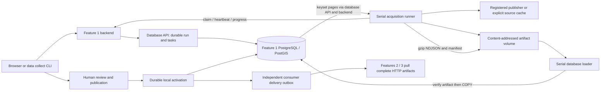

# Feature 1 data performance review

Work in progress on `codex/feature-1-data-performance`, starting at `9459a11`.
Measurements below distinguish retained historical timings, controlled component benchmarks,
and new end-to-end runs. Network download time is not counted as a CPU improvement.

## Flow and ownership

The four actual task stages are discover, acquire, import and build_release. Import contains
validation, typed staging, materialisation and quality checks; these are not separate worker
queues. A cached reprocess skips discovery/acquisition and reuses registered canonical bytes,
but still repeats validation, COPY, materialisation and release building into a new generation.
Neither startup nor acquisition automatically publishes. Publication verifies the export and
switches the accepted generation atomically; consumer delivery cannot block that switch.

| Source | Acquisition and staging | Materialisation and reads |
| --- | --- | --- |
| G-NAF | CKAN discovery or explicitly mounted ZIP; NSW locality/street dictionaries; disk-backed SQLite geocode join; bounded address batches | Typed COPY, coordinate transform to EPSG:4326, insert into isolated warehouse generation; keyset export by G-NAF PID. Accepted addresses use partial search/spatial indexes. |
| PSI | Registered annual archives since 1990 and current weekly archives; disk-backed nested ZIP processing; typed Parquet in archive order | COPY; group business key + source hash to first transmission; window-derived revisions; distinct eligible addresses joined against accepted G-NAF and fallback registry dictionaries; materialise missing reference anchors and sales; export by business key/revision. |
| BOCSAR | Postcode/suburb archives; sparse positive observations plus explicit month coverage; typed Parquet | COPY; ordered DISTINCT ON keeps first source occurrence; separate fact/coverage inserts; complete series export by geography kind/value/category, including empty positive-observation series. |
| Schools | Official CSV; small canonical JSON document | JSONB COPY staging, fixed projection and geometry; school-code keyset export. |
| ABS SEIFA | Official XLSX; NSW SAL rows with four indexes and population | Small canonical JSON, fixed SQL projection; SAL-code keyset export. |
| Fixture | Checked-in synthetic records | Same durable pipeline and review boundary, never substituted for official jobs. |

Relevant implementation: `runner.py`, `adapters/`, `loader.py`, `import_profiles.py`,
`source_materialisation.py`, `query_specs.py`, `_release_records.py`, `release_builders.py`.
Backend code is under `student-1/backend/src/propertyscope_data_platform`; SQL/store code is
under `student-1/database/src/propertyscope_data_store`.

## Baseline evidence

The retained live database contains 5,190,134 accepted G-NAF addresses and 7,402,643 PSI revisions.
The September 5 cached reprocesses recorded:

| Source | Import | Export | Total processing |
| --- | ---: | ---: | ---: |
| G-NAF | 356.09 s | 201.74 s | 557.84 s |
| BOCSAR | 808.60 s | 234.76 s | 1,043.37 s |
| PSI | 1,571.28 s | 438.50 s | 2,009.80 s |

These historical jobs are context, not a controlled before/after experiment. BOCSAR's 318,122
release records are series, not the much larger number of staged positive observations plus
coverage rows. First-page SQL uses indexes and counts only once for complete exports; a cold
20,000-row G-NAF/PSI page took 2.59/4.72 s, while warm pages took roughly 32–65 ms. Do not mistake
cache warming for an implementation gain.

## G-NAF canonical handoff

New acquisitions write `propertyscope.canonical-gnaf-parquet.v1`, Zstandard level 3, in at most
65,536-row groups. The database validates the exact schema/metadata and applies the identical
existing normalization and row hashing. Legacy JSON/NDJSON remains replayable. No dataset rows,
geocode policy, quality checks or publication gates are removed.

On the first 200,000 rows of the retained registered canonical artifact, in the database API
container: NDJSON was 85,636,783 bytes and Parquet 7,241,399 bytes (**91.5% smaller**). Write time
was 1.927 vs 1.257 s; read plus validation was 5.765 vs 6.252 s. Combined CPU time was effectively
flat (7.692 vs 7.509 s). The gain is smaller artifact storage and less hashing/file traffic;
the tradeoff is a slightly slower typed decode in this sample. Exact ordered normalized row
hashes matched. This is not a claim of an 11.8x end-to-end speedup.
The full fresh file was 191,912,851 bytes versus 2,222,419,699 bytes for retained NDJSON (91.4%
smaller). G-NAF's loader preflight now retains a 9 GiB database-growth floor, preserving the
previous full NDJSON/default-expansion allowance: a compressed file does not imply smaller SQL
tables, indexes or temporary work. Existing temporary-file and reserve allowances still apply.

Reproduce with `uv run python scripts/benchmark_feature1_gnaf.py --rows 200000`; add `--source`
pointing to a registered legacy canonical NDJSON file for real-row measurements. The default
uses synthetic addresses and does not contact publishers or write to a database.

## BOCSAR parsing and export queries

The old adapter expanded a complete CSV member into bytes and then a decoded string, constructed
a dictionary with hundreds of month keys for every input row, and rebuilt the same month tuple.
The new adapter streams the ZIP member through `TextIOWrapper` and `csv.reader`, resolves column
positions once, and reuses the immutable coverage vector. Bounded 64-entry caches in the writer
and loader reuse ISO month strings and the coverage checksum; each individual record still has
its own identity hash and its supplied coverage metadata/checksum checked. Positive counts,
explicit observed-zero coverage, quoted CSV fields and leading-zero postcodes are preserved.

`scripts/benchmark_feature1_bocsar.py` compares the adapter at `9459a11` with the working adapter
using 10,000 synthetic wide rows and 312 months. Uninstrumented parser time fell from 1.644 to
0.955 seconds (**42% less time**). A separate tracemalloc pass measured peak Python allocations
falling from 21,017,582 to 141,010 bytes (**99.3% lower**). That is parser allocation, not container
RSS or a full import measurement. Both produced 190,000 positive observations, 10,000 coverage
records and identical summed counts. No network or database is involved in this benchmark.

The subsequent full official acquisition produced 10,114,565 canonical observation/coverage
records and **byte-identical Parquet** to the retained previous run: 345,600,226 bytes, SHA-256
`b356cd70396d7b9a8e627c113ec31d3870df3715b86b0a8f49fb231c3823ade4`. This checks the complete
acquisition output, not merely the synthetic benchmark's counts.

The complete crime export previously performed three correlated indexed observation lookups for
each coverage series: first offence label, first subcategory label, and all observations. It now
limits the coverage page first, then performs one lateral aggregate per series. Ordered label
arrays select the first observation's labels; ordered JSON aggregation builds its observations.
An aggregate without input still returns the coverage series with null labels and `[]` observations.
The `(release, geography kind, geography value, category, month)` index supports these lookups.

On the same 500-series page of the retained official release, four interleaved read-only
`EXPLAIN (ANALYZE, BUFFERS, FORMAT JSON)` runs gave median execution **407.80 → 355.28 ms**
(12.9% less time), and shared buffer hits **12,076 → 7,098** (41.2% fewer). Result rows matched.
The sample is deliberately reported as a page query, not an end-to-end crime-job improvement.

## PSI parsing without recursive copies

PSI fingerprinting previously called `dataclasses.asdict` for every sale, recursively copying
all fields before encoding them. `PsiSale` contains flat immutable values, so the new projection
reads its declared fields directly. It retains the same standard-library JSON encoding and
fingerprint bytes. Bounded caches reuse parsed dates (32,768 entries, including the ordered
format tuple in the key) and publisher timestamps (4,096 entries). Invalid direct dates still
raise; the official-source wrapper still retains malformed publisher dates as unknown.

On 100,000 real records per archive, with empty caches at each parser's start:

| Archive | Previous parsing | Updated parsing | Reduction |
| --- | ---: | ---: | ---: |
| 1999 | 11.918 s | 6.888 s | 42.2% |
| 2025 | 19.312 s | 7.674 s | 60.3% |

These are local Windows parser measurements, excluding Parquet writing/database work and the
subsequent parity check. Ordered business keys and complete sale fingerprints matched in both
eras. The tradeoff is a bounded per-process date cache; no revisions, dates, decimal precision
or source facts are discarded. Reproduce with `uv run python scripts/benchmark_feature1_psi.py
--archive .propertyscope-source-cache/psi/2025.zip --year 2025 --rows 100000`.

## Release CPU and compatibility

The database API now encodes normalized private export pages with `orjson`; the backend continues
its existing byte relay and the runner decodes the received bytes natively. Portable product
records still pass Pydantic validation before native encoding. Unsupported large native integers
fall back to the previous encoder, preserving the existing integer contract; invalid coordinates
are rejected before encoding. No normalization/source-row hash computation was replaced.
Serial projection now processes bounded batches (256 flat records or 32 nested crime series),
reducing repeated summary allocation and compressor calls. Existing bounded flat-product
process workers remain available; crime remains serial because process transfer costs more.

Runner gzip defaults to level 3 instead of 6. The setting is explicit and reversible through
`PROPERTYSCOPE_RELEASE_COMPRESSION_LEVEL`; library callers retain level 6 by default. Portable
NDJSON schemas and records remain compatible. Compression settings and native number formatting
can change artifact bytes, so new artifacts register their actual SHA-256 as usual; historical
artifacts remain immutable. This does not promise a new artifact hash identical to an old release.

Using the first 64 MiB of decompressed retained release data, timings below include compression
**and verification decompression**. They are single component samples, not whole release times:

| Product | Level 6 time | Level 3 time | Level 6 bytes | Level 3 bytes | Size cost |
| --- | ---: | ---: | ---: | ---: | ---: |
| Addresses | 0.820 s | 0.441 s | 7,104,897 | 8,280,872 | +16.6% |
| Crime | 1.981 s | 1.160 s | 20,289,949 | 22,092,989 | +8.9% |
| Sales | 0.776 s | 0.409 s | 5,777,584 | 7,256,709 | +25.6% |

The extra native dependency is pinned through `uv.lock` and requires rebuilding service images.
It avoids maintaining a custom JSON serializer. See the [orjson implementation and supported
types](https://github.com/ijl/orjson). Use level 6 when download bandwidth/storage matters more
than local export CPU. A format migration for every downstream feature was unnecessary.

## Query inventory and remaining costs

All SQL is fixed/parameterized in the database service. The runner never connects to PostgreSQL.
The important query families, in execution order, are:

1. **Task claim and recovery** (`repository.py`, `_import_operations.py`): short transactional
   claims persist worker leases; heartbeats use separate requests. One acquisition task and one
   bulk loader operation run at a time. Restarted workers do not silently steal active leases.
2. **Import staging** (`import_profiles.py`, `source_materialisation.py`): verify the registered
   complete artifact, stream normalized tuples through PostgreSQL COPY into a transaction-local
   typed table, then insert warehouse rows. `COPY ... FREEZE` is used where the temporary table
   was created in that transaction. There is no per-record HTTP or INSERT transaction.
3. **G-NAF materialisation**: fixed typed projection and `ST_Transform` produce EPSG:4326 points
   from the declared input CRS, preserving source coordinates/identity evidence. Candidate rows
   avoid the expensive partial published search indexes until activation. Parquet cannot remove
   geometry transformation, warehouse index writes, WAL or full record validation.
4. **PSI revisions**: group `(source_business_key, source_row_sha256)` to the minimum source
   ordinal; `row_number()` ordered by first ordinal assigns revisions. This intentionally retains
   changed facts while coalescing retransmissions. Sorting/hashing millions of rows is expensive
   but replacing it with “latest row only” would sacrifice sales history and was not done.
5. **PSI address resolution**: materialize distinct eligible addresses, aggregate accepted G-NAF
   candidates plus recognized street-type equivalents, aggregate the non-G-NAF registry fallback,
   and batch left-join the eight exact address components. Ambiguous G-NAF matches cannot fall
   through to a convenient registry match. Insert only missing matched registry anchors before
   the sales insert, preserving property foreign keys. This already avoids the old per-sale
   correlated aggregate bottleneck; this pass does not claim credit for that earlier change.
6. **BOCSAR materialisation**: ordered `DISTINCT ON` over geography/category/month chooses the
   first source ordinal for observations; a second ordered pass materializes coverage. Positive
   observations and coverage remain separate. Temporary sort spill and target index/WAL writes
   are still substantial for complete history.
7. **Quality and complete exports** (`query_specs.py`, `_release_records.py`): count the candidate
   generation and compare with validated input semantics. G-NAF uses PID keyset pages, PSI uses
   `(business key, revision)`, crime uses `(geography kind, value, category)`. Complete-export
   counts are obtained once, not per page. User previews retain their separate bounded queries.
8. **Publication and reads**: verify the registered product, prepare published indexes/summary
   data through the loader, then atomically change `serving.accepted_generation` and create an
   independent delivery outbox. Property search reads only accepted published rows, caps candidates
   at 500, and uses exact numeric/postcode predicates or the normalized trigram search expression.
   PSI history and SEIFA context hydrate separately from property identity. Full G-NAF activation
   still writes millions of published flags/index entries; it is not a constant-time pointer-only
   operation. Consumer imports cannot delay the producer's accepted-pointer switch.

For a uni project, the biggest remaining simplification would be an explicit reusable prepared
dataset bundle, not removing durable provenance or making features share a database. Serial bulk
work also prevents several full-history sorts competing for laptop memory. No new queue service,
distributed scheduler, global PostgreSQL memory override or cross-feature coupling was added.

## Long data sessions versus development reload

Live `docker stats` showed several idle development Gunicorn services using approximately
40–55% of one CPU core each on this Windows/Docker Desktop checkout. Source polling over bind
mounts is a separate resource cost from data processing. The new
`uv run scripts/dev.py stack up --offline --no-reload --build` command uses the existing base
images without the development overlay. It explicitly preserves the development project name
and durable volumes, retains the selected AI runtime, and does not alter source/job contracts.
The tradeoff is deliberate: source edits require image rebuilding during that session. Plain
`stack up` restores the default editing workflow. Switch while workers are idle.
After switching the existing stack, sampled idle CPU fell from approximately 40–55% per service
to 0.47% (Feature 1 backend), 0.46% (Feature 1 database API), 0.12% (Feature 2 backend) and 0.02%
(Feature 3 backend). These are Docker CPU snapshots rather than job-speed multipliers. All
services became healthy, and the same accepted datasets remained available. The fresh long-run
stack was left running to avoid interrupting its active loader; do not attribute a mid-session
change in host contention solely to a code optimization.

## Live stall found and fixed

The fresh BOCSAR run exposed an application-level lock cycle after a transient control-service
503. The long COPY transaction held the batch provenance foreign key's `KEY SHARE` lock on its
run. Task failure handling first locked the task, then requested `FOR UPDATE` on that run. The
loader's separate progress transaction needed the locked task before Python could send more
COPY rows. PostgreSQL saw COPY waiting for client input, so this was not a normal SQL deadlock
that its detector could resolve. Progress, heartbeats and eventually UI reads stalled.

Task completion/failure now uses `FOR NO KEY UPDATE` for the cancellation-state decision. It
still serializes changes to the run, but is compatible with the import's foreign-key lock.
A fully migrated PostgreSQL regression test holds an actual foreign-key lock on a separate
connection and proves retryable failure can finish within a one-second statement timeout.
The runner also retries brief 502/503/504 control responses with bounded backoff and classifies
exhausted transient HTTP errors as recoverable, instead of a permanent source-data failure.

For recovery of the observed stall, only the blocked statement in the isolated test database
was cancelled. The import lease then expired and its incomplete transaction rolled back;
the verified full Parquet acquisition remained available. BOCSAR, queued PSI discovery and
the cached G-NAF task were explicitly resumed through the public API. These interrupted timings
are kept separate from clean stage measurements. No accepted dataset or original environment
volume was deleted.

## Experiments rejected

Increasing transaction sort memory from 4 MB to 128 MB halved temporary blocks written in a
one-million-observation BOCSAR deduplication experiment, but elapsed times overlapped (4.18–5.01 s
versus 4.32–5.76 s). No global memory tuning is justified by that evidence. Concurrent sort/hash
nodes multiply `work_mem`, making a speculative increase undesirable on student laptops.
See PostgreSQL's [resource-consumption documentation](https://www.postgresql.org/docs/16/runtime-config-resource.html).

For G-NAF activation, a temporary 200,000-address table with the same published-only normalized
trigram index was updated under 4 MB and 64 MB GIN pending-list limits, including explicit final
`gin_clean_pending_list`. Total times overlapped: 5.07–5.27 s versus 5.19–5.35 s. The larger list
only moved work into deferred cleanup, so it was not adopted. This isolated index experiment does
not model all six warehouse indexes or WAL. PostgreSQL explains this
[pending-list tradeoff](https://www.postgresql.org/docs/16/gin-tips.html).

## Prototype and prebuilt datasets

For ordinary development, ingest once and preserve the named volumes: `stack down` followed by
`stack up` does not rerun acquisition or import. Use `stack reset` only when a genuinely empty
database is needed. This is the cheapest daily workflow and avoids the entire processing cost.

`C:/git/prototype/property/prototype/analysis/_common.py` caches derived suburb/postcode/year
aggregates and long-form crime data as Parquet. That is useful precedent for caching expensive
derived results. Its `build_db.py` is a smaller, filtered SQLite workflow, so timings cannot be
compared directly with complete NSW history and immutable generations.

Keep small synthetic teaching fixtures in Git. Keep full official snapshots in an explicit,
checksum-bound cache or downloadable artifact bundle, with source date, license and schema
metadata. Committing multi-million-row snapshots repeatedly would enlarge every clone and retain
old versions indefinitely. G-NAF already has a license-controlled redistribution policy; a format
change does not grant permission to publish its bytes. The current registered canonical replay
is the simplest reusable cache for imports; a future reviewed database snapshot would additionally
avoid COPY/index rebuilding but would be larger and coupled to migrations/PostGIS.
The new 192 MB G-NAF and 346 MB crime canonical files also exceed GitHub's normal 100 MiB
per-file limit; a downloadable release asset or explicit local bundle avoids putting them into
every clone. See [GitHub's large-file guidance](https://docs.github.com/en/repositories/working-with-files/managing-large-files/about-large-files-on-github).
If clean-machine setup is the priority, make that bundle a separate, reproducible export step:
bind source checksums, scope, schema versions and attribution to the files, then register them
through the existing canonical replay boundary. Parquet reuse avoids acquisition and parsing;
it still pays validation, COPY, joins and indexes. A tested database snapshot is the option that
also avoids those database costs, with a stronger dependency on the exact migration/runtime
version. Neither bundle mechanism was silently introduced in this PR.

## Validation log

The original `ps-dev` stack was started with the canonical offline workflow. A separate `ps-perf`
Compose project then used new PostgreSQL/artifact volumes and Feature 1 port 5210. Feature 2/3
were also started in that project on ports 5310/5610 for downstream validation. The original
accepted data and named volumes were preserved. The isolated database capacity was explicitly
set to 500 GiB after checking physical headroom; this is a test-host allowance, not a recommended
laptop minimum. G-NAF used the checksum-verified registered raw ZIP in the explicit source cache;
PSI used the explicit annual/weekly archive cache. Small official sources and BOCSAR used their
registered publisher paths. No full official dataset was committed to Git.

Completed fresh source runs so far:

| Source | Run ID | Records | Recorded stages |
| --- | --- | ---: | --- |
| Synthetic fixture | `84ea5019-f2e0-4e9d-bb56-eb2eb62ec1d0` | 10 | 1.223 s total |
| NSW schools | `a97cf9fc-2dc7-41d9-9044-4dfdba95f122` | 2,210 | 2.507 s total |
| ABS SEIFA | `41a99e9e-166e-4420-ac29-ae0573d8a2f9` | 4,320 | 4.745 s total |
| G-NAF | `0a4b3b46-da22-4b1b-b927-f2d7beb6805d` | 5,190,134 | acquire 248.57 s; import 378.95 s; export recovered after restart |

G-NAF was reviewed and published through the browser in the isolated stack. Its activation took
981.94 s, separately from import/export. Schools and SEIFA were also published locally. The fresh
property page showed the correct G-NAF identity, map and all four SEIFA indexes for Aarons Pass.
After the lock fix, five property reads during BOCSAR COPY took 206, 31, 28, 31 and 23 ms.

BOCSAR's fresh acquisition took 268.58 s; the retained full acquisition of the same canonical
bytes took 326.95 s (18% less recorded time). Retained G-NAF acquisitions took 267.59/291.90 s,
versus 248.57 s here. These are historical comparisons with publisher/cache/host-contention
differences, so the isolated benchmarks above are the stronger evidence for individual changes.

- Initial canonical gate: 925 passed, one skipped, one pre-existing browser audit failure. The
  source-conflict named flow looks for a `More actions` menu which is absent in that source UI.
- G-NAF handoff tests: seven passing tests for ordered hash parity, typed schema/metadata,
  malformed coordinates/postcodes, unreadable/empty files and bounded row groups.
- Live browser: opened real port 5200, previewed and started the official schools workflow.

Further changes, final checks and full-size run outcomes will be recorded before handoff.
