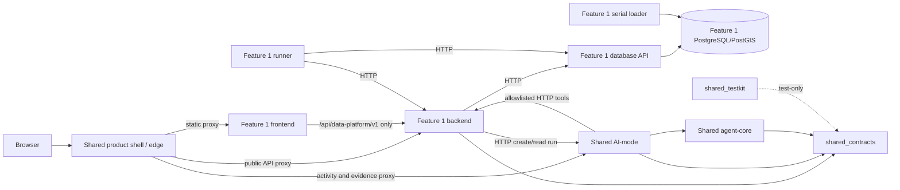

# Shared and Feature 1 UI baseline

Status: source-confirmed baseline with deterministic test evidence

Baseline date: 23 August 2026

Scope: Shared product shell, Shared AI activity UI, and Feature 1's Property Discovery and
Data Operations workspaces

## Evidence labels and release priority

This document deliberately separates three kinds of statement:

- **Runtime-confirmed** — observed by an existing deterministic test or command run recorded below.
- **Source-confirmed** — directly represented in the current HTML, JavaScript, CSS, Nginx,
  Compose, manifest, or API source, but not manually replayed in a live browser for this baseline.
- **Required/recommended** — a state or quality expectation derived from a current API contract or
  interaction; it is not a claim that a deterministic fixture or browser assertion exists yet.

The release-critical presentation target is the laptop demonstration. The complete matrix is a
release gate at 1440x1000 and 1024x768. The 768x1024 and 390x844 captures remain required audit
evidence, but their release gate is bounded resilience: no page-level horizontal overflow, clipped
primary action, broken navigation/search, unusable confirmation dialog, or blocked core task. Rich
card/list alternatives for dense operator tables are advisory unless a low-risk shared fix is clear.

This branch did not start or stop Docker. A coordinated runtime owner supplied the targeted browser
observations recorded below from the already-running full-data stack. That spike is useful evidence,
but it is not the complete route/state/viewport audit. Production authentication, complete
persistence journeys, external basemap reliability, and live model-provider behavior remain
unconfirmed here.

## Repository and package map

There is no `package.json`, bundler, npm dependency graph, Playwright configuration, or frontend
compile step in the current repository. The production frontends are dependency-free HTML/CSS/ES
modules served by Nginx. Python 3.12 projects share the root `uv.lock`.

| Application/package | Owner and source | Start/build | Tests | Configuration and API data |
|---|---|---|---|---|
| Shared product shell | Shared; `shared/frontend/` | `uv run scripts/dev.py up`; image built by `shared/frontend/Dockerfile`; direct port 5100 and canonical same-origin edge | `node --test shared/frontend/dashboard.test.mjs`; product-shell assertions also run in `scripts/tests/test_product_shell.py` | `config.js` may override non-secret feature/activity ingress URLs. `/api/shared-health/*`, `/api/data-platform/v1/*`, and `/api/ai-mode/*` are same-origin Nginx projections. |
| Feature 1 frontend | student-1; `student-1/frontend/` | Same root command; `student-1/Dockerfile` target `frontend`; direct port 5200 or `/features/data-platform/` through the shell | `node --test student-1/tests/frontend/core.test.mjs`; structural component checks in `student-1/tests/component/test_frontend.py` | Fixed public base `/api/data-platform/v1`; health is `/health/ready` direct or `/api/shared-health/data-platform` at the edge. AI activity URL changes by ingress. Map tiles/styles may call OpenFreeMap; feature data always comes from its backend. |
| Shared AI activity UI | Shared presentation assets; `shared/frontend/operations/ai-mode/`, served by AI-mode | Included in `ai-mode` image; `/operations/ai-mode/` only when `AI_MODE_OPERATIONS_ENABLED=true` (Compose default is true) | `node --test shared/frontend/operations/ai-mode/polling.test.mjs`; Python operations frontend/API tests | Calls AI-mode's domain-neutral run list/detail/event projections; optional query filters select feature/run. No direct store access. |
| Shared mapping package | Shared; `shared/frontend/mapping/` | Copied into Feature 1 production image and mounted read-only in dev; MapLibre loaded lazily | `node --test shared/frontend/mapping/mapping.test.mjs` | Feature supplies bounded GeoJSON and meaning; provider supplies OpenFreeMap style/tiles with a local neutral fallback. |
| PropertyScope v2 prototype | Historical/review artifact; `docs/prototype/propertyscope-v2/` | Static files only; not in canonical Compose or release ingress | No canonical test command | Hard-coded prototype data. It is not runtime authority and must not be treated as a second application. |
| Non-product integration fixture | Shared test infrastructure; `examples/integration-test-feature/` | Root dev command or integration-test Compose profile; direct port 5190 | Python component/integration tests inside canonical gate | Own backend/database plus AI-mode; deliberately not Feature 1 product behavior. |
| Feature 1 backend/runner/database | student-1; `student-1/backend/`, `student-1/database/` | Root dev command builds backend, runner, database API/loader, and PostgreSQL; optional isolated `--full-data` overlay | Python unit, contract, component, and real-HTTP tests under `student-1/tests` | Browser calls backend only. Backend and runner use database API HTTP. Only database API/loader receive PostgreSQL credentials. |
| Shared Python kernel | Shared; `shared/contracts`, `shared/testkit`, `agent-core`, `ai-mode` | `uv sync --locked --all-packages --all-groups`; AI-mode can run with `uv run flask --app ai_mode:create_app run --port 5005` | Ruff, mypy, pytest, schema/architecture/registry/catalogue validators in `scripts/check.py` | Contracts remain domain-neutral. Feature tools are registered by versioned YAML and called over HTTP. |
| Features 2-5 | Unallocated `student-2/` through `student-5/` placeholders | No product runtime | Root workspace/package placeholders only | Shared registry reserves routes but marks all four unimplemented and disabled. |

The canonical dev workflow composes `docker-compose.yml`,
`docker-compose.integration-test.yml`, and `docker-compose.dev.yml`. `--full-data` adds an isolated
project and `docker-compose.full-data.yml`; it is not required for deterministic showcase UI work.

## Dependency and deployment direction

Features must not import another student's code or `agent_core`; tests alone may import
`shared_testkit`. AI-mode never receives Feature 1 database credentials, and no service other than
the database API/loader opens PostgreSQL. These directions are executable in
`scripts/validate_architecture.py` and passed during this baseline.

## Shared versus Feature 1 ownership

| Concern | Shared owns | Feature 1 owns | Baseline observation |
|---|---|---|---|
| Product integration | Home, bounded feature registry, availability labels, feature ingress, shared status/evidence/activity links | Its canonical feature manifest, hash routes, task language and navigation | Source-confirmed and consistent with the living integration contract. |
| Visual foundation | `--ps-*` tokens, reset/base behavior, focus, containers/stacks/grids, buttons, badges, cards, input shell, status list, toast | Buyer/operator information density, feature aliases/layouts, domain tables/forms/cards/maps | Feature consumes tokens but still implements parallel unprefixed buttons, badges, panels, tables, state surfaces and toast. |
| Mapping | Provider/renderer lifecycle, GeoJSON validation, bounded viewport loading, neutral fallback, controls | Property API, layer meaning, popup fields and coverage caveats | Boundary is clean; production Feature 1 imports the shared provider. |
| HTTP contracts | Correlation, Problem Details, agent and tool contracts | Property/search/source/job/run/release/product business payloads | No Feature 1 entity was found in `shared_contracts`. |
| Orchestration | Run state machine, provider/tool policy, AI-mode persistence and generic activity evidence | Feature objectives, allowlisted tools, retries/publication business rules | Feature calls AI-mode over HTTP; no forbidden production import found. |
| Persistence | AI-mode's own SQLite state only | Feature 1 PostgreSQL/PostGIS, artifacts, release/publication data | Exclusive ownership is enforced and passed. |
| Runtime fixtures | Generic scripted model/test helpers | Property fixtures and registered source/job profiles | Existing UI lacks a route/state fixture selector; deterministic browser interception is still required. |

### Boundary candidates to review, not assumed defects

The Shared shell is allowed to know registered feature names and ingress routes. However, three
special cases should be reviewed before expanding the shell because they bypass purely
registry-driven composition:

1. `shared/frontend/app.js:7-10,31-37` names `propertyDiscovery`, `dataOperations`, and
   `releaseDetail`, and translates an address query into Feature 1's hash contract.
2. `shared/frontend/routes/status.js:116-126` singles out the `data-platform` slug to create a
   Property data-store dependency card.
3. `shared/frontend/routes/evidence.js:4-17` filters accepted releases to `feature-1` and links to
   a Feature 1 release detail route.

These are source-confirmed edge/product integrations, not domain code in the Shared design system
or contracts. Recommendation: keep them in a small registry/adapter boundary and do not move
property entities, matching, release approval rules, or dataset interpretation into Shared.

### Generic behavior duplicated in Feature 1

| Generic concept | Shared implementation | Feature 1 near-duplicate | Risk |
|---|---|---|---|
| Button, badge, card/panel and table styling | `shared/frontend/design-system/components.css`, `shared/frontend/core.js:53-110` | `.button`, `.badge`, `.panel`, `.table-wrap` in `student-1/frontend/styles.css`; `components/layout.js`, `components/tables.js` | Interaction/state/spacing fixes can drift between workspaces. |
| Safe DOM helpers | `shared/frontend/core.js:1-11` | `student-1/frontend/core/dom.js` | Small but parallel generic API; decide whether a browser package or intentional private copy is safer. |
| Loading/empty/error/notice feedback | Shared route-local notices plus `.ps-status-list`/toast | `student-1/frontend/components/states.js` and `.notice` variants | No single state contract or test gallery. |
| Dialog/confirmation and toast | Shared toast primitive; no complete shared dialog controller | Native dialogs plus `components/dialogs.js` and app-level confirm/toast | Feature owns working behavior, but focus return, async errors and destructive semantics need one tested contract. |
| Form field/filter composition | Shared input shell only | `components/forms.js` and app-level field schemas | Appropriate feature ownership today; generic validation/description behavior is a future extraction candidate. |
| Responsive table wrapper | `.dashboard-table-wrap` | `.table-wrap` | Both use horizontal overflow/min-width rather than an explicit per-surface narrow-screen policy. |

Do not mechanically move these into Shared. Extract only domain-neutral behavior with a stable API
and cross-workspace tests.

## Shared design surface

The stable public surface is source-confirmed in
`shared/frontend/design-system/README.md`:

- typography: `--ps-font-*`, `--ps-type-*`, `--ps-leading-*`, `--ps-weight-*`;
- colour/surfaces: `--ps-ink-*`, `--ps-ocean-*`, `--ps-eucalypt-*`, `--ps-sand-*`, canvas,
  paper and line tokens;
- evidence/operational state: confirmed, partial, conflicting, unknown, danger and info;
- rhythm/geometry: `--ps-space-*`, content/control/shell sizes, radius and shadow scales;
- interaction: duration, easing, focus and z-index tokens;
- layout/utilities: `.ps-container`, cluster, stack, grids, screen-reader-only and skip-link;
- controls/content: `.ps-button`, `.ps-badge`, `.ps-card`, `.ps-input-shell`,
  `.ps-status-list`, and `.ps-toast`; and
- generic mapping: controller, provider, validation, viewport loader, controls and styles under
  `shared/frontend/mapping/`.

The Shared shell imports tokens/base/components through `styles.css`; Feature 1 imports those three
files directly before its own stylesheet. Feature 1 maps many private aliases to `--ps-*` values and
does not redeclare a `--ps-*` token. Source still shows later cascade overrides and many private raw
sizes/colours in both shell and feature styles, so the token foundation is incomplete rather than
absent.

## Global interaction ownership

These interactions apply to every route in their workspace and are not repeated in each matrix row.

| Workspace | Visible interaction | Owner | Expected result |
|---|---|---|---|
| Shared shell | Brand/Home, Research areas, Data status, Sources & history, roadmap/footer links | Shared shell | Bounded hash navigation; unknown hashes return Home; dashboard route receives focus and announces load. |
| Shared shell | Header and hero address search | Shared shell integration adapter | Navigate to Feature 1 `#properties?q=...`; no property API call occurs in Shared. |
| Shared shell | Open Property data / overview / activity links | Shared registry/config | Navigate to configured same-origin ingress (or explicit direct-dev override). |
| Shared shell | Mobile menu toggle and Escape | Shared shell | Toggle `aria-expanded`; link activation closes it; Escape closes and restores toggle focus. |
| Feature 1 | Brand/product-home and global Shared links | Feature 1 shell adapter | Navigate to the configured Shared origin without changing feature API state. |
| Feature 1 | Header property search | Feature 1 | Navigate to `#properties` with encoded `q`. |
| Feature 1 | Sidebar primary routes and Activity history | Feature 1 | Update bounded hash route/current item; mobile activation closes drawer. |
| Feature 1 | Mobile menu toggle and Escape | Feature 1 | Toggle drawer/`aria-expanded`; Escape closes and restores focus. |
| Feature 1 | Entity and confirmation dialogs | Feature 1 | Native modal; Cancel/close makes no request; accepted form/action uses the route-specific API and reports a request ID. |
| Feature 1 | Toast/live region | Feature 1 | Announce success/failure without replacing current content. |

## Route, state and interaction matrix

State names prefixed **S** are source-confirmed current branches. **R** means required/recommended
fixture coverage inferred from the current contract or control, not an implemented deterministic UI
fixture. Every route inherits the global interactions above.

### Shared shell

| Route/view | Primary goal | Route interactions and expected result | States | API/fixture needs | Desktop and narrow composition |
|---|---|---|---|---|---|
| `#home` (also `#top`, `#research-areas`, `#operations`) | Start property research and understand available areas | Address search → Feature 1 query; Property data/overview/activity links → configured destinations; anchor links scroll; planned cards are non-links | S populated registry; S planned areas; R long labels/content | Static registry/config only | Desktop rail + two-column hero; at <=1080 hero stacks/hides journey card; <=760 rail/search collapse and actions stack. |
| `#features` | Compare available/planned research areas | Check availability → roadmap; enabled feature action → ingress; planned cards have no action | S one available + four planned; R long labels | Static feature registry | Two-column cards; Shared dashboard rail hidden <=760. |
| `#system-status` | Check live readiness without treating gates as outages | Refresh → repeat all health calls; service links → owning view | S loading; S ready/degraded/unavailable/unknown; S partial dependency; R timeout/long error | `/healthz`, `/api/shared-health/data-platform`, `/api/shared-health/ai-mode`; fixtures for each health combination/request ID | Three-card grid/rail desktop; stacked content/mobile nav. |
| `#evidence` | Inspect current published releases and AI-run references | Open Property data; dataset link → Feature 1 release; run link → Shared activity | S loading; S populated; S provider-partial; S each section empty; S request error; R long/hostile values | `/api/data-platform/v1/dataset-releases?status=accepted&limit=20`; `/api/ai-mode/agent-runs?limit=10` | Two evidence panels desktop, one column narrow; tables currently scroll at a fixed minimum width. |
| `#release-roadmap` | Distinguish current from planned capability | View status; enabled manifest links → destination | S current/planned; R long content | Static capability manifest | Three stages desktop, stacked narrow; detailed table scrolls. |

### Property Discovery

| Route/view | Primary goal | Route interactions and expected result | States | API/fixture needs | Desktop and narrow composition |
|---|---|---|---|---|---|
| `#properties[?q=]` | Resolve an NSW address | Search → encoded URL + results; result card → exact property detail; retry → repeat search; all-details disclosure toggles | S landing; S loading; S populated; S unsupported; S empty; S error; R long/hostile matches; R slow | `GET properties/search?q=&state=NSW&limit=25`; matched/empty/unsupported/problem fixtures | Hero + result panel and optional detail table; results become one column <=780 and search action stacks <=560. |
| `#properties/{property_ref}` | Review stable identity, map and available coverage | Back to search preserves query; map pan/zoom/popup; identity/report/coordinate disclosures toggle; retry → reload | S loading; S populated; S partial map/coverage/report; S unknown coverage; S invalid coordinate; S map fallback; S fatal detail error; R long evidence | Four calls: property, `map-context`, `coverage`, `report-section`; bounded GeoJSON and independent failures | Identity hero/map/details; feature detail layout collapses <=1080; tables may horizontally scroll narrow. |

### Data Operations — primary workflow

| Route/view | Primary goal | Route interactions and expected result | States | API/fixture needs | Desktop and narrow composition |
|---|---|---|---|---|---|
| `#overview` | See readiness and recent update problems | View updates/sources/history/current release/failure links → owning routes | S loading; S populated; S partial supporting feeds; S empty updates/releases/coverage; R all feeds failed | sources, ingestion runs, releases and overview calls with independent failure fixtures | Four stats + dashboard grid desktop; 2-up stats then one-column panels narrow. |
| `#jobs[?q=&status=]` | Find or start a registered data update | Create/Edit → entity dialog; Apply filters → encoded route; Start/Backfill → plan dialog; View/history links; Delete → safe confirmation then DELETE | S loading; S populated; S filtered/empty; S disabled controls; S error; S create/edit validation; R permission/read-only; R conflict; R long/many rows | jobs list; create/update/delete; runtime capabilities, job plan, create run; active/draft/disabled/retired fixtures | Dense action table desktop; filters/actions stack <=560 but table remains horizontally scrollable. Core controls must remain reachable on mobile. |
| `#jobs/{id}` | Understand one update and safely start it | Start/backfill/history/Edit; plan method/source/scope fields; Preview → plan response; advanced JSON disclosure; Confirm → create run | S loading; S populated; S optional capabilities unavailable; S disabled job; S plan validation/error; S live available/unavailable; R permission/conflict/long values | job detail + capabilities; runtime capabilities; plans; create run; PSI/G-NAF/generic fixtures | Two-column detail desktop, one column <=1080; form/scope fields one column <=560; native confirm dialog. |
| `#runs[?q=&status=&job=]` | Find a prior/in-progress update | Filter; clear job filter; choose update; table row click or Enter → detail; choose saved update link | S loading; S populated; S filtered/empty; S error; R many/long rows | ingestion-runs list across every status and job filter | Dense table desktop; filter stacks <=560; table scroll is permitted but no page overflow/hidden core link. |
| `#runs/{id}` | Follow progress, recover safely, and inspect evidence | State-dependent Resume/Retry/Use file/Cancel → confirmation + mutation; Ask AI; previous run/check/file links; disclosures; polling/Refresh through visibility resume | S loading; S requested/queued/running polling; S succeeded/failed/cancelled/interrupted; S error; S polling dependency failure; R review/permission/conflict; R long task/error | run, tasks, quality, artifacts, releases; action mutation endpoints; changing polling fixtures | Timeline + evidence grid desktop, one column <=1080; actions wrap; tables/details must not clip. |
| `#releases[?q=&status=]` | Find published/candidate dataset versions | Create draft → form dialog; filter; dataset link → detail | S loading; S populated; S filtered/empty; S error; S create validation; R permission/conflict/many rows | release list/create for draft/candidate/awaiting review/accepted/rejected/superseded | Dense table desktop; filters/actions stack narrow; table scroll is advisory if contained. |
| `#releases/{id}` | Compare, review and publish one immutable version | State-dependent Edit/Delete/Submit/Publish/Reject confirmations; Review with AI; manifest/coverage/details disclosures; preview Previous/Next | S every lifecycle; S blocking quality; S predecessor missing/unavailable; S checks unavailable/empty; S preview populated/empty/unavailable/page error; S receipts empty/failure; R permission/conflict/long/hostile data | release/detail/manifest, quality results, accepted releases, paged records; all review/mutation endpoints | Two-column review + comparison tables desktop; one-column <=1080; dialogs and primary review action are resilience-critical mobile. |

### Data Operations — contextual specialist routes

| Route/view | Primary goal | Route interactions and expected result | States | API/fixture needs | Desktop and narrow composition |
|---|---|---|---|---|---|
| `#sources[?q=&status=]` | Maintain approved source definitions | Create/Edit dialog; filter; View; Delete confirmation | S loading/populated/filtered-empty/error; S create/edit validation; R permission/conflict/long rows | source list/detail/create/update/delete across lifecycle states | Dense table and toolbar; narrow table may scroll but controls/dialog must remain usable. |
| `#sources/{id}` | Inspect source provenance and protection | Edit; technical disclosure; attribution reference is displayed as text | S loading/populated/error; R missing/long values; R permission | source detail | Two-column detail collapses <=1080. |
| `#data-products` | Inspect registered publication settings | Dataset link → detail | S loading/populated/error; R empty/many/long | data-products list | Wide table; laptop-critical, narrow contained scroll advisory. |
| `#data-products/{dataset_id}` | Inspect one publication contract | No mutation; published-version technical disclosure | S loading/populated/no accepted release/error; R long limitations | data-product detail | Single panel; detail list collapses to one column <=560. |
| `#quality` | Choose an update whose checks should be inspected | View checks → exact run route | S loading/populated/no runs/error | recent ingestion runs | Picker table; contained scroll narrow. |
| `#quality/{run_id}` | Inspect quality outcomes and samples | Choose another update; compare/sample disclosures; retry on evidence error | S loading/populated/empty; S run-summary partial; S evidence error; R long/hostile sample | run + quality-results independently | Wide evidence table; laptop-critical; narrow core navigation/no overflow required. |
| `#artifacts` | Choose an update whose files/lineage should be inspected | View files → exact run route | S loading/populated/no runs/error | recent ingestion runs | Picker table; contained scroll narrow. |
| `#artifacts/{run_id}` | Inspect files, checksums and lineage | Choose another update; lineage disclosures; retry on evidence error | S loading/populated/empty; S run-summary partial; S evidence error; R long hashes/metadata | run + artifacts independently | Wide evidence table; laptop-critical; narrow core navigation/no overflow required. |
| `#coverage` | Inspect published geographic/semantic coverage | Limitation disclosures | S loading/populated/empty/error; R partial/stale/unavailable/long limitations | accepted/superseded releases with coverage metadata | Wide table; laptop-critical; narrow contained scroll advisory. |
| `#ai[/release:{release_id}]` | Start a read-only review of a candidate | Select release/objective; Start → create run; activity link; recent history disclosure/result links | S loading/candidates/history; S nothing to review; S no history; S history partial; S provider unavailable; S form error; R permission/slow | releases, agent-runs history, create release agent-run | Form/panels stack; core task and service-unavailable recovery are resilience-critical mobile. |
| `#ai/{agent_run_id}` | Follow/read one AI review | New review; activity link; Refresh; progress disclosure; polling | S active/polling; S succeeded/final; S failed; S review-required; S detail/events partial; S no events; R long result; R out-of-order/slow | agent run + events with changing cursors and independent failures | Timeline/detail panels stack; primary links must remain visible narrow. |

Unknown Feature 1 hashes are source-confirmed to fall back to `#properties`; unknown Shared hashes
fall back to `#home`. Detail IDs are opaque path segments and query fields are URL encoded.

## API and deterministic fixture inventory

The machine-readable companion file groups the calls per route. At minimum, a deterministic fixture
layer needs these response families without changing production contracts:

- health: healthy, degraded, unavailable, timeout and request-ID variants;
- collections: zero, one, many, long/missing fields, hostile text, filtered-empty and permission
  failure;
- property: supported matches, unsupported query, empty match, stable detail, invalid/missing
  coordinates, map provider fallback, partial coverage and report-section failure;
- jobs/plans: active/disabled lifecycle, generic/PSI/G-NAF capability shapes, showcase/test/full-data
  availability, valid/invalid plan and version conflict;
- runs: every lifecycle state, changing poll sequence, failed/interrupted recovery actions, tasks,
  quality and artifact partial failures;
- releases: every lifecycle state, blocking/non-blocking checks, previous version present/absent,
  preview pages/empty/unavailable, receipts, review mutations and conflicts; and
- AI review: no candidate, unavailable provider, active event sequence, final result, failed result,
  review-required and partial detail/event history.

No such browser fixture selector exists yet. Current checked-in synthetic Feature 1 data supports
deterministic backend tests/showcase startup, but it does not independently force every UI state.

## Targeted runtime/browser observations

These observations were supplied by the coordinated runtime owner from the healthy full-data stack
on ports 5100, 5200 and 5005. They are **runtime-confirmed** for the named route/viewport only:

- Shared Home at 1440x1000 and 390x844 and Feature 1 Property search at the same widths had no
  document-level horizontal overflow.
- Feature 1 property detail at 390x844 retained a 375 CSS-pixel document width; its dense inner
  tables used contained scrolling rather than widening the document.
- Data updates at 1440x1000 was visually stable in the captured populated state.
- The Create update dialog is longer than the 1000-pixel laptop viewport; its action area begins
  below the initial viewport. This is a release-relevant dialog geometry risk, not yet a proven
  clipped-action defect because scrolling behavior still needs replay.
- Measured mobile navigation/control heights include 34-42 CSS-pixel targets, below the desired
  44-pixel touch target. This is a confirmed accessibility/usability finding, while laptop task
  completion remains the release priority.
- Escape did not close the Create update dialog in one in-app-browser attempt. The explicit close
  button did close it and restored focus. Treat Escape as an unresolved reproducibility check, not
  a confirmed defect, until the deterministic harness repeats it in a fresh page.

Screenshots are outside the repository at
`C:\Users\mattt\.codex\visualizations\2026\08\23\01a02c87-485e-7bc2-8f31-405261cd9cf7\ui-baseline\`:

- `shared-home-1440x1000.png`, `shared-home-390x844.png`;
- `feature1-properties-empty-1440x1000.png`, `feature1-properties-empty-390x844.png`;
- `feature1-property-detail-390x844.png`;
- `feature1-data-updates-1440x1000.png`; and
- `feature1-create-update-dialog-1440x1000.png`.

One coordination failure is also relevant to the future one-command workflow: attempting a default
`dev.py up --offline` while the full-data project already owned port 5005 built images and failed
late at the port bind, leaving partial default-project containers that then required a scoped
default `dev.py down`. The full-data project was left untouched. Prompt 1 should add a fail-fast
port/project preflight so parallel audit work cannot repeat this partial-start condition.

## Current quality workflow and baseline results

| Command | Baseline result |
|---|---|
| `uv run python scripts/check.py` before workspace sync | **Failed as environment bootstrap evidence.** Ruff format/check passed, then contract drift check stopped with `ModuleNotFoundError: pydantic` because the fresh worktree contained only root dependencies. |
| `uv sync --locked --all-packages --all-groups` | **Passed.** Installed all six implemented workspace packages and their locked dependencies. |
| `uv run python scripts/check.py` after sync | **Passed.** 215 files formatted; Ruff clean; generated contracts, architecture, model registry and two tool catalogues valid; mypy clean over 90 files; 290 shared/core tests passed at 90.36% coverage; 208 Feature 1 tests passed at 65.39% coverage; 60 Node frontend tests passed (558 total test cases). |

The aggregate gate covers format, lint, schema drift, architecture, model registry, tool catalogues,
strict typing, Python unit/component/real-loopback integration tests, and dependency-free frontend
module/source assertions. It does **not** currently run a real browser, screenshots, automated
accessibility scanning, responsive overflow checks, visual regression, or a Compose end-to-end UI
journey. No build-specific frontend lint/typecheck exists because there is no compiled frontend.

## Prioritized risks

| Priority | Risk and evidence | Consequence / next evidence |
|---|---|---|
| P0 | There is no deterministic browser route/state/viewport harness or screenshot gate. `scripts/check.py:14-24,27-76` runs Node source/module tests but no browser runner. | The acceptance matrix cannot yet be replayed, and source evidence can be mistaken for rendered behavior. Implement Prompts 1-2 before broad polish. |
| P0 | The runtime spike covered only seven targeted screenshots, not the complete matrix. | A runtime owner must start the one canonical stack; audit agents should inspect it without starting competing copies or binding 5100/5200/5005. |
| P0 | A second default `dev.py up --offline` built before failing late against full-data's occupied port 5005 and left partial containers. | Add a fail-fast port/project preflight and explicit runtime-owner guidance before parallel browser work. |
| P1 | Feature 1 duplicates generic controls/states/tables/dialog/toast behavior beside Shared primitives (`student-1/frontend/components/*.js`, `student-1/frontend/styles.css`; `shared/frontend/core.js`, design-system components). | Fixes can drift. Define a small Shared behavior contract and gallery before migrating call sites; preserve feature domain composition. |
| P1 | Both shells retain late cascade overrides and raw geometry/colour values (`shared/frontend/styles.css:203-343`; `student-1/frontend/styles.css:319-367`). | Visual changes are difficult to review and tokens do not fully prevent value drift. Inventory/migrate in bounded passes. |
| P1 | Dense tables remain minimum-width scrolling surfaces on narrow screens (`shared/frontend/styles.css:200`; Feature 1 `.table-wrap` and multiple wide matrices). | Laptop is the full gate. On mobile, contained horizontal scrolling is acceptable for dense operator work, but page overflow or clipped core actions is not. |
| P1 | Feature 1 route coverage is mostly source-assertion testing rather than interaction execution (`student-1/tests/frontend/core.test.mjs`; component frontend test). | CRUD buttons, dialogs, filters, history navigation, polling and retries can regress without failing current tests. |
| P1 | Native dialogs have a minimal wait helper (`student-1/frontend/components/dialogs.js:1-9`) and app-level orchestration (`student-1/frontend/app.js:121-177`). | Focus return, Escape, outside click, async error and repeated-submit behavior require browser evidence. |
| P1 | The Create update dialog extends below a 1440x1000 initial viewport; one Escape attempt did not close it, although the close control restored focus. | Reproduce in fresh deterministic pages; verify internal scrolling, sticky/visible actions, Escape and focus return before classifying the Escape behavior as a defect. |
| P1 | Shared evidence/status routes contain Feature 1 special cases (`shared/frontend/routes/evidence.js:4-17`; `status.js:116-126`). | Adding features may cause hard-coded branching. Keep property-specific adapters small/registry-backed instead of growing domain logic in Shared. |
| P2 | Loading/empty/error behavior is not uniform: some screens use reusable state components while property and run routes also create plain loading sections directly. | Announcements, retry placement and layout stability may vary. Confirm in fixture-driven screenshots before consolidation. |
| P2 | Current mobile CSS hides global/header search and rails (`shared/frontend/styles.css:316-343`; `student-1/frontend/styles.css:276-307`). | This is acceptable only if the mobile menu and in-page property search preserve core navigation/search. Audit those tasks explicitly. |
| P2 | The property map can log `console.error` on renderer startup failure (`student-1/frontend/routes/properties.js:181-188`) while also providing a visible fallback. | The future console gate needs an allowlist/classification so an expected degraded map does not hide unexpected exceptions. |
| P2 | Shared status/evidence calls and Feature 1 route calls have route-local timeout/partial behavior but no one fixture catalogue. | Partial states can silently drift from API contracts; machine-readable scenarios should be the single audit source. |
| P3 | Historical `docs/prototype/propertyscope-v2/` repeats production-like screens/styles and is substantially larger than the live frontend. | Reviewers and agents may edit or audit the wrong UI. Keep it explicitly labelled historical and out of production route counts. |

## Unresolved uncertainties and coordination

- Only the targeted screenshots above are runtime-confirmed. Complete interaction replay, focus
  behavior, all-route overflow measurements and external map fallback remain unconfirmed.
- The current API does not expose an approved authentication/permission model. Permission/read-only
  states are required future fixtures, not existing product claims.
- “Partial data” has route-specific meanings. The audit must preserve successful sections and use
  contract vocabulary; it must not invent domain conclusions from missing collections.
- Destructive confirmations can be opened in ordinary audit mode, but the mutation itself should be
  skipped unless a resettable isolated fixture explicitly enables destructive replay.
- A single runtime coordinator should own `uv run scripts/dev.py up`, `status`, `logs`, and `down` on
  ports 5100/5200/5005. Parallel UI agents should consume that runtime or use request interception;
  they must not start competing Compose projects against the same ports or databases.
- The four viewports stay in the audit. Only laptop captures require full dense-workflow parity for
  the release; tablet/mobile findings beyond resilience/core-task failures can be scheduled later.

## Baseline handoff

Prompt 0 changes documentation/configuration only. No production HTML, CSS, JavaScript, Python,
contracts, Compose topology, dependencies, or runtime data were changed.
