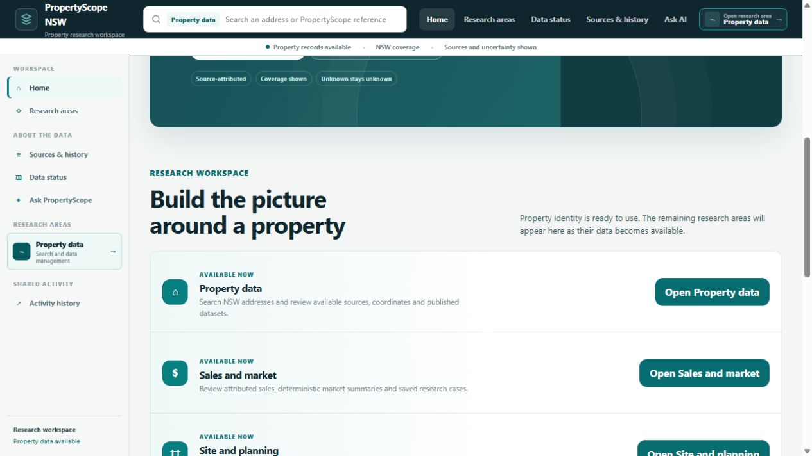
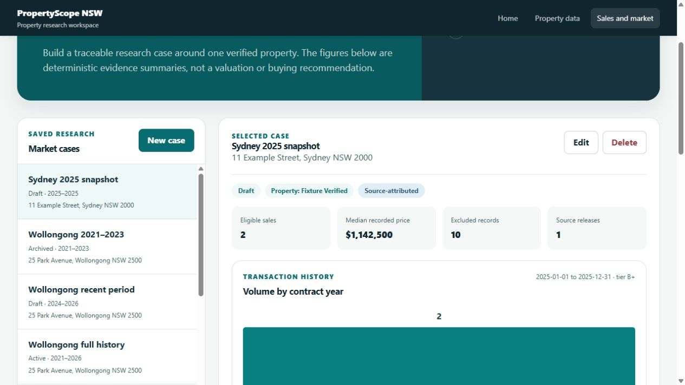
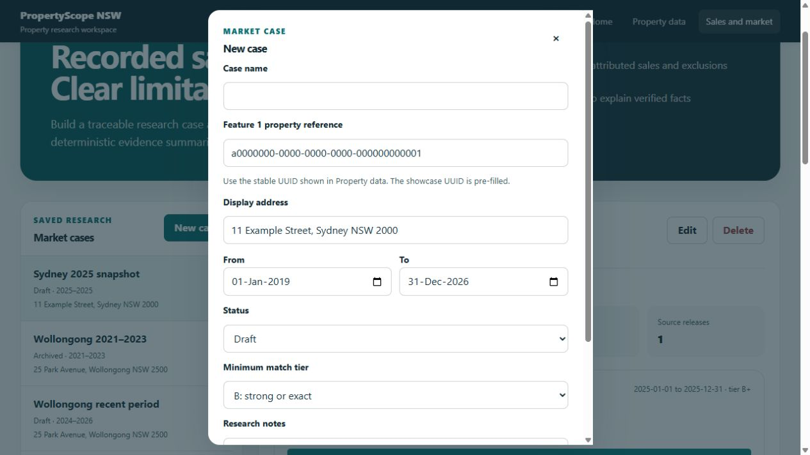
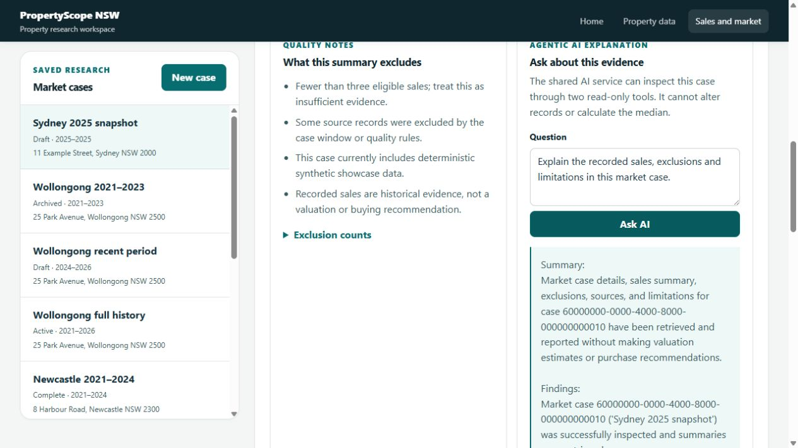
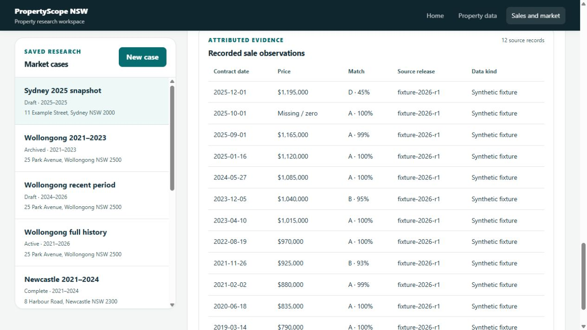
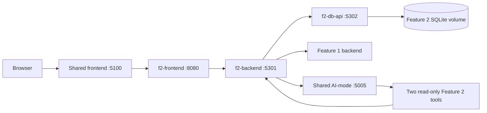

# Feature 2: Property Sales Explorer and Market Cases

- Student: Burhan Naeem
- Student ID: 24764134
- Email: Burhan.Naeem@wisetechglobal.com
- Feature key: `student-2-market-intelligence`
- Release: Assessment 1, Release 0

Feature 2 provides a traceable property sales research workspace. A user selects a verified Feature 1 property, reviews attributed sale observations, applies a date window and match-quality threshold, and saves the work as a market case. The backend calculates deterministic facts such as the eligible sale count, median recorded price, yearly transaction volume, exclusion counts and source releases. The shared Agentic AI service can then explain those already calculated facts through two read-only tools.

This feature is research support. It does not calculate a property valuation, forecast prices, recommend a purchase or replace professional advice.

## Release 0 capabilities

| Capability | What works now |
| --- | --- |
| Integrated user interface | Feature 2 is available from the shared PropertyScope home page and follows the shared design system. |
| Market case CRUD | Create, list, inspect, edit and delete saved market research cases. |
| Feature 1 integration | New cases use a stable Feature 1 property UUID and the backend checks that reference through the Feature 1 API. |
| Sales evidence | Review contract date, recorded price, match tier, confidence, source release and whether the record is synthetic. |
| Deterministic summaries | Calculate eligible sale count, median recorded price, volume by contract year, exclusions and source releases without using an LLM for arithmetic. |
| Quality controls | Filter by date range and minimum property-match tier, reject missing or zero prices, and explain why records were excluded. |
| Saved research context | Store a case name, display address, status, research notes and filters. Updates use optimistic version checking. |
| Agentic AI | Ask Gemini or another configured provider to explain one case using only the two approved Feature 2 tools. |
| Offline mode | CRUD, seeded data, evidence tables and deterministic summaries work without an API key. |
| Data import contract | Accept a validated, checksum-protected `propertyscope.property-sales.v3` gzip NDJSON release published by Feature 1. |
| Microservices | Run separate frontend, backend and database API containers with health and readiness checks. |
| DevOps | Run formatting, linting, architecture validation, type checking, tests, coverage, container builds and a Docker smoke test in GitHub Actions. |

## Guided demonstration

Start the integrated application, then open [http://localhost:5100](http://localhost:5100).

### 1. Open Feature 2 from the shared application

Scroll to **Build the picture around a property** and click **Open Sales and market**. This confirms that Feature 2 is integrated into the group application rather than running as an isolated page.



### 2. Select and review a saved market case

Click a case in the **Market cases** list. The seeded **Sydney 2025 snapshot** is useful for a demonstration because it deliberately contains eligible and excluded records.

The selected case shows its verified property state, saved status, eligible sale count, median recorded price, excluded-record count, source-release count and volume by contract year.



Use **Edit** to change the case name, address label, date window, status, match threshold or notes. Use **Delete** only when the saved case is no longer needed. Deletion requires confirmation in the interface.

### 3. Create a market case

Click **New case**. Then:

1. Enter a descriptive case name.
2. Paste the stable property UUID shown by Feature 1.
3. Confirm the display address.
4. Choose the start and end dates.
5. Select `Draft`, `Active`, `Complete` or `Archived`.
6. Choose the minimum match tier.
7. Add optional research notes.
8. Click **Save case**.

The showcase Feature 1 property UUID and address are pre-filled for a quick Release 0 demonstration.



### 4. Read the quality notes

Below the chart, review **What this summary excludes**. The feature explicitly reports small samples, records outside the case period, missing or zero prices, records below the selected match threshold, synthetic fixture data and the limitation that historical sales are not a valuation.

The summary rules are deterministic:

- Only observations for the selected property are considered.
- The contract date must fall inside the case date window.
- The price must be a positive integer.
- The match tier must satisfy the selected minimum tier.
- The median is calculated in backend code from the eligible prices.
- Excluded observations are counted by reason rather than silently discarded.

### 5. Ask Agentic AI to explain the evidence

Enter a question in **Ask about this evidence**, or keep the suggested question, and click **Ask AI**.

The shared AI service performs a bounded Plan, Act, Observe, Adapt loop. It may call only:

- `market.cases.inspect.v1`, which reads the selected saved case.
- `market.sales.summary.v1`, which reads the deterministic summary and sale evidence.

Both tools are read-only. The run is limited to four iterations, six tool calls, one model-repair attempt and a 120-second time budget. The LLM explains the evidence but does not calculate the median, alter database records, estimate value or recommend whether to buy.



If no provider key is configured, the feature reports that AI is unavailable while leaving every deterministic workflow usable.

### 6. Inspect the attributed source records

Scroll to **Recorded sale observations**. Each row exposes the contract date, price, property-match tier and confidence, source release and data kind. This keeps the summary traceable and makes synthetic Release 0 data visible.



## Data available in Release 0

The database starts with deterministic synthetic showcase data so the application and assessment demonstration do not depend on a large or expensive external download.

- 10 seeded market cases
- 26 seeded sale observations
- 3 example properties in Sydney, Newcastle and Wollongong
- Multiple date windows and case statuses
- Match tiers A, B and one deliberately low-confidence D record
- One deliberately missing or zero price
- Explicit synthetic flags and source-release metadata

The two owned tables are:

| Table | Purpose |
| --- | --- |
| `market_case` | Stores the verified property reference, case name, date window, status, notes, filters, AI run reference and optimistic version. |
| `sale_observation` | Stores normalised property sale evidence, matching confidence, provenance, release version and synthetic status. |

For later releases, Feature 1 can publish a `propertyscope.property-sales.v3` release to `POST /api/data-import/v1/propertyscope-releases`. Feature 2 verifies the declared SHA-256 checksum, decompresses the gzip NDJSON artifact, validates every record against the v3 contract and imports records idempotently.

## Architecture



| Service | Responsibility |
| --- | --- |
| `f2-frontend` | Nginx-hosted HTML, CSS and JavaScript for the market-case workspace. It proxies Feature 2 API calls on the same origin. |
| `f2-backend` | Public Flask API, request validation, Feature 1 property validation, deterministic summaries, release import and AI-mode orchestration. |
| `f2-db-api` | Internal Flask API and the only service allowed to open the Feature 2 SQLite file. It applies migrations and owns persistence. |

Feature 2 is registered through `student-2/feature.yaml`. The repository generator uses that manifest to create the Compose profile, shared routes, enabled-service projection and shared feature registry.

## Running the application

### Prerequisites

- Docker Desktop with the Linux engine running
- Python 3.12
- `uv`

From the repository root, install the locked workspace:

```powershell
uv sync --locked --all-packages --all-groups
```

### Run without AI

```powershell
uv run scripts/dev.py stack up --offline
```

This starts the complete integrated application with provider readiness disabled. Feature 2 CRUD and summaries remain fully available.

### Run with Gemini

Create a local `.env.gemini` file. It is ignored by Git and must never be committed:

```dotenv
AI_MODE_LLM_PROVIDER=gemini
AI_MODE_DEFAULT_MODEL_PROFILE=gemini-development.v1
GEMINI_API_KEY=replace-with-your-own-key
```

Then run:

```powershell
uv run scripts/dev.py stack up --env-file .env.gemini
```

The development command reads the environment file, writes the credential to the ignored `.propertyscope-runtime` directory and mounts it into the AI container as a file secret. It does not place the key in committed Compose files.

### Useful URLs

| Page | URL |
| --- | --- |
| Integrated group application | [http://localhost:5100](http://localhost:5100) |
| Feature 2 through the shared shell | [http://localhost:5100/features/market-intelligence/#market-cases](http://localhost:5100/features/market-intelligence/#market-cases) |
| Feature 2 direct frontend | [http://localhost:5300](http://localhost:5300) |
| Shared AI-mode service | [http://localhost:5005](http://localhost:5005) |

Stop the local stack with:

```powershell
uv run scripts/dev.py stack down
```

## Public API overview

The public base path is `/api/market-intelligence/v1`.

| Method and path | Purpose |
| --- | --- |
| `GET /market-cases` | List saved cases. |
| `POST /market-cases` | Validate a Feature 1 property and create a case. |
| `GET /market-cases/{case_id}` | Read one case. |
| `PUT /market-cases/{case_id}` | Update a case using its expected version. |
| `DELETE /market-cases/{case_id}` | Delete one case. |
| `GET /market-cases/{case_id}/evidence` | Return the case, deterministic summary and sale observations. |
| `GET /properties/{property_ref}/validate` | Check a Feature 1 property reference. |
| `GET /assistant/capabilities` | List the approved AI tools and suggested questions. |
| `POST /assistant/turns` | Start a bounded AI explanation run. |
| `GET /assistant/turns/{run_id}` | Read a Feature 2 owned AI run. |
| `GET /assistant/turns/{run_id}/events` | Read the run event trail. |
| `POST /assistant/turns/{run_id}/cancel` | Cancel an active run. |

The database API uses an internal-only base path and requires the shared internal token. Browser clients do not receive direct database access.

## Validation and tests

Run the repository quality gate from the repository root:

```powershell
uv run python scripts/check.py
```

The Student 2 GitHub Actions workflow also performs:

- Ruff formatting and lint checks
- Architecture, deployment, tool-catalog and workspace-package validation
- Mypy type checking
- Python unit and integration tests
- At least 70 percent coverage for both Feature 2 Python packages
- JavaScript syntax and browser-core tests
- Docker image builds for all three Feature 2 services
- A Compose startup and health check
- CRUD, seed-count and frontend smoke checks
- Log capture on failure and cleanup of ephemeral CI volumes

## Release 0 requirement mapping

| Assessment area | Feature 2 evidence |
| --- | --- |
| Agentic AI development | Bounded AI-mode run with trusted case identifiers, two allowlisted read-only tools, durable status polling and visible safety limitations. |
| Microservices | Independent frontend, backend and database API services with clear ownership boundaries. |
| AI model integration | Shared provider configuration supports Gemini and the approved model registry. Deterministic workflows continue offline. |
| Docker | Multi-stage `student-2/Dockerfile`, Compose services, named data volume, health checks and shared network. |
| DevOps | Path-filtered Student 2 GitHub Actions workflow with quality, tests, coverage, container build and smoke test. |
| Database | Versioned SQL migrations, two owned tables, at least ten records per table and idempotent source imports. |
| Group integration | Manifest registration, generated routes, shared home-page entry, Feature 1 validation and shared AI-mode integration. |

## Current limitations

- The default Release 0 records are synthetic and are labelled as such.
- Real NSW sales data depends on Feature 1 publishing an accepted v3 release.
- The feature reports historical recorded sale evidence only. It does not provide valuation, forecasting or buy or sell advice.
- The AI explanation requires a configured provider key, but all non-AI functionality works offline.
- SQLite is appropriate for the Release 0 service boundary and local demonstration. A later production design may choose a different persistence engine.
- Match quality depends on the property references and normalised evidence supplied by Feature 1.

## Source layout

```text
student-2/
├── backend/src/propertyscope_market_intelligence/  Public API and domain logic
├── database/src/propertyscope_market_store/        Database API, repository and SQL migrations
├── frontend/                                       User interface and Nginx routing
├── tests/                                          Python and JavaScript tests
├── docs/screenshots/                               Guided demonstration images
├── Dockerfile                                      Three container build targets
├── feature.yaml                                    Manifest registration
└── tool-catalog.yaml                               AI tool registration
```

The approved allocation and minimum feature boundary are maintained in [the registered feature scope](../docs/architecture/registered-feature-scope.md).
