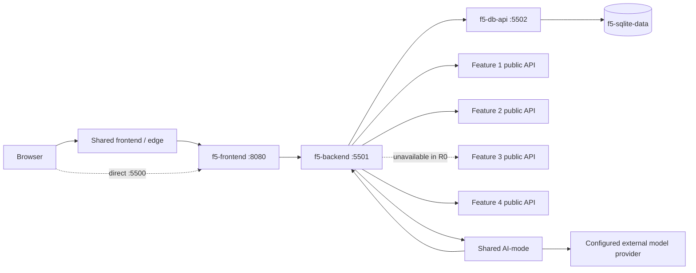
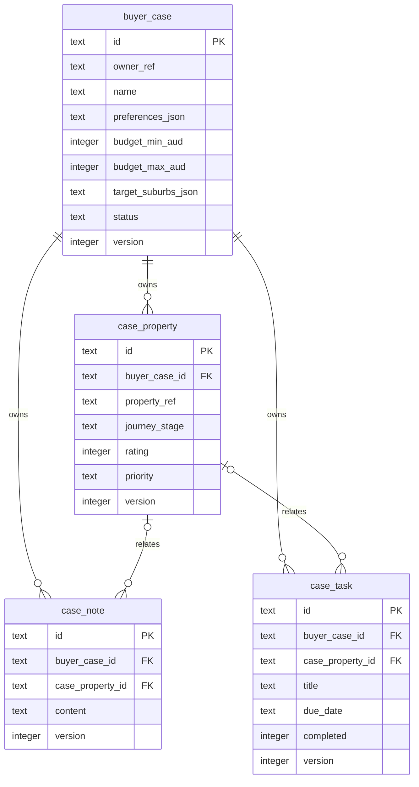

# Student 5 Release 0 implementation and evidence guide

## Feature purpose

Buyer Journey and Agent Workspace helps a demo buyer maintain buyer cases, shortlist properties,
track journey stages, ratings and priorities, record notes and tasks, review bounded cross-feature
evidence, and request one AI-assisted case summary with suggested next actions.

## Functional requirements

| ID | Requirement | Implementation | Reproducible evidence |
|---|---|---|---|
| F5-R0-F01 | Buyer-case CRUD | Public `/api/buyer-workspaces/v1/buyer-cases` routes and accessible frontend forms | Python API/vertical tests and Compose smoke |
| F5-R0-F02 | Shortlist CRUD | Case-scoped property routes and frontend controls | Domain/API/JavaScript tests and Compose smoke |
| F5-R0-F03 | Stage, rating and priority | Versioned property update route | Conflict tests and Compose smoke |
| F5-R0-F04 | Note CRUD | Case/property-scoped note routes | API/frontend tests and Compose smoke |
| F5-R0-F05 | Task CRUD and completion | Versioned task routes and completion control | API/frontend tests and Compose smoke |
| F5-R0-F06 | Bounded cross-feature evidence | Injected public HTTP clients for Features 1, 2 and 4; Feature 3 is explicit `unavailable` | Integration tests and evidence refresh UI |
| F5-R0-F07 | AI case summary and next actions | Shared AI-mode run using four Student 5-owned read-only tools | Real ToolRegistry test and offline Compose run |
| F5-R0-F08 | Plan → Act → Observe → Adapt visibility | Safe run projection and four-phase frontend timeline | Python and JavaScript projection tests |
| F5-R0-F09 | Health and readiness | Backend and database `/health/live` and `/health/ready`; frontend `/healthz` | Container health checks |

## Non-functional requirements

- **Service separation:** `f5-frontend`, `f5-backend` and `f5-db-api` are separate processes. Only
  the database API mounts the SQLite volume; the backend communicates with it over authenticated HTTP.
- **Ownership:** Student 5 imports no Student 1–4 implementation. Cross-feature reads use their public
  APIs. The AI-mode tools are owned by `student-5-buyer-journey`.
- **Validation:** validators reject unknown fields, malformed UUIDs, unsupported states, invalid
  budgets, invalid NSW localities and unsafe pagination.
- **Optimistic concurrency:** mutable records require a positive current version and stale writes
  return `409 application/problem+json`.
- **Accessibility:** labelled forms, announced errors/states, keyboard controls, visible focus and a
  responsive 320 CSS-pixel floor are covered by static and behaviour tests.
- **Graceful degradation:** database readiness gates CRUD; evidence and AI/provider failures remain
  optional and do not disable ordinary CRUD.
- **Bounded integration:** evidence is limited to 10 shortlisted properties and the first 25 Feature
  2/4 match candidates. Notes/tasks exposed to AI are limited to 100 each. HTTP responses are bounded.
- **Security:** the browser never receives `owner_ref` or the internal token. User notes and labels are
  untrusted data, never model instructions. Public errors omit upstream bodies and secrets.
- **Persistence:** schema and deterministic seeds are migrations. Restart does not rerun seeds or
  restore a deliberately deleted record. SQLite is stored in `f5-sqlite-data`.
- **Testability:** stores, HTTP transports, evidence and AI-mode boundaries are injected.
- **Correlation:** accepted `X-Request-ID` values propagate browser → backend → database/evidence/AI
  boundaries and return in responses.

## Architecture



Student 5 never mounts, imports or connects to another feature's database. AI-mode calls only the
fixed Student 5 tool routes, which reapply buyer-case owner scope before reading data.

## Data design

Conceptually, one buyer case owns preferences and a shortlist; notes and tasks optionally relate to
one shortlisted property. Logically, all four aggregates have opaque UUID identifiers, timestamps and
optimistic versions. Physically, SQLite stores JSON preferences/suburbs only behind the database API.



- Deleting a buyer case cascades to its properties, notes and tasks.
- Deleting a property sets linked note/task property references to `NULL` transactionally while
  incrementing their versions and timestamps.
- A case cannot shortlist the same `property_ref` twice.
- Owner, case, property, status/stage and task completion indexes support bounded queries.
- Seed migration `002_seed.sql` supplies at least 10 rows in every table and runs once through schema
  versioning, not on every application start.

## AI workflow

The backend creates a shared AI-mode run with one trusted `buyer_case_id` and exactly these tools:

1. `buyer.cases.inspect.v1`
2. `buyer.notes.list.v1`
3. `buyer.tasks.list.v1`
4. `buyer.evidence.collect.v1`

All tools are read-only, owner-scoped and bounded. The shared orchestrator records Plan → Act →
Observe → Adapt steps. The final UI separates the summary, suggested actions, evidence references and
limitations. Users must verify material findings and make every decision themselves. The workflow
does not persist proposed tasks automatically and does not provide valuation, legal advice or an
automatic purchase recommendation. Its fixed server objective tells the model to treat notes, labels
and other user-entered strings as untrusted data rather than instructions.

## Testing and DevOps

Run from the repository root:

```text
uv sync --locked --all-packages --all-groups
uv run pytest student-5/tests --cov=propertyscope_buyer_workspaces --cov=propertyscope_buyer_store --cov-report=term --cov-fail-under=80
node --check student-5/frontend/app.js
node --import ./scripts/frontend-test-bootstrap.mjs --test student-5/tests/frontend/buyer_cases.test.mjs
uv run ruff format --check student-5/backend/src student-5/database/src student-5/tests student-5/scripts
uv run ruff check student-5/backend/src student-5/database/src student-5/tests student-5/scripts
uv run mypy --strict --config-file student-5/pyproject.toml student-5/backend/src student-5/database/src student-5/tests student-5/scripts
uv run python scripts/generate_deployment.py --check
uv run python scripts/validate_tool_catalogs.py
```

Local verification on 3 September 2026 produced 131 passing Student 5 Python tests with 82.30%
coverage and 17 passing Student 5 JavaScript tests. JavaScript syntax, Student 5 Ruff format/lint,
strict Mypy (29 source files), lockfile, generated deployment, three tool catalogues, architecture,
workspace packaging, frontend style, shared navigation and integration checks passed. Docker image and
live Compose evidence was not captured locally because this Windows environment did not have a Docker
CLI; the workflow below performs those checks on a clean CI runner and its outcome must be captured
from a genuine run.

The Student 5 workflow builds all three image targets, uses a uniquely named Compose project, checks
health and seed counts, performs public CRUD/evidence/offline-AI smoke checks, restarts services to
prove persistence, and deletes only its CI-created ephemeral resources.

## Risks and limitations

- Feature 3 has no Release 0 public API and is represented as unavailable.
- Feature 2/4 evidence association is limited to their current public list/evidence contracts and
  first 25 match candidates.
- Model output depends on external provider availability and always requires user verification.
- Release 0 uses one server-configured demo owner, not authentication or multi-user authorisation.
- No direct database access is permitted across features.
- Dossiers, document storage, messaging, appointment booking, negotiation, MCP, RAG and multi-agent
  functions are deliberately excluded from Release 0.

## Genuine evidence checklist for Derek

- [ ] Shared homepage visibly shows Buyer workspace.
- [ ] `f5-frontend`, `f5-backend` and `f5-db-api` are healthy.
- [ ] Seed report shows at least 10 buyer cases, properties, notes and tasks.
- [ ] Capture buyer-case create/read/edit/delete.
- [ ] Capture shortlist creation and journey-stage change.
- [ ] Capture note create/edit/delete.
- [ ] Capture task create/edit/complete/delete.
- [ ] Capture evidence states, including Feature 3 unavailable.
- [ ] Record the genuine AI run ID.
- [ ] Capture Plan/Act/Observe/Adapt display.
- [ ] Capture AI evidence references and limitations.
- [ ] Capture provider-unavailable behavior while CRUD remains usable.
- [ ] Capture persistence and non-reseeding after restart.
- [ ] Capture the genuine successful Student 5 GitHub Actions run.
- [ ] Preserve commit history and contribution log.
- [ ] Record the final showcase; do not substitute generated or fabricated screenshots.

## 1.5–2 minute showcase sequence

1. Open Buyer workspace from the shared home.
2. Create and open a buyer case with budget, suburb and preferences.
3. Add a shortlisted property and change its journey stage, rating and priority.
4. Add a task and mark it complete.
5. Refresh evidence and point out independent states and Feature 3's honest unavailability.
6. Generate a case summary and show its run ID and Plan/Act/Observe/Adapt progression.
7. Point out evidence references, limitations and the user-verification warning.
